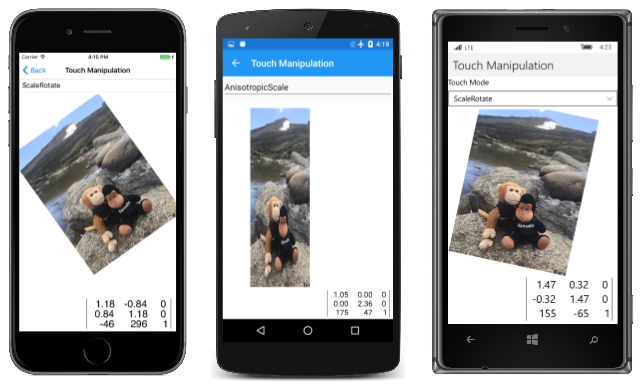
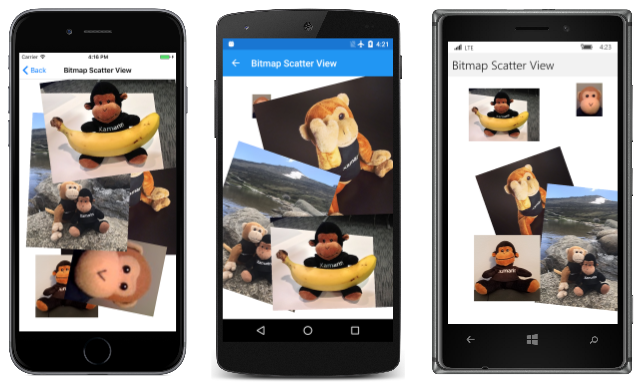

# Touch Manipulations

_Use matrix transforms to implement touch dragging, pinching, and rotation_

In multi-touch environments such as those on mobile devices, users often use their fingers to manipulate objects on the screen. Common gestures such as a one-finger drag and a two-finger pinch can move and scale objects, or even rotate them. These gestures are generally implemented using transform matrices, and this article shows you how to do that.


## Manipulating One Bitmap

The **Touch Manipulation** page demonstrates touch manipulations on a single bitmap.
This sample makes use of the touch-tracking effect presented in the article [Invoking Events from Effects](~/xamarin-forms/app-fundamentals/effects/touch-tracking.md).

Several other files provide support for the **Touch Manipulation** page. The first is the [`TouchManipulationMode`](https://github.com/xamarin/xamarin-forms-samples/blob/master/SkiaSharpForms/Demos/Demos/SkiaSharpFormsDemos/Transforms/TouchManipulationMode.cs) enumeration, which indicates the different types of touch manipulation implemented by the code you'll be seeing:

```csharp
enum TouchManipulationMode
{
    None,
    PanOnly,
    IsotropicScale,     // includes panning
    AnisotropicScale,   // includes panning
    ScaleRotate,        // implies isotropic scaling
    ScaleDualRotate     // adds one-finger rotation
}
```

`PanOnly` is a one-finger drag that is implemented with translation. All the subsequent options also include panning but involve two fingers: `IsotropicScale` is a pinch operation that results in the object scaling equally in the horizontal and vertical directions. `AnisotropicScale` allows unequal scaling.

The `ScaleRotate` option is for two-finger scaling and rotation. Scaling is isotropic. Implementing two-finger rotation with anisotropic scaling is problematic because the finger movements are essentially the same.

The `ScaleDualRotate` option adds one-finger rotation. When a single finger drags the object, the dragged object is first rotated around its center so that the center of the object lines up with the dragging vector.

The [**TouchManipulationPage.xaml**](https://github.com/xamarin/xamarin-forms-samples/blob/master/SkiaSharpForms/Demos/Demos/SkiaSharpFormsDemos/Transforms/TouchManipulationPage.xaml) file includes a `Picker` with the members of the `TouchManipulationMode` enumeration:

```xaml
<ContentPage xmlns="http://xamarin.com/schemas/2014/forms"
             xmlns:x="http://schemas.microsoft.com/winfx/2009/xaml"
             xmlns:skia="clr-namespace:SkiaSharp.Views.Forms;assembly=SkiaSharp.Views.Forms"
             xmlns:tt="clr-namespace:TouchTracking"
             x:Class="SkiaSharpFormsDemos.Transforms.TouchManipulationPage"
             Title="Touch Manipulation">
    <Grid>
        <Grid.RowDefinitions>
            <RowDefinition Height="Auto" />
            <RowDefinition Height="*" />
        </Grid.RowDefinitions>

        <Picker Title="Touch Mode"
                Grid.Row="0"
                SelectedIndexChanged="OnTouchModePickerSelectedIndexChanged">
            <Picker.Items>
                <x:String>None</x:String>
                <x:String>PanOnly</x:String>
                <x:String>IsotropicScale</x:String>
                <x:String>AnisotropicScale</x:String>
                <x:String>ScaleRotate</x:String>
                <x:String>ScaleDualRotate</x:String>
            </Picker.Items>
            <Picker.SelectedIndex>
                4
            </Picker.SelectedIndex>
        </Picker>

        <Grid BackgroundColor="White"
              Grid.Row="1">

            <skia:SKCanvasView x:Name="canvasView"
                               PaintSurface="OnCanvasViewPaintSurface" />
            <Grid.Effects>
                <tt:TouchEffect Capture="True"
                                TouchAction="OnTouchEffectAction" />
            </Grid.Effects>
        </Grid>
    </Grid>
</ContentPage>
```

Towards the bottom is an `SKCanvasView` and a `TouchEffect` attached to the single-cell `Grid` that encloses it.

The [**TouchManipulationPage.xaml.cs**](https://github.com/xamarin/xamarin-forms-samples/blob/master/SkiaSharpForms/Demos/Demos/SkiaSharpFormsDemos/Transforms/TouchManipulationPage.xaml.cs) code-behind file has a `bitmap` field but it is not of type `SKBitmap`. The type is `TouchManipulationBitmap` (a class you'll see shortly):

```csharp
public partial class TouchManipulationPage : ContentPage
{
    TouchManipulationBitmap bitmap;
    ...

    public TouchManipulationPage()
    {
        InitializeComponent();

        string resourceID = "SkiaSharpFormsDemos.Media.MountainClimbers.jpg";
        Assembly assembly = GetType().GetTypeInfo().Assembly;

        using (Stream stream = assembly.GetManifestResourceStream(resourceID))
        {
            SKBitmap bitmap = SKBitmap.Decode(stream);
            this.bitmap = new TouchManipulationBitmap(bitmap);
            this.bitmap.TouchManager.Mode = TouchManipulationMode.ScaleRotate;
        }
    }
    ...
}
```

The constructor instantiates a `TouchManipulationBitmap` object, passing to the constructor an `SKBitmap` obtained from an embedded resource. The constructor concludes by setting the `Mode` property of the `TouchManager` property of the `TouchManipulationBitmap` object to a member of the `TouchManipulationMode` enumeration.

The `SelectedIndexChanged` handler for the `Picker` also sets this `Mode` property:

```csharp
public partial class TouchManipulationPage : ContentPage
{
    ...
    void OnTouchModePickerSelectedIndexChanged(object sender, EventArgs args)
    {
        if (bitmap != null)
        {
            Picker picker = (Picker)sender;
            TouchManipulationMode mode;
            Enum.TryParse(picker.Items[picker.SelectedIndex], out mode);
            bitmap.TouchManager.Mode = mode;
        }
    }
    ...
}
```

The `TouchAction` handler of the `TouchEffect` instantiated in the XAML file calls two methods in `TouchManipulationBitmap` named `HitTest` and `ProcessTouchEvent`:

```csharp
public partial class TouchManipulationPage : ContentPage
{
    ...
    List<long> touchIds = new List<long>();
    ...
    void OnTouchEffectAction(object sender, TouchActionEventArgs args)
    {
        // Convert Xamarin.Forms point to pixels
        Point pt = args.Location;
        SKPoint point =
            new SKPoint((float)(canvasView.CanvasSize.Width * pt.X / canvasView.Width),
                        (float)(canvasView.CanvasSize.Height * pt.Y / canvasView.Height));

        switch (args.Type)
        {
            case TouchActionType.Pressed:
                if (bitmap.HitTest(point))
                {
                    touchIds.Add(args.Id);
                    bitmap.ProcessTouchEvent(args.Id, args.Type, point);
                    break;
                }
                break;

            case TouchActionType.Moved:
                if (touchIds.Contains(args.Id))
                {
                    bitmap.ProcessTouchEvent(args.Id, args.Type, point);
                    canvasView.InvalidateSurface();
                }
                break;

            case TouchActionType.Released:
            case TouchActionType.Cancelled:
                if (touchIds.Contains(args.Id))
                {
                    bitmap.ProcessTouchEvent(args.Id, args.Type, point);
                    touchIds.Remove(args.Id);
                    canvasView.InvalidateSurface();
                }
                break;
        }
    }
    ...
}
```

If the `HitTest` method returns `true` &mdash; meaning that a finger has touched the screen within the area occupied by the bitmap &mdash; then the touch ID is added to the `TouchIds` collection. This ID represents the sequence of touch events for that finger until the finger lifts from the screen. If multiple fingers touch the bitmap, then the `touchIds` collection contains a touch ID for each finger.

The `TouchAction` handler also calls the `ProcessTouchEvent` class in `TouchManipulationBitmap`. This is where some (but not all) of the real touch processing occurs.

The [`TouchManipulationBitmap`](https://github.com/xamarin/xamarin-forms-samples/blob/master/SkiaSharpForms/Demos/Demos/SkiaSharpFormsDemos/Transforms/TouchManipulationBitmap.cs) class is a wrapper class for `SKBitmap` that contains code to render the bitmap and process touch events. It works in conjunction with more generalized code in a `TouchManipulationManager` class (which you'll see shortly).

The `TouchManipulationBitmap` constructor saves the `SKBitmap` and instantiates two properties, the `TouchManager` property of type `TouchManipulationManager` and the `Matrix` property of type `SKMatrix`:

```csharp
class TouchManipulationBitmap
{
    SKBitmap bitmap;
    ...

    public TouchManipulationBitmap(SKBitmap bitmap)
    {
        this.bitmap = bitmap;
        Matrix = SKMatrix.MakeIdentity();

        TouchManager = new TouchManipulationManager
        {
            Mode = TouchManipulationMode.ScaleRotate
        };
    }

    public TouchManipulationManager TouchManager { set; get; }

    public SKMatrix Matrix { set; get; }
    ...
}
```

This `Matrix` property is the accumulated transform resulting from all the touch activity. As you'll see, each touch event is resolved into a matrix, which is then concatenated with the `SKMatrix` value stored by the `Matrix` property.

The `TouchManipulationBitmap` object draws itself in its `Paint` method. The argument is an `SKCanvas` object. This `SKCanvas` might already have a transform applied to it, so the `Paint` method concatenates the `Matrix` property associated with the bitmap to the existing transform, and restores the canvas when it has finished:

```csharp
class TouchManipulationBitmap
{
    ...
    public void Paint(SKCanvas canvas)
    {
        canvas.Save();
        SKMatrix matrix = Matrix;
        canvas.Concat(ref matrix);
        canvas.DrawBitmap(bitmap, 0, 0);
        canvas.Restore();
    }
    ...
}
```

The `HitTest` method returns `true` if the user touches the screen at a point within the boundaries of the bitmap. As the user manipulates the bitmap, the bitmap might be rotated, or even (through a combination of anisotropic scaling and rotation) be in the shape of a parallelogram. You might fear that the `HitTest` method needs to implement rather complex analytic geometry in that case.

However, a shortcut is available:

Determining if a point lies within the boundaries of a transformed rectangle is the same as determining if an inverse transformed point lies within the boundaries of the untransformed rectangle. That's a much easier calculation and it can use the convenient `Contains` method defined by `SKRect`:

```csharp
class TouchManipulationBitmap
{
    ...
    public bool HitTest(SKPoint location)
    {
        // Invert the matrix
        SKMatrix inverseMatrix;

        if (Matrix.TryInvert(out inverseMatrix))
        {
            // Transform the point using the inverted matrix
            SKPoint transformedPoint = inverseMatrix.MapPoint(location);

            // Check if it's in the untransformed bitmap rectangle
            SKRect rect = new SKRect(0, 0, bitmap.Width, bitmap.Height);
            return rect.Contains(transformedPoint);
        }
        return false;
    }
    ...
}
```

The second public method in `TouchManipulationBitmap` is `ProcessTouchEvent`. When this method is called, it has already been established that the touch event belongs to this particular bitmap. The method maintains a dictionary of [`TouchManipulationInfo`](https://github.com/xamarin/xamarin-forms-samples/blob/master/SkiaSharpForms/Demos/Demos/SkiaSharpFormsDemos/Transforms/TouchManipulationInfo.cs) objects, which is simply the previous point and the new point of each finger:

```csharp
class TouchManipulationInfo
{
    public SKPoint PreviousPoint { set; get; }

    public SKPoint NewPoint { set; get; }
}
```

Here's the dictionary and the `ProcessTouchEvent` method itself:

```csharp
class TouchManipulationBitmap
{
    ...
    Dictionary<long, TouchManipulationInfo> touchDictionary =
        new Dictionary<long, TouchManipulationInfo>();
    ...
    public void ProcessTouchEvent(long id, TouchActionType type, SKPoint location)
    {
        switch (type)
        {
            case TouchActionType.Pressed:
                touchDictionary.Add(id, new TouchManipulationInfo
                {
                    PreviousPoint = location,
                    NewPoint = location
                });
                break;

            case TouchActionType.Moved:
                TouchManipulationInfo info = touchDictionary[id];
                info.NewPoint = location;
                Manipulate();
                info.PreviousPoint = info.NewPoint;
                break;

            case TouchActionType.Released:
                touchDictionary[id].NewPoint = location;
                Manipulate();
                touchDictionary.Remove(id);
                break;

            case TouchActionType.Cancelled:
                touchDictionary.Remove(id);
                break;
        }
    }
    ...
}
```

In the `Moved` and `Released` events, the method calls `Manipulate`. At these times, the `touchDictionary` contains one or more `TouchManipulationInfo` objects. If the `touchDictionary` contains one item, it is likely that the `PreviousPoint` and `NewPoint` values are unequal and represent the movement of a finger. If multiple fingers are touching the bitmap, the dictionary contains more than one item, but only one of these items has different `PreviousPoint` and `NewPoint` values. All the rest have equal `PreviousPoint` and `NewPoint` values.

This is important: The `Manipulate` method can assume that it's processing the movement of only one finger. At the time of this call none of the other fingers are moving, and if they really are moving (as is likely), those movements will be processed in future calls to `Manipulate`.

The `Manipulate` method first copies the dictionary to an array for convenience. It ignores anything other than the first two entries. If more than two fingers are attempting to manipulate the bitmap, the others are ignored. `Manipulate` is the final member of `TouchManipulationBitmap`:

```csharp
class TouchManipulationBitmap
{
    ...
    void Manipulate()
    {
        TouchManipulationInfo[] infos = new TouchManipulationInfo[touchDictionary.Count];
        touchDictionary.Values.CopyTo(infos, 0);
        SKMatrix touchMatrix = SKMatrix.MakeIdentity();

        if (infos.Length == 1)
        {
            SKPoint prevPoint = infos[0].PreviousPoint;
            SKPoint newPoint = infos[0].NewPoint;
            SKPoint pivotPoint = Matrix.MapPoint(bitmap.Width / 2, bitmap.Height / 2);

            touchMatrix = TouchManager.OneFingerManipulate(prevPoint, newPoint, pivotPoint);
        }
        else if (infos.Length >= 2)
        {
            int pivotIndex = infos[0].NewPoint == infos[0].PreviousPoint ? 0 : 1;
            SKPoint pivotPoint = infos[pivotIndex].NewPoint;
            SKPoint newPoint = infos[1 - pivotIndex].NewPoint;
            SKPoint prevPoint = infos[1 - pivotIndex].PreviousPoint;

            touchMatrix = TouchManager.TwoFingerManipulate(prevPoint, newPoint, pivotPoint);
        }

        SKMatrix matrix = Matrix;
        SKMatrix.PostConcat(ref matrix, touchMatrix);
        Matrix = matrix;
    }
}
```

If one finger is manipulating the bitmap, `Manipulate` calls the `OneFingerManipulate` method of the `TouchManipulationManager` object. For two fingers, it calls `TwoFingerManipulate`. The arguments to these methods are the same: the `prevPoint` and `newPoint` arguments represent the finger that is moving. But the `pivotPoint` argument is different for the two calls:

For one-finger manipulation, the `pivotPoint` is the center of the bitmap. This is to allow for one-finger rotation. For two-finger manipulation, the event indicates the movement of only one finger, so that the `pivotPoint` is the finger that is not moving.

In both cases, `TouchManipulationManager` returns an `SKMatrix` value, which the method concatenates with the current `Matrix` property that `TouchManipulationPage` uses to render the bitmap.

`TouchManipulationManager` is generalized and uses no other files except `TouchManipulationMode`. You might be able to use this class without change in your own applications. It defines a single property of type `TouchManipulationMode`:

```csharp
class TouchManipulationManager
{
    public TouchManipulationMode Mode { set; get; }
    ...
}
```


However, you'll probably want to avoid the `AnisotropicScale` option. It's very easy with this option to manipulate the bitmap so that one of the scaling factors becomes zero. That makes the bitmap disappear from sight, never to return. If you truly do need anisotropic scaling, you'll want to enhance the logic to avoid undesirable outcomes.

`TouchManipulationManager` makes use of vectors, but since there is no `SKVector` structure in SkiaSharp, `SKPoint` is used instead. `SKPoint` supports the subtraction operator, and the result can be treated as a vector. The only vector-specific logic that needed to be added is a `Magnitude` calculation:

```csharp
class TouchManipulationManager
{
    ...
    float Magnitude(SKPoint point)
    {
        return (float)Math.Sqrt(Math.Pow(point.X, 2) + Math.Pow(point.Y, 2));
    }
}
```

Whenever rotation has been selected, both the one-finger and two-finger manipulation methods handle the rotation first. If any rotation is detected, then the rotation component is effectively removed. What remains is interpreted as panning and scaling.

Here's the `OneFingerManipulate` method. If one-finger rotation has not been enabled, then the logic is simple &mdash; it simply uses the previous point and new point to construct a vector named `delta` that corresponds precisely to translation. With one-finger rotation enabled, the method uses angles from the pivot point (the center of the bitmap) to the previous point and new point to construct a rotation matrix:

```csharp
class TouchManipulationManager
{
    public TouchManipulationMode Mode { set; get; }

    public SKMatrix OneFingerManipulate(SKPoint prevPoint, SKPoint newPoint, SKPoint pivotPoint)
    {
        if (Mode == TouchManipulationMode.None)
        {
            return SKMatrix.MakeIdentity();
        }

        SKMatrix touchMatrix = SKMatrix.MakeIdentity();
        SKPoint delta = newPoint - prevPoint;

        if (Mode == TouchManipulationMode.ScaleDualRotate)  // One-finger rotation
        {
            SKPoint oldVector = prevPoint - pivotPoint;
            SKPoint newVector = newPoint - pivotPoint;

            // Avoid rotation if fingers are too close to center
            if (Magnitude(newVector) > 25 && Magnitude(oldVector) > 25)
            {
                float prevAngle = (float)Math.Atan2(oldVector.Y, oldVector.X);
                float newAngle = (float)Math.Atan2(newVector.Y, newVector.X);

                // Calculate rotation matrix
                float angle = newAngle - prevAngle;
                touchMatrix = SKMatrix.MakeRotation(angle, pivotPoint.X, pivotPoint.Y);

                // Effectively rotate the old vector
                float magnitudeRatio = Magnitude(oldVector) / Magnitude(newVector);
                oldVector.X = magnitudeRatio * newVector.X;
                oldVector.Y = magnitudeRatio * newVector.Y;

                // Recalculate delta
                delta = newVector - oldVector;
            }
        }

        // Multiply the rotation matrix by a translation matrix
        SKMatrix.PostConcat(ref touchMatrix, SKMatrix.MakeTranslation(delta.X, delta.Y));

        return touchMatrix;
    }
    ...
}
```

In the `TwoFingerManipulate` method, the pivot point is the position of the finger that's not moving in this particular touch event. The rotation is very similar to the one-finger rotation, and then the vector named `oldVector` (based on the previous point) is adjusted for the rotation. The remaining movement is interpreted as scaling:

```csharp
class TouchManipulationManager
{
    ...
    public SKMatrix TwoFingerManipulate(SKPoint prevPoint, SKPoint newPoint, SKPoint pivotPoint)
    {
        SKMatrix touchMatrix = SKMatrix.MakeIdentity();
        SKPoint oldVector = prevPoint - pivotPoint;
        SKPoint newVector = newPoint - pivotPoint;

        if (Mode == TouchManipulationMode.ScaleRotate ||
            Mode == TouchManipulationMode.ScaleDualRotate)
        {
            // Find angles from pivot point to touch points
            float oldAngle = (float)Math.Atan2(oldVector.Y, oldVector.X);
            float newAngle = (float)Math.Atan2(newVector.Y, newVector.X);

            // Calculate rotation matrix
            float angle = newAngle - oldAngle;
            touchMatrix = SKMatrix.MakeRotation(angle, pivotPoint.X, pivotPoint.Y);

            // Effectively rotate the old vector
            float magnitudeRatio = Magnitude(oldVector) / Magnitude(newVector);
            oldVector.X = magnitudeRatio * newVector.X;
            oldVector.Y = magnitudeRatio * newVector.Y;
        }

        float scaleX = 1;
        float scaleY = 1;

        if (Mode == TouchManipulationMode.AnisotropicScale)
        {
            scaleX = newVector.X / oldVector.X;
            scaleY = newVector.Y / oldVector.Y;

        }
        else if (Mode == TouchManipulationMode.IsotropicScale ||
                 Mode == TouchManipulationMode.ScaleRotate ||
                 Mode == TouchManipulationMode.ScaleDualRotate)
        {
            scaleX = scaleY = Magnitude(newVector) / Magnitude(oldVector);
        }

        if (!float.IsNaN(scaleX) && !float.IsInfinity(scaleX) &&
            !float.IsNaN(scaleY) && !float.IsInfinity(scaleY))
        {
            SKMatrix.PostConcat(ref touchMatrix,
                SKMatrix.MakeScale(scaleX, scaleY, pivotPoint.X, pivotPoint.Y));
        }

        return touchMatrix;
    }
    ...
}
```

You'll notice there is no explicit translation in this method. However, both the `MakeRotation` and `MakeScale` methods are based on the pivot point, and that includes implicit translation. If you're using two fingers on the bitmap and dragging them in the same direction, `TouchManipulation` will get a series of touch events alternating between the two fingers. As each finger moves relative to the other, scaling or rotation results, but it's negated by the other finger's movement, and the result is translation.

The only remaining part of the **Touch Manipulation** page is the `PaintSurface` handler in the `TouchManipulationPage` code-behind file. This calls the `Paint` method of the `TouchManipulationBitmap`, which applies the matrix representing the accumulated touch activity:

```csharp
public partial class TouchManipulationPage : ContentPage
{
    ...
    MatrixDisplay matrixDisplay = new MatrixDisplay();
    ...
    void OnCanvasViewPaintSurface(object sender, SKPaintSurfaceEventArgs args)
    {
        SKImageInfo info = args.Info;
        SKSurface surface = args.Surface;
        SKCanvas canvas = surface.Canvas;

        canvas.Clear();

        // Display the bitmap
        bitmap.Paint(canvas);

        // Display the matrix in the lower-right corner
        SKSize matrixSize = matrixDisplay.Measure(bitmap.Matrix);

        matrixDisplay.Paint(canvas, bitmap.Matrix,
            new SKPoint(info.Width - matrixSize.Width,
                        info.Height - matrixSize.Height));
    }
}
```

The `PaintSurface` handler concludes by displaying a `MatrixDisplay` object showing the accumulated touch matrix:

[](touch-images/touchmanipulation-large.png#lightbox "Triple screenshot of the Touch Manipulation page")

## Manipulating Multiple Bitmaps

One of the advantages of isolating touch-processing code in classes such as `TouchManipulationBitmap` and `TouchManipulationManager` is the ability to reuse these classes in a program that allows the user to manipulate multiple bitmaps.

The **Bitmap Scatter View** page demonstrates how this is done. Rather than defining a field of type `TouchManipulationBitmap`, the [`BitmapScatterPage`](https://github.com/xamarin/xamarin-forms-samples/blob/master/SkiaSharpForms/Demos/Demos/SkiaSharpFormsDemos/Transforms/BitmapScatterViewPage.xaml.cs) class defines a `List` of bitmap objects:

```csharp
public partial class BitmapScatterViewPage : ContentPage
{
    List<TouchManipulationBitmap> bitmapCollection =
        new List<TouchManipulationBitmap>();
    ...
    public BitmapScatterViewPage()
    {
        InitializeComponent();

        // Load in all the available bitmaps
        Assembly assembly = GetType().GetTypeInfo().Assembly;
        string[] resourceIDs = assembly.GetManifestResourceNames();
        SKPoint position = new SKPoint();

        foreach (string resourceID in resourceIDs)
        {
            if (resourceID.EndsWith(".png") ||
                resourceID.EndsWith(".jpg"))
            {
                using (Stream stream = assembly.GetManifestResourceStream(resourceID))
                {
                    SKBitmap bitmap = SKBitmap.Decode(stream);
                    bitmapCollection.Add(new TouchManipulationBitmap(bitmap)
                    {
                        Matrix = SKMatrix.MakeTranslation(position.X, position.Y),
                    });
                    position.X += 100;
                    position.Y += 100;
                }
            }
        }
    }
    ...
}
```

The constructor loads in all of the bitmaps available as embedded resources, and adds them to the `bitmapCollection`. Notice that the `Matrix` property is initialized on each `TouchManipulationBitmap` object, so the upper-left corners of each bitmap are offset by 100 pixels.

The `BitmapScatterView` page also needs to handle touch events for multiple bitmaps. Rather than defining a `List` of touch IDs of currently manipulated `TouchManipulationBitmap` objects, this program requires a dictionary:

```csharp
public partial class BitmapScatterViewPage : ContentPage
{
    ...
    Dictionary<long, TouchManipulationBitmap> bitmapDictionary =
       new Dictionary<long, TouchManipulationBitmap>();
    ...
    void OnTouchEffectAction(object sender, TouchActionEventArgs args)
    {
        // Convert Xamarin.Forms point to pixels
        Point pt = args.Location;
        SKPoint point =
            new SKPoint((float)(canvasView.CanvasSize.Width * pt.X / canvasView.Width),
                        (float)(canvasView.CanvasSize.Height * pt.Y / canvasView.Height));

        switch (args.Type)
        {
            case TouchActionType.Pressed:
                for (int i = bitmapCollection.Count - 1; i >= 0; i--)
                {
                    TouchManipulationBitmap bitmap = bitmapCollection[i];

                    if (bitmap.HitTest(point))
                    {
                        // Move bitmap to end of collection
                        bitmapCollection.Remove(bitmap);
                        bitmapCollection.Add(bitmap);

                        // Do the touch processing
                        bitmapDictionary.Add(args.Id, bitmap);
                        bitmap.ProcessTouchEvent(args.Id, args.Type, point);
                        canvasView.InvalidateSurface();
                        break;
                    }
                }
                break;

            case TouchActionType.Moved:
                if (bitmapDictionary.ContainsKey(args.Id))
                {
                    TouchManipulationBitmap bitmap = bitmapDictionary[args.Id];
                    bitmap.ProcessTouchEvent(args.Id, args.Type, point);
                    canvasView.InvalidateSurface();
                }
                break;

            case TouchActionType.Released:
            case TouchActionType.Cancelled:
                if (bitmapDictionary.ContainsKey(args.Id))
                {
                    TouchManipulationBitmap bitmap = bitmapDictionary[args.Id];
                    bitmap.ProcessTouchEvent(args.Id, args.Type, point);
                    bitmapDictionary.Remove(args.Id);
                    canvasView.InvalidateSurface();
                }
                break;
        }
    }
    ...
}
```

Notice how the `Pressed` logic loops through the `bitmapCollection` in reverse. The bitmaps often overlap each other. The bitmaps later in the collection visually lie on top of the bitmaps earlier in the collection. If there are multiple bitmaps under the finger that presses on the screen, the topmost one must be the one that is manipulated by that finger.

Also notice that the `Pressed` logic moves that bitmap to the end of the collection so that it visually moves to the top of the pile of other bitmaps.

In the `Moved` and `Released` events, the `TouchAction` handler calls the `ProcessingTouchEvent` method in `TouchManipulationBitmap` just like the earlier program.

Finally, the `PaintSurface` handler calls the `Paint` method of each `TouchManipulationBitmap` object:

```csharp
public partial class BitmapScatterViewPage : ContentPage
{
    ...
    void OnCanvasViewPaintSurface(object sender, SKPaintSurfaceEventArgs args)
    {
        SKCanvas canvas = args.Surface.Canvas;
        canvas.Clear();

        foreach (TouchManipulationBitmap bitmap in bitmapCollection)
        {
            bitmap.Paint(canvas);
        }
    }
}
```

The code loops through the collection and displays the pile of bitmaps from the beginning of the collection to the end:

[](touch-images/bitmapscatterview-large.png#lightbox "Triple screenshot of the Bitmap Scatter View page")

## Single-Finger Scaling

A scaling operation generally requires a pinch gesture using two fingers. However, it's possible to implement scaling with a single finger by having the finger move the corners of a bitmap.

This is demonstrated in the **Single Finger Corner Scale** page. Because this sample uses a somewhat different type of scaling that that implemented in the `TouchManipulationManager` class, it does not use that class or the `TouchManipulationBitmap` class. Instead, all the touch logic is in the code-behind file. This is somewhat simpler logic than usual because it tracks only one finger at a time, and simply ignores any secondary fingers that might be touching the screen.

The [**SingleFingerCornerScale.xaml**](https://github.com/xamarin/xamarin-forms-samples/blob/master/SkiaSharpForms/Demos/Demos/SkiaSharpFormsDemos/Transforms/SingleFingerCornerScalePage.xaml) page instantiates the `SKCanvasView` class and creates a `TouchEffect` object for tracking touch events:

```xaml
<ContentPage xmlns="http://xamarin.com/schemas/2014/forms"
             xmlns:x="http://schemas.microsoft.com/winfx/2009/xaml"
             xmlns:skia="clr-namespace:SkiaSharp.Views.Forms;assembly=SkiaSharp.Views.Forms"
             xmlns:tt="clr-namespace:TouchTracking"
             x:Class="SkiaSharpFormsDemos.Transforms.SingleFingerCornerScalePage"
             Title="Single Finger Corner Scale">

    <Grid BackgroundColor="White"
          Grid.Row="1">

        <skia:SKCanvasView x:Name="canvasView"
                           PaintSurface="OnCanvasViewPaintSurface" />
        <Grid.Effects>
            <tt:TouchEffect Capture="True"
                            TouchAction="OnTouchEffectAction"   />
        </Grid.Effects>
    </Grid>
</ContentPage>
```

The [**SingleFingerCornerScalePage.xaml.cs**](https://github.com/xamarin/xamarin-forms-samples/blob/master/SkiaSharpForms/Demos/Demos/SkiaSharpFormsDemos/Transforms/SingleFingerCornerScalePage.xaml.cs) file loads a bitmap resource from the **Media** directory and displays it using an `SKMatrix` object defined as a field:

```csharp
public partial class SingleFingerCornerScalePage : ContentPage
{
    SKBitmap bitmap;
    SKMatrix currentMatrix = SKMatrix.MakeIdentity();
    ···

    public SingleFingerCornerScalePage()
    {
        InitializeComponent();

        string resourceID = "SkiaSharpFormsDemos.Media.SeatedMonkey.jpg";
        Assembly assembly = GetType().GetTypeInfo().Assembly;

        using (Stream stream = assembly.GetManifestResourceStream(resourceID))
        {
            bitmap = SKBitmap.Decode(stream);
        }
    }

    void OnCanvasViewPaintSurface(object sender, SKPaintSurfaceEventArgs args)
    {
        SKImageInfo info = args.Info;
        SKSurface surface = args.Surface;
        SKCanvas canvas = surface.Canvas;

        canvas.Clear();

        canvas.SetMatrix(currentMatrix);
        canvas.DrawBitmap(bitmap, 0, 0);
    }
    ···
}
```

This `SKMatrix` object is modified by the touch logic shown below.

The remainder of the code-behind file is the `TouchEffect` event handler. It begins by converting the current location of the finger to an `SKPoint` value. For the `Pressed` action type, the handler checks that no other finger is touching the screen, and that the finger is within the bounds of the bitmap.

The crucial part of the code is an `if` statement involving two calls to the `Math.Pow` method. This math checks if the finger location is outside of an ellipse that fills the bitmap. If so, then that's a scaling operation. The finger is near one of the corners of the bitmap, and a pivot point is determined that is the opposite corner. If the finger is within this ellipse, it's a regular panning operation:

```csharp
public partial class SingleFingerCornerScalePage : ContentPage
{
    SKBitmap bitmap;
    SKMatrix currentMatrix = SKMatrix.MakeIdentity();

    // Information for translating and scaling
    long? touchId = null;
    SKPoint pressedLocation;
    SKMatrix pressedMatrix;

    // Information for scaling
    bool isScaling;
    SKPoint pivotPoint;
    ···

    void OnTouchEffectAction(object sender, TouchActionEventArgs args)
    {
        // Convert Xamarin.Forms point to pixels
        Point pt = args.Location;
        SKPoint point =
            new SKPoint((float)(canvasView.CanvasSize.Width * pt.X / canvasView.Width),
                        (float)(canvasView.CanvasSize.Height * pt.Y / canvasView.Height));

        switch (args.Type)
        {
            case TouchActionType.Pressed:
                // Track only one finger
                if (touchId.HasValue)
                    return;

                // Check if the finger is within the boundaries of the bitmap
                SKRect rect = new SKRect(0, 0, bitmap.Width, bitmap.Height);
                rect = currentMatrix.MapRect(rect);
                if (!rect.Contains(point))
                    return;

                // First assume there will be no scaling
                isScaling = false;

                // If touch is outside interior ellipse, make this a scaling operation
                if (Math.Pow((point.X - rect.MidX) / (rect.Width / 2), 2) +
                    Math.Pow((point.Y - rect.MidY) / (rect.Height / 2), 2) > 1)
                {
                    isScaling = true;
                    float xPivot = point.X < rect.MidX ? rect.Right : rect.Left;
                    float yPivot = point.Y < rect.MidY ? rect.Bottom : rect.Top;
                    pivotPoint = new SKPoint(xPivot, yPivot);
                }

                // Common for either pan or scale
                touchId = args.Id;
                pressedLocation = point;
                pressedMatrix = currentMatrix;
                break;

            case TouchActionType.Moved:
                if (!touchId.HasValue || args.Id != touchId.Value)
                    return;

                SKMatrix matrix = SKMatrix.MakeIdentity();

                // Translating
                if (!isScaling)
                {
                    SKPoint delta = point - pressedLocation;
                    matrix = SKMatrix.MakeTranslation(delta.X, delta.Y);
                }
                // Scaling
                else
                {
                    float scaleX = (point.X - pivotPoint.X) / (pressedLocation.X - pivotPoint.X);
                    float scaleY = (point.Y - pivotPoint.Y) / (pressedLocation.Y - pivotPoint.Y);
                    matrix = SKMatrix.MakeScale(scaleX, scaleY, pivotPoint.X, pivotPoint.Y);
                }

                // Concatenate the matrices
                SKMatrix.PreConcat(ref matrix, pressedMatrix);
                currentMatrix = matrix;
                canvasView.InvalidateSurface();
                break;

            case TouchActionType.Released:
            case TouchActionType.Cancelled:
                touchId = null;
                break;
        }
    }
}
```

The `Moved` action type calculates a matrix corresponding to the touch activity from the time the finger pressed the screen up to this time. It concatenates that matrix with the matrix in effect at the time the finger first pressed the bitmap. The scaling operation is always relative to the corner opposite to the one that the finger touched.

For small or oblong bitmaps, an interior ellipse might occupy most of the bitmap and leave very tiny areas at the corners to scale the bitmap. You might prefer a somewhat different approach, in which case you can replace that entire `if` block that sets `isScaling` to `true` with this code:

```csharp
float halfHeight = rect.Height / 2;
float halfWidth = rect.Width / 2;

// Top half of bitmap
if (point.Y < rect.MidY)
{
    float yRelative = (point.Y - rect.Top) / halfHeight;

    // Upper-left corner
    if (point.X < rect.MidX - yRelative * halfWidth)
    {
        isScaling = true;
        pivotPoint = new SKPoint(rect.Right, rect.Bottom);
    }
    // Upper-right corner
    else if (point.X > rect.MidX + yRelative * halfWidth)
    {
        isScaling = true;
        pivotPoint = new SKPoint(rect.Left, rect.Bottom);
    }
}
// Bottom half of bitmap
else
{
    float yRelative = (point.Y - rect.MidY) / halfHeight;

    // Lower-left corner
    if (point.X < rect.Left + yRelative * halfWidth)
    {
        isScaling = true;
        pivotPoint = new SKPoint(rect.Right, rect.Top);
    }
    // Lower-right corner
    else if (point.X > rect.Right - yRelative * halfWidth)
    {
        isScaling = true;
        pivotPoint = new SKPoint(rect.Left, rect.Top);
    }
}
```

This code effectively divides the area of the bitmap into an interior diamond shape and four triangles at the corners. This allows much larger areas at the corners to grab and scale the bitmap.

## Related Links

- [SkiaSharp APIs](https://docs.microsoft.com/dotnet/api/skiasharp)
- [SkiaSharpFormsDemos (sample)](https://developer.xamarin.com/samples/xamarin-forms/SkiaSharpForms/Demos/)
- [Invoking Events from Effects](~/xamarin-forms/app-fundamentals/effects/touch-tracking.md)
