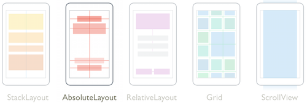
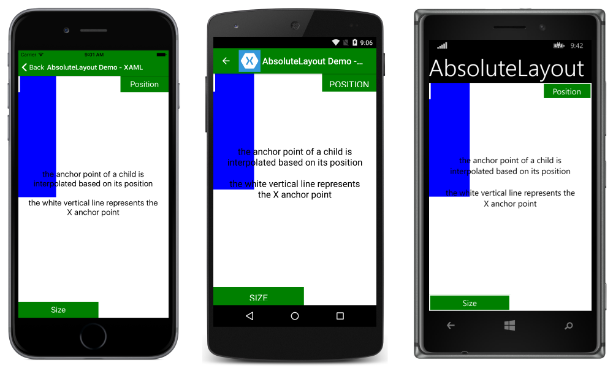
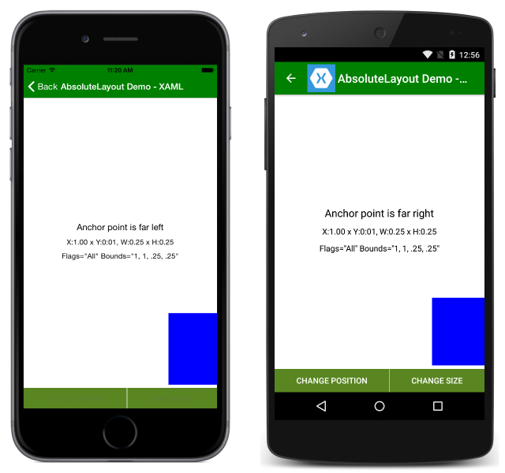
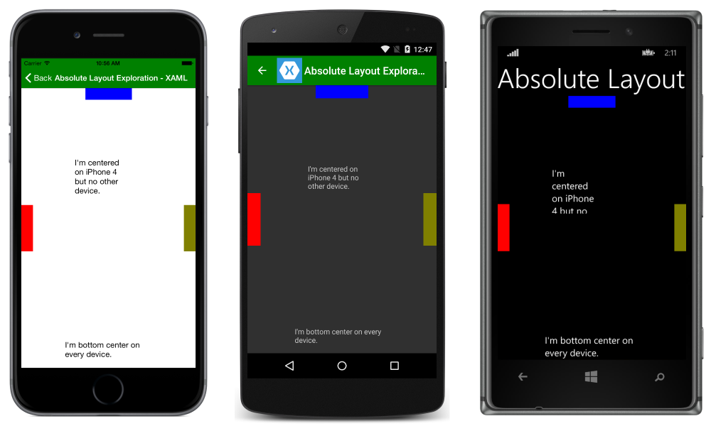
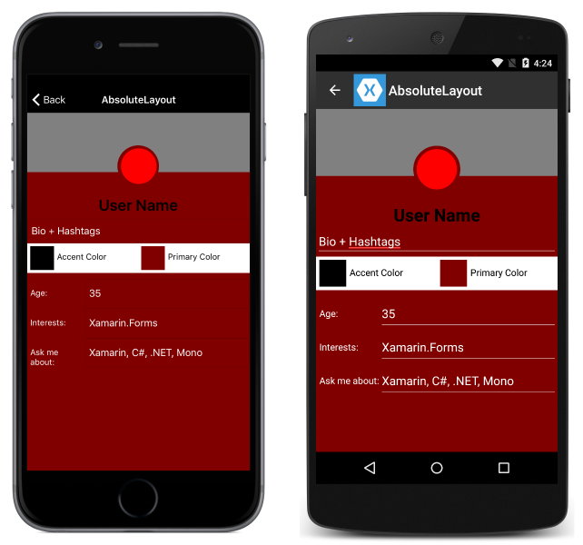

# Xamarin.Forms AbsoluteLayout

[ Download the sample](https://developer.xamarin.com/samples/xamarin-forms/UserInterface/Layout/)

[`AbsoluteLayout`](xref:Xamarin.Forms.AbsoluteLayout) positions and sizes child elements proportional to its own size and position or by absolute values. Child views may be positioned and sized using proportional values or static values, and proportional and static values can be mixed.

[](absolute-layout-images/layouts.png#lightbox "Xamarin.Forms Layouts")

This article will cover:

- **[Purpose](#Purpose)** &ndash; common uses for `AbsoluteLayout`.
- **[Usage](#Usage)** &ndash; how to use `AbsoluteLayout` to achieve your desired design.
  - **[Proportional Layouts](#Proportional_Layouts)** &ndash; understand how proportional values work in an `AbsoluteLayout`.
  - **[Specifying Values](#Specifying_Values)** &ndash; understand how proportional and absolute values are specified.
  - **[Proportional Values](#Proportional_Values)** &ndash; understand how proportional values work.
    - **[Absolute Values](#Absolute_Values)** &ndash; understand how absolute values work.

<a name="Purpose" />

## Purpose

Because of the positioning model of `AbsoluteLayout`, the layout makes it relatively straightforward to position elements so that they are flush with any side of the layout, or centered. With proportional sizes and positions, elements in an `AbsoluteLayout` can scale automatically to any view size. For items where only the position but not the size should scale, absolute and proportional values can be mixed.

`AbsoluteLayout` could be used anywhere elements need to be positioned within a view and is especially useful when aligning elements to edges.

<a name="Usage" />

## Usage

<a name="Proportional_Layouts" />

### Proportional Layouts

`AbsoluteLayout` has a unique anchor model whereby the anchor of the element is positioned relative to its element as the element is positioned relative to the layout when proportional positioning is used. When absolute positioning is used, the anchor is at (0,0) within the view. This has two important consequences:

- Elements cannot be positioned off screen using proportional values.
- Elements can be reliably positioned along any side of the layout or in the center, regardless of the size of the layout or device.

`AbsoluteLayout`, like `RelativeLayout`, is able to position elements so that they overlap.

Note in the following screenshot, the anchor of the box is a white dot. Notice the relationship between the anchor and the box as it moves through the layout:





<a name="Specifying_Values" />

### Specifying Values

Views within an `AbsoluteLayout` are positioned using four values:

- **X** &ndash; the x (horizontal) position of the view's anchor
- **Y** &ndash; the y (vertical) position of the view's anchor
- **Width** &ndash; the width of the view
- **Height** &ndash; the height of the view

Each of those values can be set as a [proportional](#Proportional_Values) value or an [absolute](#Absolute_Values) value.

Values are specified as a combination of bounds and a flag. `LayoutBounds` is a [`Rectangle`](xref:Xamarin.Forms.Rectangle) consisting of four values: `x`, `y`, `width`, `height`.

### AbsoluteLayoutFlags

[`AbsoluteLayoutFlags`](xref:Xamarin.Forms.AbsoluteLayoutFlags) specifies how values will be interpreted and has the following predefined options:

- **None** &ndash; interprets all values as absolute. This is the default value if no layout flags are specified.
- **All** &ndash; interprets all values as proportional.
- **WidthProportional** &ndash; interprets the `Width` value as proportional and all other values as absolute.
- **HeightProportional** &ndash; interprets only the height value as proportional with all other values absolute.
- **XProportional** &ndash; interprets the `X` value as proportional, while treating all other values as absolute.
- **YProportional** &ndash; interprets the `Y` value as proportional, while treating all other values as absolute.
- **PositionProportional** &ndash; interprets the `X` and `Y` values as proportional, while the size values are interpreted as absolute.
- **SizeProportional** &ndash; interprets the `Width` and `Height` values as proportional while the position values are absolute.

In XAML, bounds and flags are set as part of the definition of views within the layout, using the `AbsoluteLayout.LayoutBounds` property. Bounds are set as a comma-separated list of values,  `X`, `Y`, `Width`, and `Height`, in that order. Flags are also specified in the declaration of views in the layout using the `AbsoluteLayout.LayoutFlags` property. Note that flags can be combined in XAML using a comma-separated list. Consider the following example:

```xaml
<?xml version="1.0" encoding="UTF-8"?>
<ContentPage xmlns="http://xamarin.com/schemas/2014/forms"
xmlns:x="http://schemas.microsoft.com/winfx/2009/xaml"
x:Class="LayoutSamples.AbsoluteLayoutExploration"
Title="Absolute Layout Exploration">
    <ContentPage.Content>
        <AbsoluteLayout>
            <Label Text="I'm centered on iPhone 4 but no other device"
                AbsoluteLayout.LayoutBounds="115,150,100,100" LineBreakMode="WordWrap"  />
            <Label Text="I'm bottom center on every device."
                AbsoluteLayout.LayoutBounds=".5,1,.5,.1" AbsoluteLayout.LayoutFlags="All"
                LineBreakMode="WordWrap"  />
            <BoxView Color="Olive"  AbsoluteLayout.LayoutBounds="1,.5, 25, 100"
                AbsoluteLayout.LayoutFlags="PositionProportional" />
            <BoxView Color="Red" AbsoluteLayout.LayoutBounds="0,.5,25,100"
                AbsoluteLayout.LayoutFlags="PositionProportional" />
            <BoxView Color="Blue" AbsoluteLayout.LayoutBounds=".5,0,100,25"
                AbsoluteLayout.LayoutFlags="PositionProportional" />
        </AbsoluteLayout>
    </ContentPage.Content>
</ContentPage>
```



Note the following:

- The label in the center is positioned using absolute size and position values. Because of that, it appears centered on iPhone 4S and lower, but not centered on larger devices.
- The text at the bottom of the layout is positioned using proportional size and position values. It will always appear at the bottom center of the layout, but its size will grow with larger layout sizes.
- Three colored `BoxView`s are positioned at the top, left, and right edges of the screen using proportional position and absolute size.

The following achieves the same layout in C#:

```csharp
public class AbsoluteLayoutExplorationCode : ContentPage
{
    public AbsoluteLayoutExplorationCode ()
    {
        Title = "Absolute Layout Exploration - Code";
        var layout = new AbsoluteLayout();

        var centerLabel = new Label {
        Text = "I'm centered on iPhone 4 but no other device.",
        LineBreakMode = LineBreakMode.WordWrap};

        AbsoluteLayout.SetLayoutBounds (centerLabel, new Rectangle (115, 159, 100, 100));
        // No need to set layout flags, absolute positioning is the default

        var bottomLabel = new Label { Text = "I'm bottom center on every device.", LineBreakMode = LineBreakMode.WordWrap };
        AbsoluteLayout.SetLayoutBounds (bottomLabel, new Rectangle (.5, 1, .5, .1));
        AbsoluteLayout.SetLayoutFlags (bottomLabel, AbsoluteLayoutFlags.All);

        var rightBox = new BoxView{ Color = Color.Olive };
        AbsoluteLayout.SetLayoutBounds (rightBox, new Rectangle (1, .5, 25, 100));
        AbsoluteLayout.SetLayoutFlags (rightBox, AbsoluteLayoutFlags.PositionProportional);

        var leftBox = new BoxView{ Color = Color.Red };
        AbsoluteLayout.SetLayoutBounds (leftBox, new Rectangle (0, .5, 25, 100));
        AbsoluteLayout.SetLayoutFlags (leftBox, AbsoluteLayoutFlags.PositionProportional);

        var topBox = new BoxView{ Color = Color.Blue };
        AbsoluteLayout.SetLayoutBounds (topBox, new Rectangle (.5, 0, 100, 25));
        AbsoluteLayout.SetLayoutFlags (topBox, AbsoluteLayoutFlags.PositionProportional);

        layout.Children.Add (bottomLabel);
        layout.Children.Add (centerLabel);
        layout.Children.Add (rightBox);
        layout.Children.Add (leftBox);
        layout.Children.Add (topBox);

        Content = layout;
    }
}
```
<a name="Proportional_Values" />

### Proportional Values

Proportional values define a relationship between a layout and a view. This relationship defines a child view's position or scale value as a proportion of the corresponding value of the parent layout. These values are expressed as `double`s with values between 0 and 1.

Proportional values are used to position and size views within the layout. So, when a view's width is set as a proportion, the resultant width value is the proportion multiplied by the `AbsoluteLayout`'s width. For example, with an `AbsoluteLayout` of width `500` and a view set to have a proportional width of .5, the rendered width of the view will be 250 (500 x .5).

To use proportional values, set `LayoutBounds` using (x, y) proportions and proportional sizes, then set `LayoutFlags` to `All`.

In XAML:

```xaml
<Label Text="I'm bottom center on every device."
  AbsoluteLayout.LayoutBounds=".5,1,.5,.1" AbsoluteLayout.LayoutFlags="All"  />
```

In C#:

```csharp
var label = new Label {Text = "I'm bottom center on every device."};
AbsoluteLayout.SetLayoutBounds(label, new Rectangle(.5,1,.5,.1));
AbsoluteLayout.SetLayoutFlags(label, AbsoluteLayoutFlags.All);
```

<a name="Absolute_Values" />

### Absolute Values

Absolute values explicitly define where views should be positioned within the layout. Unlike proportional values, absolute values are capable of positioning and sizing a view that does not fit within the bounds of the layout.

Using absolute values for positioning can be dangerous when the size of the layout is not known. When using absolute positions, an element in the center of the screen at one size could be offset at any other size. It is important to test your app across the various screen sizes of your supported devices.

To use absolute layout values, set `LayoutBounds` using (x, y) coordinates and explicit sizes, then set `LayoutFlags` to `None`.

In XAML:

```xaml
<Label Text="I'm centered on iPhone 4 but no other device."
  AbsoluteLayout.LayoutBounds="115,150,100,100"  />
```

In C#:

```csharp
var label = new Label {Text = "I'm centered on iPhone 4 but no other device."};
AbsoluteLayout.SetLayoutBounds(label, new Rectangle(115,150,100,100));
```

## Exploring a Complex Layout

Each of the layouts have strengths and weaknesses for creating particular layouts. Throughout this series of layout articles, a sample app has been created with the same page layout implemented using three different layouts.

Consider the following XAML:

```xaml
<?xml version="1.0" encoding="UTF-8"?>
<ContentPage xmlns="http://xamarin.com/schemas/2014/forms"
xmlns:x="http://schemas.microsoft.com/winfx/2009/xaml"
x:Class="TheBusinessTumble.AbsoluteLayoutPage"
Title="AbsoluteLayout">
    <ContentPage.ToolbarItems>
        <ToolbarItem Text="Save" />
    </ContentPage.ToolbarItems>
    <ContentPage.Content>
        <ScrollView>
            <AbsoluteLayout BackgroundColor="Maroon">
                <BoxView BackgroundColor="Gray" AbsoluteLayout.LayoutBounds="0
                    0,1,100" AbsoluteLayout.LayoutFlags="XProportional,YProportional,WidthProportional" />
                <Button BackgroundColor="Maroon"
                    AbsoluteLayout.LayoutBounds=".5,55,70,70" AbsoluteLayout.LayoutFlags="XProportional" BorderRadius="35" />
                <Button BackgroundColor="Red" AbsoluteLayout.LayoutBounds=".5
                    60,60,60" AbsoluteLayout.LayoutFlags="XProportional" BorderRadius="30" />
                <Label Text="User Name" FontAttributes="Bold" FontSize="26"
                    TextColor="Black" HorizontalTextAlignment="Center" AbsoluteLayout.LayoutBounds=".5,140,1,40" AbsoluteLayout.LayoutFlags="XProportional,WidthProportional" />
                <Entry Text="Bio + Hashtags" TextColor="White"
                    BackgroundColor="Maroon" AbsoluteLayout.LayoutBounds=".5,180,1,40" AbsoluteLayout.LayoutFlags="XProportional,WidthProportional" />
                <AbsoluteLayout BackgroundColor="White"
                        AbsoluteLayout.LayoutBounds="0, 220, 1, 50" AbsoluteLayout.LayoutFlags="XProportional,WidthProportional">
                    <AbsoluteLayout AbsoluteLayout.LayoutBounds="0,0,.5,1" AbsoluteLayout.LayoutFlags="WidthProportional,HeightProportional">
                        <Button BackgroundColor="Black" BorderRadius="20"
                            AbsoluteLayout.LayoutBounds="5,.5,40,40" AbsoluteLayout.LayoutFlags="YProportional" />
                        <Label Text="Accent Color" TextColor="Black"
                            AbsoluteLayout.LayoutBounds="50,.55,1,25" AbsoluteLayout.LayoutFlags="YProportional,WidthProportional" />
                    </AbsoluteLayout>
                    <AbsoluteLayout AbsoluteLayout.LayoutBounds="1,0,.5,1" AbsoluteLayout.LayoutFlags="WidthProportional,HeightProportional,XProportional">
                        <Button BackgroundColor="Maroon" BorderRadius="20"
                            AbsoluteLayout.LayoutBounds="5,.5,40,40" AbsoluteLayout.LayoutFlags="YProportional" />
                        <Label Text="Primary Color" TextColor="Black"
                            AbsoluteLayout.LayoutBounds="50,.55,1,25" AbsoluteLayout.LayoutFlags="YProportional,WidthProportional" />
                    </AbsoluteLayout>
                </AbsoluteLayout>
                <AbsoluteLayout AbsoluteLayout.LayoutBounds="0,270,1,50" AbsoluteLayout.LayoutFlags="WidthProportional" Padding="5,0,0,0">
                    <Label Text="Age:" TextColor="White"
                        AbsoluteLayout.LayoutBounds="0,25,.25,50" AbsoluteLayout.LayoutFlags="WidthProportional" />
                    <Entry Text="35" TextColor="White" BackgroundColor="Maroon"
                        AbsoluteLayout.LayoutBounds="1,10,.75,50" AbsoluteLayout.LayoutFlags="XProportional,WidthProportional" />
                </AbsoluteLayout>
                <AbsoluteLayout AbsoluteLayout.LayoutBounds="0,320,1,50" AbsoluteLayout.LayoutFlags="WidthProportional" Padding="5,0,0,0">
                    <Label Text="Interests:" TextColor="White"
                        AbsoluteLayout.LayoutBounds="0,25,.25,50" AbsoluteLayout.LayoutFlags="WidthProportional" />
                    <Entry Text="Xamarin.Forms" TextColor="White"
                        BackgroundColor="Maroon" AbsoluteLayout.LayoutBounds="1,10,.75,50" AbsoluteLayout.LayoutFlags="XProportional,WidthProportional" />
                </AbsoluteLayout>
                <AbsoluteLayout AbsoluteLayout.LayoutBounds="0,370,1,50" AbsoluteLayout.LayoutFlags="WidthProportional" Padding="5,0,0,0">
                    <Label Text="Ask me about:" TextColor="White"
                        AbsoluteLayout.LayoutBounds="0,25,.25,50" AbsoluteLayout.LayoutFlags="WidthProportional" />
                    <Entry Text="Xamarin, C#, .NET, Mono" TextColor="White"
                        BackgroundColor="Maroon" AbsoluteLayout.LayoutBounds="1,10,.75,50" AbsoluteLayout.LayoutFlags="XProportional,WidthProportional" />
                </AbsoluteLayout>
            </AbsoluteLayout>
        </ScrollView>
    </ContentPage.Content>
</ContentPage>
```

The above code results in the following layout:



Notice that `AbsoluteLayout`s are nested, because in some cases nesting layouts can be easier than presenting all elements within the same layout.

## Related Links

- [Creating Mobile Apps with Xamarin.Forms, Chapter 14](https://developer.xamarin.com/r/xamarin-forms/book/chapter14.pdf)
- [AbsoluteLayout](xref:Xamarin.Forms.AbsoluteLayout)
- [Layout (sample)](https://developer.xamarin.com/samples/xamarin-forms/UserInterface/Layout/)
- [BusinessTumble Example (sample)](https://developer.xamarin.com/samples/xamarin-forms/UserInterface/BusinessTumble/)
