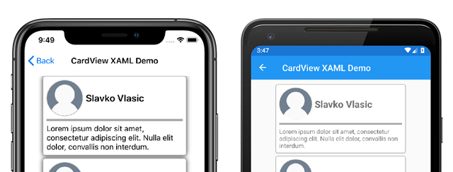
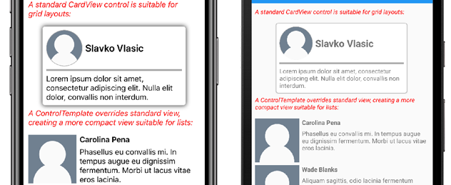

# Xamarin.Forms ContentView

[ Download the sample](/samples/xamarin/xamarin-forms-samples/userinterface-contentviewdemos/)

The Xamarin.Forms [`ContentView`](xref:Xamarin.Forms.ContentView) class is a type of `Layout` that contains a single child element and is typically used to create custom, reusable controls. The `ContentView` class inherits from [`TemplatedView`](xref:Xamarin.Forms.TemplatedView). This article, and associated sample, explain how to create a custom `CardView` control based on the `ContentView` class.

The following screenshot shows a `CardView` control that derives from the `ContentView` class:

[](contentview-images/cardview-list.png#lightbox)

The `ContentView` class defines a single property:

* [`Content`](xref:Xamarin.Forms.ContentView.Content) is a `View` object. This property is backed by a [`BindableProperty`](xref:Xamarin.Forms.BindableProperty) object so it can be the target of data bindings.

The `ContentView` also inherits a property from the `TemplatedView` class:

* [`ControlTemplate`](xref:Xamarin.Forms.TemplatedView.ControlTemplate) is a `ControlTemplate` that can define or override the appearance of the control.

For more information about the `ControlTemplate` property, see [Customize appearance with a ControlTemplate](#customize-appearance-with-a-controltemplate).

## Create a custom control

The `ContentView` class offers little functionality by itself but can be used to create a custom control. The sample project defines a `CardView` control - a UI element that displays an image, title, and description in a card-like layout.

The process for creating a custom control is to:

1. Create a new class using the `ContentView` template in Visual Studio 2019.
1. Define any unique properties or events in the code-behind file for the new custom control.
1. Create the UI for the custom control.

> [!NOTE]
> It's possible to create a custom control whose layout is defined in code instead of XAML. For simplicity, the sample application only defines a single `CardView` class with a XAML layout. However, the sample application contains a **CardViewCodePage** class that shows the process of consuming the custom control in code.

### Create code-behind properties

The `CardView` custom control defines the following properties:

* `CardTitle`: a `string` object that represents the title shown on the card.
* `CardDescription`: a `string` object that represents the description shown on the card.
* `IconImageSource`: an `ImageSource` object that represents the image shown on the card.
* `IconBackgroundColor`: a `Color` object that represents the background color for the image shown on the card.
* `BorderColor`: a `Color` object that represents the color of the card border, image border, and divider line.
* `CardColor`: a `Color` object that represents the background color of the card.

> [!NOTE]
> The `BorderColor` property affects multiple items for the purposes of demonstration. This property could be broken out into three properties if needed.

Each property is backed by a `BindableProperty` instance. The backing `BindableProperty` allows each property to be styled, and bound, using the MVVM pattern.

The following example shows how to create a backing `BindableProperty`:

```csharp
public static readonly BindableProperty CardTitleProperty = BindableProperty.Create(
    "CardTitle",        // the name of the bindable property
    typeof(string),     // the bindable property type
    typeof(CardView),   // the parent object type
    string.Empty);      // the default value for the property
```

The custom property uses the `GetValue` and `SetValue` methods to get and set the `BindableProperty` object values:

```csharp
public string CardTitle
{
    get => (string)GetValue(CardView.CardTitleProperty);
    set => SetValue(CardView.CardTitleProperty, value);
}
```

For more information about `BindableProperty` objects, see [Bindable Properties](~/xamarin-forms/xaml/bindable-properties.md).

### Define UI

The custom control UI uses a `ContentView` as the root element for the `CardView` control. The following example shows the `CardView` XAML:

```XAML
<ContentView ...
             x:Name="this"
             x:Class="CardViewDemo.Controls.CardView">
    <Frame BindingContext="{x:Reference this}"
            BackgroundColor="{Binding CardColor}"
            BorderColor="{Binding BorderColor}"
            ...>
        <Grid>
            ...
            <Frame BorderColor="{Binding BorderColor, FallbackValue='Black'}"
                   BackgroundColor="{Binding IconBackgroundColor, FallbackValue='Grey'}"
                   ...>
                <Image Source="{Binding IconImageSource}"
                       .. />
            </Frame>
            <Label Text="{Binding CardTitle, FallbackValue='Card Title'}"
                   ... />
            <BoxView BackgroundColor="{Binding BorderColor, FallbackValue='Black'}"
                     ... />
            <Label Text="{Binding CardDescription, FallbackValue='Card description text.'}"
                   ... />
        </Grid>
    </Frame>
</ContentView>
```

The `ContentView` element sets the `x:Name` property to **this**, which can be used to access the object bound to the `CardView` instance. Elements in the layout set bindings on their properties to values defined on the bound object.

For more information about data binding, see [Xamarin.Forms Data Binding](~/xamarin-forms/app-fundamentals/data-binding/index.md).

> [!NOTE]
> The `FallbackValue` property provides a default value in case the binding is `null`. This also allows the [XAML Previewer](~/xamarin-forms/xaml/xaml-previewer/index.md) in Visual Studio to render the `CardView` control.

## Instantiate a custom control

A reference to the custom control namespace must be added to a page that instantiates the custom control. The following example shows a namespace reference called **controls** added to a `ContentPage` instance in XAML:

```xaml
<ContentPage ...
             xmlns:controls="clr-namespace:CardViewDemo.Controls" >
```

Once the reference has been added the `CardView` can be instantiated in XAML, and its properties defined:

```xaml
<controls:CardView BorderColor="DarkGray"
                   CardTitle="Slavko Vlasic"
                   CardDescription="Lorem ipsum dolor sit..."
                   IconBackgroundColor="SlateGray"
                   IconImageSource="user.png"/>
```

A `CardView` can also be instantiated in code:

```csharp
CardView card = new CardView
{
    BorderColor = Color.DarkGray,
    CardTitle = "Slavko Vlasic",
    CardDescription = "Lorem ipsum dolor sit...",
    IconBackgroundColor = Color.SlateGray,
    IconImageSource = ImageSource.FromFile("user.png")
};
```

## Customize appearance with a ControlTemplate

A custom control that derives from the `ContentView` class can define appearance using XAML, code, or may not define appearance at all. Regardless of how appearance is defined, a `ControlTemplate` object can override the appearance with a custom layout.

The `CardView` layout might occupy too much space for some use cases. A `ControlTemplate` can override the `CardView` layout to provide a more compact view, suitable for a condensed list:

```xaml
<ContentPage.Resources>
    <ResourceDictionary>
        <ControlTemplate x:Key="CardViewCompressed">
            <Grid>
                <Grid.RowDefinitions>
                    <RowDefinition Height="100" />
                </Grid.RowDefinitions>
                <Grid.ColumnDefinitions>
                    <ColumnDefinition Width="100" />
                    <ColumnDefinition Width="100*" />
                </Grid.ColumnDefinitions>
                <Image Grid.Row="0"
                       Grid.Column="0"
                       Source="{TemplateBinding IconImageSource}"
                       BackgroundColor="{TemplateBinding IconBackgroundColor}"
                       WidthRequest="100"
                       HeightRequest="100"
                       Aspect="AspectFill"
                       HorizontalOptions="Center"
                       VerticalOptions="Center"/>
                <StackLayout Grid.Row="0"
                             Grid.Column="1">
                    <Label Text="{TemplateBinding CardTitle}"
                           FontAttributes="Bold" />
                    <Label Text="{TemplateBinding CardDescription}" />
                </StackLayout>
            </Grid>
        </ControlTemplate>
    </ResourceDictionary>
</ContentPage.Resources>
```

Data binding in a `ControlTemplate` uses the `TemplateBinding` markup extension to specify bindings. The `ControlTemplate` property can then be set to the defined ControlTemplate object, by using its `x:Key` value. The following example shows the `ControlTemplate` property set on a `CardView` instance:

```xaml
<controls:CardView ControlTemplate="{StaticResource CardViewCompressed}"/>
```

The following screenshots show a standard `CardView` instance and `CardView` whose `ControlTemplate` has been overridden:

[](contentview-images/cardview-controltemplates.png#lightbox)

For more information about control templates, see [Xamarin.Forms Control Templates](~/xamarin-forms/app-fundamentals/templates/control-template.md).

## Related links

* [ContentView sample application](/samples/xamarin/xamarin-forms-samples/userinterface-contentviewdemos/)
* [Xamarin.Forms Data Binding](~/xamarin-forms/app-fundamentals/data-binding/index.md)
* [Bindable Properties](~/xamarin-forms/xaml/bindable-properties.md).
* [Xamarin.Forms Control Templates](~/xamarin-forms/app-fundamentals/templates/control-template.md)