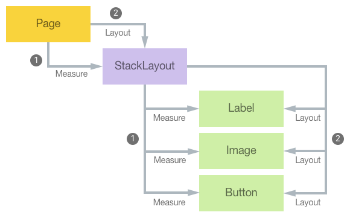
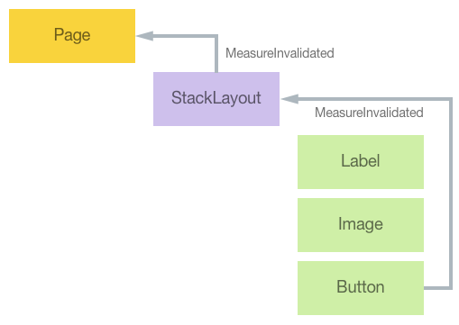

# Create a Custom Layout in Xamarin.Forms

[ Download the sample](/samples/xamarin/xamarin-forms-samples/userinterface-customlayout-wraplayout)

_Xamarin.Forms defines five layout classes – StackLayout, AbsoluteLayout, RelativeLayout, Grid, and FlexLayout, and each arranges its children in a different way. However, sometimes it's necessary to organize page content using a layout not provided by Xamarin.Forms. This article explains how to write a custom layout class, and demonstrates an orientation-sensitive WrapLayout class that arranges its children horizontally across the page, and then wraps the display of subsequent children to additional rows._

In Xamarin.Forms, all layout classes derive from the [`Layout<T>`](xref:Xamarin.Forms.Layout`1) class and constrain the generic type to [`View`](xref:Xamarin.Forms.View) and its derived types. In turn, the `Layout<T>` class derives from the [`Layout`](xref:Xamarin.Forms.Layout) class, which provides the mechanism for positioning and sizing child elements.

Every visual element is responsible for determining its own preferred size, which is known as the *requested* size. [`Page`](xref:Xamarin.Forms.Page), [`Layout`](xref:Xamarin.Forms.Layout), and [`Layout<View>`](xref:Xamarin.Forms.Layout`1) derived types are responsible for determining the location and size of their child, or children, relative to themselves. Therefore, layout involves a parent-child relationship, where the parent determines what the size of its children should be, but will attempt to accommodate the requested size of the child.

A thorough understanding of the Xamarin.Forms layout and invalidation cycles is required to create a custom layout. These cycles will now be discussed.

## Layout

Layout begins at the top of the visual tree with a page, and it proceeds through all branches of the visual tree to encompass every visual element on a page. Elements that are parents to other elements are responsible for sizing and positioning their children relative to themselves.

The [`VisualElement`](xref:Xamarin.Forms.VisualElement) class defines a [`Measure`](xref:Xamarin.Forms.VisualElement.Measure(System.Double,System.Double,Xamarin.Forms.MeasureFlags)) method that measures an element for layout operations, and a [`Layout`](xref:Xamarin.Forms.VisualElement.Layout(Xamarin.Forms.Rectangle)) method that specifies the rectangular area the element will be rendered within. When an application starts and the first page is displayed, a *layout cycle* consisting first of `Measure` calls, and then `Layout` calls, starts on the [`Page`](xref:Xamarin.Forms.Page) object:

1. During the layout cycle, every parent element is responsible for calling the `Measure` method on its children.
1. After the children have been measured, every parent element is responsible for calling the `Layout` method on its children.

This cycle ensures that every visual element on the page receives calls to the `Measure` and `Layout` methods. The process is shown in the following diagram:



> [!NOTE]
> Note that layout cycles can also occur on a subset of the visual tree if something changes to affect the layout. This includes items being added or removed from a collection such as in a [`StackLayout`](xref:Xamarin.Forms.StackLayout), a change in the [`IsVisible`](xref:Xamarin.Forms.VisualElement.IsVisible) property of an element, or a change in the size of an element.

Every Xamarin.Forms class that has a `Content` or a `Children` property has an overridable [`LayoutChildren`](xref:Xamarin.Forms.Layout.LayoutChildren(System.Double,System.Double,System.Double,System.Double)) method. Custom layout classes that derive from [`Layout<View>`](xref:Xamarin.Forms.Layout`1) must override this method and ensure that the [`Measure`](xref:Xamarin.Forms.VisualElement.Measure(System.Double,System.Double,Xamarin.Forms.MeasureFlags)) and [`Layout`](xref:Xamarin.Forms.VisualElement.Layout(Xamarin.Forms.Rectangle)) methods are called on all the element's children, to provide the desired custom layout.

In addition, every class that derives from [`Layout`](xref:Xamarin.Forms.Layout) or [`Layout<View>`](xref:Xamarin.Forms.Layout`1) must override the [`OnMeasure`](xref:Xamarin.Forms.VisualElement.OnMeasure(System.Double,System.Double)) method, which is where a layout class determines the size that it needs to be by making calls to the [`Measure`](xref:Xamarin.Forms.VisualElement.Measure(System.Double,System.Double,Xamarin.Forms.MeasureFlags)) methods of its children.

> [!NOTE]
> Elements determine their size based on *constraints*, which indicate how much space is available for an element within the element's parent. Constraints passed to the [`Measure`](xref:Xamarin.Forms.VisualElement.Measure(System.Double,System.Double,Xamarin.Forms.MeasureFlags)) and [`OnMeasure`](xref:Xamarin.Forms.VisualElement.OnMeasure(System.Double,System.Double)) methods can range from 0 to `Double.PositiveInfinity`. An element is *constrained*, or *fully constrained*, when it receives a call to its [`Measure`](xref:Xamarin.Forms.VisualElement.Measure(System.Double,System.Double,Xamarin.Forms.MeasureFlags)) method with non-infinite arguments - the element is constrained to a particular size. An element is *unconstrained*, or *partially constrained*, when it receives a call to its `Measure` method with at least one argument equal to `Double.PositiveInfinity` – the infinite constraint can be thought of as indicating autosizing.

## Invalidation

Invalidation is the process by which a change in an element on a page triggers a new layout cycle. Elements are considered invalid when they no longer have the correct size or position. For example, if the [`FontSize`](xref:Xamarin.Forms.Button.FontSize) property of a [`Button`](xref:Xamarin.Forms.Button) changes, the `Button` is said to be invalid because it will no longer have the correct size. Resizing the `Button` may then have a ripple effect of changes in layout through the rest of a page.

Elements invalidate themselves by invoking the [`InvalidateMeasure`](xref:Xamarin.Forms.VisualElement.InvalidateMeasure) method, generally when a property of the element changes that might result in a new size of the element. This method fires the [`MeasureInvalidated`](xref:Xamarin.Forms.VisualElement.MeasureInvalidated) event, which the element's parent handles to trigger a new layout cycle.

The [`Layout`](xref:Xamarin.Forms.Layout) class sets a handler for the [`MeasureInvalidated`](xref:Xamarin.Forms.VisualElement.MeasureInvalidated) event on every child added to its `Content` property or `Children` collection, and detaches the handler when the child is removed. Therefore, every element in the visual tree that has children is alerted whenever one of its children changes size. The following diagram illustrates how a change in the size of an element in the visual tree can cause changes that ripple up the tree:



However, the `Layout` class attempts to restrict the impact of a change in a child's size on the layout of a page. If the layout is size constrained, then a child size change does not affect anything higher than the parent layout in the visual tree. However, usually a change in the size of a layout affects how the layout arranges its children. Therefore, any change in a layout's size will start a layout cycle for the layout, and the layout will receive calls to its [`OnMeasure`](xref:Xamarin.Forms.VisualElement.OnMeasure(System.Double,System.Double)) and [`LayoutChildren`](xref:Xamarin.Forms.Layout.LayoutChildren(System.Double,System.Double,System.Double,System.Double)) methods.

The [`Layout`](xref:Xamarin.Forms.Layout) class also defines an [`InvalidateLayout`](xref:Xamarin.Forms.Layout.InvalidateLayout) method that has a similar purpose to the [`InvalidateMeasure`](xref:Xamarin.Forms.VisualElement.InvalidateMeasure) method. The `InvalidateLayout` method should be invoked whenever a change is made that affects how the layout positions and sizes its children. For example, the `Layout` class invokes the `InvalidateLayout` method whenever a child is added to or removed from a layout.

The [`InvalidateLayout`](xref:Xamarin.Forms.Layout.InvalidateLayout) can be overridden to implement a cache to minimize repetitive invocations of the [`Measure`](xref:Xamarin.Forms.VisualElement.Measure(System.Double,System.Double,Xamarin.Forms.MeasureFlags)) methods of the layout's children. Overriding the `InvalidateLayout` method will provide a notification of when children are added to or removed from the layout. Similarly, the [`OnChildMeasureInvalidated`](xref:Xamarin.Forms.Layout.OnChildMeasureInvalidated) method can be overridden to provide a notification when one of the layout's children changes size. For both method overrides, a custom layout should respond by clearing the cache. For more information, see [Calculate and Cache Layout Data](#calculate-and-cache-layout-data).

## Create a Custom Layout

The process for creating a custom layout is as follows:

1. Create a class that derives from the `Layout<View>` class. For more information, see [Create a WrapLayout](#create-a-wraplayout).
1. [*optional*] Add properties, backed by bindable properties, for any parameters that should be set on the layout class. For more information, see [Add Properties Backed by Bindable Properties](#add-properties-backed-by-bindable-properties).
1. Override the [`OnMeasure`](xref:Xamarin.Forms.VisualElement.OnMeasure(System.Double,System.Double)) method to invoke the [`Measure`](xref:Xamarin.Forms.VisualElement.Measure(System.Double,System.Double,Xamarin.Forms.MeasureFlags)) method on all the layout's children, and return a requested size for the layout. For more information, see [Override the OnMeasure Method](#override-the-onmeasure-method).
1. Override the [`LayoutChildren`](xref:Xamarin.Forms.Layout.LayoutChildren(System.Double,System.Double,System.Double,System.Double)) method to invoke the [`Layout`](xref:Xamarin.Forms.VisualElement.Layout(Xamarin.Forms.Rectangle)) method on all the layout's children. Failure to invoke the [`Layout`](xref:Xamarin.Forms.VisualElement.Layout(Xamarin.Forms.Rectangle)) method on each child in a layout will result in the child never receiving a correct size or position, and hence the child will not become visible on the page. For more information, see [Override the LayoutChildren Method](#override-the-layoutchildren-method).

    > [!NOTE]
    > When enumerating children in the [`OnMeasure`](xref:Xamarin.Forms.VisualElement.OnMeasure(System.Double,System.Double)) and [`LayoutChildren`](xref:Xamarin.Forms.Layout.LayoutChildren(System.Double,System.Double,System.Double,System.Double)) overrides, skip any child whose [`IsVisible`](xref:Xamarin.Forms.VisualElement.IsVisible) property is set to `false`. This will ensure that the custom layout won't leave space for invisible children.

1. [*optional*] Override the [`InvalidateLayout`](xref:Xamarin.Forms.Layout.InvalidateLayout) method to be notified when children are added to or removed from the layout. For more information, see [Override the InvalidateLayout Method](#override-the-invalidatelayout-method).
1. [*optional*] Override the [`OnChildMeasureInvalidated`](xref:Xamarin.Forms.Layout.OnChildMeasureInvalidated) method to be notified when one of the layout's children changes size. For more information, see [Override the OnChildMeasureInvalidated Method](#override-the-onchildmeasureinvalidated-method).

> [!NOTE]
> Note that the [`OnMeasure`](xref:Xamarin.Forms.VisualElement.OnMeasure(System.Double,System.Double)) override won't be invoked if the size of the layout is governed by its parent, rather than its children. However, the override will be invoked if one or both of the constraints are infinite, or if the layout class has non-default [`HorizontalOptions`](xref:Xamarin.Forms.View.HorizontalOptions) or [`VerticalOptions`](xref:Xamarin.Forms.View.VerticalOptions) property values. For this reason, the [`LayoutChildren`](xref:Xamarin.Forms.Layout.LayoutChildren(System.Double,System.Double,System.Double,System.Double)) override can't rely on child sizes obtained during the [`OnMeasure`](xref:Xamarin.Forms.VisualElement.OnMeasure(System.Double,System.Double)) method call. Instead, `LayoutChildren` must invoke the [`Measure`](xref:Xamarin.Forms.VisualElement.Measure(System.Double,System.Double,Xamarin.Forms.MeasureFlags)) method on the layout's children, before invoking the [`Layout`](xref:Xamarin.Forms.VisualElement.Layout(Xamarin.Forms.Rectangle)) method. Alternatively, the size of the children obtained in the `OnMeasure` override can be cached to avoid later `Measure` invocations in the `LayoutChildren` override, but the layout class will need to know when the sizes need to be obtained again. For more information, see [Calculate and Cache Layout Data](#calculate-and-cache-layout-data).

The layout class can then be consumed by adding it to a [`Page`](xref:Xamarin.Forms.Page), and by adding children to the layout. For more information, see [Consume the WrapLayout](#consume-the-wraplayout).

### Create a WrapLayout

The sample application demonstrates an orientation-sensitive `WrapLayout` class that arranges its children horizontally across the page, and then wraps the display of subsequent children to additional rows.

The `WrapLayout` class allocates the same amount of space for each child, known as the *cell size*, based on the maximum size of the children. Children smaller than the cell size can be positioned within the cell based on their [`HorizontalOptions`](xref:Xamarin.Forms.View.HorizontalOptions) and [`VerticalOptions`](xref:Xamarin.Forms.View.VerticalOptions) property values.

The `WrapLayout` class definition is shown in the following code example:

```csharp
public class WrapLayout : Layout<View>
{
  Dictionary<Size, LayoutData> layoutDataCache = new Dictionary<Size, LayoutData>();
  ...
}
```

#### Calculate and Cache Layout Data

The `LayoutData` structure stores data about a collection of children in a number of properties:

- `VisibleChildCount` – the number of children that are visible in the layout.
- `CellSize` – the maximum size of all the children, adjusted to the size of the layout.
- `Rows` – the number of rows.
- `Columns` – the number of columns.

The `layoutDataCache` field is used to store multiple `LayoutData` values. When the application starts, two `LayoutData` objects will be cached into the `layoutDataCache` dictionary for the current orientation – one for the constraint arguments to the `OnMeasure` override, and one for the `width` and `height` arguments to the `LayoutChildren` override. When rotating the device into landscape orientation, the `OnMeasure` override and the `LayoutChildren` override will again be invoked, which will result in another two `LayoutData` objects being cached into the dictionary. However, when returning the device to portrait orientation, no further calculations are required because the `layoutDataCache` already has the required data.

The following code example shows the `GetLayoutData` method, which calculates the properties of the `LayoutData` structured based on a particular size:

```csharp
LayoutData GetLayoutData(double width, double height)
{
  Size size = new Size(width, height);

  // Check if cached information is available.
  if (layoutDataCache.ContainsKey(size))
  {
    return layoutDataCache[size];
  }

  int visibleChildCount = 0;
  Size maxChildSize = new Size();
  int rows = 0;
  int columns = 0;
  LayoutData layoutData = new LayoutData();

  // Enumerate through all the children.
  foreach (View child in Children)
  {
    // Skip invisible children.
    if (!child.IsVisible)
      continue;

    // Count the visible children.
    visibleChildCount++;

    // Get the child's requested size.
    SizeRequest childSizeRequest = child.Measure(Double.PositiveInfinity, Double.PositiveInfinity);

    // Accumulate the maximum child size.
    maxChildSize.Width = Math.Max(maxChildSize.Width, childSizeRequest.Request.Width);
    maxChildSize.Height = Math.Max(maxChildSize.Height, childSizeRequest.Request.Height);
  }

  if (visibleChildCount != 0)
  {
    // Calculate the number of rows and columns.
    if (Double.IsPositiveInfinity(width))
    {
      columns = visibleChildCount;
      rows = 1;
    }
    else
    {
      columns = (int)((width + ColumnSpacing) / (maxChildSize.Width + ColumnSpacing));
      columns = Math.Max(1, columns);
      rows = (visibleChildCount + columns - 1) / columns;
    }

    // Now maximize the cell size based on the layout size.
    Size cellSize = new Size();

    if (Double.IsPositiveInfinity(width))
      cellSize.Width = maxChildSize.Width;
    else
      cellSize.Width = (width - ColumnSpacing * (columns - 1)) / columns;

    if (Double.IsPositiveInfinity(height))
      cellSize.Height = maxChildSize.Height;
    else
      cellSize.Height = (height - RowSpacing * (rows - 1)) / rows;

    layoutData = new LayoutData(visibleChildCount, cellSize, rows, columns);
  }

  layoutDataCache.Add(size, layoutData);
  return layoutData;
}
```

The `GetLayoutData` method performs the following operations:

- It determines whether a calculated `LayoutData` value is already in the cache and returns it if it's available.
- Otherwise, it enumerates through all the children, invoking the `Measure` method on each child with an infinite width and height, and determines the maximum child size.
- Provided that there's at least one visible child, it calculates the number of rows and columns required, and then calculates a cell size for the children based on the dimensions of the `WrapLayout`. Note that the cell size is usually slightly wider than the maximum child size, but that it could also be smaller if the `WrapLayout` isn't wide enough for the widest child or tall enough for the tallest child.
- It stores the new `LayoutData` value in the cache.

#### Add Properties Backed by Bindable Properties

The `WrapLayout` class defines `ColumnSpacing` and `RowSpacing` properties, whose values are used to separate the rows and columns in the layout, and which are backed by bindable properties. The bindable properties are shown in the following code example:

```csharp
public static readonly BindableProperty ColumnSpacingProperty = BindableProperty.Create(
  "ColumnSpacing",
  typeof(double),
  typeof(WrapLayout),
  5.0,
  propertyChanged: (bindable, oldvalue, newvalue) =>
  {
    ((WrapLayout)bindable).InvalidateLayout();
  });

public static readonly BindableProperty RowSpacingProperty = BindableProperty.Create(
  "RowSpacing",
  typeof(double),
  typeof(WrapLayout),
  5.0,
  propertyChanged: (bindable, oldvalue, newvalue) =>
  {
    ((WrapLayout)bindable).InvalidateLayout();
  });
```

The property-changed handler of each bindable property invokes the `InvalidateLayout` method override to trigger a new layout pass on the `WrapLayout`. For more information, see [Override the InvalidateLayout Method](#override-the-invalidatelayout-method) and [Override the OnChildMeasureInvalidated Method](#override-the-onchildmeasureinvalidated-method).

#### Override the OnMeasure Method

The `OnMeasure` override is shown in the following code example:

```csharp
protected override SizeRequest OnMeasure(double widthConstraint, double heightConstraint)
{
  LayoutData layoutData = GetLayoutData(widthConstraint, heightConstraint);
  if (layoutData.VisibleChildCount == 0)
  {
    return new SizeRequest();
  }

  Size totalSize = new Size(layoutData.CellSize.Width * layoutData.Columns + ColumnSpacing * (layoutData.Columns - 1),
                layoutData.CellSize.Height * layoutData.Rows + RowSpacing * (layoutData.Rows - 1));
  return new SizeRequest(totalSize);
}
```

The override invokes the `GetLayoutData` method and constructs a `SizeRequest` object from the returned data, while also taking into account the `RowSpacing` and `ColumnSpacing` property values. For more information about the `GetLayoutData` method, see [Calculate and Cache Layout Data](#calculate-and-cache-layout-data).

> [!IMPORTANT]
> The [`Measure`](xref:Xamarin.Forms.VisualElement.Measure(System.Double,System.Double,Xamarin.Forms.MeasureFlags)) and [`OnMeasure`](xref:Xamarin.Forms.VisualElement.OnMeasure(System.Double,System.Double)) methods should never request an infinite dimension by returning a [`SizeRequest`](xref:Xamarin.Forms.SizeRequest) value with a property set to `Double.PositiveInfinity`. However, at least one of the constraint arguments to `OnMeasure` can be `Double.PositiveInfinity`.

#### Override the LayoutChildren Method

The `LayoutChildren` override is shown in the following code example:

```csharp
protected override void LayoutChildren(double x, double y, double width, double height)
{
  LayoutData layoutData = GetLayoutData(width, height);

  if (layoutData.VisibleChildCount == 0)
  {
    return;
  }

  double xChild = x;
  double yChild = y;
  int row = 0;
  int column = 0;

  foreach (View child in Children)
  {
    if (!child.IsVisible)
    {
      continue;
    }

    LayoutChildIntoBoundingRegion(child, new Rectangle(new Point(xChild, yChild), layoutData.CellSize));
    if (++column == layoutData.Columns)
    {
      column = 0;
      row++;
      xChild = x;
      yChild += RowSpacing + layoutData.CellSize.Height;
    }
    else
    {
      xChild += ColumnSpacing + layoutData.CellSize.Width;
    }
  }
}
```

The override begins with a call to the `GetLayoutData` method, and then enumerates all of the children to size and position them within each child's cell. This is achieved by invoking the [`LayoutChildIntoBoundingRegion`](xref:Xamarin.Forms.Layout.LayoutChildIntoBoundingRegion(Xamarin.Forms.VisualElement,Xamarin.Forms.Rectangle)) method, which is used to position a child within a rectangle based on its [`HorizontalOptions`](xref:Xamarin.Forms.View.HorizontalOptions) and [`VerticalOptions`](xref:Xamarin.Forms.View.VerticalOptions) property values. This is equivalent to making a call to the child's [`Layout`](xref:Xamarin.Forms.VisualElement.Layout(Xamarin.Forms.Rectangle)) method.

> [!NOTE]
> Note that the rectangle passed to the `LayoutChildIntoBoundingRegion` method includes the whole area in which the child can reside.

For more information about the `GetLayoutData` method, see [Calculate and Cache Layout Data](#calculate-and-cache-layout-data).

#### Override the InvalidateLayout Method

The [`InvalidateLayout`](xref:Xamarin.Forms.Layout.InvalidateLayout) override is invoked when children are added to or removed from the layout, or when one of the `WrapLayout` properties changes value, as shown in the following code example:

```csharp
protected override void InvalidateLayout()
{
  base.InvalidateLayout();
  layoutInfoCache.Clear();
}
```

The override invalidates the layout and discards all the cached layout information.

> [!NOTE]
> To stop the [`Layout`](xref:Xamarin.Forms.Layout) class invoking the [`InvalidateLayout`](xref:Xamarin.Forms.Layout.InvalidateLayout) method whenever a child is added to or removed from a layout, override the [`ShouldInvalidateOnChildAdded`](xref:Xamarin.Forms.Layout.ShouldInvalidateOnChildAdded(Xamarin.Forms.View)) and [`ShouldInvalidateOnChildRemoved`](xref:Xamarin.Forms.Layout.ShouldInvalidateOnChildRemoved(Xamarin.Forms.View)) methods, and return `false`. The layout class can then implement a custom process when children are added or removed.

#### Override the OnChildMeasureInvalidated Method

The [`OnChildMeasureInvalidated`](xref:Xamarin.Forms.Layout.OnChildMeasureInvalidated) override is invoked when one of the layout's children changes size, and is shown in the following code example:

```csharp
protected override void OnChildMeasureInvalidated()
{
  base.OnChildMeasureInvalidated();
  layoutInfoCache.Clear();
}
```

The override invalidates the child layout, and discards all of the cached layout information.

### Consume the WrapLayout

The `WrapLayout` class can be consumed by placing it on a [`Page`](xref:Xamarin.Forms.Page) derived type, as demonstrated in the following XAML code example:

```xaml
<ContentPage ... xmlns:local="clr-namespace:ImageWrapLayout">
    <ScrollView Margin="0,20,0,20">
        <local:WrapLayout x:Name="wrapLayout" />
    </ScrollView>
</ContentPage>
```

The equivalent C# code is shown below:

```csharp
public class ImageWrapLayoutPageCS : ContentPage
{
  WrapLayout wrapLayout;

  public ImageWrapLayoutPageCS()
  {
    wrapLayout = new WrapLayout();

    Content = new ScrollView
    {
      Margin = new Thickness(0, 20, 0, 20),
      Content = wrapLayout
    };
  }
  ...
}
```

Children can then be added to the `WrapLayout` as required. The following code example shows [`Image`](xref:Xamarin.Forms.Image) elements being added to the `WrapLayout`:

```csharp
protected override async void OnAppearing()
{
    base.OnAppearing();

    var images = await GetImageListAsync();
    if (images != null)
    {
        foreach (var photo in images.Photos)
        {
            var image = new Image
            {
                Source = ImageSource.FromUri(new Uri(photo))
            };
            wrapLayout.Children.Add(image);
        }
    }
}

async Task<ImageList> GetImageListAsync()
{
    try
    {
        string requestUri = "https://raw.githubusercontent.com/xamarin/docs-archive/master/Images/stock/small/stock.json";
        string result = await _client.GetStringAsync(requestUri);
        return JsonConvert.DeserializeObject<ImageList>(result);
    }
    catch (Exception ex)
    {
        Debug.WriteLine($"\tERROR: {ex.Message}");
    }

    return null;
}
```

When the page containing the `WrapLayout` appears, the sample application asynchronously accesses a remote JSON file containing a list of photos, creates an [`Image`](xref:Xamarin.Forms.Image) element for each photo, and adds it to the `WrapLayout`. This results in the appearance shown in the following screenshots:


The following screenshots show the `WrapLayout` after it's been rotated to landscape orientation:


The number of columns in each row depends on the photo size, the screen width, and the number of pixels per device-independent unit. The [`Image`](xref:Xamarin.Forms.Image) elements asynchronously load the photos, and therefore the `WrapLayout` class will receive frequent calls to its [`LayoutChildren`](xref:Xamarin.Forms.Layout.LayoutChildren(System.Double,System.Double,System.Double,System.Double)) method as each `Image` element receives a new size based on the loaded photo.

## Related links

- [WrapLayout (sample)](/samples/xamarin/xamarin-forms-samples/userinterface-customlayout-wraplayout)
- [Custom Layouts](~/xamarin-forms/creating-mobile-apps-xamarin-forms/summaries/chapter26.md)
- [Creating Custom Layouts in Xamarin.Forms (video)](https://www.youtube.com/watch?v=sxjOqNZFhKU)
- [Layout\<T>](xref:Xamarin.Forms.Layout`1)
- [Layout](xref:Xamarin.Forms.Layout)
- [VisualElement](xref:Xamarin.Forms.VisualElement)