# Device Orientation

[ Download the sample](/samples/xamarin/xamarin-forms-samples/userinterface-responsivelayout)

It is important to consider how your application will be used and how landscape orientation can be incorporated to improve the user experience. Individual layouts can be designed to accommodate multiple orientations and best use the available space. At the application level, rotation can be disabled or enabled.

## Controlling Orientation

When using Xamarin.Forms, the supported method of controlling device orientation is to use the settings for each individual project.

### iOS

On iOS, device orientation is configured for applications using the **Info.plist** file. Use the IDE options at the top of this document to select which instructions you'd like to see:

# [Visual Studio](#tab/windows)

In Visual Studio, open the iOS project and open **Info.plist**. The file will open into a configuration panel, starting with the iPhone Deployment Info tab:

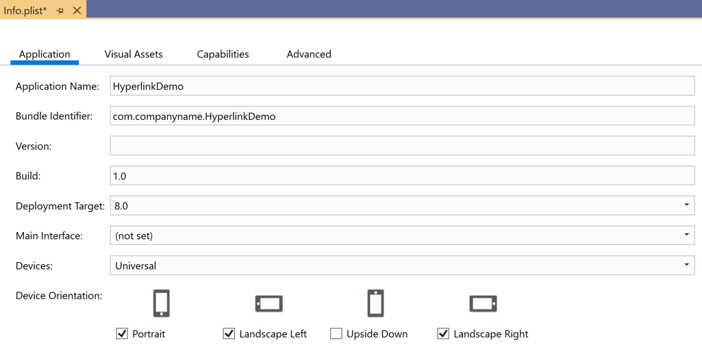

# [Visual Studio for Mac](#tab/macos)

In Visual Studio for Mac, open the iOS project and open **Info.plist**. Under the **Application** tab, sections will be available to set orientation:

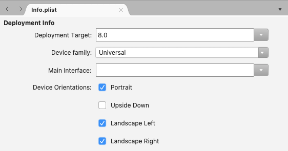

If you'd prefer to edit the values using a key-value editor interface, select the **Source**> tab at the bottom of the screen:

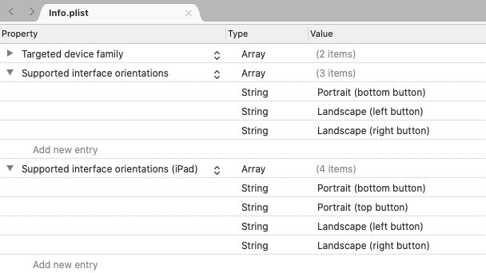

-----

### Android

To control the orientation on Android, open **MainActivity.cs** and set the orientation using the attribute decorating the `MainActivity` class:

```csharp
namespace MyRotatingApp.Droid
{
    [Activity (Label = "MyRotatingApp.Droid", Icon = "@drawable/icon", Theme = "@style/MainTheme", MainLauncher = true, ConfigurationChanges = ConfigChanges.ScreenSize | ConfigChanges.Orientation, ScreenOrientation = ScreenOrientation.Landscape)] //This is what controls orientation
    public class MainActivity : FormsAppCompatActivity
    {
        protected override void OnCreate (Bundle bundle)
...
```

Xamarin.Android supports several options for specifying orientation:

- **Landscape** &ndash; forces the application orientation to be landscape, regardless of sensor data.
- **Portrait** &ndash; forces the application orientation to be portrait, regardless of sensor data.
- **User** &ndash; causes the application to be presented using the user's preferred orientation.
- **Behind** &ndash; causes the application's orientation to be the same as the orientation of the [activity](xref:Android.App.Activity) behind it.
- **Sensor** &ndash; causes the application's orientation to be determined by the sensor, even if the user has disabled automatic rotation.
- **SensorLandscape** &ndash; causes the application to use landscape orientation while using sensor data to change the direction the screen is facing (so that the screen isn't seen as upside down).
- **SensorPortrait** &ndash; causes the application to use portrait orientation while using sensor data to change the direction the screen is facing (so that the screen isn't seen as upside down).
- **ReverseLandscape** &ndash; causes the application to use landscape orientation, facing the opposite direction from usual, so as to appear "upside down."
- **ReversePortrait** &ndash; causes the application to use portrait orientation, facing the opposite direction from usual, so as to appear "upside down."
- **FullSensor** &ndash; causes the application to rely on sensor data to select the correct orientation (out of the possible 4).
- **FullUser** &ndash; causes the application to use the user's orientation preferences. If automatic rotation is enabled, then all 4 orientations can be used.
- **UserLandscape** &ndash; _\[Not Supported\]_ causes the application to use landscape orientation, unless the user has automatic rotation enabled, in which case it will use the sensor to determine orientation. This option will break compilation.
- **UserPortrait** &ndash; _\[Not Supported\]_ causes the application to use portrait orientation, unless the user has automatic rotation enabled, in which case it will use the sensor to determine orientation. This option will break compilation.
- **Locked** &ndash; _\[Not Supported\]_  causes the application to use the screen orientation, whatever it is at launch, without responding to changes in the device's physical orientation. This option will break compilation.

Note that the native Android APIs provide a lot of control over how orientation is managed, including options that explicitly contradict the user's expressed preferences.

### Universal Windows platform

On the Universal Windows Platform (UWP), supported orientations are set in the **Package.appxmanifest** file. Opening the manifest will reveal a configuration panel where supported orientations can be selected.

## Reacting to Changes in Orientation

Xamarin.Forms does not offer any native events for notifying your app of orientation changes in shared code. However,[Xamarin.Essentials](~/essentials/index.md) contains a [`DeviceDisplay`] class that provides notifications of orientation changes.

To detect orientations without Xamarin.Essentials, monitor the `SizeChanged` event of the `Page`, which fires when either the width or height of the `Page` changes. When the width of the `Page` is greater than the height, the device is in landscape mode. For more information, see [Display an Image based on Screen Orientation](https://github.com/xamarin/recipes/tree/master/Recipes/xamarin-forms/Controls/screen-orientation).

Alternatively, it's possible to override the [`OnSizeAllocated`](xref:Xamarin.Forms.Page.OnSizeAllocated*) method on a `Page`, inserting any layout change logic there. The `OnSizeAllocated` method is called whenever a `Page` is allocated a new size, which happens whenever the device is rotated. Note that the base implementation of `OnSizeAllocated` performs important layout functions, so it is important to call the base implementation in the override:

```csharp
protected override void OnSizeAllocated(double width, double height)
{
    base.OnSizeAllocated(width, height); //must be called
}
```

Failure to take that step will result in a non-functioning page.

Note that the `OnSizeAllocated` method may be called many times when a device is rotated. Changing your layout each time is wasteful of resources and can lead to flickering. Consider using an instance variable within your page to track whether the orientation is in landscape or portrait, and only redraw when there is a change:

```csharp
private double width = 0;
private double height = 0;

protected override void OnSizeAllocated(double width, double height)
{
    base.OnSizeAllocated(width, height); //must be called
    if (this.width != width || this.height != height)
    {
        this.width = width;
        this.height = height;
        //reconfigure layout
    }
}
```

Once a change in device orientation has been detected, you may want to add or remove additional views to/from your user interface to react to the change in available space. For example, consider the built-in calculator on each platform in portrait:

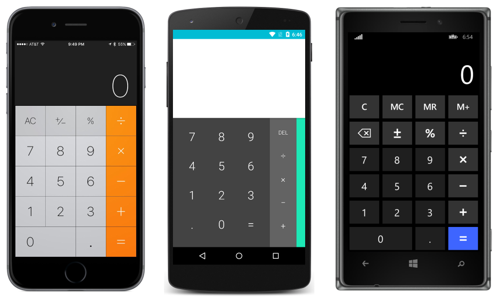

and landscape:

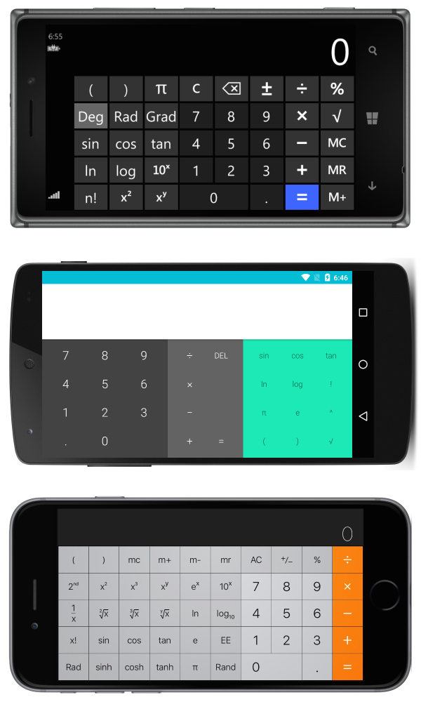

Notice that the apps take advantage of the available space by adding more functionality in landscape.

## Responsive Layout

It is possible to design interfaces using the built-in layouts so that they transition gracefully when the device is rotated. When designing interfaces that will continue to be appealing when responding to changes in orientation consider the following general rules:

- **Pay attention to ratios** &ndash; changes in orientation can cause problems when certain assumptions are made with regards to ratios. For example, a view that would have plenty of space in 1/3 of the vertical space of a screen in portrait may not fit into 1/3 of the vertical space in landscape.
- **Be careful with absolute values** &ndash; absolute (pixel) values that make sense in portrait may not make sense in landscape. When absolute values are necessary, use nested layouts to isolate their impact. For example, it would be reasonable to use absolute values in a `TableView` `ItemTemplate` when the item template has a guaranteed uniform height.

The above rules also apply when implementing interfaces for multiple screen sizes and are generally considered best-practice. The rest of this guide will explain specific examples of responsive layouts using each of the primary layouts in Xamarin.Forms.

> [!NOTE]
> For clarity, the following sections demonstrate how to implement responsive layouts using just one type of `Layout` at a time. In practice, it is often simpler to mix `Layout`s to achieve a desired layout using the simpler or most intuitive `Layout` for each component.

### StackLayout

Consider the following application, displayed in portrait:

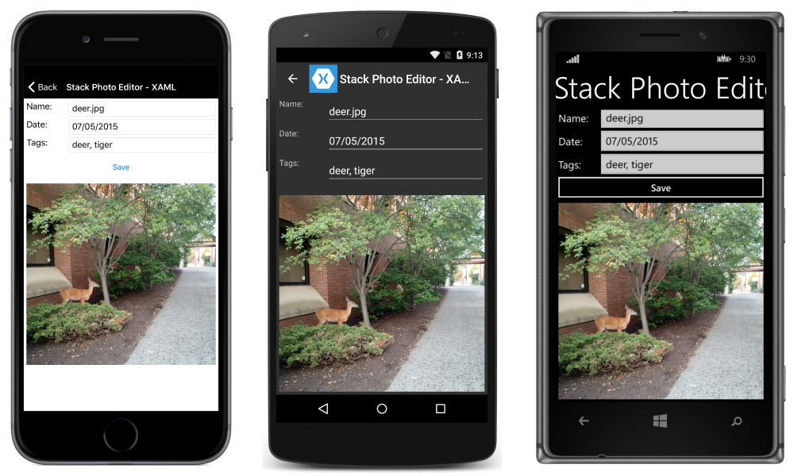

and landscape:

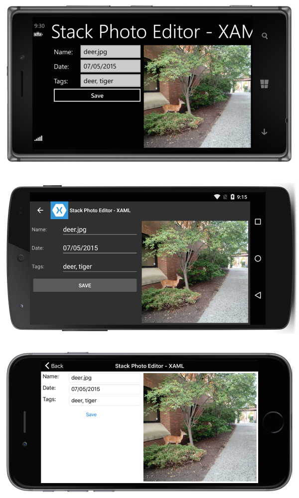

That is accomplished with the following XAML:

```xaml
<?xml version="1.0" encoding="UTF-8"?>
<ContentPage xmlns="http://xamarin.com/schemas/2014/forms"
xmlns:x="http://schemas.microsoft.com/winfx/2009/xaml"
x:Class="ResponsiveLayout.StackLayoutPageXaml"
Title="Stack Photo Editor - XAML">
    <ContentPage.Content>
        <StackLayout Spacing="10" Padding="5" Orientation="Vertical"
        x:Name="outerStack"> <!-- can change orientation to make responsive -->
            <ScrollView>
                <StackLayout Spacing="5" HorizontalOptions="FillAndExpand"
                    WidthRequest="1000">
                    <StackLayout Orientation="Horizontal">
                        <Label Text="Name: " WidthRequest="75"
                            HorizontalOptions="Start" />
                        <Entry Text="deer.jpg"
                            HorizontalOptions="FillAndExpand" />
                    </StackLayout>
                    <StackLayout Orientation="Horizontal">
                        <Label Text="Date: " WidthRequest="75"
                            HorizontalOptions="Start" />
                        <Entry Text="07/05/2015"
                            HorizontalOptions="FillAndExpand" />
                    </StackLayout>
                    <StackLayout Orientation="Horizontal">
                        <Label Text="Tags:" WidthRequest="75"
                            HorizontalOptions="Start" />
                        <Entry Text="deer, tiger"
                            HorizontalOptions="FillAndExpand" />
                    </StackLayout>
                    <StackLayout Orientation="Horizontal">
                        <Button Text="Save" HorizontalOptions="FillAndExpand" />
                    </StackLayout>
                </StackLayout>
            </ScrollView>
            <Image  Source="deer.jpg" />
        </StackLayout>
    </ContentPage.Content>
</ContentPage>
```

Some C# is used to change the orientation of `outerStack` based on the orientation of the device:

```csharp
protected override void OnSizeAllocated (double width, double height){
    base.OnSizeAllocated (width, height);
    if (width != this.width || height != this.height) {
        this.width = width;
        this.height = height;
        if (width > height) {
            outerStack.Orientation = StackOrientation.Horizontal;
        } else {
            outerStack.Orientation = StackOrientation.Vertical;
        }
    }
}
```

Note the following:

- `outerStack` is adjusted to present the image and controls as a horizontal or vertical stack depending on orientation, to best take advantage of the available space.

### AbsoluteLayout

Consider the following application, displayed in portrait:

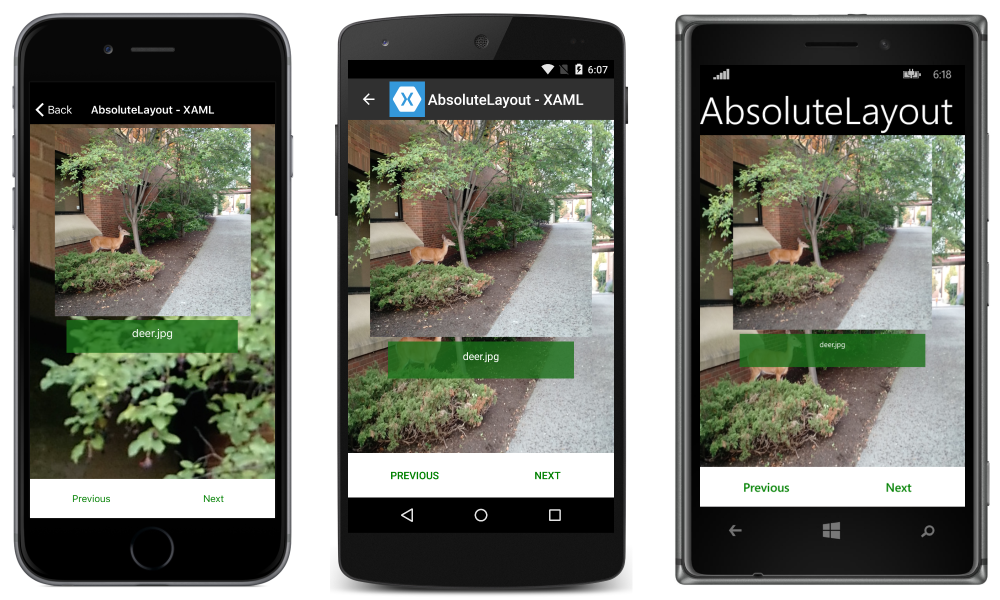

and landscape:

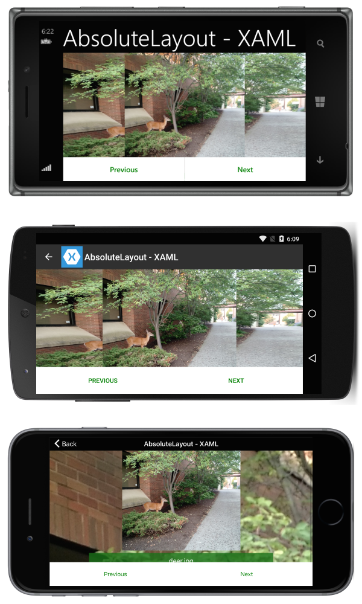

That is accomplished with the following XAML:

```xaml
<?xml version="1.0" encoding="UTF-8"?>
<ContentPage xmlns="http://xamarin.com/schemas/2014/forms"
xmlns:x="http://schemas.microsoft.com/winfx/2009/xaml"
x:Class="ResponsiveLayout.AbsoluteLayoutPageXaml"
Title="AbsoluteLayout - XAML" BackgroundImageSource="deer.jpg">
    <ContentPage.Content>
        <AbsoluteLayout>
            <ScrollView AbsoluteLayout.LayoutBounds="0,0,1,1"
                AbsoluteLayout.LayoutFlags="PositionProportional,SizeProportional">
                <AbsoluteLayout>
                    <Image Source="deer.jpg"
                        AbsoluteLayout.LayoutBounds=".5,0,300,300"
                        AbsoluteLayout.LayoutFlags="PositionProportional" />
                    <BoxView Color="#CC1A7019" AbsoluteLayout.LayoutBounds=".5
                        300,.7,50" AbsoluteLayout.LayoutFlags="XProportional
                        WidthProportional" />
                    <Label Text="deer.jpg" AbsoluteLayout.LayoutBounds = ".5
                        310,1, 50" AbsoluteLayout.LayoutFlags="XProportional
                        WidthProportional" HorizontalTextAlignment="Center" TextColor="White" />
                </AbsoluteLayout>
            </ScrollView>
            <Button Text="Previous" AbsoluteLayout.LayoutBounds="0,1,.5,60"
                AbsoluteLayout.LayoutFlags="PositionProportional
                    WidthProportional"
                BackgroundColor="White" TextColor="Green" BorderRadius="0" />
            <Button Text="Next" AbsoluteLayout.LayoutBounds="1,1,.5,60"
                AbsoluteLayout.LayoutFlags="PositionProportional
                    WidthProportional" BackgroundColor="White"
                    TextColor="Green" BorderRadius="0" />
        </AbsoluteLayout>
    </ContentPage.Content>
</ContentPage>
```

Note the following:

- Because of the way the page has been laid out, there is no need for procedural code to introduce responsiveness.
- The `ScrollView` is being used to allow the label to be visible even when the height of the screen is less than the sum of the fixed heights of the buttons and the image.

### RelativeLayout

Consider the following application, displayed in portrait:

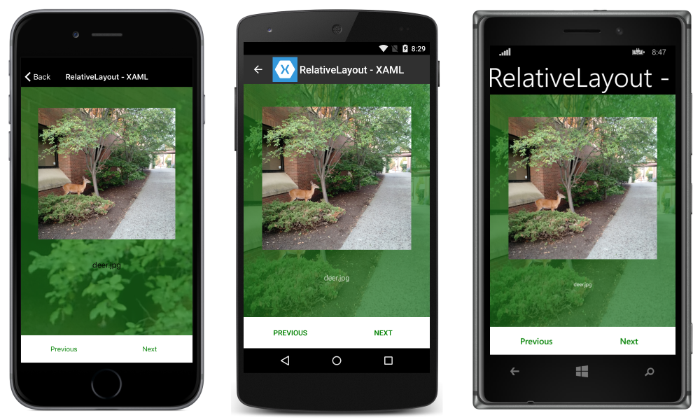

and landscape:

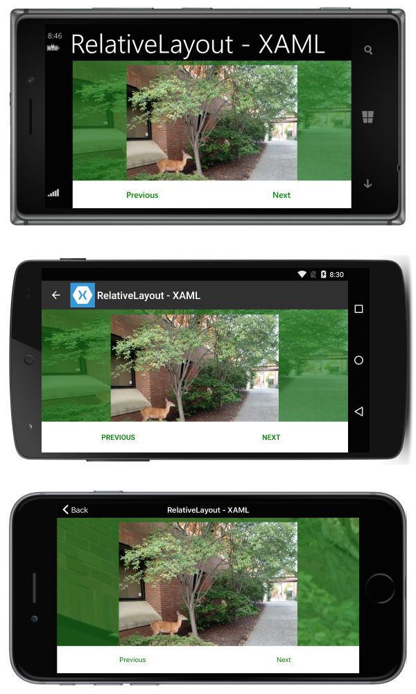

That is accomplished with the following XAML:

```xaml
<?xml version="1.0" encoding="UTF-8"?>
<ContentPage xmlns="http://xamarin.com/schemas/2014/forms"
xmlns:x="http://schemas.microsoft.com/winfx/2009/xaml"
x:Class="ResponsiveLayout.RelativeLayoutPageXaml"
Title="RelativeLayout - XAML"
BackgroundImageSource="deer.jpg">
    <ContentPage.Content>
        <RelativeLayout x:Name="outerLayout">
            <BoxView BackgroundColor="#AA1A7019"
                RelativeLayout.WidthConstraint="{ConstraintExpression
                    Type=RelativeToParent,Property=Width,Factor=1}"
                RelativeLayout.HeightConstraint="{ConstraintExpression
                    Type=RelativeToParent,Property=Height,Factor=1}"
                RelativeLayout.XConstraint="{ConstraintExpression
                    Type=RelativeToParent,Property=Width,Factor=0,Constant=0}"
                RelativeLayout.YConstraint="{ConstraintExpression
                    Type=RelativeToParent,Property=Height,Factor=0,Constant=0}" />
            <ScrollView
                RelativeLayout.WidthConstraint="{ConstraintExpression
                    Type=RelativeToParent,Property=Width,Factor=1}"
                RelativeLayout.HeightConstraint="{ConstraintExpression
                    Type=RelativeToParent,Property=Height,Factor=1,Constant=-60}"
                RelativeLayout.XConstraint="{ConstraintExpression
                    Type=RelativeToParent,Property=Width,Factor=0,Constant=0}"
                RelativeLayout.YConstraint="{ConstraintExpression
                    Type=RelativeToParent,Property=Height,Factor=0,Constant=0}">
                <RelativeLayout>
                    <Image Source="deer.jpg" x:Name="imageDeer"
                        RelativeLayout.WidthConstraint="{ConstraintExpression
                            Type=RelativeToParent,Property=Width,Factor=.8}"
                        RelativeLayout.XConstraint="{ConstraintExpression
                            Type=RelativeToParent,Property=Width,Factor=.1}"
                        RelativeLayout.YConstraint="{ConstraintExpression
                            Type=RelativeToParent,Property=Height,Factor=0,Constant=10}" />
                    <Label Text="deer.jpg" HorizontalTextAlignment="Center"
                        RelativeLayout.WidthConstraint="{ConstraintExpression
                            Type=RelativeToParent,Property=Width,Factor=1}"
                        RelativeLayout.HeightConstraint="{ConstraintExpression
                            Type=RelativeToParent,Property=Height,Factor=0,Constant=75}"
                        RelativeLayout.XConstraint="{ConstraintExpression
                            Type=RelativeToParent,Property=Width,Factor=0,Constant=0}"
                        RelativeLayout.YConstraint="{ConstraintExpression
                            Type=RelativeToView,ElementName=imageDeer,Property=Height,Factor=1,Constant=20}" />
                </RelativeLayout>

            </ScrollView>

            <Button Text="Previous" BackgroundColor="White" TextColor="Green" BorderRadius="0"
                RelativeLayout.YConstraint="{ConstraintExpression
                    Type=RelativeToParent,Property=Height,Factor=1,Constant=-60}"
                RelativeLayout.XConstraint="{ConstraintExpression
                    Type=RelativeToParent,Property=Width,Factor=0,Constant=0}"
                RelativeLayout.HeightConstraint="{ConstraintExpression
                    Type=RelativeToParent,Property=Width,Factor=0,Constant=60}"
                RelativeLayout.WidthConstraint="{ConstraintExpression
                    Type=RelativeToParent,Property=Width,Factor=.5}"
                 />
            <Button Text="Next" BackgroundColor="White" TextColor="Green" BorderRadius="0"
                RelativeLayout.XConstraint="{ConstraintExpression
                    Type=RelativeToParent,Property=Width,Factor=.5}"
                RelativeLayout.YConstraint="{ConstraintExpression
                    Type=RelativeToParent,Property=Height,Factor=1,Constant=-60}"
                RelativeLayout.HeightConstraint="{ConstraintExpression
                    Type=RelativeToParent,Property=Width,Factor=0,Constant=60}"
                RelativeLayout.WidthConstraint="{ConstraintExpression
                    Type=RelativeToParent,Property=Width,Factor=.5}"
                />
        </RelativeLayout>
    </ContentPage.Content>
</ContentPage>

```

Note the following:

- Because of the way the page has been laid out, there is no need for procedural code to introduce responsiveness.
- The `ScrollView` is being used to allow the label to be visible even when the height of the screen is less than the sum of the fixed heights of the buttons and the image.

### Grid

Consider the following application, displayed in portrait:

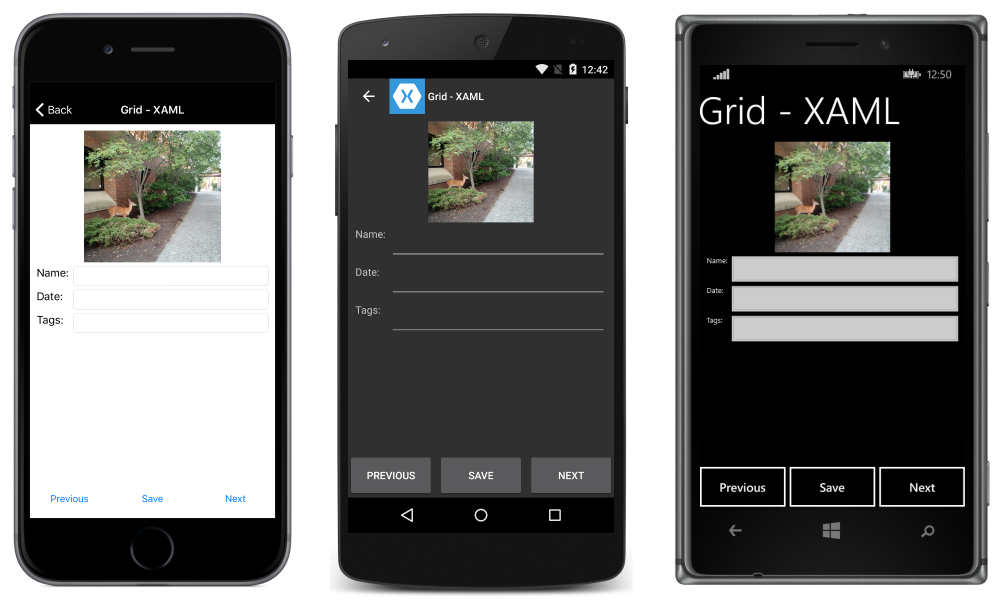

and landscape:

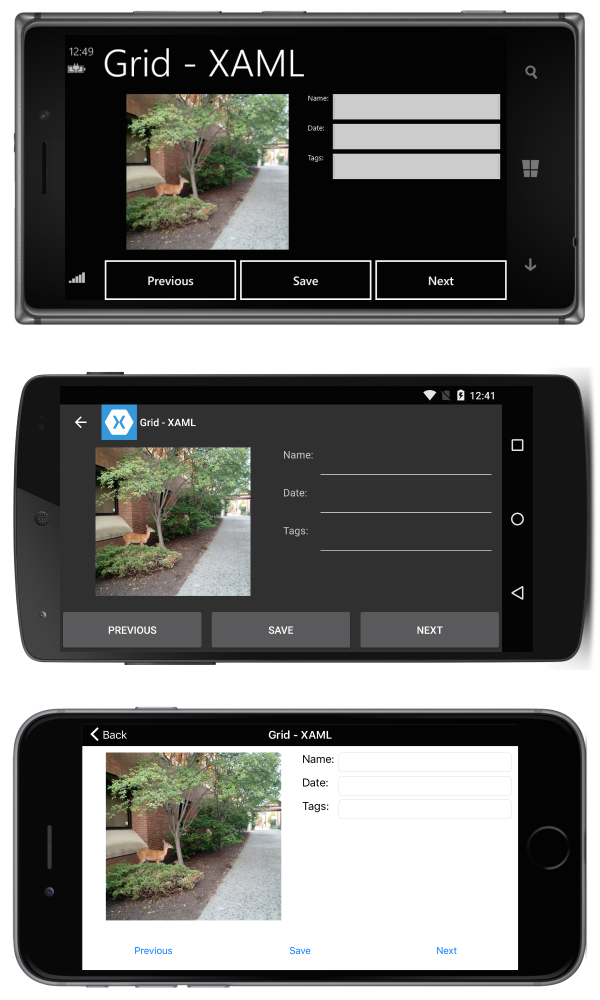

That is accomplished with the following XAML:

```xaml
<?xml version="1.0" encoding="UTF-8"?>
<ContentPage xmlns="http://xamarin.com/schemas/2014/forms"
xmlns:x="http://schemas.microsoft.com/winfx/2009/xaml"
x:Class="ResponsiveLayout.GridPageXaml"
Title="Grid - XAML">
    <ContentPage.Content>
        <Grid x:Name="outerGrid">
            <Grid.RowDefinitions>
                <RowDefinition Height="*" />
                <RowDefinition Height="60" />
            </Grid.RowDefinitions>
            <Grid x:Name="innerGrid" Grid.Row="0" Padding="10">
                <Grid.RowDefinitions>
                    <RowDefinition Height="*" />
                </Grid.RowDefinitions>
                <Grid.ColumnDefinitions>
                    <ColumnDefinition Width="*" />
                    <ColumnDefinition Width="*" />
                </Grid.ColumnDefinitions>
                <Image Source="deer.jpg" Grid.Row="0" Grid.Column="0" HeightRequest="300" WidthRequest="300" />
                <Grid x:Name="controlsGrid" Grid.Row="0" Grid.Column="1" >
                    <Grid.RowDefinitions>
                        <RowDefinition Height="Auto" />
                        <RowDefinition Height="Auto" />
                        <RowDefinition Height="Auto" />
                    </Grid.RowDefinitions>
                    <Grid.ColumnDefinitions>
                        <ColumnDefinition Width="Auto" />
                        <ColumnDefinition Width="*" />
                    </Grid.ColumnDefinitions>
                    <Label Text="Name:" Grid.Row="0" Grid.Column="0" />
                    <Label Text="Date:" Grid.Row="1" Grid.Column="0" />
                    <Label Text="Tags:" Grid.Row="2" Grid.Column="0" />
                    <Entry Grid.Row="0" Grid.Column="1" />
                    <Entry Grid.Row="1" Grid.Column="1" />
                    <Entry Grid.Row="2" Grid.Column="1" />
                </Grid>
            </Grid>
            <Grid x:Name="buttonsGrid" Grid.Row="1">
                <Grid.ColumnDefinitions>
                    <ColumnDefinition Width="*" />
                    <ColumnDefinition Width="*" />
                    <ColumnDefinition Width="*" />
                </Grid.ColumnDefinitions>
                <Button Text="Previous" Grid.Column="0" />
                <Button Text="Save" Grid.Column="1" />
                <Button Text="Next" Grid.Column="2" />
            </Grid>
        </Grid>
    </ContentPage.Content>
</ContentPage>
```

Along with the following procedural code to handle rotation changes:

```csharp
private double width;
private double height;

protected override void OnSizeAllocated (double width, double height){
    base.OnSizeAllocated (width, height);
    if (width != this.width || height != this.height) {
        this.width = width;
        this.height = height;
        if (width > height) {
            innerGrid.RowDefinitions.Clear();
            innerGrid.ColumnDefinitions.Clear ();
            innerGrid.RowDefinitions.Add (new RowDefinition{ Height = new GridLength (1, GridUnitType.Star) });
            innerGrid.ColumnDefinitions.Add (new ColumnDefinition { Width = new GridLength (1, GridUnitType.Star) });
            innerGrid.ColumnDefinitions.Add (new ColumnDefinition { Width = new GridLength (1, GridUnitType.Star) });
            innerGrid.Children.Remove (controlsGrid);
            innerGrid.Children.Add (controlsGrid, 1, 0);
        } else {
            innerGrid.RowDefinitions.Clear();
            innerGrid.ColumnDefinitions.Clear ();
            innerGrid.ColumnDefinitions.Add (new ColumnDefinition{ Width = new GridLength (1, GridUnitType.Star) });
            innerGrid.RowDefinitions.Add (new RowDefinition { Height = new GridLength (1, GridUnitType.Auto) });
            innerGrid.RowDefinitions.Add (new RowDefinition { Height = new GridLength (1, GridUnitType.Star) });
            innerGrid.Children.Remove (controlsGrid);
            innerGrid.Children.Add (controlsGrid, 0, 1);
        }
    }
}
```

Note the following:

- Because of the way the page has been laid out, there is a method to change the grid placement of the controls.

## Related Links

- [Layout (sample)](/samples/xamarin/xamarin-forms-samples/userinterface-layout)
- [BusinessTumble Example (sample)](/samples/xamarin/xamarin-forms-samples/userinterface-businesstumble)
- [Responsive Layout (sample)](/samples/xamarin/xamarin-forms-samples/userinterface-responsivelayout)
- [Display an Image based on Screen Orientation](https://github.com/xamarin/recipes/tree/master/Recipes/xamarin-forms/Controls/screen-orientation)