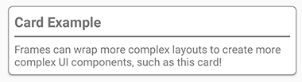

# Xamarin.Forms Frame

[ Download the sample](/samples/xamarin/xamarin-forms-samples/userinterface-frame/)

The Xamarin.Forms [`Frame`](xref:Xamarin.Forms.Frame) class is a layout used to wrap a view with a border that can be configured with color, shadow, and other options. Frames are commonly used to create borders around controls but can be used to create more complex UI. For more information, see [Advanced Frame usage](#advanced-frame-usage).

The following screenshot shows `Frame` controls on iOS and Android:

[](frame-images/frame-full.png#lightbox "Frame examples on iOS and Android")

The `Frame` class defines the following properties:

* [`BorderColor`](xref:Xamarin.Forms.Frame.BorderColor) is a `Color` value that determines the color of the `Frame` border.
* [`CornerRadius`](xref:Xamarin.Forms.Frame.CornerRadius) is a `float` value that determines the rounded radius of the corner.
* [`HasShadow`](xref:Xamarin.Forms.Frame.HasShadow) is a `bool` value that determines whether the frame has a drop shadow.

These properties are backed by [`BindableProperty`](xref:Xamarin.Forms.BindableProperty) objects, which means the `Frame` can be the target of data bindings.

> [!NOTE]
> The `HasShadow` property behavior is platform-dependent. The default value is `true` on all platforms. However, on UWP drop shadows are not rendered. Drop shadows are rendered on both Android and iOS but drop shadows on iOS are darker and occupy more space.

## Create a Frame

A `Frame` can be instantiated in XAML. The default `Frame` object has a white background, a drop shadow, and no border. A `Frame` object typically wraps another control. The following example shows a default `Frame` wrapping a `Label` object:

```xaml
<Frame>
  <Label Text="Example" />
</Frame>
```

A `Frame` can also be created in code:

```csharp
Frame defaultFrame = new Frame
{
    Content = new Label { Text = "Example" }
};
```

`Frame` objects can be customized with rounded corners, colorized borders, and drop shadows by setting properties in the XAML. The following example shows a customized `Frame` object:

```xaml
<Frame BorderColor="Orange"
       CornerRadius="10"
       HasShadow="True">
  <Label Text="Example" />
</Frame>
```

These instance properties can also be set in code:

```csharp
Frame frame = new Frame
{
    BorderColor = Color.Orange,
    CornerRadius = 10,
    HasShadow = true,
    Content = new Label { Text = "Example" }
};
```

## Advanced Frame usage

The `Frame` class inherits from `ContentView`, which means it can contain any type of `View` object including `Layout` objects. This ability allows the `Frame` to be used to create complex UI objects such as cards.

### Create a card with a Frame

Combining a `Frame` object with a `Layout` object such as a `StackLayout` object allows the creation of more complex UI. The following screenshot shows an example card, created using a `Frame` object:

[](frame-images/frame-full.png#lightbox "Screenshot of a card created with a Frame")

The following XAML shows how to create a card with the `Frame` class:

```xaml
<Frame BorderColor="Gray"
       CornerRadius="5"
       Padding="8">
  <StackLayout>
    <Label Text="Card Example"
           FontSize="Medium"
           FontAttributes="Bold" />
    <BoxView Color="Gray"
             HeightRequest="2"
             HorizontalOptions="Fill" />
    <Label Text="Frames can wrap more complex layouts to create more complex UI components, such as this card!"/>
  </StackLayout>
</Frame>
```

A card can also be created in code:

```csharp
Frame cardFrame = new Frame
{
    BorderColor = Color.Gray,
    CornerRadius = 5,
    Padding = 8,
    Content = new StackLayout
    {
        Children =
        {
            new Label
            {
                Text = "Card Example",
                FontSize = Device.GetNamedSize(NamedSize.Medium, typeof(Label)),
                FontAttributes = FontAttributes.Bold
            },
            new BoxView
            {
                Color = Color.Gray,
                HeightRequest = 2,
                HorizontalOptions = LayoutOptions.Fill
            },
            new Label
            {
                Text = "Frames can wrap more complex layouts to create more complex UI components, such as this card!"
            }
        }
    }
};
```

### Round elements

The `CornerRadius` property of the `Frame` control can be used to create a circle image. The following screenshot shows an example of a round image, created using a `Frame` object:

[](frame-images/frame-full.png#lightbox "Screenshot of a circle image created with a Frame")

The following XAML shows how to create a circle image in XAML:

```xaml
<Frame Margin="10"
       BorderColor="Black"
       CornerRadius="50"
       HeightRequest="60"
       WidthRequest="60"
       IsClippedToBounds="True"
       HorizontalOptions="Center"
       VerticalOptions="Center">
  <Image Source="outdoors.jpg"
         Aspect="AspectFill"
         Margin="-20"
         HeightRequest="100"
         WidthRequest="100" />
</Frame>
```

A circle image can also be created in code:

```csharp
Frame circleImageFrame = new Frame
{
    Margin = 10,
    BorderColor = Color.Black,
    CornerRadius = 50,
    HeightRequest = 60,
    WidthRequest = 60,
    IsClippedToBounds = true,
    HorizontalOptions = LayoutOptions.Center,
    VerticalOptions = LayoutOptions.Center,
    Content = new Image
    {
        Source = ImageSource.FromFile("outdoors.jpg"),
        Aspect = Aspect.AspectFill,
        Margin = -20,
        HeightRequest = 100,
        WidthRequest = 100
    }
};
```

The **outdoors.jpg** image must be added to each platform project, and how this is achieved varies by platform. For more information, see [Images in Xamarin.Forms](~/xamarin-forms/user-interface/images.md).

> [!NOTE]
> Rounded corners behave slightly differently across platforms. The `Image` object's `Margin` should be half of the difference between the image width and the parent frame width, and should be negative to center the image evenly within the `Frame` object. However, the width and height requested are not guaranteed, so the `Margin`, `HeightRequest` and `WidthRequest` properties may need to be altered based on your image size and other layout choices.

## Related links

* [Frame Demos](/samples/xamarin/xamarin-forms-samples/userinterface-frame/)
* [Images in Xamarin.Forms](~/xamarin-forms/user-interface/images.md)