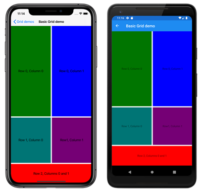
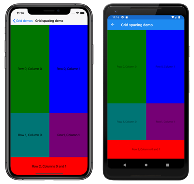
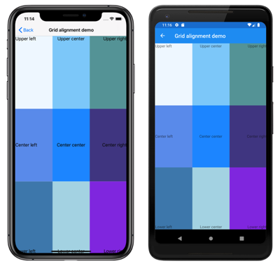
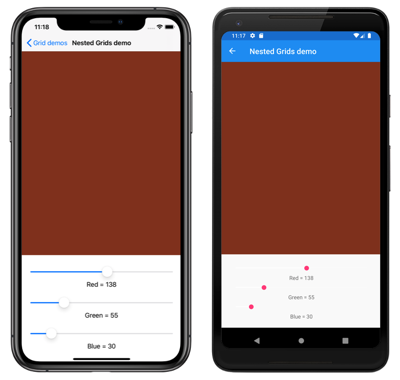

# Xamarin.Forms Grid

[ Download the sample](/samples/xamarin/xamarin-forms-samples/userinterface-griddemos)

[](grid-images/layouts-large.png#lightbox "Xamarin.Forms Grid")

The [`Grid`](xref:Xamarin.Forms.Grid) is a layout that organizes its children into rows and columns, which can have proportional or absolute sizes. By default, a `Grid` contains one row and one column. In addition, a `Grid` can be used as a parent layout that contains other child layouts.

The [`Grid`](xref:Xamarin.Forms.Grid) layout should not be confused with tables, and is not intended to present tabular data. Unlike HTML tables, a `Grid` is intended for laying out content. For displaying tabular data, consider using a [ListView](~/xamarin-forms/user-interface/listview/index.md), [CollectionView](~/xamarin-forms/user-interface/collectionview/index.md), or [TableView](~/xamarin-forms/user-interface/tableview.md).

The [`Grid`](xref:Xamarin.Forms.Grid) class defines the following properties:

- [`Column`](xref:Xamarin.Forms.Grid.ColumnProperty), of type `int`, which is an attached property that indicates the column alignment of a view within a parent `Grid`. The default value of this property is 0. A validation callback ensures that when the property is set, its value is greater than or equal to 0.
- [`ColumnDefinitions`](xref:Xamarin.Forms.Grid.ColumnDefinitions), of type [`ColumnDefinitionCollection`](xref:Xamarin.Forms.ColumnDefinitionCollection), is a list of [`ColumnDefinition`](xref:Xamarin.Forms.ColumnDefinition) objects that define the width of the grid columns.
- [`ColumnSpacing`](xref:Xamarin.Forms.Grid.ColumnSpacing), of type `double`, indicates the distance between grid columns. The default value of this property is 6 device-independent units.
- [`ColumnSpan`](xref:Xamarin.Forms.Grid.ColumnSpanProperty), of type `int`, which is an attached property that indicates the total number of columns that a view spans within a parent `Grid`. The default value of this property is 1. A validation callback ensures that when the property is set, its value is greater than or equal to 1.
- [`Row`](xref:Xamarin.Forms.Grid.RowProperty), of type `int`, which is an attached property that indicates the row alignment of a view within a parent `Grid`. The default value of this property is 0. A validation callback ensures that when the property is set, its value is greater than or equal to 0.
- [`RowDefinitions`](xref:Xamarin.Forms.Grid.RowDefinitions), of type [`RowDefinitionCollection`](xref:Xamarin.Forms.RowDefinitionCollection), is a list of [`RowDefintion`](xref:Xamarin.Forms.RowDefinition) objects that define the height of the grid rows.
- [`RowSpacing`](xref:Xamarin.Forms.Grid.RowSpacing), of type `double`, indicates the distance between grid rows. The default value of this property is 6 device-independent units.
- [`RowSpan`](xref:Xamarin.Forms.Grid.RowSpanProperty), of type `int`, which is an attached property that indicates the total number of rows that a view spans within a parent `Grid`. The default value of this property is 1. A validation callback ensures that when the property is set, its value is greater than or equal to 1.

These properties are backed by [`BindableProperty`](xref:Xamarin.Forms.BindableProperty) objects, which means that the properties can be targets of data bindings and styled.

The [`Grid`](xref:Xamarin.Forms.Grid) class derives from the `Layout<T>` class, which defines a `Children` property of type `IList<T>`. The `Children` property is the `ContentProperty` of the `Layout<T>` class, and therefore does not need to be explicitly set from XAML.

> [!TIP]
> To obtain the best possible layout performance, follow the guidelines at [Optimize layout performance](~/xamarin-forms/deploy-test/performance.md#optimize-layout-performance).

## Rows and columns

By default, a [`Grid`](xref:Xamarin.Forms.Grid) contains one row and one column:

```xaml
<ContentPage xmlns="http://xamarin.com/schemas/2014/forms"
             xmlns:x="http://schemas.microsoft.com/winfx/2009/xaml"
             x:Class="GridTutorial.MainPage">
    <Grid Margin="20,35,20,20">
        <Label Text="By default, a Grid contains one row and one column." />
    </Grid>
</ContentPage>
```

In this example, the [`Grid`](xref:Xamarin.Forms.Grid) contains a single child [`Label`](xref:Xamarin.Forms.Label) that's automatically positioned in a single location:

[](grid-images/default-large.png#lightbox "Default Grid layout")

The layout behavior of a [`Grid`](xref:Xamarin.Forms.Grid) can be defined with the [`RowDefinitions`](xref:Xamarin.Forms.Grid.RowDefinitions) and [`ColumnDefinitions`](xref:Xamarin.Forms.Grid.ColumnDefinitions) properties, which are collections of [`RowDefinition`](xref:Xamarin.Forms.RowDefinition) and [`ColumnDefinition`](xref:Xamarin.Forms.ColumnDefinition) objects, respectively. These collections define the row and column characteristics of a `Grid`, and should contain one [`RowDefinition`](xref:Xamarin.Forms.RowDefinition) object for each row in the `Grid`, and one [`ColumnDefinition`](xref:Xamarin.Forms.ColumnDefinition) object for each column in the `Grid`.

The [`RowDefinition`](xref:Xamarin.Forms.RowDefinition) class defines a [`Height`](xref:Xamarin.Forms.RowDefinition.Height) property, of type [`GridLength`](xref:Xamarin.Forms.GridLength), and the [`ColumnDefinition`](xref:Xamarin.Forms.ColumnDefinition) class defines a [`Width`](xref:Xamarin.Forms.ColumnDefinition.Width) property, of type [`GridLength`](xref:Xamarin.Forms.GridLength). The [`GridLength`](xref:Xamarin.Forms.GridLength) struct specifies a row height or a column width in terms of the [`GridUnitType`](xref:Xamarin.Forms.GridUnitType) enumeration, which has three members:

- `Absolute` – the row height or column width is a value in device-independent units (a number in XAML).
- `Auto` – the row height or column width is autosized based on the cell contents (`Auto` in XAML).
- `Star` – leftover row height or column width is allocated proportionally (a number followed by `*` in XAML).

A [`Grid`](xref:Xamarin.Forms.Grid) row with a `Height` property of `Auto` constrains the height of views in that row in the same way as a vertical [`StackLayout`](xref:Xamarin.Forms.StackLayout). Similarly, a column with a `Width` property of `Auto` works much like a horizontal `StackLayout`.

> [!CAUTION]
> Try to ensure that as few rows and columns as possible are set to [`Auto`](xref:Xamarin.Forms.GridLength.Auto) size. Each auto-sized row or column will cause the layout engine to perform additional layout calculations. Instead, use fixed size rows and columns if possible. Alternatively, set rows and columns to occupy a proportional amount of space with the [`GridUnitType.Star`](xref:Xamarin.Forms.GridUnitType.Star) enumeration value.

The following XAML shows how to create a [`Grid`](xref:Xamarin.Forms.Grid) with three rows and two columns:

```xaml
<ContentPage xmlns="http://xamarin.com/schemas/2014/forms"
             xmlns:x="http://schemas.microsoft.com/winfx/2009/xaml"
             x:Class="GridDemos.Views.BasicGridPage"
             Title="Basic Grid demo">
   <Grid>
        <Grid.RowDefinitions>
            <RowDefinition Height="2*" />
            <RowDefinition Height="*" />
            <RowDefinition Height="100" />
        </Grid.RowDefinitions>
        <Grid.ColumnDefinitions>
            <ColumnDefinition Width="*" />
            <ColumnDefinition Width="*" />
        </Grid.ColumnDefinitions>
        ...
    </Grid>
</ContentPage>
```

In this example, the [`Grid`](xref:Xamarin.Forms.Grid) has an overall height that is the height of the page. The `Grid` knows that the height of the third row is 100 device-independent units. It subtracts that height from its own height, and allocates the remaining height proportionally between the first and second rows based on the number before the star. In this example, the height of the first row is twice that of the second row.

The two [`ColumnDefinition`](xref:Xamarin.Forms.ColumnDefinition) objects both set the [`Width`](xref:Xamarin.Forms.ColumnDefinition.Width) to `*`, which is the same as `1*`, meaning that the width of the screen is divided equally beneath the two columns.

> [!IMPORTANT]
> The default value of the [`RowDefinition.Height`](xref:Xamarin.Forms.RowDefinition.Height) property is `*`. Similarly, the default value of the [`ColumnDefinition.Width`](xref:Xamarin.Forms.ColumnDefinition.Width) property is `*`. Therefore, it's not necessary to set these properties in cases where these defaults are acceptable.

Child views can be positioned in specific [`Grid`](xref:Xamarin.Forms.Grid) cells with the [`Grid.Column`](xref:Xamarin.Forms.Grid.ColumnProperty) and [`Grid.Row`](xref:Xamarin.Forms.Grid.RowProperty) attached properties. In addition, to make child views span across multiple rows and columns, use the [`Grid.RowSpan`](xref:Xamarin.Forms.Grid.RowSpanProperty) and [`Grid.ColumnSpan`](xref:Xamarin.Forms.Grid.ColumnSpanProperty) attached properties.

The following XAML shows the same [`Grid`](xref:Xamarin.Forms.Grid) definition, and also positions child views in specific `Grid` cells:

```xaml
<ContentPage xmlns="http://xamarin.com/schemas/2014/forms"
             xmlns:x="http://schemas.microsoft.com/winfx/2009/xaml"
             x:Class="GridDemos.Views.BasicGridPage"
             Title="Basic Grid demo">
   <Grid>
        <Grid.RowDefinitions>
            <RowDefinition Height="2*" />
            <RowDefinition />
            <RowDefinition Height="100" />
        </Grid.RowDefinitions>
        <Grid.ColumnDefinitions>
            <ColumnDefinition />
            <ColumnDefinition />
        </Grid.ColumnDefinitions>
        <BoxView Color="Green" />
        <Label Text="Row 0, Column 0"
               HorizontalOptions="Center"
               VerticalOptions="Center" />
        <BoxView Grid.Column="1"
                 Color="Blue" />
        <Label Grid.Column="1"
               Text="Row 0, Column 1"
               HorizontalOptions="Center"
               VerticalOptions="Center" />
        <BoxView Grid.Row="1"
                 Color="Teal" />
        <Label Grid.Row="1"
               Text="Row 1, Column 0"
               HorizontalOptions="Center"
               VerticalOptions="Center" />
        <BoxView Grid.Row="1"
                 Grid.Column="1"
                 Color="Purple" />
        <Label Grid.Row="1"
               Grid.Column="1"
               Text="Row1, Column 1"
               HorizontalOptions="Center"
               VerticalOptions="Center" />
        <BoxView Grid.Row="2"
                 Grid.ColumnSpan="2"
                 Color="Red" />
        <Label Grid.Row="2"
               Grid.ColumnSpan="2"
               Text="Row 2, Columns 0 and 1"
               HorizontalOptions="Center"
               VerticalOptions="Center" />
    </Grid>
</ContentPage>
```

> [!NOTE]
> The `Grid.Row` and `Grid.Column` properties are both indexed from 0, and so `Grid.Row="2"` refers to the third row while `Grid.Column="1"` refers to the second column. In addition, both of these properties have a default value of 0, and so don't need to be set on child views that occupy the first row or first column of a [`Grid`](xref:Xamarin.Forms.Grid).

In this example, all three [`Grid`](xref:Xamarin.Forms.Grid) rows are occupied by [`BoxView`](xref:Xamarin.Forms.BoxView) and [`Label`](xref:Xamarin.Forms.Label) views. The third row is 100 device-independent units high, with the first two rows occupying the remaining space (the first row is twice as high as the second row). The two columns are equal in width and divide the `Grid` in half. The `BoxView` in the third row spans both columns.

[](grid-images/basic-large.png#lightbox "Basic Grid layout")

In addition, child views in a [`Grid`](xref:Xamarin.Forms.Grid) can share cells. The order that the children appear in the XAML is the order that the children are placed in the `Grid`. In the previous example, the [`Label`](xref:Xamarin.Forms.Label) objects are only visible because they are rendered on top of the [`BoxView`](xref:Xamarin.Forms.BoxView) objects. The `Label` objects would not be visible if the `BoxView` objects were rendered on top of them.

The equivalent C# code is:

```csharp
public class BasicGridPageCS : ContentPage
{
    public BasicGridPageCS()
    {
        Grid grid = new Grid
        {
            RowDefinitions =
            {
                new RowDefinition { Height = new GridLength(2, GridUnitType.Star) },
                new RowDefinition(),
                new RowDefinition { Height = new GridLength(100) }
            },
            ColumnDefinitions =
            {
                new ColumnDefinition(),
                new ColumnDefinition()
            }
        };

        // Row 0
        // The BoxView and Label are in row 0 and column 0, and so only needs to be added to the
        // Grid.Children collection to get default row and column settings.
        grid.Children.Add(new BoxView
        {
            Color = Color.Green
        });
        grid.Children.Add(new Label
        {
            Text = "Row 0, Column 0",
            HorizontalOptions = LayoutOptions.Center,
            VerticalOptions = LayoutOptions.Center
        });

        // This BoxView and Label are in row 0 and column 1, which are specified as arguments
        // to the Add method.
        grid.Children.Add(new BoxView
        {
            Color = Color.Blue
        }, 1, 0);
        grid.Children.Add(new Label
        {
            Text = "Row 0, Column 1",
            HorizontalOptions = LayoutOptions.Center,
            VerticalOptions = LayoutOptions.Center
        }, 1, 0);

        // Row 1
        // This BoxView and Label are in row 1 and column 0, which are specified as arguments
        // to the Add method overload.
        grid.Children.Add(new BoxView
        {
            Color = Color.Teal
        }, 0, 1, 1, 2);
        grid.Children.Add(new Label
        {
            Text = "Row 1, Column 0",
            HorizontalOptions = LayoutOptions.Center,
            VerticalOptions = LayoutOptions.Center
        }, 0, 1, 1, 2); // These arguments indicate that that the child element goes in the column starting at 0 but ending before 1.
                        // They also indicate that the child element goes in the row starting at 1 but ending before 2.

        grid.Children.Add(new BoxView
        {
            Color = Color.Purple
        }, 1, 2, 1, 2);
        grid.Children.Add(new Label
        {
            Text = "Row1, Column 1",
            HorizontalOptions = LayoutOptions.Center,
            VerticalOptions = LayoutOptions.Center
        }, 1, 2, 1, 2);

        // Row 2
        // Alternatively, the BoxView and Label can be positioned in cells with the Grid.SetRow
        // and Grid.SetColumn methods.
        BoxView boxView = new BoxView { Color = Color.Red };
        Grid.SetRow(boxView, 2);
        Grid.SetColumnSpan(boxView, 2);
        Label label = new Label
        {
            Text = "Row 2, Column 0 and 1",
            HorizontalOptions = LayoutOptions.Center,
            VerticalOptions = LayoutOptions.Center
        };
        Grid.SetRow(label, 2);
        Grid.SetColumnSpan(label, 2);

        grid.Children.Add(boxView);
        grid.Children.Add(label);

        Title = "Basic Grid demo";
        Content = grid;
    }
}
```

In code, to specify the height of a [`RowDefinition`](xref:Xamarin.Forms.RowDefinition) object, and the width of a [`ColumnDefinition`](xref:Xamarin.Forms.ColumnDefinition) object, you use values of the [`GridLength`](xref:Xamarin.Forms.GridLength) structure, often in combination with the [`GridUnitType`](xref:Xamarin.Forms.GridUnitType) enumeration.

The example code above also shows several different approaches to adding children to the [`Grid`](xref:Xamarin.Forms.Grid), and specifying the cells in which they reside. When using the `Add` overload that specifies *left*, *right*, *top*, and *bottom* arguments, while the *left* and *top* arguments will always refer to cells within the `Grid`, the *right* and *bottom* arguments appear to refer to cells that are outside the `Grid`. This is because the *right* argument must always be greater than the *left* argument, and the *bottom* argument must always be greater than the *top* argument. The following example, which assumes a 2x2 `Grid`, shows equivalent code using both `Add` overloads:

```csharp
// left, top
grid.Children.Add(topLeft, 0, 0);           // first column, first row
grid.Children.Add(topRight, 1, 0);          // second column, first tow
grid.Children.Add(bottomLeft, 0, 1);        // first column, second row
grid.Children.Add(bottomRight, 1, 1);       // second column, second row

// left, right, top, bottom
grid.Children.Add(topLeft, 0, 1, 0, 1);     // first column, first row
grid.Children.Add(topRight, 1, 2, 0, 1);    // second column, first tow
grid.Children.Add(bottomLeft, 0, 1, 1, 2);  // first column, second row
grid.Children.Add(bottomRight, 1, 2, 1, 2); // second column, second row
```

> [!NOTE]
> In addition, child views can be added to a [`Grid`](xref:Xamarin.Forms.Grid) with the [`AddHorizontal`](xref:Xamarin.Forms.Grid.IGridList`1.AddHorizontal*) and [`AddVertical`](xref:Xamarin.Forms.Grid.IGridList`1.AddVertical*) methods, which add children to a single row or single column `Grid`. The `Grid` then expands in rows or columns as these calls are made, as well as automatically positioning children in the correct cells.

### Simplify row and column definitions

In XAML, the row and column characteristics of a [`Grid`](xref:Xamarin.Forms.Grid) can be specified using a simplified syntax that avoids having to define [`RowDefinition`](xref:Xamarin.Forms.RowDefinition) and [`ColumnDefinition`](xref:Xamarin.Forms.ColumnDefinition) objects for each row and column. Instead, the [`RowDefinitions`](xref:Xamarin.Forms.Grid.RowDefinitions) and [`ColumnDefinitions`](xref:Xamarin.Forms.Grid.ColumnDefinitions) properties can be set to strings containing comma-delimited [`GridUnitType`](xref:Xamarin.Forms.GridUnitType) values, from which type converters built into Xamarin.Forms create `RowDefinition` and `ColumnDefinition` objects:

```xaml
<Grid RowDefinitions="1*, Auto, 25, 14, 20"
      ColumnDefinitions="*, 2*, Auto, 300">
    ...
</Grid>
```

In this example, the [`Grid`](xref:Xamarin.Forms.Grid) has five rows and four columns. The third, forth, and fifth rows are set to absolute heights, with the second row auto-sizing to its content. The remaining height is then allocated to the first row.

The forth column is set to an absolute width, with the third column auto-sizing to its content. The remaining width is allocated proportionally between the first and second columns based on the number before the star. In this example, the width of the second column is twice that of the first column (because `*` is identical to `1*`).

## Space between rows and columns

By default, [`Grid`](xref:Xamarin.Forms.Grid) rows are separated by 6 device-independent units of space. Similarly, `Grid` columns are separated by 6 device-independent units of space. These defaults can be changed by setting the [`RowSpacing`](xref:Xamarin.Forms.Grid.RowSpacing) and [`ColumnSpacing`](xref:Xamarin.Forms.Grid.ColumnSpacing) properties, respectively:

```xaml
<ContentPage xmlns="http://xamarin.com/schemas/2014/forms"
             xmlns:x="http://schemas.microsoft.com/winfx/2009/xaml"
             x:Class="GridDemos.Views.GridSpacingPage"
             Title="Grid spacing demo">
    <Grid RowSpacing="0"
          ColumnSpacing="0">
        ..
    </Grid>
</ContentPage>
```

This example creates a [`Grid`](xref:Xamarin.Forms.Grid) that has no spacing between its rows and columns:

[](grid-images/spacing-large.png#lightbox "Grid without spacing between cells")

> [!TIP]
> The [`RowSpacing`](xref:Xamarin.Forms.Grid.RowSpacing) and [`ColumnSpacing`](xref:Xamarin.Forms.Grid.ColumnSpacing) properties can be set to negative values to make cell contents overlap.

The equivalent C# code is:

```csharp
public GridSpacingPageCS()
{
    Grid grid = new Grid
    {
        RowSpacing = 0,
        ColumnSpacing = 0,
        // ...
    };
    // ...

    Content = grid;
}
```

## Alignment

Child views in a [`Grid`](xref:Xamarin.Forms.Grid) can be positioned within their cells by the [`HorizontalOptions`](xref:Xamarin.Forms.View.HorizontalOptions) and [`VerticalOptions`](xref:Xamarin.Forms.View.VerticalOptions) properties. These properties can be set to the following fields from the [`LayoutOptions`](xref:Xamarin.Forms.LayoutOptions) struct:

- [`Start`](xref:Xamarin.Forms.LayoutOptions.Start)
- [`Center`](xref:Xamarin.Forms.LayoutOptions.Center)
- [`End`](xref:Xamarin.Forms.LayoutOptions.End)
- [`Fill`](xref:Xamarin.Forms.LayoutOptions.Fill)

> [!IMPORTANT]
> The `AndExpands` fields in the [`LayoutOptions`](xref:Xamarin.Forms.LayoutOptions) struct are only applicable to [`StackLayout`](xref:Xamarin.Forms.StackLayout) objects.

The following XAML creates a [`Grid`](xref:Xamarin.Forms.Grid) with nine equal-size cells, and places a [`Label`](xref:Xamarin.Forms.Label) in each cell with a different alignment:

```xaml
<ContentPage xmlns="http://xamarin.com/schemas/2014/forms"
             xmlns:x="http://schemas.microsoft.com/winfx/2009/xaml"
             x:Class="GridDemos.Views.GridAlignmentPage"
             Title="Grid alignment demo">
    <Grid RowSpacing="0"
          ColumnSpacing="0">
        <Grid.RowDefinitions>
            <RowDefinition />
            <RowDefinition />
            <RowDefinition />
        </Grid.RowDefinitions>
        <Grid.ColumnDefinitions>
            <ColumnDefinition />
            <ColumnDefinition />
            <ColumnDefinition />
        </Grid.ColumnDefinitions>

        <BoxView Color="AliceBlue" />
        <Label Text="Upper left"
               HorizontalOptions="Start"
               VerticalOptions="Start" />
        <BoxView Grid.Column="1"
                 Color="LightSkyBlue" />
        <Label Grid.Column="1"
               Text="Upper center"
               HorizontalOptions="Center"
               VerticalOptions="Start"/>
        <BoxView Grid.Column="2"
                 Color="CadetBlue" />
        <Label Grid.Column="2"
               Text="Upper right"
               HorizontalOptions="End"
               VerticalOptions="Start" />
        <BoxView Grid.Row="1"
                 Color="CornflowerBlue" />
        <Label Grid.Row="1"
               Text="Center left"
               HorizontalOptions="Start"
               VerticalOptions="Center" />
        <BoxView Grid.Row="1"
                 Grid.Column="1"
                 Color="DodgerBlue" />
        <Label Grid.Row="1"
               Grid.Column="1"
               Text="Center center"
               HorizontalOptions="Center"
               VerticalOptions="Center" />
        <BoxView Grid.Row="1"
                 Grid.Column="2"
                 Color="DarkSlateBlue" />
        <Label Grid.Row="1"
               Grid.Column="2"
               Text="Center right"
               HorizontalOptions="End"
               VerticalOptions="Center" />
        <BoxView Grid.Row="2"
                 Color="SteelBlue" />
        <Label Grid.Row="2"
               Text="Lower left"
               HorizontalOptions="Start"
               VerticalOptions="End" />
        <BoxView Grid.Row="2"
                 Grid.Column="1"
                 Color="LightBlue" />
        <Label Grid.Row="2"
               Grid.Column="1"
               Text="Lower center"
               HorizontalOptions="Center"
               VerticalOptions="End" />
        <BoxView Grid.Row="2"
                 Grid.Column="2"
                 Color="BlueViolet" />
        <Label Grid.Row="2"
               Grid.Column="2"
               Text="Lower right"
               HorizontalOptions="End"
               VerticalOptions="End" />
    </Grid>
</ContentPage>
```

In this example, the [`Label`](xref:Xamarin.Forms.Label) objects in each row are all identically aligned vertically, but use different horizontal alignments. Alternatively, this can be thought of as the `Label` objects in each column being identically aligned horizontally, but using different vertical alignments:

[](grid-images/alignment-large.png#lightbox "Cell alignment in a Grid")

The equivalent C# code is:

```csharp
public class GridAlignmentPageCS : ContentPage
{
    public GridAlignmentPageCS()
    {
        Grid grid = new Grid
        {
            RowSpacing = 0,
            ColumnSpacing = 0,
            RowDefinitions =
            {
                new RowDefinition(),
                new RowDefinition(),
                new RowDefinition()
            },
            ColumnDefinitions =
            {
                new ColumnDefinition(),
                new ColumnDefinition(),
                new ColumnDefinition()
            }
        };

        // Row 0
        grid.Children.Add(new BoxView
        {
            Color = Color.AliceBlue
        });
        grid.Children.Add(new Label
        {
            Text = "Upper left",
            HorizontalOptions = LayoutOptions.Start,
            VerticalOptions = LayoutOptions.Start
        });

        grid.Children.Add(new BoxView
        {
            Color = Color.LightSkyBlue
        }, 1, 0);
        grid.Children.Add(new Label
        {
            Text = "Upper center",
            HorizontalOptions = LayoutOptions.Center,
            VerticalOptions = LayoutOptions.Start
        }, 1, 0);

        grid.Children.Add(new BoxView
        {
            Color = Color.CadetBlue
        }, 2, 0);
        grid.Children.Add(new Label
        {
            Text = "Upper right",
            HorizontalOptions = LayoutOptions.End,
            VerticalOptions = LayoutOptions.Start
        }, 2, 0);

        // Row 1
        grid.Children.Add(new BoxView
        {
            Color = Color.CornflowerBlue
        }, 0, 1);
        grid.Children.Add(new Label
        {
            Text = "Center left",
            HorizontalOptions = LayoutOptions.Start,
            VerticalOptions = LayoutOptions.Center
        }, 0, 1);

        grid.Children.Add(new BoxView
        {
            Color = Color.DodgerBlue
        }, 1, 1);
        grid.Children.Add(new Label
        {
            Text = "Center center",
            HorizontalOptions = LayoutOptions.Center,
            VerticalOptions = LayoutOptions.Center
        }, 1, 1);

        grid.Children.Add(new BoxView
        {
            Color = Color.DarkSlateBlue
        }, 2, 1);
        grid.Children.Add(new Label
        {
            Text = "Center right",
            HorizontalOptions = LayoutOptions.End,
            VerticalOptions = LayoutOptions.Center
        }, 2, 1);

        // Row 2
        grid.Children.Add(new BoxView
        {
            Color = Color.SteelBlue
        }, 0, 2);
        grid.Children.Add(new Label
        {
            Text = "Lower left",
            HorizontalOptions = LayoutOptions.Start,
            VerticalOptions = LayoutOptions.End
        }, 0, 2);

        grid.Children.Add(new BoxView
        {
            Color = Color.LightBlue
        }, 1, 2);
        grid.Children.Add(new Label
        {
            Text = "Lower center",
            HorizontalOptions = LayoutOptions.Center,
            VerticalOptions = LayoutOptions.End
        }, 1, 2);

        grid.Children.Add(new BoxView
        {
            Color = Color.BlueViolet
        }, 2, 2);
        grid.Children.Add(new Label
        {
            Text = "Lower right",
            HorizontalOptions = LayoutOptions.End,
            VerticalOptions = LayoutOptions.End
        }, 2, 2);

        Title = "Grid alignment demo";
        Content = grid;
    }
}
```

## Nested Grid objects

A [`Grid`](xref:Xamarin.Forms.Grid) can be used as a parent layout that contains nested child `Grid` objects, or other child layouts. When nesting `Grid` objects, the `Grid.Row`, `Grid.Column`, `Grid.RowSpan`, and `Grid.ColumnSpan` attached properties always refer to the position of views within their parent `Grid`.

The following XAML shows an example of nesting [`Grid`](xref:Xamarin.Forms.Grid) objects:

```xaml
<ContentPage xmlns="http://xamarin.com/schemas/2014/forms"
             xmlns:x="http://schemas.microsoft.com/winfx/2009/xaml"
             xmlns:converters="clr-namespace:GridDemos.Converters"
             x:Class="GridDemos.Views.ColorSlidersGridPage"
             Title="Nested Grids demo">

    <ContentPage.Resources>
        <converters:DoubleToIntConverter x:Key="doubleToInt" />

        <Style TargetType="Label">
            <Setter Property="HorizontalTextAlignment"
                    Value="Center" />
        </Style>
    </ContentPage.Resources>

    <Grid>
        <Grid.RowDefinitions>
            <RowDefinition />
            <RowDefinition Height="Auto" />
        </Grid.RowDefinitions>

        <BoxView x:Name="boxView"
                 Color="Black" />
        <Grid Grid.Row="1"
              Margin="20">
            <Grid.RowDefinitions>
                <RowDefinition />
                <RowDefinition />
                <RowDefinition />
                <RowDefinition />
                <RowDefinition />
                <RowDefinition />
            </Grid.RowDefinitions>
            <Slider x:Name="redSlider"
                    ValueChanged="OnSliderValueChanged" />
            <Label Grid.Row="1"
                   Text="{Binding Source={x:Reference redSlider},
                                  Path=Value,
                                  Converter={StaticResource doubleToInt},
                                  ConverterParameter=255,
                                  StringFormat='Red = {0}'}" />
            <Slider x:Name="greenSlider"
                    Grid.Row="2"
                    ValueChanged="OnSliderValueChanged" />
            <Label Grid.Row="3"
                   Text="{Binding Source={x:Reference greenSlider},
                                  Path=Value,
                                  Converter={StaticResource doubleToInt},
                                  ConverterParameter=255,
                                  StringFormat='Green = {0}'}" />
            <Slider x:Name="blueSlider"
                    Grid.Row="4"
                    ValueChanged="OnSliderValueChanged" />
            <Label Grid.Row="5"
                   Text="{Binding Source={x:Reference blueSlider},
                                  Path=Value,
                                  Converter={StaticResource doubleToInt},
                                  ConverterParameter=255,
                                  StringFormat='Blue = {0}'}" />
        </Grid>
    </Grid>
</ContentPage>
```

In this example, the root [`Grid`](xref:Xamarin.Forms.Grid) layout contains a [`BoxView`](xref:Xamarin.Forms.BoxView) in its first row, and a child `Grid` in its second row. The child `Grid` contains [`Slider`](xref:Xamarin.Forms.Slider) objects that manipulate the color displayed by the `BoxView`, and [`Label`](xref:Xamarin.Forms.Label) objects that display the value of each `Slider`:

[](grid-images/nesting-large.png#lightbox "Nested Grid objects")

> [!IMPORTANT]
> The deeper you nest [`Grid`](xref:Xamarin.Forms.Grid) objects and other layouts, the more the nested layouts will impact performance. For more information, see [Choose the correct layout](~/xamarin-forms/deploy-test/performance.md#choose-the-correct-layout).

The equivalent C# code is:

```csharp
public class ColorSlidersGridPageCS : ContentPage
{
    BoxView boxView;
    Slider redSlider;
    Slider greenSlider;
    Slider blueSlider;

    public ColorSlidersGridPageCS()
    {
        // Create an implicit style for the Labels
        Style labelStyle = new Style(typeof(Label))
        {
            Setters =
            {
                new Setter { Property = Label.HorizontalTextAlignmentProperty, Value = TextAlignment.Center }
            }
        };
        Resources.Add(labelStyle);

        // Root page layout
        Grid rootGrid = new Grid
        {
            RowDefinitions =
            {
                new RowDefinition(),
                new RowDefinition()
            }
        };

        boxView = new BoxView { Color = Color.Black };
        rootGrid.Children.Add(boxView);

        // Child page layout
        Grid childGrid = new Grid
        {
            Margin = new Thickness(20),
            RowDefinitions =
            {
                new RowDefinition(),
                new RowDefinition(),
                new RowDefinition(),
                new RowDefinition(),
                new RowDefinition(),
                new RowDefinition()
            }
        };

        DoubleToIntConverter doubleToInt = new DoubleToIntConverter();

        redSlider = new Slider();
        redSlider.ValueChanged += OnSliderValueChanged;
        childGrid.Children.Add(redSlider);

        Label redLabel = new Label();
        redLabel.SetBinding(Label.TextProperty, new Binding("Value", converter: doubleToInt, converterParameter: "255", stringFormat: "Red = {0}", source: redSlider));
        Grid.SetRow(redLabel, 1);
        childGrid.Children.Add(redLabel);

        greenSlider = new Slider();
        greenSlider.ValueChanged += OnSliderValueChanged;
        Grid.SetRow(greenSlider, 2);
        childGrid.Children.Add(greenSlider);

        Label greenLabel = new Label();
        greenLabel.SetBinding(Label.TextProperty, new Binding("Value", converter: doubleToInt, converterParameter: "255", stringFormat: "Green = {0}", source: greenSlider));
        Grid.SetRow(greenLabel, 3);
        childGrid.Children.Add(greenLabel);

        blueSlider = new Slider();
        blueSlider.ValueChanged += OnSliderValueChanged;
        Grid.SetRow(blueSlider, 4);
        childGrid.Children.Add(blueSlider);

        Label blueLabel = new Label();
        blueLabel.SetBinding(Label.TextProperty, new Binding("Value", converter: doubleToInt, converterParameter: "255", stringFormat: "Blue = {0}", source: blueSlider));
        Grid.SetRow(blueLabel, 5);
        childGrid.Children.Add(blueLabel);

        // Place the child Grid in the root Grid
        rootGrid.Children.Add(childGrid, 0, 1);

        Title = "Nested Grids demo";
        Content = rootGrid;
    }

    void OnSliderValueChanged(object sender, ValueChangedEventArgs e)
    {
        boxView.Color = new Color(redSlider.Value, greenSlider.Value, blueSlider.Value);
    }
}
```

## Related links

- [Grid demos (sample)](/samples/xamarin/xamarin-forms-samples/userinterface-griddemos)
- [Layout Options in Xamarin.Forms](layout-options.md)
- [Choose a Xamarin.Forms Layout](choose-layout.md)
- [Improve Xamarin.Forms App Performance](~/xamarin-forms/deploy-test/performance.md)