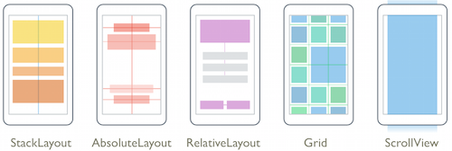

# Layouts in Xamarin.Forms

[ Download the sample](https://developer.xamarin.com/samples/xamarin-forms/UserInterface/Layout/)

Xamarin.Forms has several layouts and features for organizing content on screen.

> [!VIDEO https://youtube.com/embed/4HlLjTZQzjM]

**Xamarin.Forms Layouts, by [Xamarin University](https://university.xamarin.com/)**

Each layout control is described below, as well as details on how to handle screen orientation changes:

* **[StackLayout](stack-layout.md)** – used to arrange views linearly, either horizontally or vertically. Views in a StackLayout can be aligned to the center, left or right of the layout.
* **[AbsoluteLayout](absolute-layout.md)** – used to arrange views by setting coordinates & size in terms of absolute values or ratios. AbsoluteLayout can be used to layer views as well as anchor them to the left, right or center.
* **[RelativeLayout](relative-layout.md)** – used to arrange views by setting constraints relative to their parent's dimensions & position.
* **[Grid](grid.md)** – used to arrange views in a grid. Rows and columns can be specified in terms of absolute values or ratios.
* **[FlexLayout](flex-layout.md)** – used to arrange views horizontally or vertically with wrapping.
* **[ScrollView](scroll-view.md)** – used to provide scrolling when a view can't fit entirely within the bounds of the screen.
* **[LayoutOptions](layout-options.md)** – define alignment and expansion for a view, relative to its parent.
* **[Input Transparency](#input_transparency)** – specifies whether an element receives input.
* **[Margin and Padding](margin-and-padding.md)** – demonstrates how to control layout behavior when an element is rendered in the user interface.
* **[Device Orientation](device-orientation.md)** – explains how to handle device orientation changes.
* **[Layout on tablet and desktop devices](tablet.md)** – shows how to optimize for larger screens on each platform.
* **[Bindable Layouts](bindable-layouts.md)** – enable layout classes to generate their content by binding to a collection of items.
* **[Creating a Custom Layout](custom.md)** – explains how to create a custom layout class.
* **[Layout Compression](layout-compression.md)** – removes specified layout from the visual tree in an attempt to improve page rendering performance.

Platform controls can also be used directly in Xamarin.Forms
layouts with [**Native Embedding**](~/xamarin-forms/platform/native-views/index.md) (new
in Xamarin.Forms 2.2), and you can [**create custom layouts**](custom.md)
to meet specific requirements.

The following graphic visualizes the layout controls:

[](images/layouts.png#lightbox "Xamarin.Forms Layouts")

## Choosing the Right Layout

The layouts you choose in your app can either help or hurt you as you're creating an attractive and usable Xamarin.Forms app. Taking some time to consider how each layout works can help you write cleaner and more scalable UI code. A screen can have a combination of different layouts to achieve a specific design.

### [StackLayout](stack-layout.md)

The `StackLayout` is used for displaying views along a line that is either horizontal or vertical. Position and size within the layout is determined based on a view's `HeightRequest`, `WidthRequest`, `HorizontalOptions` and `VerticalOptions`. `StackLayout` is often used as the base layout, arranging other layouts on the screen.

For an example of when `StackLayout` would be a good choice, consider an app that needs to display a button and a label, with the label left-aligned and the button right-aligned.

```xaml
<StackLayout Orientation="Horizontal">
  <Label HorizontalOptions="StartAndExpand" Text="Label" />
  <Button HorizontalOptions="End" Text="Button" />
</StackLayout>
```

### [FlexLayout](flex-layout.md)

The `FlexLayout` is similar to `StackLayout` in that it displays child views either horizontally or vertically:

```xaml
<FlexLayout Direction="Column"
            AlignItems="Center"
            JustifyContent="SpaceEvenly">

    <Label Text="FlexLayout in Action" />
    <Button Text="Button" />
    <Label Text="Another Label" />
</FlexLayout>
```

However, if there are too many children to fit in a single row or columm, `FlexLayout` is also capable of wrapping those views. `FlexLayout` is based on the CSS Flexible Box Layout Module, and has many of the same built-in options for positioning and aligning its children.

### [AbsoluteLayout](absolute-layout.md)

The `AbsoluteLayout` is used for displaying views, with size and position being specified either as explicit values or values relative to the size of the layout. Unlike `StackLayout` and `Grid`, `AbsoluteLayout` allows child views to overlap. Unlike `RelativeLayout`, `AbsoluteLayout` doesn't let you place elements off screen.

For an example of when `AbsoluteLayout` would be a good choice, consider an app that needs to present collections of objects as stacks. This is often seen when presenting albums of photos or songs. The following code gives the appearance of a pile, with elements rotated to hint at the contents of the pile:

In XAML:

```xaml
<AbsoluteLayout Padding="15">
  <Image AbsoluteLayout.LayoutFlags="PositionProportional" AbsoluteLayout.LayoutBounds="0.5, 0, 100, 100" Rotation="30"
    Source="bottom.png" />
  <Image AbsoluteLayout.LayoutFlags="PositionProportional" AbsoluteLayout.LayoutBounds="0.5, 0, 100, 100" Rotation="60"
    Source="middle.png" />
  <Image AbsoluteLayout.LayoutFlags="PositionProportional" AbsoluteLayout.LayoutBounds="0.5, 0, 100, 100"
    Source="cover.png" />
</AbsoluteLayout>
```

Note the following aspects of the above code:

- Each `Image` is displayed in the same position (in the middle of the horizontal space)
- The `Padding` is considered by `AbsoluteLayout`, unlike `RelativeLayout`, which ignores it.
- `AbsoluteLayout.LayoutFlags` specifies how the layout bounds will be interpreted. In this case `PositionProportional`, means that the coordinates will be a ratio of the size of the layout, while the size will be interpreted as an explicit size.
- `AbsoluteLayout.Layoutbounds` specifies the horizontal position, vertical position, width and height in that order.

### [RelativeLayout](relative-layout.md)

The `RelativeLayout` is used for displaying views, with size and position specified as values relative to the values of the layout or another view. Relative values do not need to match he corresponding value on the related view. As an example, it is possible to set a view's `Width` property to be proportional to another view's `X` property.

RelativeLayout can be used to create UIs that scale proportionally across device sizes. The following XAML implements a design with boxes at the topmost corners, with a flagpole with flag in the center:

```xaml
<RelativeLayout HorizontalOptions="FillAndExpand" VerticalOptions="FillAndExpand">
  <BoxView Color="Blue" HeightRequest="50" WidthRequest="50"
    RelativeLayout.XConstraint= "{ConstraintExpression Type=RelativeToParent, Property=Width, Factor = 0}"
    RelativeLayout.YConstraint="{ConstraintExpression Type=RelativeToParent, Property=Height, Factor = 0}" />
  <BoxView Color="Red" HeightRequest="50" WidthRequest="50"
    RelativeLayout.XConstraint= "{ConstraintExpression Type=RelativeToParent, Property=Width, Factor = .9}"
    RelativeLayout.YConstraint="{ConstraintExpression Type=RelativeToParent, Property=Height, Factor = 0}" />
  <BoxView Color="Gray" WidthRequest="15" x:Name="pole"
    RelativeLayout.HeightConstraint="{ConstraintExpression Type=RelativeToParent, Property=Height, Factor=.75}"
    RelativeLayout.XConstraint= "{ConstraintExpression Type=RelativeToParent, Property=Width, Factor = .45}"
    RelativeLayout.YConstraint="{ConstraintExpression Type=RelativeToParent, Property=Height, Factor = .25}" />
  <BoxView Color="Green"
    RelativeLayout.HeightConstraint="{ConstraintExpression Type=RelativeToParent, Property=Height, Factor=.10, Constant=10}"
    RelativeLayout.WidthConstraint="{ConstraintExpression Type=RelativeToParent,Property=Width, Factor=.2, Constant=20}"
    RelativeLayout.XConstraint= "{ConstraintExpression Type=RelativeToView, ElementName=pole, Property=X, Constant=15}"
    RelativeLayout.YConstraint="{ConstraintExpression Type=RelativeToView, ElementName=pole, Property=Y, Constant=0}" />
</RelativeLayout>
```

Note the following aspects of the above code:

- Both positions and sizes are specified as constraints.
- The flagpole is named so that the flag's (green box's) position can be set relative to the flagpole.
- The constraint expressions have `Factor` and `Constant` properties, which can be used to define positions and sizes as multiples (or fractions) of properties of other objects, plus a constant. Constants can be negative.

### [Grid](grid.md)

The `Grid` is used for displaying elements in rows & columns. Note that the Grid is not a table, so it does not have the concept of cells, header & footer rows, or borders between rows & columns. In general, Grid is not appropriate for displaying tabular data. For that use, consider a [ListView](~/xamarin-forms/user-interface/listview/index.md) or [TableView](~/xamarin-forms/user-interface/tableview.md).

For an example of when a `Grid` is the right layout to use, consider a numeric input for a calculator. A numeric input for a calculator might consist of four rows and three columns, each with a button. The following code implements this design:

```xaml
<Grid>
  <Grid.RowDefinitions>
    <RowDefinition Height="*" />
    <RowDefinition Height="*" />
    <RowDefinition Height="*" />
    <RowDefinition Height="*" />
  </Grid.RowDefinitions>

  <Grid.ColumnDefinitions>
    <ColumnDefinition Width="*" />
    <ColumnDefinition Width="*" />
    <ColumnDefinition Width="*" />
  </Grid.ColumnDefinitions>
  <Button Text="1" Grid.Row="0" Grid.Column="0" />
  <Button Text="2" Grid.Row="0" Grid.Column="1" />
  <Button Text="3" Grid.Row="0" Grid.Column="2" />
  <Button Text="4" Grid.Row="1" Grid.Column="0" />
  <Button Text="5" Grid.Row="1" Grid.Column="1" />
  <Button Text="6" Grid.Row="1" Grid.Column="2" />
  <Button Text="7" Grid.Row="2" Grid.Column="0" />
  <Button Text="8" Grid.Row="2" Grid.Column="1" />
  <Button Text="9" Grid.Row="2" Grid.Column="2" />
  <Button Text="0" Grid.Row="3" Grid.Column="1" />
  <Button Text="&lt;-" Grid.Row="3" Grid.Column="2" />
</Grid>
```

Note the following aspects of the above code:

- Grids and Columns are explicitly specified, not inferred from the content.
- `Height` and `Width` values can be set to star, which means that the Grid will set those values to fill the available space.
- Each button's position is specified by `Grid.Row` & `Grid.Column` properties.

### [LayoutOptions](layout-options.md)

The [`LayoutOptions`](xref:Xamarin.Forms.LayoutOptions) structure can be used to define alignment and expansion for a view, relative to its parent.

### [Margin and Padding](margin-and-padding.md)

The [`Margin`](xref:Xamarin.Forms.View.Margin) and [`Padding`](xref:Xamarin.Forms.Layout.Padding) properties control layout behavior when an element is rendered in the user interface.

<a name="input_transparency" />

### Input Transparency

Each element has an [`InputTransparent`](xref:Xamarin.Forms.VisualElement.InputTransparent) property that's used to define whether the element receives input. Its default value is `false`, ensuring that the element receives input.

When this property is set on a container class, such as a layout class, its value transfers to child elements. Therefore, setting the [`InputTransparent`](xref:Xamarin.Forms.VisualElement.InputTransparent) property to `true` on a layout class will result in the elements within the layout not receiving input.

### [Device Orientation](device-orientation.md)

Xamarin.Forms and its built-in layouts are capable of handling changes in device orientation. Consider which orientations your app will support, as well as how you'll make use of the space provided in landscape and portrait modes.

### [Layout for Tablet and Desktop apps](tablet.md)

iOS, Android, and Universal Windows Platform all support larger screen sizes
on tablet devices (as well as laptops and desktops for Windows). Xamarin.Forms
lets you optimize your app for larger screens by detecting the device
type and either adjusting the page layout, or using a totally different
page altogether for larger screens.

### [Bindable Layouts](bindable-layouts.md)

The `BindableLayout` class enables any layout class that derives from the [`Layout<T>`](xref:Xamarin.Forms.Layout`1) class to generate its content by binding to a collection of items, with the option to set the appearance of each item with a [`DataTemplate`](xref:Xamarin.Forms.DataTemplate).

### [Creating a Custom Layout](custom.md)

Xamarin.Forms defines four layout classes - [`StackLayout`](xref:Xamarin.Forms.StackLayout), [`AbsoluteLayout`](xref:Xamarin.Forms.AbsoluteLayout), [`RelativeLayout`](xref:Xamarin.Forms.RelativeLayout), and [`Grid`](xref:Xamarin.Forms.Grid), and each arranges its children in a different way. However, sometimes its necessary to organize page content using a layout not provided by Xamarin.Forms. This article explains how to write a custom layout class, and demonstrates an orientation-sensitive `WrapLayout` class that arranges its children horizontally across the page, and then wraps the display of subsequent children to additional rows.

### [Layout Compression](layout-compression.md)

Layout compression removes specified layouts from the visual tree in an attempt to improve page rendering performance. The performance benefit that this delivers varies depending on the complexity of a page, the version of the operating system being used, and the device on which the application is running. However, the biggest performance gains will be seen on older devices.

## Making Your Choice

Be aware that in most cases, more than one layout choice can be used to
implement your desired design. When there are multiple valid choices,
consider which approach will be the easiest for your situation.
Most designs can't be realized with just one layout, so nest layouts
as needed to create more complex designs.

## Related Links

- [Apple's Human Interface Guidelines](https://developer.apple.com/library/ios/documentation/UserExperience/Conceptual/MobileHIG)
- [Android Design Website](https://developer.android.com/design/index.html)
- [Layout (sample)](https://developer.xamarin.com/samples/xamarin-forms/UserInterface/Layout/)
- [BusinessTumble Example (sample)](https://developer.xamarin.com/samples/xamarin-forms/UserInterface/BusinessTumble/)
