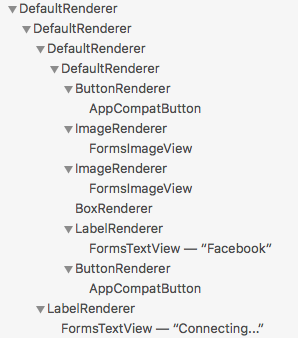
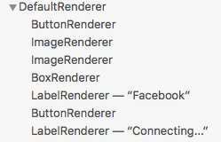

# Layout Compression

[ Download the sample](/samples/xamarin/xamarin-forms-samples/userinterface-layoutcompression)

_Layout compression removes specified layouts from the visual tree in an attempt to improve page rendering performance. This article explains how to enable layout compression and the benefits it can bring._

## Overview

Xamarin.Forms performs layout using two series of recursive method calls:

- Layout begins at the top of the visual tree with a page, and it proceeds through all branches of the visual tree to encompass every visual element on a page. Elements that are parents to other elements are responsible for sizing and positioning their children relative to themselves.
- Invalidation is the process by which a change in an element on a page triggers a new layout cycle. Elements are considered invalid when they no longer have the correct size or position. Every element in the visual tree that has children is alerted whenever one of its children changes sizes. Therefore, a change in the size of an element in the visual tree can cause changes that ripple up the tree.

For more information about how Xamarin.Forms performs layout, see [Creating a Custom Layout](~/xamarin-forms/user-interface/layouts/custom.md).

The result of the layout process is a hierarchy of native controls. However, this hierarchy includes additional container renderers and wrappers for platform renderers, further inflating the view hierarchy nesting. The deeper the level of nesting, the greater the amount of work that Xamarin.Forms has to perform to display a page. For complex layouts, the view hierarchy can be both deep and broad, with multiple levels of nesting.

For example, consider the following button from the sample application for logging into Facebook:


This button is specified as a custom control with the following XAML view hierarchy:

```xaml
<ContentView ...>
    <StackLayout>
        <StackLayout ...>
            <AbsoluteLayout ...>
                <Button ... />    
                <Image ... />
                <Image ... />
                <BoxView ... />
                <Label ... />
                <Button ... />
            </AbsoluteLayout>
        </StackLayout>
        <Label ... />
    </StackLayout>    
</ContentView>
```

The resulting nested view hierarchy can be examined with the Live Visual Tree. On Android, the nested view hierarchy contains 17 views:



Layout compression, which is available for Xamarin.Forms applications on the iOS and Android platforms, aims to flatten the view nesting by removing specified layouts from the visual tree, which can improve page-rendering performance. The performance benefit that's delivered varies depending on the complexity of a page, the version of the operating system being used, and the device on which the application is running. However, the biggest performance gains will be seen on older devices.

> [!NOTE]
> While this article focuses on the results of applying layout compression on Android, it's equally applicable to iOS.

## Layout Compression

In XAML, layout compression can be enabled by setting the `CompressedLayout.IsHeadless` attached property to `true` on a layout class:

```xaml
<StackLayout CompressedLayout.IsHeadless="true">
  ...
</StackLayout>   
```

Alternatively, it can be enabled in C# by specifying the layout instance as the first argument to the `CompressedLayout.SetIsHeadless` method:

```csharp
CompressedLayout.SetIsHeadless(stackLayout, true);
```

> [!IMPORTANT]
> Since layout compression removes a layout from the visual tree, it's not suitable for layouts that have a visual appearance, or that obtain touch input. Therefore, layouts that set [`VisualElement`](xref:Xamarin.Forms.VisualElement) properties (such as [`BackgroundColor`](xref:Xamarin.Forms.VisualElement.BackgroundColor), [`IsVisible`](xref:Xamarin.Forms.VisualElement.IsVisible), [`Rotation`](xref:Xamarin.Forms.VisualElement.Rotation), [`Scale`](xref:Xamarin.Forms.VisualElement.Scale), [`TranslationX`](xref:Xamarin.Forms.VisualElement.TranslationX) and [`TranslationY`](xref:Xamarin.Forms.VisualElement.TranslationY) or that accept gestures, are not candidates for layout compression. However, enabling layout compression on a layout that sets visual appearance properties, or that accepts gestures, will not result in a build or runtime error. Instead, layout compression will be applied and visual appearance properties, and gesture recognition, will silently fail.

For the Facebook button, layout compression can be enabled on the three layout classes:

```xaml
<StackLayout CompressedLayout.IsHeadless="true">
    <StackLayout CompressedLayout.IsHeadless="true" ...>
        <AbsoluteLayout CompressedLayout.IsHeadless="true" ...>
            ...
        </AbsoluteLayout>
    </StackLayout>
    ...
</StackLayout>  
```

On Android, this results in a nested view hierarchy of 14 views:


Compared to the original nested view hierarchy of 17 views, this represents a reduction in the number of views of 17%. While this reduction may appear insignificant, the view reduction over an entire page can be more significant.

### Fast Renderers

Fast renderers reduce the inflation and rendering costs of Xamarin.Forms controls on Android by flattening the resulting native view hierarchy. This further improves performance by creating fewer objects, which in turn results in a less complex visual tree and less memory use. For more information about fast renderers, see [Fast Renderers](~/xamarin-forms/internals/fast-renderers.md).

For the Facebook button in the sample application, combining layout compression and fast renderers produces a nested view hierarchy of 8 views:



Compared to the original nested view hierarchy of 17 views, this represents a reduction of 52%.

The sample application contains a page extracted from a real application. Without layout compression and fast renderers, the page produces a nested view hierarchy of 130 views on Android. Enabling fast renderers and layout compression on appropriate layout classes reduces the nested view hierarchy to 70 views, a reduction of 46%.

## Summary

Layout compression removes specified layouts from the visual tree in an attempt to improve page rendering performance. The performance benefit that this delivers varies depending on the complexity of a page, the version of the operating system being used, and the device on which the application is running. However, the biggest performance gains will be seen on older devices.

## Related Links

- [Creating a Custom Layout](~/xamarin-forms/user-interface/layouts/custom.md)
- [Fast Renderers](~/xamarin-forms/internals/fast-renderers.md)
- [LayoutCompression (sample)](/samples/xamarin/xamarin-forms-samples/userinterface-layoutcompression)