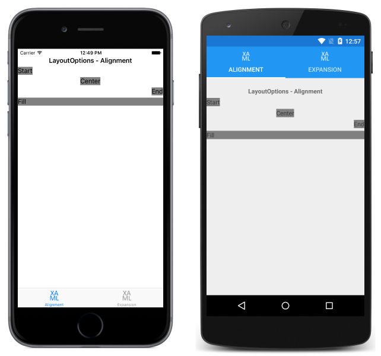
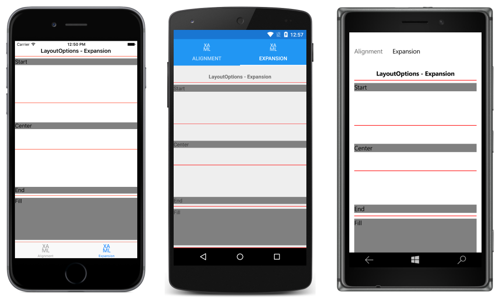

# Layout Options in Xamarin.Forms

[ Download the sample](/samples/xamarin/xamarin-forms-samples/userinterface-layoutoptions)

_Every Xamarin.Forms view has HorizontalOptions and VerticalOptions properties, of type LayoutOptions. This article explains the effect that each LayoutOptions value has on the alignment and expansion of a view._

## Overview

The [`LayoutOptions`](xref:Xamarin.Forms.LayoutOptions) structure encapsulates two layout preferences:

- **Alignment** – the view's preferred alignment, which determines its position and size within its parent layout.
- **Expansion** – used only by a [`StackLayout`](xref:Xamarin.Forms.StackLayout), and indicates if the view should use extra space, if it's available.

These layout preferences can be applied to a [`View`](xref:Xamarin.Forms.View), relative to its parent, by setting the [`HorizontalOptions`](xref:Xamarin.Forms.View.HorizontalOptions) or [`VerticalOptions`](xref:Xamarin.Forms.View.VerticalOptions) property of the `View` to one of the public fields from the [`LayoutOptions`](xref:Xamarin.Forms.LayoutOptions) structure. The public fields are as follows:

- [`Start`](xref:Xamarin.Forms.LayoutOptions.Start)
- [`Center`](xref:Xamarin.Forms.LayoutOptions.Center)
- [`End`](xref:Xamarin.Forms.LayoutOptions.End)
- [`Fill`](xref:Xamarin.Forms.LayoutOptions.Fill)
- [`StartAndExpand`](xref:Xamarin.Forms.LayoutOptions.StartAndExpand)
- [`CenterAndExpand`](xref:Xamarin.Forms.LayoutOptions.CenterAndExpand)
- [`EndAndExpand`](xref:Xamarin.Forms.LayoutOptions.EndAndExpand)
- [`FillAndExpand`](xref:Xamarin.Forms.LayoutOptions.FillAndExpand)

The `Start`, `Center`, `End`, and `Fill` fields are used to define the view's alignment within the parent layout:

- For horizontal alignment, [`Start`](xref:Xamarin.Forms.LayoutOptions.Start) positions the [`View`](xref:Xamarin.Forms.View) on the left hand side of the parent layout, and for vertical alignment, it positions the `View` at the top of the parent layout.
- For horizontal and vertical alignment, [`Center`](xref:Xamarin.Forms.LayoutOptions.Center) horizontally or vertically centers the [`View`](xref:Xamarin.Forms.View).
- For horizontal alignment, [`End`](xref:Xamarin.Forms.LayoutOptions.End) positions the [`View`](xref:Xamarin.Forms.View) on the right hand side of the parent layout, and for vertical alignment, it positions the `View` at the bottom of the parent layout.
- For horizontal alignment, [`Fill`](xref:Xamarin.Forms.LayoutOptions.Fill) ensures that the [`View`](xref:Xamarin.Forms.View) fills the width of the parent layout, and for vertical alignment, it ensures that the `View` fills the height of the parent layout.

The `StartAndExpand`, `CenterAndExpand`, `EndAndExpand`, and `FillAndExpand` values are used to define the alignment preference, and whether the view will occupy more space if available within the parent [`StackLayout`](xref:Xamarin.Forms.StackLayout).

> [!NOTE]
> The default value of a view's [`HorizontalOptions`](xref:Xamarin.Forms.View.HorizontalOptions) and [`VerticalOptions`](xref:Xamarin.Forms.View.VerticalOptions) properties is [`LayoutOptions.Fill`](xref:Xamarin.Forms.LayoutOptions.Fill).

## Alignment

Alignment controls how a view is positioned within its parent layout when the parent layout contains unused space (that is, the parent layout is larger than the combined size of all its children).

A [`StackLayout`](xref:Xamarin.Forms.StackLayout) only respects the `Start`, `Center`, `End`, and `Fill` [`LayoutOptions`](xref:Xamarin.Forms.LayoutOptions) fields on child views that are in the opposite direction to the `StackLayout` orientation. Therefore, child views within a vertically oriented `StackLayout` can set their [`HorizontalOptions`](xref:Xamarin.Forms.View.HorizontalOptions) properties to one of the `Start`, `Center`, `End`, or `Fill` fields. Similarly, child views within a horizontally oriented `StackLayout` can set their [`VerticalOptions`](xref:Xamarin.Forms.View.VerticalOptions) properties to one of the `Start`, `Center`, `End`, or `Fill` fields.

A [`StackLayout`](xref:Xamarin.Forms.StackLayout) does not respect the `Start`, `Center`, `End`, and `Fill` [`LayoutOptions`](xref:Xamarin.Forms.LayoutOptions) fields on child views that are in the same direction as the `StackLayout` orientation. Therefore, a vertically oriented `StackLayout` ignores the `Start`, `Center`, `End`, or `Fill` fields if they are set on the [`VerticalOptions`](xref:Xamarin.Forms.View.VerticalOptions) properties of child views. Similarly, a horizontally oriented `StackLayout` ignores the `Start`, `Center`, `End`, or `Fill` fields if they are set on the [`HorizontalOptions`](xref:Xamarin.Forms.View.HorizontalOptions) properties of child views.

> [!NOTE]
> [`LayoutOptions.Fill`](xref:Xamarin.Forms.LayoutOptions.Fill) generally overrides size requests specified using the  [`HeightRequest`](xref:Xamarin.Forms.VisualElement.HeightRequest) and [`WidthRequest`](xref:Xamarin.Forms.VisualElement.WidthRequest) properties.

The following XAML code example demonstrates a vertically oriented [`StackLayout`](xref:Xamarin.Forms.StackLayout) where each child [`Label`](xref:Xamarin.Forms.Label) sets its [`HorizontalOptions`](xref:Xamarin.Forms.View.HorizontalOptions) property to one of the four alignment fields from the [`LayoutOptions`](xref:Xamarin.Forms.LayoutOptions) structure:

```xaml
<StackLayout Margin="0,20,0,0">
  ...
  <Label Text="Start" BackgroundColor="Gray" HorizontalOptions="Start" />
  <Label Text="Center" BackgroundColor="Gray" HorizontalOptions="Center" />
  <Label Text="End" BackgroundColor="Gray" HorizontalOptions="End" />
  <Label Text="Fill" BackgroundColor="Gray" HorizontalOptions="Fill" />
</StackLayout>
```

The equivalent C# code is shown below:

```csharp
Content = new StackLayout
{
  Margin = new Thickness(0, 20, 0, 0),
  Children = {
    ...
    new Label { Text = "Start", BackgroundColor = Color.Gray, HorizontalOptions = LayoutOptions.Start },
    new Label { Text = "Center", BackgroundColor = Color.Gray, HorizontalOptions = LayoutOptions.Center },
    new Label { Text = "End", BackgroundColor = Color.Gray, HorizontalOptions = LayoutOptions.End },
    new Label { Text = "Fill", BackgroundColor = Color.Gray, HorizontalOptions = LayoutOptions.Fill }
  }
};
```

The code results in the layout shown in the following screenshots:

[](layout-options-images/alignment-large.png#lightbox "Alignment Layout Options")

## Expansion

Expansion controls whether a view will occupy more space, if available, within a [`StackLayout`](xref:Xamarin.Forms.StackLayout). If the `StackLayout` contains unused space (that is, the `StackLayout` is larger than the combined size of all of its children), the unused space is shared equally by all child views that request expansion by setting their [`HorizontalOptions`](xref:Xamarin.Forms.View.HorizontalOptions) or [`VerticalOptions`](xref:Xamarin.Forms.View.VerticalOptions) properties to a [`LayoutOptions`](xref:Xamarin.Forms.LayoutOptions) field that uses the `AndExpand` suffix. Note that when all the space in the `StackLayout` is used, the expansion options have no effect.

A [`StackLayout`](xref:Xamarin.Forms.StackLayout) can only expand child views in the direction of its orientation. Therefore, a vertically oriented `StackLayout` can expand child views that set their [`VerticalOptions`](xref:Xamarin.Forms.View.VerticalOptions) properties to one of the `StartAndExpand`, `CenterAndExpand`, `EndAndExpand`, or `FillAndExpand` fields, if the `StackLayout` contains unused space. Similarly, a horizontally oriented `StackLayout` can expand child views that set their [`HorizontalOptions`](xref:Xamarin.Forms.View.HorizontalOptions) properties to one of the `StartAndExpand`, `CenterAndExpand`, `EndAndExpand`, or `FillAndExpand` fields, if the `StackLayout` contains unused space.

A [`StackLayout`](xref:Xamarin.Forms.StackLayout) can't expand child views in the direction opposite to its orientation. Therefore, on a vertically oriented `StackLayout`, setting the [`HorizontalOptions`](xref:Xamarin.Forms.View.HorizontalOptions) property on a child view to [`StartAndExpand`](xref:Xamarin.Forms.LayoutOptions.StartAndExpand) has the same effect as setting the property to [`Start`](xref:Xamarin.Forms.LayoutOptions.Start).

> [!NOTE]
> Note that enabling expansion doesn't change the size of a view unless it uses [`LayoutOptions.FillAndExpand`](xref:Xamarin.Forms.LayoutOptions.FillAndExpand).

The following XAML code example demonstrates a vertically oriented [`StackLayout`](xref:Xamarin.Forms.StackLayout) where each child [`Label`](xref:Xamarin.Forms.Label) sets its [`VerticalOptions`](xref:Xamarin.Forms.View.VerticalOptions) property to one of the four expansion fields from the [`LayoutOptions`](xref:Xamarin.Forms.LayoutOptions) structure:

```xaml
<StackLayout Margin="0,20,0,0">
  ...
  <BoxView BackgroundColor="Red" HeightRequest="1" />
  <Label Text="Start" BackgroundColor="Gray" VerticalOptions="StartAndExpand" />
  <BoxView BackgroundColor="Red" HeightRequest="1" />
  <Label Text="Center" BackgroundColor="Gray" VerticalOptions="CenterAndExpand" />
  <BoxView BackgroundColor="Red" HeightRequest="1" />
  <Label Text="End" BackgroundColor="Gray" VerticalOptions="EndAndExpand" />
  <BoxView BackgroundColor="Red" HeightRequest="1" />
  <Label Text="Fill" BackgroundColor="Gray" VerticalOptions="FillAndExpand" />
  <BoxView BackgroundColor="Red" HeightRequest="1" />
</StackLayout>
```

The equivalent C# code is shown below:

```csharp
Content = new StackLayout
{
  Margin = new Thickness(0, 20, 0, 0),
  Children = {
    ...
    new BoxView { BackgroundColor = Color.Red, HeightRequest = 1 },
    new Label { Text = "StartAndExpand", BackgroundColor = Color.Gray, VerticalOptions = LayoutOptions.StartAndExpand },
    new BoxView { BackgroundColor = Color.Red, HeightRequest = 1 },
    new Label { Text = "CenterAndExpand", BackgroundColor = Color.Gray, VerticalOptions = LayoutOptions.CenterAndExpand },
    new BoxView { BackgroundColor = Color.Red, HeightRequest = 1 },
    new Label { Text = "EndAndExpand", BackgroundColor = Color.Gray, VerticalOptions = LayoutOptions.EndAndExpand },
    new BoxView { BackgroundColor = Color.Red, HeightRequest = 1 },
    new Label { Text = "FillAndExpand", BackgroundColor = Color.Gray, VerticalOptions = LayoutOptions.FillAndExpand },
    new BoxView { BackgroundColor = Color.Red, HeightRequest = 1 }
  }
};
```

The code results in the layout shown in the following screenshots:

[](layout-options-images/expansion-large.png#lightbox "Expansion Layout Options")

Each [`Label`](xref:Xamarin.Forms.Label) occupies the same amount of space within the [`StackLayout`](xref:Xamarin.Forms.StackLayout). However, only the final `Label`, which sets its [`VerticalOptions`](xref:Xamarin.Forms.View.VerticalOptions) property to [`FillAndExpand`](xref:Xamarin.Forms.LayoutOptions.FillAndExpand) has a different size. In addition, each `Label` is separated by a small red [`BoxView`](xref:Xamarin.Forms.BoxView), which enables the space the `Label` occupies to be easily viewed.

## Summary

This article explained the effect that each [`LayoutOptions`](xref:Xamarin.Forms.LayoutOptions) structure value has on the alignment and expansion of a view, relative to its parent. The `Start`, `Center`, `End`, and `Fill` fields are used to define the view's alignment within the parent layout, and the `StartAndExpand`, `CenterAndExpand`, `EndAndExpand`, and `FillAndExpand` fields are used to define the alignment preference, and to determine whether the view will occupy more space, if available, within a [`StackLayout`](xref:Xamarin.Forms.StackLayout).

## Related Links

- [LayoutOptions (sample)](/samples/xamarin/xamarin-forms-samples/userinterface-layoutoptions)
- [LayoutOptions](xref:Xamarin.Forms.LayoutOptions)