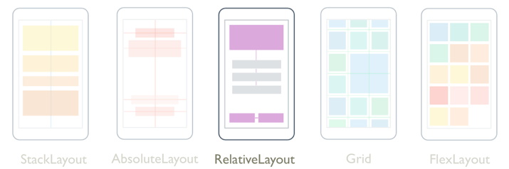

# Xamarin.Forms RelativeLayout

[ Download the sample](/samples/xamarin/xamarin-forms-samples/userinterface-relativelayoutdemos)

[](relativelayout-images/layouts-large.png#lightbox)

A [`RelativeLayout`](xref:Xamarin.Forms.RelativeLayout) is used to position and size children relative to properties of the layout or sibling elements. This allows UIs to be created that scale proportionally across device sizes. In addition, unlike some other layout classes, `RelativeLayout` is able to position children so that overlap.

The [`RelativeLayout`](xref:Xamarin.Forms.RelativeLayout) class defines the following properties:

- [`XConstraint`](xref:Xamarin.Forms.RelativeLayout.XConstraintProperty), of type [`Constraint`](xref:Xamarin.Forms.Constraint), which is an attached property that represents the constraint on the X position of the child.
- [`YConstraint`](xref:Xamarin.Forms.RelativeLayout.YConstraintProperty), of type [`Constraint`](xref:Xamarin.Forms.Constraint), which is an attached property that represents the constraint on the Y position of the child.
- [`WidthConstraint`](xref:Xamarin.Forms.RelativeLayout.WidthConstraintProperty), of type [`Constraint`](xref:Xamarin.Forms.Constraint), which is an attached property that represents the constraint on the width of the child.
- [`HeightConstraint`](xref:Xamarin.Forms.RelativeLayout.HeightConstraintProperty), of type [`Constraint`](xref:Xamarin.Forms.Constraint), which is an attached property that represents the constraint on the height of the child.
- [`BoundsConstraint`](xref:Xamarin.Forms.RelativeLayout.BoundsConstraintProperty), of type [`BoundsConstraint`](xref:Xamarin.Forms.BoundsConstraint), which is an attached property that represents the constraint on the position and size of the child. This property can't be easily consumed from XAML.

These properties are backed by [`BindableProperty`](xref:Xamarin.Forms.BindableProperty) objects, which means that the properties can be targets of data bindings and styled. For more information about attached properties, see [Xamarin.Forms Attached Properties](~/xamarin-forms/xaml/attached-properties.md).

> [!NOTE]
> The width and height of a child in a [`RelativeLayout`](xref:Xamarin.Forms.RelativeLayout) can also be specified through the child's `WidthRequest` and `HeightRequest` properties, instead of the [`WidthConstraint`](xref:Xamarin.Forms.RelativeLayout.WidthConstraintProperty) and [`HeightConstraint`](xref:Xamarin.Forms.RelativeLayout.HeightConstraintProperty) attached properties.

The [`RelativeLayout`](xref:Xamarin.Forms.RelativeLayout) class derives from the `Layout<T>` class, which defines a `Children` property of type `IList<T>`. The `Children` property is the `ContentProperty` of the `Layout<T>` class, and therefore does not need to be explicitly set from XAML.

> [!TIP]
> Avoid using a [`RelativeLayout`](xref:Xamarin.Forms.RelativeLayout) whenever possible. It will result in the CPU having to perform significantly more work.

## Constraints

Within a [`RelativeLayout`](xref:Xamarin.Forms.RelativeLayout), the position and size of children are specified as constraints using absolute values or relative values. When constraints aren't specified, a child will be positioned in the upper left corner of the layout.

The following table shows how to specify constraints in XAML and C#:

|     | XAML | C# |
| --- | ---- | -- |
| **Absolute values** | Absolute constraints are specified by setting the [`RelativeLayout`](xref:Xamarin.Forms.RelativeLayout) attached properties to `double` values. | Absolute constraints are specified by the [`Constraint.Constant`](xref:Xamarin.Forms.Constraint.Constant*) method, or by using the `Children.Add` overload that requires a `Func<Rectangle>` argument. |
| **Relative values** | Relative constraints are specified by setting the [`RelativeLayout`](xref:Xamarin.Forms.RelativeLayout) attached properties to [`Constraint`](xref:Xamarin.Forms.Constraint) objects that are returned by the `ConstraintExpression` markup extension. | Relative constraints are specified by [`Constraint`](xref:Xamarin.Forms.Constraint) objects that are returned by methods of the `Constraint` class. |

For more information about specifying constraints using absolute values, see [Absolute positioning and sizing](#absolute-positioning-and-sizing). For more information about specifying constraints using relative values, see [Relative positioning and sizing](#relative-positioning-and-sizing).

In C#, children can be added to [`RelativeLayout`](xref:Xamarin.Forms.RelativeLayout) by three `Add` overloads. The first overload requires a `Expression<Func<Rectangle>>` to specify the position and size of a child. The second overload requires optional `Expression<Func<double>>` objects for the `x`, `y`, `width`, and `height` arguments. The third overload requires optional `Constraint` objects for the `x`, `y`, `width`, and `height` arguments.

It's possible to change the position and size of a child in a [`RelativeLayout`](xref:Xamarin.Forms.RelativeLayout) with the [`SetXConstraint`](xref:Xamarin.Forms.RelativeLayout.SetXConstraint*), [`SetYConstraint`](xref:Xamarin.Forms.RelativeLayout.SetYConstraint*), [`SetWidthConstraint`](xref:Xamarin.Forms.RelativeLayout.SetWidthConstraint*), and [`SetHeightConstraint`](xref:Xamarin.Forms.RelativeLayout.SetHeightConstraint*) methods. The first argument to each of these methods is the child, and the second is a [`Constraint`](xref:Xamarin.Forms.Constraint) object. In addition, the [`SetBoundsConstraint`](xref:Xamarin.Forms.RelativeLayout.SetBoundsConstraint*) method can also be used to change the position and size of a child. The first argument to this method is the child, and the second is a [`BoundsConstraint`](xref:Xamarin.Forms.BoundsConstraint) object.

## Absolute positioning and sizing

A [`RelativeLayout`](xref:Xamarin.Forms.RelativeLayout) can position and size children using absolute values, specified in device-independent units, which explicitly define where children should be placed in the layout. This is achieved by adding children to the `Children` collection of a `RelativeLayout` and setting the [`XConstraint`](xref:Xamarin.Forms.RelativeLayout.XConstraintProperty), [`YConstraint`](xref:Xamarin.Forms.RelativeLayout.YConstraintProperty), [`WidthConstraint`](xref:Xamarin.Forms.RelativeLayout.WidthConstraintProperty), and [`HeightConstraint`](xref:Xamarin.Forms.RelativeLayout.HeightConstraintProperty) attached properties on each child to absolute position and/or size values.

> [!WARNING]
> Using absolute values for positioning and sizing children can be problematic, because different devices have different screen sizes and resolutions. Therefore, the coordinates for the center of the screen on one device may be offset on other devices.

The following XAML shows a [`RelativeLayout`](xref:Xamarin.Forms.RelativeLayout) whose children are positioned using absolute values:

```xaml
<ContentPage xmlns="http://xamarin.com/schemas/2014/forms"
             xmlns:x="http://schemas.microsoft.com/winfx/2009/xaml"
             x:Class="RelativeLayoutDemos.Views.StylishHeaderDemoPage"
             Title="Stylish header demo">
    <RelativeLayout Margin="20">
        <BoxView Color="Silver"
                 RelativeLayout.XConstraint="0"
                 RelativeLayout.YConstraint="10"
                 RelativeLayout.WidthConstraint="200"
                 RelativeLayout.HeightConstraint="5" />
        <BoxView Color="Silver"
                 RelativeLayout.XConstraint="0"
                 RelativeLayout.YConstraint="20"
                 RelativeLayout.WidthConstraint="200"
                 RelativeLayout.HeightConstraint="5" />
        <BoxView Color="Silver"
                 RelativeLayout.XConstraint="10"
                 RelativeLayout.YConstraint="0"
                 RelativeLayout.WidthConstraint="5"
                 RelativeLayout.HeightConstraint="65" />
        <BoxView Color="Silver"
                 RelativeLayout.XConstraint="20"
                 RelativeLayout.YConstraint="0"
                 RelativeLayout.WidthConstraint="5"
                 RelativeLayout.HeightConstraint="65" />
        <Label Text="Stylish header"
               FontSize="24"
               RelativeLayout.XConstraint="30"
               RelativeLayout.YConstraint="25" />
    </RelativeLayout>
</ContentPage>
```

In this example, the position of each [`BoxView`](xref:Xamarin.Forms.BoxView) object is defined using the values specified in the [`XConstraint`](xref:Xamarin.Forms.RelativeLayout.XConstraintProperty) and [`YConstraint`](xref:Xamarin.Forms.RelativeLayout.YConstraintProperty) attached properties. The size of each `BoxView` is defined using the values specified in the [`WidthConstraint`](xref:Xamarin.Forms.RelativeLayout.WidthConstraintProperty) and [`HeightConstraint`](xref:Xamarin.Forms.RelativeLayout.HeightConstraintProperty) attached properties. The position of the [`Label`](xref:Xamarin.Forms.Label) object is also defined using the values specified in the `XConstraint` and `YConstraint` attached properties. However, size values are not specified for the `Label`, and so it's unconstrained and sizes itself. In all cases, the absolute values represent device-independent units.

The following screenshots show the resulting layout:


The equivalent C# code is shown below:

```csharp
public class StylishHeaderDemoPageCS : ContentPage
{
    public StylishHeaderDemoPageCS()
    {
        RelativeLayout relativeLayout = new RelativeLayout
        {
            Margin = new Thickness(20)
        };

        relativeLayout.Children.Add(new BoxView
        {
            Color = Color.Silver
        }, () => new Rectangle(0, 10, 200, 5));

        relativeLayout.Children.Add(new BoxView
        {
            Color = Color.Silver
        }, () => new Rectangle(0, 20, 200, 5));

        relativeLayout.Children.Add(new BoxView
        {
            Color = Color.Silver
        }, () => new Rectangle(10, 0, 5, 65));

        relativeLayout.Children.Add(new BoxView
        {
            Color = Color.Silver
        }, () => new Rectangle(20, 0, 5, 65));

        relativeLayout.Children.Add(new Label
        {
            Text = "Stylish Header",
            FontSize = 24
        }, Constraint.Constant(30), Constraint.Constant(25));

        Title = "Stylish header demo";
        Content = relativeLayout;
    }
}
```

In this example, [`BoxView`](xref:Xamarin.Forms.BoxView) objects are added to the [`RelativeLayout`](xref:Xamarin.Forms.RelativeLayout) using an `Add` overload that requires a `Expression<Func<Rectangle>>` to specify the position and size of each child. The position of the [`Label`](xref:Xamarin.Forms.Label) is defined using an `Add` overload that requires optional [`Constraint`](xref:Xamarin.Forms.Constraint) objects, in this case created by the [`Constraint.Constant`](xref:Xamarin.Forms.Constraint.Constant*) method.

> [!NOTE]
> A [`RelativeLayout`](xref:Xamarin.Forms.RelativeLayout) that uses absolute values can position and size children so that they don't fit within the bounds of the layout.

## Relative positioning and sizing

A [`RelativeLayout`](xref:Xamarin.Forms.RelativeLayout) can position and size children using values that are relative to properties of the layout, or sibling elements. This is achieved by adding children to the `Children` collection of the `RelativeLayout` and setting the [`XConstraint`](xref:Xamarin.Forms.RelativeLayout.XConstraintProperty), [`YConstraint`](xref:Xamarin.Forms.RelativeLayout.YConstraintProperty), [`WidthConstraint`](xref:Xamarin.Forms.RelativeLayout.WidthConstraintProperty), and [`HeightConstraint`](xref:Xamarin.Forms.RelativeLayout.HeightConstraintProperty) attached properties on each child to relative values using [`Constraint`](xref:Xamarin.Forms.Constraint) objects.

Constraints can be a constant, relative to a parent, or relative to a sibling. The type of constraint is represented by the [`ConstraintType`](xref:Xamarin.Forms.ConstraintType) enumeration, which defines the following members:

- `RelativeToParent`, which indicates a constraint that is relative to a parent.
- `RelativeToView`, which indicates a constraint that is relative to a view (or sibling).
- `Constant`, which indicates a constant constraint.

### Constraint markup extension

In XAML, a [`Constraint`](xref:Xamarin.Forms.Constraint) object can be created by the [`ConstraintExpression`](xref:Xamarin.Forms.ConstraintExpression) markup extension. This markup extension is typically used to relate the position and size of a child within a [`RelativeLayout`](xref:Xamarin.Forms.RelativeLayout) to its parent, or to a sibling.

The [`ConstraintExpression`](xref:Xamarin.Forms.ConstraintExpression) class defines the following properties:

- [`Constant`](xref:Xamarin.Forms.ConstraintExpression.Constant), of type `double`, which represents the constraint constant value.
- [`ElementName`](xref:Xamarin.Forms.ConstraintExpression.ElementName), of type `string`, which represents the name of a source element against which to calculate the constraint.
- [`Factor`](xref:Xamarin.Forms.ConstraintExpression.Factor), of type `double`, which represents the factor by which to scale a constrained dimension, relative to the source element. This property defaults to 1.
- [`Property`](xref:Xamarin.Forms.ConstraintExpression.Property), of type `string`, which represents the name of the property on the source element to use in the constraint calculation.
- [`Type`](xref:Xamarin.Forms.ConstraintExpression.Type), of type [`ConstraintType`](xref:Xamarin.Forms.ConstraintType), which represents the type of the constraint.

For more information about Xamarin.Forms markup extensions, see [XAML Markup Extensions](~/xamarin-forms/xaml/markup-extensions/index.md).

The following XAML shows a [`RelativeLayout`](xref:Xamarin.Forms.RelativeLayout) whose children are constrained by the [`ConstraintExpression`](xref:Xamarin.Forms.ConstraintExpression) markup extension:

```xaml
<ContentPage xmlns="http://xamarin.com/schemas/2014/forms"
             xmlns:x="http://schemas.microsoft.com/winfx/2009/xaml"
             x:Class="RelativeLayoutDemos.Views.RelativePositioningAndSizingDemoPage"
             Title="RelativeLayout demo">
    <RelativeLayout>
        <BoxView Color="Red"
                 RelativeLayout.XConstraint="{ConstraintExpression Type=Constant, Constant=0}"
                 RelativeLayout.YConstraint="{ConstraintExpression Type=Constant, Constant=0}" />
        <BoxView Color="Green"
                 RelativeLayout.XConstraint="{ConstraintExpression Type=RelativeToParent, Property=Width, Constant=-40}"
                 RelativeLayout.YConstraint="{ConstraintExpression Type=Constant, Constant=0}" />
        <BoxView Color="Blue"
                 RelativeLayout.XConstraint="{ConstraintExpression Type=Constant, Constant=0}"
                 RelativeLayout.YConstraint="{ConstraintExpression Type=RelativeToParent, Property=Height, Constant=-40}" />
        <BoxView Color="Yellow"
                 RelativeLayout.XConstraint="{ConstraintExpression Type=RelativeToParent, Property=Width, Constant=-40}"
                 RelativeLayout.YConstraint="{ConstraintExpression Type=RelativeToParent, Property=Height, Constant=-40}" />

        <!-- Centered and 1/3 width and height of parent -->
        <BoxView x:Name="oneThird"
                 Color="Silver"
                 RelativeLayout.XConstraint="{ConstraintExpression Type=RelativeToParent, Property=Width, Factor=0.33}"
                 RelativeLayout.YConstraint="{ConstraintExpression Type=RelativeToParent, Property=Height, Factor=0.33}"
                 RelativeLayout.WidthConstraint="{ConstraintExpression Type=RelativeToParent, Property=Width, Factor=0.33}"
                 RelativeLayout.HeightConstraint="{ConstraintExpression Type=RelativeToParent, Property=Height, Factor=0.33}" />

        <!-- 1/3 width and height of previous -->
        <BoxView Color="Black"
                 RelativeLayout.XConstraint="{ConstraintExpression Type=RelativeToView, ElementName=oneThird, Property=X}"
                 RelativeLayout.YConstraint="{ConstraintExpression Type=RelativeToView, ElementName=oneThird, Property=Y}"
                 RelativeLayout.WidthConstraint="{ConstraintExpression Type=RelativeToView, ElementName=oneThird, Property=Width, Factor=0.33}"
                 RelativeLayout.HeightConstraint="{ConstraintExpression Type=RelativeToView, ElementName=oneThird, Property=Height, Factor=0.33}" />
    </RelativeLayout>
</ContentPage>
```

In this example, the position of each [`BoxView`](xref:Xamarin.Forms.BoxView) object is defined by setting the [`XConstraint`](xref:Xamarin.Forms.RelativeLayout.XConstraintProperty) and [`YConstraint`](xref:Xamarin.Forms.RelativeLayout.YConstraintProperty) attached properties. The first `BoxView` has its `XConstraint` and `YConstraint` attached properties set to constants, which are absolute values. The remaining `BoxView` objects all have their position set by using at least one relative value. For example, the yellow `BoxView` object sets the `XConstraint` attached property to the width of its parent (the [`RelativeLayout`](xref:Xamarin.Forms.RelativeLayout)) minus 40. Similarly, this `BoxView` sets the `YConstraint` attached property to the height of its parent minus 40. This ensures that the yellow `BoxView` appears in the lower-right corner of the screen.

> [!NOTE]
> [`BoxView`](xref:Xamarin.Forms.BoxView) objects that don't specify a size are automatically sized to 40x40 by Xamarin.Forms.

The silver [`BoxView`](xref:Xamarin.Forms.BoxView) named `oneThird` is positioned centrally, relative to its parent. It's also sized relative to its parent, being one third of its width and height. This is achieved by setting the [`XConstraint`](xref:Xamarin.Forms.RelativeLayout.XConstraintProperty) and [`WidthConstraint`](xref:Xamarin.Forms.RelativeLayout.WidthConstraintProperty) attached properties to the width of the parent (the [`RelativeLayout`](xref:Xamarin.Forms.RelativeLayout)), multiplied by 0.33. Similarly, the [`YConstraint`](xref:Xamarin.Forms.RelativeLayout.YConstraintProperty) and [`HeightConstraint`](xref:Xamarin.Forms.RelativeLayout.HeightConstraintProperty) attached properties are set to the height of the parent, multiplied by 0.33.

The black [`BoxView`](xref:Xamarin.Forms.BoxView) is positioned and sized relative to the `oneThird` `BoxView`. This is achieved by setting its [`XConstraint`](xref:Xamarin.Forms.RelativeLayout.XConstraintProperty) and [`YConstraint`](xref:Xamarin.Forms.RelativeLayout.YConstraintProperty) attached properties to the `X` and `Y` values, respectively, of the sibling element. Similarly, its size is set to one third of the width and height of its sibling element. This is achieved by setting its [`WidthConstraint`](xref:Xamarin.Forms.RelativeLayout.WidthConstraintProperty) and [`HeightConstraint`](xref:Xamarin.Forms.RelativeLayout.HeightConstraintProperty) attached properties to the `Width` and `Height` values of the sibling element, respectively, which are then multiplied by 0.33.

The following screenshot shows the resulting layout:


### Constraint objects

The [`Constraint`](xref:Xamarin.Forms.Constraint) class defines the following public static methods, which return `Constraint` objects:

- [`Constant`](xref:Xamarin.Forms.Constraint.Constant*), which constrains a child to a size specified with a `double`.
- [`FromExpression`](xref:Xamarin.Forms.Constraint.FromExpression*), which constrains a child using a lambda expression.
- [`RelativeToParent`](xref:Xamarin.Forms.Constraint.RelativeToParent*), which constrains a child relative to its parent's size.
- [`RelativeToView`](xref:Xamarin.Forms.Constraint.RelativeToView*), which constrains a child relative to the size of a view.

In addition, the [`BoundsConstraint`](xref:Xamarin.Forms.BoundsConstraint) class defines a single method, [`FromExpression`](xref:Xamarin.Forms.BoundsConstraint.FromExpression*), which returns a `BoundsConstraint` that constrains a child's position and size with a `Expression<Func<Rectangle>>`. This method can be used to set the [`BoundsConstraint`](xref:Xamarin.Forms.RelativeLayout.BoundsConstraintProperty) attached property.

The following C# code shows a [`RelativeLayout`](xref:Xamarin.Forms.RelativeLayout) whose children are constrained by [`Constraint`](xref:Xamarin.Forms.Constraint) objects:

```csharp
public class RelativePositioningAndSizingDemoPageCS : ContentPage
{
    public RelativePositioningAndSizingDemoPageCS()
    {
        RelativeLayout relativeLayout = new RelativeLayout();

        // Four BoxView's
        relativeLayout.Children.Add(
            new BoxView { Color = Color.Red },
            Constraint.Constant(0),
            Constraint.Constant(0));

        relativeLayout.Children.Add(
            new BoxView { Color = Color.Green },
            Constraint.RelativeToParent((parent) =>
            {
                return parent.Width - 40;
            }), Constraint.Constant(0));

        relativeLayout.Children.Add(
            new BoxView { Color = Color.Blue },
            Constraint.Constant(0),
            Constraint.RelativeToParent((parent) =>
            {
                return parent.Height - 40;
            }));

        relativeLayout.Children.Add(
            new BoxView { Color = Color.Yellow },
            Constraint.RelativeToParent((parent) =>
            {
                return parent.Width - 40;
            }),
            Constraint.RelativeToParent((parent) =>
            {
                return parent.Height - 40;
            }));

        // Centered and 1/3 width and height of parent
        BoxView silverBoxView = new BoxView { Color = Color.Silver };
        relativeLayout.Children.Add(
            silverBoxView,
            Constraint.RelativeToParent((parent) =>
            {
                return parent.Width * 0.33;
            }),
            Constraint.RelativeToParent((parent) =>
            {
                return parent.Height * 0.33;
            }),
            Constraint.RelativeToParent((parent) =>
            {
                return parent.Width * 0.33;
            }),
            Constraint.RelativeToParent((parent) =>
            {
                return parent.Height * 0.33;
            }));

        // 1/3 width and height of previous
        relativeLayout.Children.Add(
            new BoxView { Color = Color.Black },
            Constraint.RelativeToView(silverBoxView, (parent, sibling) =>
            {
                return sibling.X;
            }),
            Constraint.RelativeToView(silverBoxView, (parent, sibling) =>
            {
                return sibling.Y;
            }),
            Constraint.RelativeToView(silverBoxView, (parent, sibling) =>
            {
                return sibling.Width * 0.33;
            }),
            Constraint.RelativeToView(silverBoxView, (parent, sibling) =>
            {
                return sibling.Height * 0.33;
            }));

        Title = "RelativeLayout demo";
        Content = relativeLayout;
    }
}
```

In this example, children are added to the [`RelativeLayout`](xref:Xamarin.Forms.RelativeLayout) using the `Add` overload that requires an optional `Constraint` object for the `x`, `y`, `width`, and `height` arguments.

> [!NOTE]
> A [`RelativeLayout`](xref:Xamarin.Forms.RelativeLayout) that uses relative values can position and size children so that they don't fit within the bounds of the layout.

## Related links

- [RelativeLayout demos (sample)](/samples/xamarin/xamarin-forms-samples/userinterface-relativelayoutdemos)
- [Xamarin.Forms Attached Properties](~/xamarin-forms/xaml/attached-properties.md)
- [XAML Markup Extensions](~/xamarin-forms/xaml/markup-extensions/index.md)
- [Choose a Xamarin.Forms Layout](choose-layout.md)
- [Improve Xamarin.Forms App Performance](~/xamarin-forms/deploy-test/performance.md)
