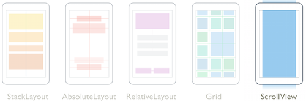
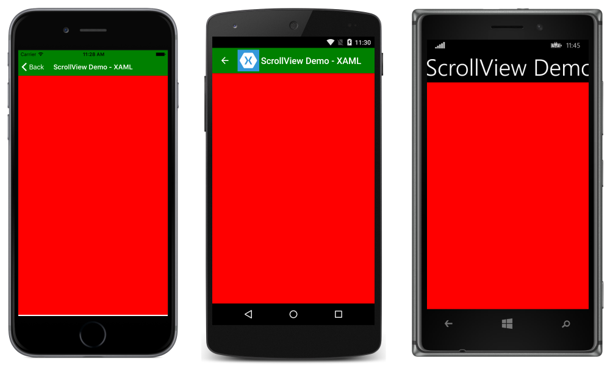
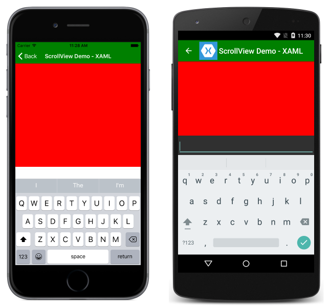

# Xamarin.Forms ScrollView

[ Download the sample](https://developer.xamarin.com/samples/xamarin-forms/UserInterface/Layout/)

[`ScrollView`](xref:Xamarin.Forms.ScrollView) contains layouts and enables them to scroll offscreen. `ScrollView` is also used to allow views to automatically move to the visible portion of the screen when the keyboard is showing.

[](scroll-view-images/layouts.png#lightbox "Xamarin.Forms Layouts")

This article covers:

- **[Purpose](#purpose)** &ndash; the purpose for `ScrollView` and when it is used.
- **[Usage](#usage)** &ndash; how to use `ScrollView` in practice.
- **[Properties](#properties)** &ndash; public properties that can be read and modified.
- **[Methods](#methods)** &ndash; public methods that can be called to scroll the view.
- **[Events](#events)** &ndash; events that can be used to listen to changes in the view's states.

## Purpose

`ScrollView` can be used to ensure that larger views display well on smaller phones. For example, a layout that works on an iPhone 6s may be clipped on an iPhone 4s. Using a `ScrollView` would allow the clipped portions of the layout to be displayed on the smaller screen.

## Usage

> [!NOTE]
> `ScrollView`s should not be nested. In addition, `ScrollView`s should not be nested with other controls that provide scrolling, like `ListView` and `WebView`.

`ScrollView` exposes a `Content` property which can be set to a single view or layout. Consider this example of a layout with a very large boxView, followed by an `Entry`:

```xaml
<ContentPage.Content>
    <ScrollView>
        <StackLayout>
            <BoxView BackgroundColor="Red" HeightRequest="600" WidthRequest="150" />
            <Entry />
        </StackLayout>
    </ScrollView>
</ContentPage.Content>
```

In C#:

```csharp
var scroll = new ScrollView();
Content = scroll;
var stack = new StackLayout();
stack.Children.Add(new BoxView { BackgroundColor = Color.Red,    HeightRequest = 600, WidthRequest = 600 });
stack.Children.Add(new Entry());
```

Before the user scrolls down, only the `BoxView` is visible:



Notice that when the user starts to enter text in the `Entry`, the view scrolls to keep it visible on screen:



## Properties

`ScrollView` defines the following properties:

- [`ContentSize`](xref:Xamarin.Forms.ScrollView.ContentSizeProperty) gets a [`Size`](xref:Xamarin.Forms.Size) value that represents the size of the content.
- [`Orientation`](xref:Xamarin.Forms.ScrollView.OrientationProperty) gets or sets a [`ScrollOrientation`](xref:Xamarin.Forms.ScrollOrientation) enumeration value that represents the scrolling direction of the `ScrollView`.
- [`ScrollX`](xref:Xamarin.Forms.ScrollView.ScrollXProperty) gets a `double` that represents the current X scroll position.
- [`ScrollY`](xref:Xamarin.Forms.ScrollView.ScrollYProperty) gets a `double` that represents the current Y scroll position.
- [`HorizontalScrollBarVisibility`](xref:Xamarin.Forms.ScrollView.HorizontalScrollBarVisibilityProperty) gets or sets a [`ScrollBarVisibility`](xref:Xamarin.Forms.ScrollBarVisibility) value that represents when the horizontal scroll bar is visible.
- [`VerticalScrollBarVisibility`](xref:Xamarin.Forms.ScrollView.VerticalScrollBarVisibilityProperty) gets or sets a [`ScrollBarVisibility`](xref:Xamarin.Forms.ScrollBarVisibility) value that represents when the vertical scroll bar is visible.

## Methods

`ScrollView` provides a `ScrollToAsync` method, which can be used to scroll the view either using coordinates or by specifying a particular view that should be made visible.

When using coordinates, specify the `x` and `y` coordinates, along with a boolean indicating whether the scrolling should be animated:

```csharp
scroll.ScrollToAsync(0, 150, true); //scrolls so that the position at 150px from the top is visible

scroll.ScrollToAsync(label, ScrollToPosition.Start, true); //scrolls so that the label is at the start of the list
```

When scrolling to a particular element, the `ScrollToPosition` enumeration specifes where in the view the element will appear:

- **Center** &ndash; scrolls the element to the center of the visible portion of the view.
- **End** &ndash; scrolls the element to the end of the visible portion of the view.
- **MakeVisible** &ndash; scrolls the element so that it is visible within the view.
- **Start** &ndash; scrolls the element to the start of the visible portion of the view.

The `IsAnimated` property specifies how the view will be scrolled. When set to true, a smooth animation will be used, rather than instantly moving the content into view.

## Events

`ScrollView` defines just one event, `Scrolled`. `Scrolled` is raised when the view has finished scrolling. The event handler for `Scrolled` takes `ScrolledEventArgs`, which has the `ScrollX` and `ScrollY` properties. The following demonstrates how to update a label with the current scroll position of a `ScrollView`:

```csharp
Label label = new Label { Text = "Position: " };
ScrollView scroll = new ScrollView();
scroll.Scrolled += (object sender, ScrolledEventArgs e) => {
    label.Text = "Position: " + e.ScrollX + " x " + e.ScrollY;
};
```

Note that scroll positions may be negative, due to the bounce effect when scrolling at the end of a list.


## Related Links

- [Layout (sample)](https://developer.xamarin.com/samples/xamarin-forms/UserInterface/Layout/)
- [BusinessTumble Example (sample)](https://developer.xamarin.com/samples/xamarin-forms/UserInterface/BusinessTumble/)
