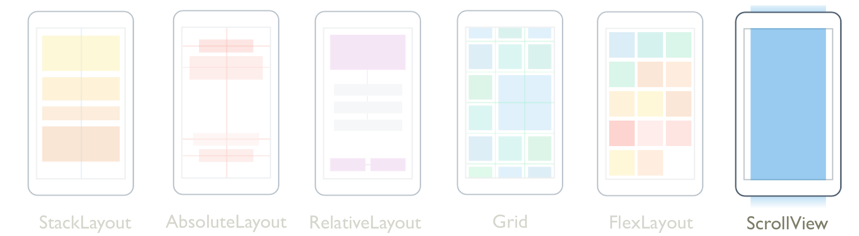
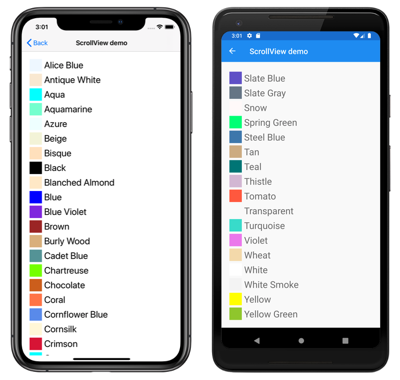
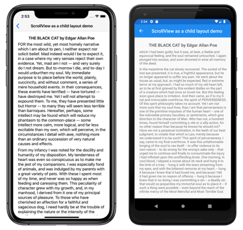

# Xamarin.Forms ScrollView

[ Download the sample](/samples/xamarin/xamarin-forms-samples/userinterface-scrollviewdemos)

[](scrollview-images/layouts-large.png#lightbox "Xamarin.Forms ScrollView")

[`ScrollView`](xref:Xamarin.Forms.ScrollView) is a layout that's capable of scrolling its content. The `ScrollView` class derives from the [`Layout`](xref:Xamarin.Forms.Layout) class, and by default scrolls its content vertically. A `ScrollView` can only have a single child, although this can be other layouts.

> [!WARNING]
> [`ScrollView`](xref:Xamarin.Forms.ScrollView) objects should not be nested. In addition, `ScrollView` objects should not be nested with other controls that provide scrolling, such as [`CollectionView`](xref:Xamarin.Forms.CollectionView), [`ListView`](xref:Xamarin.Forms.ListView), and [`WebView`](xref:Xamarin.Forms.WebView).

[`ScrollView`](xref:Xamarin.Forms.ScrollView) defines the following properties:

- [`Content`](xref:Xamarin.Forms.ScrollView.Content), of type [`View`](xref:Xamarin.Forms.View), represents the content to display in the [`ScrollView`](xref:Xamarin.Forms.ScrollView).
- [`ContentSize`](xref:Xamarin.Forms.ScrollView), of type [`Size`](xref:Xamarin.Forms.Size), represents the size of the content. This is a read-only property.
- [`HorizontalScrollBarVisibility`](xref:Xamarin.Forms.ScrollView), of type [`ScrollBarVisibility`](xref:Xamarin.Forms.ScrollView.HorizontalScrollBarVisibility), represents when the horizontal scroll bar is visible.
- [`Orientation`](xref:Xamarin.Forms.ScrollView.Orientation), of type [`ScrollOrientation`](xref:Xamarin.Forms.ScrollOrientation), represents the scrolling direction of the [`ScrollView`](xref:Xamarin.Forms.ScrollView). The default value of this property is `Vertical`.
- [`ScrollX`](xref:Xamarin.Forms.ScrollView.ScrollX), of type `double`, indicates the current X scroll position. The default value of this read-only property is 0.
- [`ScrollY`](xref:Xamarin.Forms.ScrollView.ScrollY), of type `double`, indicates the current Y scroll position. The default value of this read-only property is 0.
- [`VerticalScrollBarVisibility`](xref:Xamarin.Forms.ScrollView),  of type [`ScrollBarVisibility`](xref:Xamarin.Forms.ScrollView.HorizontalScrollBarVisibility), represents when the vertical scroll bar is visible.

These properties are backed by [`BindableProperty`](xref:Xamarin.Forms.BindableProperty) objects, with the exception of the [`Content`](xref:Xamarin.Forms.ScrollView.Content) property, which means that they can be targets of data bindings and styled.

The [`Content`](xref:Xamarin.Forms.ScrollView.Content) property is the [`ContentProperty`](xref:Xamarin.Forms.ContentPropertyAttribute) of the [`ScrollView`](xref:Xamarin.Forms.ScrollView) class, and therefore does not need to be explicitly set from XAML.

> [!TIP]
> To obtain the best possible layout performance, follow the guidelines at [Optimize layout performance](~/xamarin-forms/deploy-test/performance.md#optimize-layout-performance).

## ScrollView as a root layout

A [`ScrollView`](xref:Xamarin.Forms.ScrollView) can only have a single child, which can be other layouts. It's therefore common for a `ScrollView` to be the root layout on a page. To scroll its child content, [`ScrollView`](xref:Xamarin.Forms.ScrollView) computes the difference between the height of its content and its own height. That difference is the amount that the `ScrollView` can scroll its content.

A [`StackLayout`](xref:Xamarin.Forms.StackLayout) will often be the child of a `ScrollView`. In this scenario, the `ScrollView` causes the `StackLayout` to be as tall as the sum of the heights of its children. Then the `ScrollView` can determine the amount that its content can be scrolled. For more information about the `StackLayout`, see [Xamarin.Forms StackLayout](stacklayout.md).

> [!CAUTION]
> In a vertical [`ScrollView`](xref:Xamarin.Forms.ScrollView), avoid setting the `VerticalOptions` property to `Start`, `Center`, or `End`. Doing so tells the `ScrollView` to be only as tall as it needs to be, which could be zero. While Xamarin.Forms protects against this eventuality, it's best to avoid code that suggests something you don't want to happen.

The following XAML example has a [`ScrollView`](xref:Xamarin.Forms.ScrollView) as a root layout on a page:

```xaml
<ContentPage xmlns="http://xamarin.com/schemas/2014/forms"
             xmlns:x="http://schemas.microsoft.com/winfx/2009/xaml"
             xmlns:local="clr-namespace:ScrollViewDemos"
             x:Class="ScrollViewDemos.Views.ColorListPage"
             Title="ScrollView demo">
    <ScrollView>
        <StackLayout BindableLayout.ItemsSource="{x:Static local:NamedColor.All}">
            <BindableLayout.ItemTemplate>
                <DataTemplate>
                    <StackLayout Orientation="Horizontal">
                        <BoxView Color="{Binding Color}"
                                 HeightRequest="32"
                                 WidthRequest="32"
                                 VerticalOptions="Center" />
                        <Label Text="{Binding FriendlyName}"
                               FontSize="24"
                               VerticalOptions="Center" />
                    </StackLayout>
                </DataTemplate>
            </BindableLayout.ItemTemplate>
        </StackLayout>
    </ScrollView>
</ContentPage>
```

In this example, the [`ScrollView`](xref:Xamarin.Forms.ScrollView) has its content set to a [`StackLayout`](xref:Xamarin.Forms.StackLayout) that uses a bindable layout to display the [`Color`](xref:Xamarin.Forms.Color) fields defined by Xamarin.Forms. By default, a `ScrollView` scrolls vertically, which reveals more content:

[](scrollview-images/root-layout-large.png#lightbox "Root ScrollView layout")

The equivalent C# code is:

```csharp
public class ColorListPageCode : ContentPage
{
    public ColorListPageCode()
    {
        DataTemplate dataTemplate = new DataTemplate(() =>
        {
            BoxView boxView = new BoxView
            {
                HeightRequest = 32,
                WidthRequest = 32,
                VerticalOptions = LayoutOptions.Center
            };
            boxView.SetBinding(BoxView.ColorProperty, "Color");

            Label label = new Label
            {
                FontSize = 24,
                VerticalOptions = LayoutOptions.Center
            };
            label.SetBinding(Label.TextProperty, "FriendlyName");

            StackLayout horizontalStackLayout = new StackLayout
            {
                Orientation = StackOrientation.Horizontal,
                Children = { boxView, label }
            };
            return horizontalStackLayout;
        });

        StackLayout stackLayout = new StackLayout();
        BindableLayout.SetItemsSource(stackLayout, NamedColor.All);
        BindableLayout.SetItemTemplate(stackLayout, dataTemplate);

        ScrollView scrollView = new ScrollView { Content = stackLayout };

        Title = "ScrollView demo";
        Content = scrollView;
    }
}
```

For more information about bindable layouts, see [Bindable Layouts in Xamarin.Forms](bindable-layouts.md).

## ScrollView as a child layout

A [`ScrollView`](xref:Xamarin.Forms.ScrollView) can be a child layout to a different parent layout.

A [`ScrollView`](xref:Xamarin.Forms.ScrollView) will often be the child of a [`StackLayout`](xref:Xamarin.Forms.StackLayout). A `ScrollView` requires a specific height to compute the difference between the height of its content and its own height, with the difference being the amount that the `ScrollView` can scroll its content. When a `ScrollView` is the child of a `StackLayout`, it doesn't receive a specific height. The `StackLayout` wants the `ScrollView` to be as short as possible, which is either the height of the `ScrollView` contents or zero. To handle this scenario, the `VerticalOptions` property of the `ScrollView` should be set to `FillAndExpand`. This will cause the `StackLayout` to give the `ScrollView` all the extra space not required by the other children, and the `ScrollView` will then have a specific height.

The following XAML example has a [`ScrollView`](xref:Xamarin.Forms.ScrollView) as a child layout to a [`StackLayout`](xref:Xamarin.Forms.StackLayout):

```xaml
<ContentPage xmlns="http://xamarin.com/schemas/2014/forms"
             xmlns:x="http://schemas.microsoft.com/winfx/2009/xaml"
             x:Class="ScrollViewDemos.Views.BlackCatPage"
             Title="ScrollView as a child layout demo">
    <StackLayout Margin="20">
        <Label Text="THE BLACK CAT by Edgar Allan Poe"
               FontSize="Medium"
               FontAttributes="Bold"
               HorizontalOptions="Center" />
        <ScrollView VerticalOptions="FillAndExpand">
            <StackLayout>
                <Label Text="FOR the most wild, yet most homely narrative which I am about to pen, I neither expect nor solicit belief. Mad indeed would I be to expect it, in a case where my very senses reject their own evidence. Yet, mad am I not -- and very surely do I not dream. But to-morrow I die, and to-day I would unburthen my soul. My immediate purpose is to place before the world, plainly, succinctly, and without comment, a series of mere household events. In their consequences, these events have terrified -- have tortured -- have destroyed me. Yet I will not attempt to expound them. To me, they have presented little but Horror -- to many they will seem less terrible than barroques. Hereafter, perhaps, some intellect may be found which will reduce my phantasm to the common-place -- some intellect more calm, more logical, and far less excitable than my own, which will perceive, in the circumstances I detail with awe, nothing more than an ordinary succession of very natural causes and effects." />
                <!-- More Label objects go here -->
            </StackLayout>
        </ScrollView>
    </StackLayout>
</ContentPage>
```

In this example, there are two [`StackLayout`](xref:Xamarin.Forms.StackLayout) objects. The first `StackLayout` is the root layout object, which has a [`Label`](xref:Xamarin.Forms.Label) object and a [`ScrollView`](xref:Xamarin.Forms.ScrollView) as its children. The `ScrollView` has a `StackLayout` as its content, with the `StackLayout` containing multiple `Label` objects. This arrangement ensures that the first `Label` is always on-screen, while text displayed by the other `Label` objects can be scrolled:

[](scrollview-images/child-layout-large.png#lightbox "Child ScrollView layout")

The equivalent C# code is:

```csharp
public class BlackCatPageCS : ContentPage
{
    public BlackCatPageCS()
    {
        Label titleLabel = new Label
        {
            Text = "THE BLACK CAT by Edgar Allan Poe",
            // More properties set here to define the Label appearance
        };

        ScrollView scrollView = new ScrollView
        {
            VerticalOptions = LayoutOptions.FillAndExpand,
            Content = new StackLayout
            {
                Children =
                {
                    new Label
                    {
                        Text = "FOR the most wild, yet most homely narrative which I am about to pen, I neither expect nor solicit belief. Mad indeed would I be to expect it, in a case where my very senses reject their own evidence. Yet, mad am I not -- and very surely do I not dream. But to-morrow I die, and to-day I would unburthen my soul. My immediate purpose is to place before the world, plainly, succinctly, and without comment, a series of mere household events. In their consequences, these events have terrified -- have tortured -- have destroyed me. Yet I will not attempt to expound them. To me, they have presented little but Horror -- to many they will seem less terrible than barroques. Hereafter, perhaps, some intellect may be found which will reduce my phantasm to the common-place -- some intellect more calm, more logical, and far less excitable than my own, which will perceive, in the circumstances I detail with awe, nothing more than an ordinary succession of very natural causes and effects.",
                    },
                    // More Label objects go here
                }
            }
        };

        Title = "ScrollView as a child layout demo";
        Content = new StackLayout
        {
            Margin = new Thickness(20),
            Children = { titleLabel, scrollView }
        };
    }
}
```

## Orientation

[`ScrollView`](xref:Xamarin.Forms.ScrollView) has an [`Orientation`](xref:Xamarin.Forms.ScrollView.Orientation) property, which represents the scrolling direction of the `ScrollView`. This property is of type [`ScrollOrientation`](xref:Xamarin.Forms.ScrollOrientation), which defines the following members:

- `Vertical` indicates that the `ScrollView` will scroll vertically. This member is the default value of the [`Orientation`](xref:Xamarin.Forms.ScrollView.Orientation) property.
- `Horizontal` indicates that the `ScrollView` will scroll horizontally.
- `Both` indicates that the `ScrollView` will scroll horizontally and vertically.
- `Neither` indicates that the `ScrollView` won't scroll.

> [!TIP]
> Scrolling can be disabled by setting the [`Orientation`](xref:Xamarin.Forms.ScrollView.OrientationProperty) property to `Neither`.

## Detect scrolling

[`ScrollView`](xref:Xamarin.Forms.ScrollView) defines a [`Scrolled`](xref:Xamarin.Forms.ScrollView.Scrolled) event that is fired to indicate that scrolling occurred. The [`ScrolledEventArgs`](xref:Xamarin.Forms.ScrolledEventArgs) object that accompanies the `Scrolled` event has `ScrollX` and `ScrollY` properties, both of type `double`.

> [!IMPORTANT]
> The `ScrolledEventArgs.ScrollX` and `ScrolledEventArgs.ScrollY` properties can have negative values, due to the bounce effect that occurs when scrolling back to the start of a [`ScrollView`](xref:Xamarin.Forms.ScrollView).

The following XAML example shows a [`ScrollView`](xref:Xamarin.Forms.ScrollView) that sets an event handler for the [`Scrolled`](xref:Xamarin.Forms.ScrollView.Scrolled) event:

```xaml
<ScrollView Scrolled="OnScrollViewScrolled">
		...
</ScrollView>
```

The equivalent C# code is:

```csharp
ScrollView scrollView = new ScrollView();
scrollView.Scrolled += OnScrollViewScrolled;
```

In this example, the `OnScrollViewScrolled` event handler is executed when the [`Scrolled`](xref:Xamarin.Forms.ScrollView.Scrolled) event fires:

```csharp
void OnScrollViewScrolled(object sender, ScrolledEventArgs e)
{
    Console.WriteLine($"ScrollX: {e.ScrollX}, ScrollY: {e.ScrollY}");
}
```

In this example, the `OnScrollViewScrolled` event handler outputs the values of the [`ScrolledEventArgs`](xref:Xamarin.Forms.ScrolledEventArgs) object that accompanies the event.

> [!NOTE]
> The [`Scrolled`](xref:Xamarin.Forms.ScrollView.Scrolled) event is fired for user initiated scrolls, and for programmatic scrolls.

## Scroll programmatically

[`ScrollView`](xref:Xamarin.Forms.ScrollView) defines two [`ScrollToAsync`](xref:Xamarin.Forms.ScrollView.ScrollToAsync*) methods, that asynchronously scroll the `ScrollView`. One of the overloads scrolls to a specified position in the `ScrollView`, while the other scrolls a specified element into view. Both overloads have an additional argument that can be used to indicate whether to animate the scroll.

> [!IMPORTANT]
> The [`ScrollToAsync`](xref:Xamarin.Forms.ScrollView.ScrollToAsync*) methods will not result in scrolling when the [`ScrollView.Orientation`](xref:Xamarin.Forms.ScrollView.OrientationProperty) property is set to `Neither`.

### Scroll a position into view

A position within a [`ScrollView`](xref:Xamarin.Forms.ScrollView) can be scrolled to with the [`ScrollToAsync`](xref:Xamarin.Forms.ScrollView.ScrollToAsync*) method that accepts `double` `x` and `y` arguments. Given a vertical `ScrollView` object named `scrollView`, the following example shows how to scroll to 150 device-independent units from the top of the `ScrollView`:

```csharp
await scrollView.ScrollToAsync(0, 150, true);
```

The third argument to the [`ScrollToAsync`](xref:Xamarin.Forms.ScrollView.ScrollToAsync*) is the `animated` argument, which determines whether a scrolling animation is displayed when programmatically scrolling a [`ScrollView`](xref:Xamarin.Forms.ScrollView).

### Scroll an element into view

An element within a [`ScrollView`](xref:Xamarin.Forms.ScrollView) can be scrolled into view with the [`ScrollToAsync`](xref:Xamarin.Forms.ScrollView.ScrollToAsync*) method that accepts [`Element`](xref:Xamarin.Forms.Element) and [`ScrollToPosition`](xref:Xamarin.Forms.ScrollToPosition) arguments. Given a vertical `ScrollView` named `scrollView`, and a [`Label`](xref:Xamarin.Forms.Label) named `label`, the following example shows how to scroll an element into view:

```csharp
await scrollView.ScrollToAsync(label, ScrollToPosition.End, true);
```

The third argument to the [`ScrollToAsync`](xref:Xamarin.Forms.ScrollView.ScrollToAsync*) is the `animated` argument, which determines whether a scrolling animation is displayed when programmatically scrolling a [`ScrollView`](xref:Xamarin.Forms.ScrollView).

When scrolling an element into view, the exact position of the element after the scroll has completed can be set with the second argument, `position`, of the [`ScrollToAsync`](xref:Xamarin.Forms.ScrollView.ScrollToAsync*) method. This argument accepts a [`ScrollToPosition`](xref:Xamarin.Forms.ScrollToPosition) enumeration member:

- `MakeVisible` indicates that the element should be scrolled until it's visible in the `ScrollView`.
- `Start` indicates that the element should be scrolled to the start of the `ScrollView`.
- `Center` indicates that the element should be scrolled to the center of the `ScrollView`.
- `End` indicates that the element should be scrolled to the end of the `ScrollView`.

## Scroll bar visibility

[`ScrollView`](xref:Xamarin.Forms.ScrollView) defines [`HorizontalScrollBarVisibility`](xref:Xamarin.Forms.ScrollView) and [`VerticalScrollBarVisibility`](xref:Xamarin.Forms.ScrollView) properties, which are backed by bindable properties. These properties get or set a [`ScrollBarVisibility`](xref:Xamarin.Forms.ScrollView.HorizontalScrollBarVisibility) enumeration value that represents whether the horizontal, or vertical, scroll bar is visible. The `ScrollBarVisibility` enumeration defines the following members:

- `Default` indicates the default scroll bar behavior for the platform, and is the default value of the `HorizontalScrollBarVisibility` and `VerticalScrollBarVisibility` properties.
- `Always` indicates that scroll bars will be visible, even when the content fits in the view.
- `Never` indicates that scroll bars will not be visible, even if the content doesn't fit in the view.

## Related links

- [ScrollView demos (sample)](/samples/xamarin/xamarin-forms-samples/userinterface-scrollviewdemos)
- [Xamarin.Forms StackLayout](stacklayout.md)
- [Bindable Layouts in Xamarin.Forms](bindable-layouts.md)