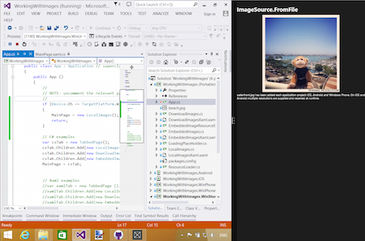

# Layout for Tablet and Desktop apps

Xamarin.Forms supports all device types available on the supported platforms,
so in addition to phones, apps can also run on:

- iPads,
- Android tablets,
- Windows tablets and desktop computers (running Windows 10).

This page briefly discusses:

- the supported [device types](#device-types), and
- how to [optimize](#optimize-for-tablet-and-desktop) layouts for tablets versus phones.

## Device Types

Larger screen devices are available for all of the platforms
supported by Xamarin.Forms.

### iPads (iOS)

The Xamarin.Forms template automatically includes iPad support by configuring
the **Info.plist > Devices** setting to **Universal** (which means both iPhone
and iPad are supported).

To provide a pleasant startup experience, and ensure the full screen resolution
is used on all devices, you should make sure an
[iPad-specific launch screen](~/ios/app-fundamentals/images-icons/launch-screens.md)
(using a storyboard) is provided. This ensures the app is rendered correctly
on iPad mini, iPad, and iPad Pro devices.

Prior to iOS 9 all apps took up the full screen on the device, but some
iPads can now perform [split screen multitasking](~/ios/platform/multitasking.md).
This means your app could take up just a slim column on the side of the screen,
50% of the width of the screen, or the entire screen.

[](tablet-images/ipad.png#lightbox "iPad Split Screen Example")

Split-screen functionality means you should design your app to work well
with as little as 320 pixels wide, or as much as 1366 pixels wide.

### Android Tablets

The Android ecosystem has a myriad of supported screen sizes, from small phones
up to large tablets. Xamarin.Forms can support all screen sizes, but as with
the other platforms you might want to adjust your user interface for
larger devices.

When supporting many different screen resolutions, you can provide your
native image resources in different sizes to optimize the user experience.
Review the [Android resources](~/android/app-fundamentals/resources-in-android/index.md)
documentation (and in particular
[creating resources for varying screen sizes](~/android/app-fundamentals/resources-in-android/resources-for-varying-screens.md))
for more information on how to structure the folders and filenames in your
Android app project to include optimized image resources in your app.

### Windows Tablets and Desktops

To support tablets and desktop computers running Windows, you'll need to use [Windows UWP support](~/xamarin-forms/platform/windows/installation/index.md), which builds universal apps that run on Windows 10.

Apps running on Windows tablets and desktops can be resized to arbitrary
dimensions in addition to running full-screen.

[](tablet-images/splitscreen.png#lightbox "Windows Split Screen Example")

## Optimize for Tablet and Desktop

You can adjust your Xamarin.Forms user interface depending on whether
a phone or tablet/desktop device is being used. This means you can optimize
the user-experience for large-screen devices such as tablets and desktop
computers.

### Device.Idiom

You can use the [`Device`](~/xamarin-forms/platform/device.md)
class to change the behavior of your app or user interface. Using the `Device.Idiom`
enumeration you can

```csharp
if (Device.Idiom == TargetIdiom.Phone)
{
    HeroImage.Source = ImageSource.FromFile("hero.jpg");
} else {
    HeroImage.Source = ImageSource.FromFile("herotablet.jpg");
}
```

This approach can be expanded to make significant changes to individual
page layouts, or even to render entirely different pages on larger screens.

### Leverage FlyoutPage

The [`FlyoutPage`](xref:Xamarin.Forms.FlyoutPage)
is ideal for larger screens, especially on the iPad
where it uses the [`UISplitViewController`](xref:UIKit.UISplitViewController)
to provide a native iOS experience.

Review [this Xamarin blog post](https://devblogs.microsoft.com/xamarin/bringing-xamarin-forms-apps-to-tablets/)
to see how you can adapt your user interface so that phones use one
layout and larger screens can use another (with the `FlyoutPage`).

## Related Links

- [Xamarin Blog](https://devblogs.microsoft.com/xamarin/bringing-xamarin-forms-apps-to-tablets/)
- [MyShoppe sample](https://github.com/jamesmontemagno/myshoppe)
