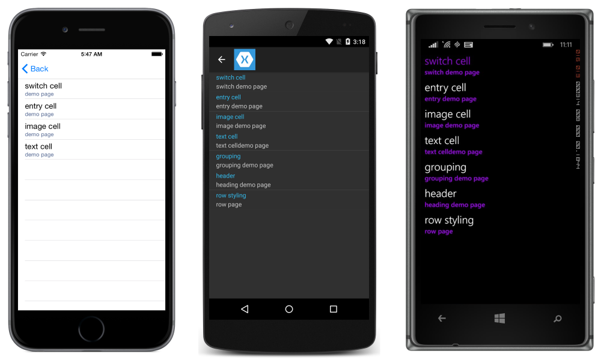
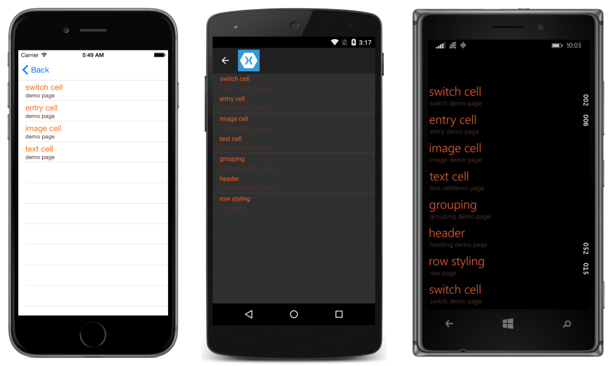
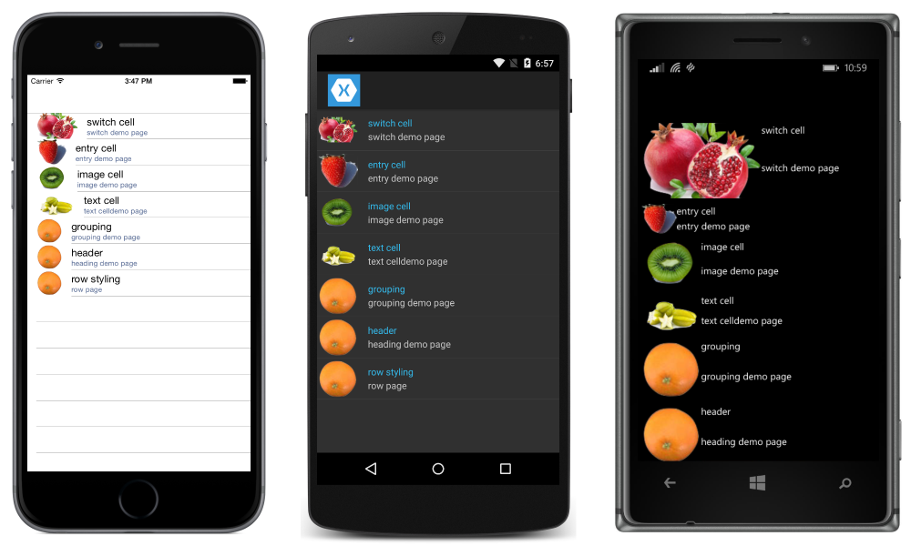
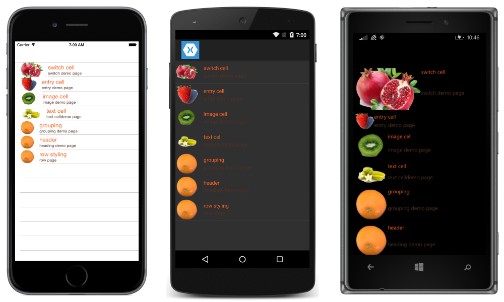
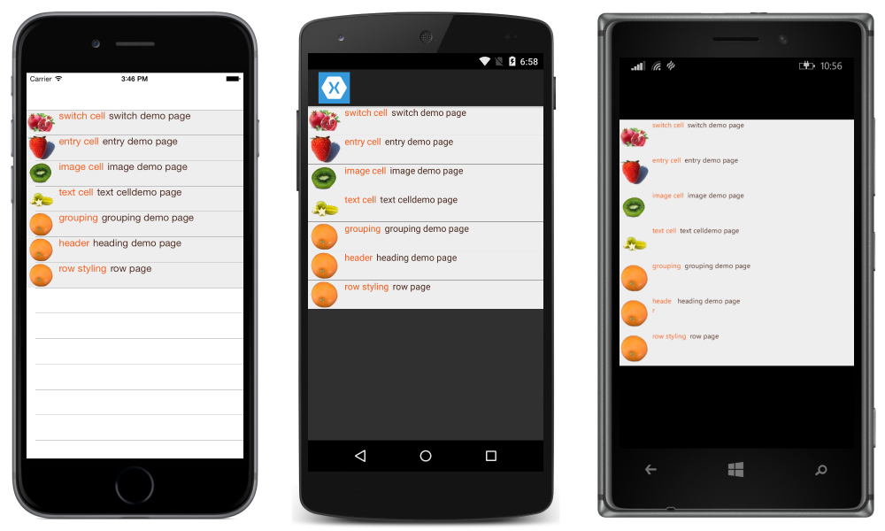

# Customizing ListView Cell Appearance

[ Download the sample](/samples/xamarin/xamarin-forms-samples/userinterface-listview-customcells)

The Xamarin.Forms [`ListView`](xref:Xamarin.Forms.ListView) class is used to present scrollable lists, which can be customized through the use of `ViewCell` elements. A `ViewCell` element can display text and images, indicate a true/false state, and receive user input.

## Built in Cells
Xamarin.Forms comes with built-in cells that work for many applications:

- [`TextCell`](#textcell) controls are used for displaying text with an optional second line for detail text.
- [`ImageCell`](#imagecell) controls are similar to `TextCell`s but include an image to the left of the text.
- `SwitchCell` controls are used to present and capture on/off or true/false states.
- `EntryCell` controls are used to present text data that the user can edit.

The [`SwitchCell`](~/xamarin-forms/user-interface/tableview.md#switchcell) and [`EntryCell`](~/xamarin-forms/user-interface/tableview.md#entrycell) controls are more commonly used in the context of a [`TableView`](~/xamarin-forms/user-interface/tableview.md).

### TextCell

[`TextCell`](xref:Xamarin.Forms.TextCell) is a cell for displaying text, optionally with a second line as detail text. The following screenshot shows `TextCell` items on iOS and Android:



TextCells are rendered as native controls at runtime, so performance is very good compared to a custom `ViewCell`. TextCells are customizable, allowing you to set the following properties:

- `Text` &ndash; the text that is shown on the first line, in large font.
- `Detail` &ndash; the text that is shown underneath the first line, in a smaller font.
- `TextColor` &ndash; the color of the text.
- `DetailColor` &ndash; the color of the detail text

The following screenshot shows `TextCell` items with customized color properties:



### ImageCell

[`ImageCell`](xref:Xamarin.Forms.ImageCell), like `TextCell`, can be used for displaying text and secondary detail text, and it offers great performance by using each platform's native controls. `ImageCell` differs from `TextCell` in that it displays an image to the left of the text.

The following screenshot shows `ImageCell` items on iOS and Android:


`ImageCell` is useful when you need to display a list of data with a visual aspect, such as a list of contacts or movies. `ImageCell`s are customizable, allowing you to set:

- `Text` &ndash; the text that is shown on the first line, in large font
- `Detail` &ndash; the text that is shown underneath the first line, in a smaller font
- `TextColor` &ndash; the color of the text
- `DetailColor` &ndash; the color of the detail text
- `ImageSource` &ndash; the image to display next to the text

The following screenshot shows `ImageCell` items with customized color properties:


## Custom Cells
Custom cells allow you to create cell layouts that aren't supported by the built-in cells. For example, you may want to present a cell with two labels that have equal weight. A `TextCell` would be insufficient because the `TextCell` has one label that is smaller. Most cell customizations add additional read-only data (such as additional labels, images or other display information).

All custom cells must derive from [`ViewCell`](xref:Xamarin.Forms.ViewCell), the same base class that all of the built-in cell types use.

Xamarin.Forms offers a [caching behavior](~/xamarin-forms/user-interface/listview/performance.md#caching-strategy) on the `ListView` control which can improve scrolling performance for some types of custom cells.

The following screenshot shows an example of a custom cell:



### XAML
The custom cell shown in the previous screenshot can be created with the following XAML:

```xaml
<?xml version="1.0" encoding="UTF-8"?>
<ContentPage xmlns="http://xamarin.com/schemas/2014/forms"
xmlns:x="http://schemas.microsoft.com/winfx/2009/xaml"
x:Class="demoListView.ImageCellPage">
    <ContentPage.Content>
        <ListView  x:Name="listView">
            <ListView.ItemTemplate>
                <DataTemplate>
                    <ViewCell>
                        <StackLayout BackgroundColor="#eee"
                        Orientation="Vertical">
                            <StackLayout Orientation="Horizontal">
                                <Image Source="{Binding image}" />
                                <Label Text="{Binding title}"
                                TextColor="#f35e20" />
                                <Label Text="{Binding subtitle}"
                                HorizontalOptions="EndAndExpand"
                                TextColor="#503026" />
                            </StackLayout>
                        </StackLayout>
                    </ViewCell>
                </DataTemplate>
            </ListView.ItemTemplate>
        </ListView>
    </ContentPage.Content>
</ContentPage>
```

The XAML works as follows:

- The custom cell is nested inside a `DataTemplate`, which is inside `ListView.ItemTemplate`. This is the same process as using any built-in cell.
- `ViewCell` is the type of the custom cell. The child of the `DataTemplate` element must be of, or derive from, the `ViewCell` class.
- Inside the `ViewCell`, layout can be managed by any Xamarin.Forms layout. In this example, layout is managed by a `StackLayout`, which allows the background color to be customized.

> [!NOTE]
> Any property of `StackLayout` that is bindable can be bound inside a custom cell. However, this capability is not shown in the XAML example.

### Code

A custom cell can also be created in code. First, a custom class that derives from `ViewCell` must be created:

```csharp
public class CustomCell : ViewCell
    {
        public CustomCell()
        {
            //instantiate each of our views
            var image = new Image ();
            StackLayout cellWrapper = new StackLayout ();
            StackLayout horizontalLayout = new StackLayout ();
            Label left = new Label ();
            Label right = new Label ();

            //set bindings
            left.SetBinding (Label.TextProperty, "title");
            right.SetBinding (Label.TextProperty, "subtitle");
            image.SetBinding (Image.SourceProperty, "image");

            //Set properties for desired design
            cellWrapper.BackgroundColor = Color.FromHex ("#eee");
            horizontalLayout.Orientation = StackOrientation.Horizontal;
            right.HorizontalOptions = LayoutOptions.EndAndExpand;
            left.TextColor = Color.FromHex ("#f35e20");
            right.TextColor = Color.FromHex ("503026");

            //add views to the view hierarchy
            horizontalLayout.Children.Add (image);
            horizontalLayout.Children.Add (left);
            horizontalLayout.Children.Add (right);
            cellWrapper.Children.Add (horizontalLayout);
            View = cellWrapper;
        }
    }
```

In the page constructor, the ListView's `ItemTemplate` property is set to a `DataTemplate` with the `CustomCell` type specified:

```csharp
public partial class ImageCellPage : ContentPage
    {
        public ImageCellPage ()
        {
            InitializeComponent ();
            listView.ItemTemplate = new DataTemplate (typeof(CustomCell));
        }
    }
```

### Binding Context Changes

When binding to a custom cell type's [`BindableProperty`](xref:Xamarin.Forms.BindableProperty) instances, the UI controls displaying the `BindableProperty` values should use the [`OnBindingContextChanged`](xref:Xamarin.Forms.Cell.OnBindingContextChanged) override to set the data to be displayed in each cell, rather than the cell constructor, as demonstrated in the following code example:

```csharp
public class CustomCell : ViewCell
{
    Label nameLabel, ageLabel, locationLabel;

    public static readonly BindableProperty NameProperty =
        BindableProperty.Create ("Name", typeof(string), typeof(CustomCell), "Name");
    public static readonly BindableProperty AgeProperty =
        BindableProperty.Create ("Age", typeof(int), typeof(CustomCell), 0);
    public static readonly BindableProperty LocationProperty =
        BindableProperty.Create ("Location", typeof(string), typeof(CustomCell), "Location");

    public string Name
    {
        get { return(string)GetValue (NameProperty); }
        set { SetValue (NameProperty, value); }
    }

    public int Age
    {
        get { return(int)GetValue (AgeProperty); }
        set { SetValue (AgeProperty, value); }
    }

    public string Location
    {
        get { return(string)GetValue (LocationProperty); }
        set { SetValue (LocationProperty, value); }
    }
    ...

    protected override void OnBindingContextChanged ()
    {
        base.OnBindingContextChanged ();

        if (BindingContext != null)
        {
            nameLabel.Text = Name;
            ageLabel.Text = Age.ToString ();
            locationLabel.Text = Location;
        }
    }
}
```

The [`OnBindingContextChanged`](xref:Xamarin.Forms.Cell.OnBindingContextChanged) override will be called when the [`BindingContextChanged`](xref:Xamarin.Forms.BindableObject.BindingContextChanged) event fires, in response to the value of the [`BindingContext`](xref:Xamarin.Forms.BindableObject.BindingContext) property changing. Therefore, when the `BindingContext` changes, the UI controls displaying the [`BindableProperty`](xref:Xamarin.Forms.BindableProperty) values should set their data. Note that the `BindingContext` should be checked for a `null` value, as this can be set by Xamarin.Forms for garbage collection, which in turn will result in the `OnBindingContextChanged` override being called.

Alternatively, UI controls can bind to the [`BindableProperty`](xref:Xamarin.Forms.BindableProperty) instances to display their values, which removes the need to override the `OnBindingContextChanged` method.

> [!NOTE]
> When overriding `OnBindingContextChanged`, ensure that the base class's `OnBindingContextChanged` method is called so that registered delegates receive the `BindingContextChanged` event.

In XAML, binding the custom cell type to data can be achieved as shown in the following code example:

```xaml
<ListView x:Name="listView">
    <ListView.ItemTemplate>
        <DataTemplate>
            <local:CustomCell Name="{Binding Name}" Age="{Binding Age}" Location="{Binding Location}" />
        </DataTemplate>
    </ListView.ItemTemplate>
</ListView>
```

This binds the `Name`, `Age`, and `Location` bindable properties in the `CustomCell` instance, to the `Name`, `Age`, and `Location` properties of each object in the underlying collection.

The equivalent binding in C# is shown in the following code example:

```csharp
var customCell = new DataTemplate (typeof(CustomCell));
customCell.SetBinding (CustomCell.NameProperty, "Name");
customCell.SetBinding (CustomCell.AgeProperty, "Age");
customCell.SetBinding (CustomCell.LocationProperty, "Location");

var listView = new ListView
{
    ItemsSource = people,
    ItemTemplate = customCell
};
```

On iOS and Android, if the [`ListView`](xref:Xamarin.Forms.ListView) is recycling elements and the custom cell uses a custom renderer, the custom renderer must correctly implement property change notification. When cells are reused their property values will change when the binding context is updated to that of an available cell, with `PropertyChanged` events being raised. For more information, see [Customizing a ViewCell](~/xamarin-forms/app-fundamentals/custom-renderer/viewcell.md). For more information about cell recycling, see [Caching Strategy](~/xamarin-forms/user-interface/listview/performance.md#caching-strategy).

## Related Links

- [Built in Cells (sample)](/samples/xamarin/xamarin-forms-samples/userinterface-listview-builtincells)
- [Custom Cells (sample)](/samples/xamarin/xamarin-forms-samples/userinterface-listview-customcells)
- [Binding Context Changed (sample)](/samples/xamarin/xamarin-forms-samples/userinterface-listview-bindingcontextchanged)