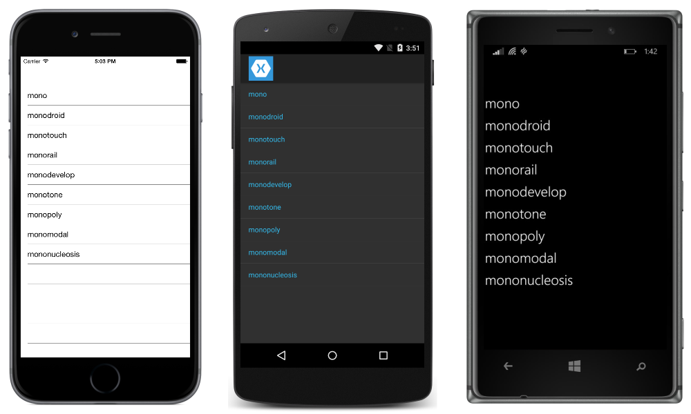
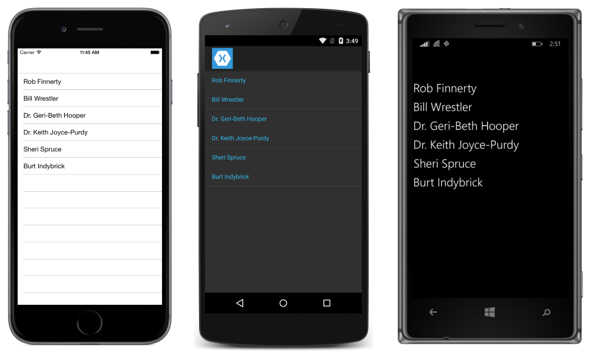

# ListView Data Sources

[ Download the sample](/samples/xamarin/xamarin-forms-samples/userinterface-listview-switchentrytwobinding)

A Xamarin.Forms [`ListView`](xref:Xamarin.Forms.ListView) is used for displaying lists of data. This article explains how to populate a `ListView` with data and how to bind data to the selected item.

## ItemsSource

A [`ListView`](xref:Xamarin.Forms.ListView) is populated with data using the [`ItemsSource`](xref:Xamarin.Forms.ItemsView`1.ItemsSource) property, which can accept any collection implementing `IEnumerable`. The simplest way to populate a `ListView` involves using an array of strings:

```xaml
<ListView>
      <ListView.ItemsSource>
          <x:Array Type="{x:Type x:String}">
            <x:String>mono</x:String>
            <x:String>monodroid</x:String>
            <x:String>monotouch</x:String>
            <x:String>monorail</x:String>
            <x:String>monodevelop</x:String>
            <x:String>monotone</x:String>
            <x:String>monopoly</x:String>
            <x:String>monomodal</x:String>
            <x:String>mononucleosis</x:String>
          </x:Array>
      </ListView.ItemsSource>
</ListView>
```

The equivalent C# code is:

```csharp
var listView = new ListView();
listView.ItemsSource = new string[]
{
  "mono",
  "monodroid",
  "monotouch",
  "monorail",
  "monodevelop",
  "monotone",
  "monopoly",
  "monomodal",
  "mononucleosis"
};
```



This approach will populate the `ListView` with a list of strings. By default, `ListView` will call `ToString` and display the result in a `TextCell` for each row. To customize how data is displayed, see [Cell Appearance](~/xamarin-forms/user-interface/listview/customizing-cell-appearance.md).

Because `ItemsSource` has been sent to an array, the content will not update as the underlying list or array changes. If you want the ListView to automatically update as items are added, removed and changed in the underlying list, you'll need to use an `ObservableCollection`. [`ObservableCollection`](xref:System.Collections.ObjectModel.ObservableCollection`1) is defined in `System.Collections.ObjectModel` and is just like `List`, except that it can notify `ListView` of any changes:

```csharp
ObservableCollection<Employee> employees = new ObservableCollection<Employee>();
listView.ItemsSource = employees;

//Mr. Mono will be added to the ListView because it uses an ObservableCollection
employees.Add(new Employee(){ DisplayName="Mr. Mono"});
```

## Data Binding

Data binding is the "glue" that binds the properties of a user interface object to the properties of some CLR object, such as a class in your viewmodel. Data binding is useful because it simplifies the development of user interfaces by replacing a lot of boring boilerplate code.

Data binding works by keeping objects in sync as their bound values change. Instead of having to write event handlers for every time a control's value changes, you establish the binding and enable binding in your viewmodel.

For more information on data binding, see [Data Binding Basics](~/xamarin-forms/xaml/xaml-basics/data-binding-basics.md) which is part four of the [Xamarin.Forms XAML Basics article series](~/xamarin-forms/xaml/xaml-basics/index.md).

### Binding Cells

Properties of cells (and children of cells) can be bound to properties of objects in the `ItemsSource`. For example, a `ListView` could be used to present a list of employees.

The employee class:

```csharp
public class Employee
{
    public string DisplayName {get; set;}
}
```

An `ObservableCollection<Employee>` is created, set as the `ListView` `ItemsSource`, and the list is populated with data:

```csharp
ObservableCollection<Employee> employees = new ObservableCollection<Employee>();
public ObservableCollection<Employee> Employees { get { return employees; }}

public EmployeeListPage()
{
    EmployeeView.ItemsSource = employees;

    // ObservableCollection allows items to be added after ItemsSource
    // is set and the UI will react to changes
    employees.Add(new Employee{ DisplayName="Rob Finnerty"});
    employees.Add(new Employee{ DisplayName="Bill Wrestler"});
    employees.Add(new Employee{ DisplayName="Dr. Geri-Beth Hooper"});
    employees.Add(new Employee{ DisplayName="Dr. Keith Joyce-Purdy"});
    employees.Add(new Employee{ DisplayName="Sheri Spruce"});
    employees.Add(new Employee{ DisplayName="Burt Indybrick"});
}
```

> [!WARNING]
> While a `ListView` will update in response to changes in its underlying `ObservableCollection`, a `ListView` will not update if a different `ObservableCollection` instance is assigned to the original `ObservableCollection` reference (e.g. `employees = otherObservableCollection;`).

The following snippet demonstrates a `ListView` bound to a list of employees:

```xaml
<?xml version="1.0" encoding="utf-8" ?>
<ContentPage xmlns="http://xamarin.com/schemas/2014/forms"
             xmlns:x="http://schemas.microsoft.com/winfx/2006/xaml"
             xmlns:constants="clr-namespace:XamarinFormsSample;assembly=XamarinFormsXamlSample"
             x:Class="XamarinFormsXamlSample.Views.EmployeeListPage"
             Title="Employee List">
  <ListView x:Name="EmployeeView"
            ItemsSource="{Binding Employees}">
    <ListView.ItemTemplate>
      <DataTemplate>
        <TextCell Text="{Binding DisplayName}" />
      </DataTemplate>
    </ListView.ItemTemplate>
  </ListView>
</ContentPage>
```

This XAML example defines a `ContentPage` that contains a `ListView`. The data source of the `ListView` is set via the `ItemsSource` attribute. The layout of each row in the `ItemsSource` is defined within the `ListView.ItemTemplate` element. This results in the following screenshots:



> [!WARNING]
> `ObservableCollection` is not thread safe. Modifying an `ObservableCollection` causes UI updates to happen on the same thread that performed the modifications. If the thread is not the primary UI thread, it will cause an exception.

### Binding SelectedItem

Often you'll want to bind to the selected item of a `ListView`, rather than use an event handler to respond to changes. To do this in XAML, bind the `SelectedItem` property:

```xaml
<ListView x:Name="listView"
          SelectedItem="{Binding Source={x:Reference SomeLabel},
          Path=Text}">
 …
</ListView>
```

Assuming `listView`'s `ItemsSource` is a list of strings, `SomeLabel` will have its `Text` property bound to the `SelectedItem`.

## Related Links

- [Two Way Binding (sample)](/samples/xamarin/xamarin-forms-samples/userinterface-listview-switchentrytwobinding)