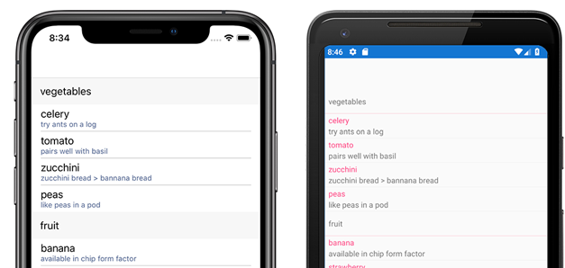
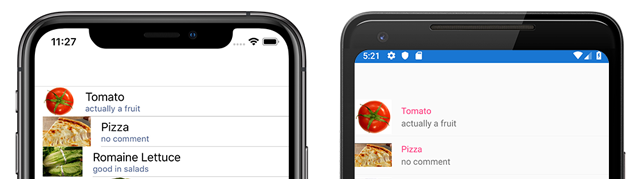
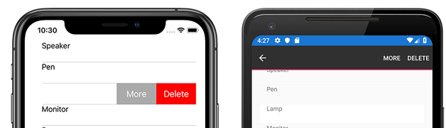

# Xamarin.Forms ListView

[ Download the sample](/samples/xamarin/xamarin-forms-samples/workingwithlistview)

[`ListView`](xref:Xamarin.Forms.ListView) is a view for presenting lists of data, especially long lists that require scrolling.

> [!IMPORTANT]
> [`CollectionView`](xref:Xamarin.Forms.CollectionView) is a view for presenting lists of data using different layout specifications. It aims to provide a more flexible, and performant alternative to [`ListView`](xref:Xamarin.Forms.ListView). For more information, see [Xamarin.Forms CollectionView](~/xamarin-forms/user-interface/collectionview/index.md).

## Use cases

A `ListView` control can be used in any situation where you're displaying scrollable lists of data. The `ListView` class supports context actions and data binding.

The `ListView` control shouldn't be confused with the [`TableView`](~/xamarin-forms/user-interface/tableview.md) control. The `TableView` control is a better option whenever you have a non-bound list of options or data because it allows predefined options to be specified in XAML. For example, the iOS settings app, which has a mostly predefined set of options, is better suited to use a `TableView` than a `ListView`.

The `ListView` class doesn't support defining list items in XAML, you must use the `ItemsSource` property or data binding with an `ItemTemplate` to define items in the list.

A `ListView` is best suited for a collections consisting of a single data type. This requirement is because only one type of cell can be used for each row in the list. The `TableView` control can support multiple cell types, so it is a better option when you need to display multiple data types.

For more information about binding data to a `ListView` instance, see [ListView data sources](~/xamarin-forms/user-interface/listview/data-and-databinding.md).

## Components

The `ListView` control has a number of components available to exercise the native functionality of each platform. These components are defined in the following sections.

### [Headers and footers](customizing-list-appearance.md#headers-and-footers)

Header and footer components display at the beginning and end of a list, separate from list's data. Headers and footers can be bound to a separate data source from the ListView's data source.

### [Groups](customizing-list-appearance.md#grouping)

Data in a `ListView` can be grouped for easier navigation. Groups are typically data bound. The following screenshot shows a `ListView` with grouped data:

### [Cells](customizing-cell-appearance.md)

Data items in a `ListView` are called cells. Each cell corresponds to a row of data. There are built-in cells to choose from, or you can define your own custom cell. Both built-in and custom cells can be used/defined in XAML or code.

- [Built-in cells](customizing-cell-appearance.md#built-in-cells), such as the `TextCell` and `ImageCell`, correspond to native controls and are especially performant.
  - A [`TextCell`](customizing-cell-appearance.md#textcell) displays a string of text, optionally with detail text. Detail text is rendered as a second line in a smaller font with an accent color.
  - An [`ImageCell`](customizing-cell-appearance.md#imagecell) displays an image with text. Appears as a `TextCell` with an image on the left.
- [Custom cells](customizing-cell-appearance.md#custom-cells) are used to present complex data. For example, a custom cell could be used to present a list of songs that includes the album and artist.

The following screenshot shows a `ListView` with ImageCell items:

To learn more about customizing cells in a `ListView`, see [Customizing ListView Cell Appearance](customizing-cell-appearance.md).

## Functionality

The `ListView` class supports a number of interaction styles.

- [Pull-to-refresh](interactivity.md#pull-to-refresh) allows the user to pull the `ListView` down to refresh the contents.
- [Context actions](interactivity.md#context-actions) allow the developer to specify custom actions on individual list items. For example, you can implement swipe-to-action on iOS, or long-tap actions on Android.
- [Selection](interactivity.md#selection-and-taps) allow the developer to attach functionality to selection and deselection events on list items.

The following screenshot shows a `ListView` with context actions:

To learn more about the interactivity features of `ListView`, see [Actions & Interactivity with ListView](interactivity.md).

## Related links

- [Working With ListView (sample)](/samples/xamarin/xamarin-forms-samples/workingwithlistview)
- [Two Way Binding (sample)](/samples/xamarin/xamarin-forms-samples/userinterface-listview-switchentrytwobinding)
- [Built In Cells (sample)](/samples/xamarin/xamarin-forms-samples/userinterface-listview-builtincells)
- [Custom Cells (sample)](/samples/xamarin/xamarin-forms-samples/userinterface-listview-customcells)
- [Grouping (sample)](/samples/xamarin/xamarin-forms-samples/userinterface-listview-grouping)
- [Custom Renderer View (sample)](/samples/xamarin/xamarin-forms-samples/workingwithlistviewnative/)
- [ListView Interactivity (sample)](/samples/xamarin/xamarin-forms-samples/userinterface-listview-interactivity)