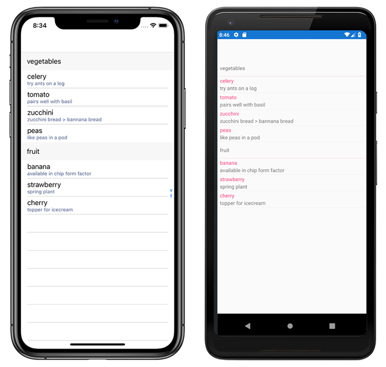

# Xamarin.Forms ListView

[ Download the sample](https://developer.xamarin.com/samples/WorkingWithListview)

[`ListView`](xref:Xamarin.Forms.ListView) is a view for presenting lists of data, especially long lists that require scrolling.

## Use Cases

Make sure ListView is the right control for your needs. ListView can be used in any situation where you are displaying scrollable lists of data. ListViews support context actions and data binding.

ListView should not be confused with [TableView](~/xamarin-forms/user-interface/tableview.md). The TableView control is a better option whenever you have a non-bound list of options or data. For example, the iOS settings app, which has a mostly predefined set of options, is better suited to use TableView than ListView.

Also note that a ListView is best suited for homogeneous data &ndash; that is, all data should be of the same type. This is because only one type of cell can be used for each row in the list. TableViews can support multiple cell types, so they are a better option when you need to mix views.

## Components
ListView has a number of components available to exercise the native functionality of each platform. Each of these components is described below:

- **[Headers and Footers](customizing-list-appearance.md#Headers_and_Footers)** &ndash; Text or view to display at the beginning and end of a list, separate from list's data. Headers and footers can be bound to a data source independently from the ListView's data source.
- **[Groups](customizing-list-appearance.md#Grouping)** &ndash; Data in a ListView can be grouped for easier navigation. Groups are typically data bound:

- **[Cells](customizing-cell-appearance.md)** &ndash; Data in a ListView is presented in cells. Each cell corresponds to a row of data. There are built-in cells to choose from, or you can define your own custom cell. Both built-in and custom cells can be used/defined in XAML or code.
  - **[Built-in](customizing-cell-appearance.md#Built_in_Cells)** &ndash; Built in cells, especially TextCell and ImageCell, can be great for performance, since they correspond to native controls on each platform.
       - **[TextCell](customizing-cell-appearance.md#TextCell)** &ndash; Displays a string of text, optionally with detail text. Detail text is rendered as a second line in a smaller font with an accent color.
       - **[ImageCell](customizing-cell-appearance.md#ImageCell)** &ndash; Displays an image with text. Appears as a TextCell with an image on the left.
  - **[Custom Cells](customizing-cell-appearance.md#customcells)** &ndash; Custom cells are great when you need to present complex data. For example, a custom view could be used to present a list of songs, including album and artist:

To learn more about customizing cells in a ListView, see [Customizing ListView Cell Appearance](customizing-cell-appearance.md).

## Functionality
ListView supports a number of interaction styles, including:

- **[Pull-to-Refresh](interactivity.md#Pull_to_Refresh)** &ndash; ListView supports pull-to-refresh on each platform.
- **[Context Actions](interactivity.md#Context_Actions)** &ndash; ListView supports taking action on individual items in a list. For example, you can implement swipe-to-action on iOS, or long-tap actions on Android.
- **[Selection](interactivity.md#selectiontaps)** &ndash; You can listen for selections and deselections to take action when a row is tapped.

To learn more about the interactivity features of ListView, see [Actions & Interactivity with ListView](interactivity.md).

## Related Links

- [Working With ListView (sample)](https://developer.xamarin.com/samples/WorkingWithListview)
- [Two Way Binding (sample)](https://developer.xamarin.com/samples/xamarin-forms/UserInterface/ListView/SwitchEntryTwoBinding)
- [Built In Cells (sample)](https://developer.xamarin.com/samples/xamarin-forms/UserInterface/ListView/BuiltInCells)
- [Custom Cells (sample)](https://developer.xamarin.com/samples/xamarin-forms/UserInterface/ListView/CustomCells)
- [Grouping (sample)](https://developer.xamarin.com/samples/xamarin-forms/UserInterface/ListView/Grouping)
- [Custom Renderer View (sample)](https://developer.xamarin.com/samples/xamarin-forms/UserInterface/ListView/WorkingWithListviewNative)
- [ListView Interactivity (sample)](https://developer.xamarin.com/samples/xamarin-forms/UserInterface/ListView/interactivity)
