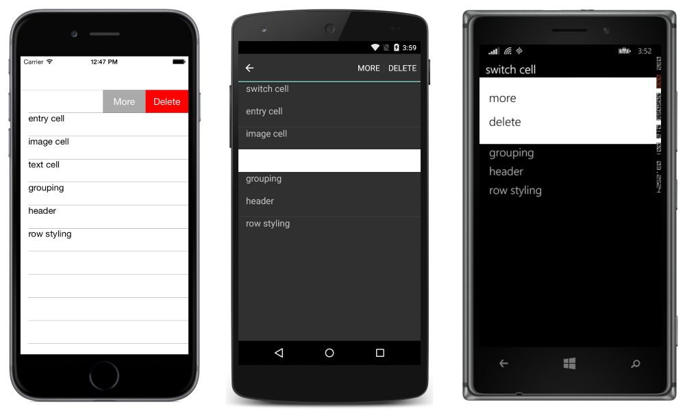
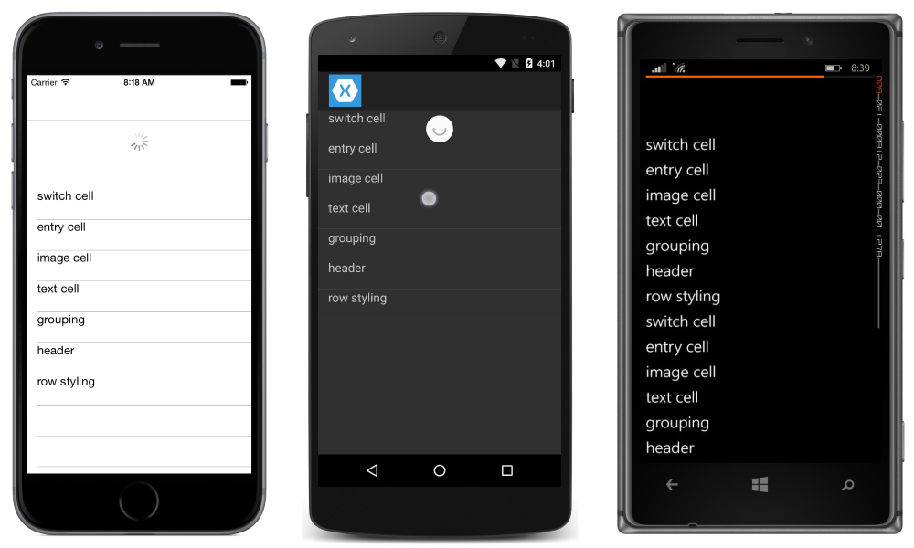
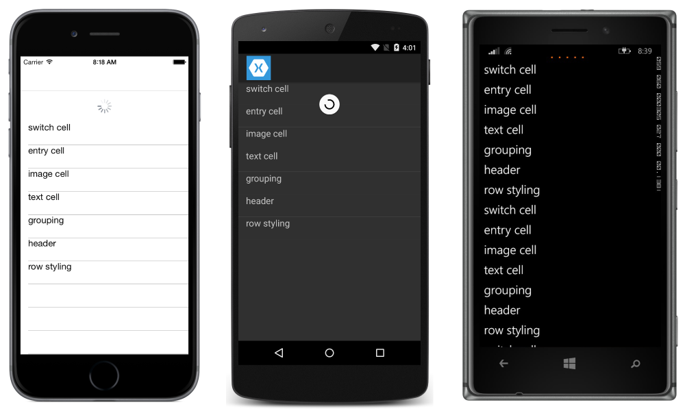

# ListView Interactivity

[ Download the sample](https://developer.xamarin.com/samples/xamarin-forms/UserInterface/ListView/interactivity)

[`ListView`](xref:Xamarin.Forms.ListView) supports interacting with the data it presents.

<a name="selectiontaps" />

## Selection & Taps

The [`ListView`](xref:Xamarin.Forms.ListView) selection mode is controlled by setting the [`ListView.SelectionMode`](xref:Xamarin.Forms.ListView.SelectionMode) property to a value of the [`ListViewSelectionMode`](xref:Xamarin.Forms.ListViewSelectionMode) enumeration:

- [`Single`](xref:Xamarin.Forms.ListViewSelectionMode.Single) indicates that a single item can be selected, with the selected item being highlighted. This is the default value.
- [`None`](xref:Xamarin.Forms.ListViewSelectionMode.None) indicates that items cannot be selected.

When a user taps an item, two events are fired:

- [`ItemSelected`](xref:Xamarin.Forms.ListView.ItemSelected) fires when a new item is selected.
- [`ItemTapped`](xref:Xamarin.Forms.ListView.ItemTapped) fires when an item is tapped.

> [!NOTE]
> Tapping the same item twice will fire two [`ItemTapped`](xref:Xamarin.Forms.ListView.ItemTapped) events, but will only fire a single [`ItemSelected`](xref:Xamarin.Forms.ListView.ItemSelected) event.

When the [`SelectionMode`](xref:Xamarin.Forms.ListView.SelectionMode) property is set to [`Single`](xref:Xamarin.Forms.ListViewSelectionMode.Single), items in the [`ListView`](xref:Xamarin.Forms.ListView) can be selected, the [`ItemSelected`](xref:Xamarin.Forms.ListView.ItemSelected) and [`ItemTapped`](xref:Xamarin.Forms.ListView.ItemTapped) events will be fired, and the [`SelectedItem`](xref:Xamarin.Forms.ListView.SelectedItem) property will be set to the value of the selected item.

When the [`SelectionMode`](xref:Xamarin.Forms.ListView.SelectionMode) property is set to [`None`](xref:Xamarin.Forms.ListViewSelectionMode.None), items in the [`ListView`](xref:Xamarin.Forms.ListView) cannot be selected, the [`ItemSelected`](xref:Xamarin.Forms.ListView.ItemSelected) event will not be fired, and the [`SelectedItem`](xref:Xamarin.Forms.ListView.SelectedItem) property will remain `null`. However, [`ItemTapped`](xref:Xamarin.Forms.ListView.ItemTapped) events will still be fired and the tapped item will be briefly highlighted during the tap.

When an item has been selected and the [`SelectionMode`](xref:Xamarin.Forms.ListView.SelectionMode) property is changed from [`Single`](xref:Xamarin.Forms.ListViewSelectionMode.Single) to [`None`](xref:Xamarin.Forms.ListViewSelectionMode.None), the [`SelectedItem`](xref:Xamarin.Forms.ListView.SelectedItem) property will be set to `null` and the [`ItemSelected`](xref:Xamarin.Forms.ListView.ItemSelected) event will be fired with a `null` item.

The following screenshots show a [`ListView`](xref:Xamarin.Forms.ListView) with the default selection mode:


### Disabling Selection

To disable [`ListView`](xref:Xamarin.Forms.ListView) selection set the [`SelectionMode`](xref:Xamarin.Forms.ListView.SelectionMode) property to [`None`](xref:Xamarin.Forms.ListViewSelectionMode.None):

```xaml
<ListView ... SelectionMode="None" />
```

```csharp
var listView = new ListView { ... SelectionMode = ListViewSelectionMode.None };
```

<a name="Context_Actions" />

## Context Actions

Often, users will want to take action on an item in a `ListView`. For example, consider a list of emails in the Mail app. On iOS, you can swipe to delete a message::



Context actions can be implemented in C# and XAML. Below you'll find specific guides for both, but first let's take a look at some key implementation details for both.

Context Actions are created using `MenuItem`s. Tap events for MenuItems are raised by the MenuItem itself, not the ListView. This is different from how tap events are handled for cells, where the ListView raises the event rather than the cell. Because the ListView is raising the event, its event handler is given key information, like which item was selected or tapped.

By default, a MenuItem has no way of knowing which cell it belongs to. `CommandParameter` is available on `MenuItem` to store objects, such as the object behind the MenuItem's ViewCell. `CommandParameter` can be set in both XAML and C#.

### C#  

Context actions can be implemented in any `Cell` subclass (as long as it isn't being used as a group header) by creating `MenuItem`s and adding them to the `ContextActions` collection for the cell. You have the following properties can be configured for the context action:

* **Text** &ndash; the string that appears in the menu item.
* **Clicked** &ndash; the event when the item is clicked.
* **IsDestructive** &ndash; (optional) when true the item is
    rendered differently on iOS.

Multiple context actions can be added to a cell, however only one should have `IsDestructive` set to `true`. The following code demonstrates how context actions would be added to a `ViewCell`:

```csharp
var moreAction = new MenuItem { Text = "More" };
moreAction.SetBinding (MenuItem.CommandParameterProperty, new Binding ("."));
moreAction.Clicked += async (sender, e) => {
    var mi = ((MenuItem)sender);
    Debug.WriteLine("More Context Action clicked: " + mi.CommandParameter);
};

var deleteAction = new MenuItem { Text = "Delete", IsDestructive = true }; // red background
deleteAction.SetBinding (MenuItem.CommandParameterProperty, new Binding ("."));
deleteAction.Clicked += async (sender, e) => {
    var mi = ((MenuItem)sender);
    Debug.WriteLine("Delete Context Action clicked: " + mi.CommandParameter);
};
// add to the ViewCell's ContextActions property
ContextActions.Add (moreAction);
ContextActions.Add (deleteAction);
```

### XAML

`MenuItem`s can also be created in a XAML collection declaratively. The XAML below demonstrates a custom cell
    with two context actions implemented:

```xaml
<ListView x:Name="ContextDemoList">
  <ListView.ItemTemplate>
    <DataTemplate>
      <ViewCell>
         <ViewCell.ContextActions>
            <MenuItem Clicked="OnMore" CommandParameter="{Binding .}"
               Text="More" />
            <MenuItem Clicked="OnDelete" CommandParameter="{Binding .}"
               Text="Delete" IsDestructive="True" />
         </ViewCell.ContextActions>
         <StackLayout Padding="15,0">
              <Label Text="{Binding title}" />
         </StackLayout>
      </ViewCell>
    </DataTemplate>
  </ListView.ItemTemplate>
</ListView>
```

In the code-behind file, ensure the `Clicked` methods are implemented:

```csharp
public void OnMore (object sender, EventArgs e) {
    var mi = ((MenuItem)sender);
    DisplayAlert("More Context Action", mi.CommandParameter + " more context action", "OK");
}

public void OnDelete (object sender, EventArgs e) {
    var mi = ((MenuItem)sender);
    DisplayAlert("Delete Context Action", mi.CommandParameter + " delete context action", "OK");
}
```

> [!NOTE]
> The `NavigationPageRenderer` for Android has an overridable `UpdateMenuItemIcon` method that can be used to load icons from a custom `Drawable`. This override makes it possible to use SVG images as icons on `MenuItem` instances on Android.

<a name="Pull_to_Refresh" />

## Pull to Refresh

Users have come to expect that pulling down on a list of data will refresh that list. [`ListView`](xref:Xamarin.Forms.ListView) supports this out-of-the-box. To enable pull-to-refresh functionality, set [`IsPullToRefreshEnabled`](xref:Xamarin.Forms.ListView.IsPullToRefreshEnabled) to `true`:

```xaml
<ListView ...
          IsPullToRefreshEnabled="true" />
```

The equivalent C# code is:

```csharp
listView.IsPullToRefreshEnabled = true;
```

A spinner appears during the refresh, which is black by default. However, the spinner color can be changed on iOS and Android by setting the `RefreshControlColor` property to a [`Color`](xref:Xamarin.Forms.Color):

```xaml
<ListView ...
          IsPullToRefreshEnabled="true"
          RefreshControlColor="Red" />
```

The equivalent C# code is:

```csharp
listView.RefreshControlColor = Color.Red;
```

The following screenshots show pull-to-refresh as the user is pulling:



The following screenshots show pull-to-refresh after the user has released the pull, with the spinner being shown while the [`ListView`](xref:Xamarin.Forms.ListView) is updating:



[`ListView`](xref:Xamarin.Forms.ListView) fires the [`Refreshing`](xref:Xamarin.Forms.ListView.Refreshing) event to initiate the refresh, and the [`IsRefreshing`](xref:Xamarin.Forms.ListView.IsRefreshing) property will be set to `true`. Whatever code is required to refresh the contents of the `ListView` should then be executed by the event handler for the `Refreshing` event, or by the method executed by the [`RefreshCommand`](xref:Xamarin.Forms.ListView.RefreshCommand). Once the `ListView` is refreshed, the `IsRefreshing` property should be set to `false`, or the [`EndRefresh`](xref:Xamarin.Forms.ListView.EndRefresh) method should be called, to indicate that the refresh is complete.

> [!NOTE]
> When defining a [`RefreshCommand`](xref:Xamarin.Forms.ListView.RefreshCommand), the `CanExecute` method of the command can be specified to enable or disable the command.

## Related Links

- [ListView Interactivity (sample)](https://developer.xamarin.com/samples/xamarin-forms/UserInterface/ListView/interactivity)
