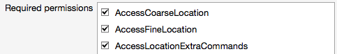

# Xamarin.Forms Map initialization and configuration

[ Download the sample](https://docs.microsoft.com/samples/xamarin/xamarin-forms-samples/workingwithmaps)

_Xamarin.Forms uses the native map APIs on each platform._

Xamarin.Forms.Maps uses the native map APIs on each platform. This provides a
fast, familiar maps experience for users, but means that some configuration
steps are needed to adhere to each platforms API requirements.
Once configured, the `Map` control works just like any other Xamarin.Forms element in common code.

The map control has been used in the [MapsSample](https://docs.microsoft.com/samples/xamarin/xamarin-forms-samples/workingwithmaps) sample, which is shown below.

 [](map-images/maps-zoom.png#lightbox "Map Control Example")

Map functionality can be further enhanced by creating a [map custom renderer](~/xamarin-forms/app-fundamentals/custom-renderer/map/index.md).

<a name="Maps_Initialization" />

## Map initialization

When adding maps to a Xamarin.Forms application, **Xamarin.Forms.Maps** is a
separate NuGet package that you should add to every project in the solution.
On Android, this also has a dependency on GooglePlayServices (another NuGet)
which is downloaded automatically when you add Xamarin.Forms.Maps.

After installing the NuGet package, some initialization code is required in each application project,
*after* the `Xamarin.Forms.Forms.Init` method call. For iOS use the following code:

```csharp
Xamarin.FormsMaps.Init();
```

On Android you must pass the same parameters as `Forms.Init`:

```csharp
Xamarin.FormsMaps.Init(this, bundle);
```

For the Universal Windows Platform (UWP) use the following code:

```csharp
Xamarin.FormsMaps.Init("INSERT_AUTHENTICATION_TOKEN_HERE");
```

Add this call in the following files for each platform:

- **iOS** - AppDelegate.cs file, in the  `FinishedLaunching` method.
- **Android** - MainActivity.cs file, in the  `OnCreate` method.
- **UWP** - MainPage.xaml.cs file, in the `MainPage` constructor.

Once the NuGet package has been added and the initialization method called inside
each application, `Xamarin.Forms.Maps` APIs can be used in the common .NET Standard library project or Shared Project code.

<a name="Platform_Configuration" />

## Platform configuration

Additional configuration steps are required on some platforms before the map will display.

### iOS

To access location services on iOS, you must set the following keys in **Info.plist**:

- iOS 11
  - [`NSLocationWhenInUseUsageDescription`](https://developer.apple.com/library/ios/documentation/General/Reference/InfoPlistKeyReference/Articles/CocoaKeys.html#//apple_ref/doc/uid/TP40009251-SW26) – for using location services when the app is in use
  - [`NSLocationAlwaysAndWhenInUseUsageDescription`](https://developer.apple.com/documentation/corelocation/choosing_the_authorization_level_for_location_services/requesting_always_authorization?language=objc) – for using location services at all times
- iOS 10 and earlier
  - [`NSLocationWhenInUseUsageDescription`](https://developer.apple.com/library/ios/documentation/General/Reference/InfoPlistKeyReference/Articles/CocoaKeys.html#//apple_ref/doc/uid/TP40009251-SW26) – for using location services when the app is in use
  - [`NSLocationAlwaysUsageDescription`](https://developer.apple.com/library/ios/documentation/General/Reference/InfoPlistKeyReference/Articles/CocoaKeys.html#//apple_ref/doc/uid/TP40009251-SW18) – for using location services at all times    

To support iOS 11 and earlier, you can include all three keys: `NSLocationWhenInUseUsageDescription`, `NSLocationAlwaysAndWhenInUseUsageDescription`, and `NSLocationAlwaysUsageDescription`.

The XML representation for these keys in **Info.plist** is shown below. You should update the `string` values to reflect how your application is using the location information:

```xml
<key>NSLocationAlwaysUsageDescription</key>
<string>Can we use your location at all times?</string>
<key>NSLocationWhenInUseUsageDescription</key>
<string>Can we use your location when your app is being used?</string>
<key>NSLocationAlwaysAndWhenInUseUsageDescription</key>
<string>Can we use your location at all times?</string>
```

The **Info.plist** entries can also be added in **Source** view while editing the **Info.plist** file:


### Android

To use the [Google Maps API v2](https://developers.google.com/maps/documentation/android/)
on Android you must generate an API key and add it to your Android project.
Follow the instructions in the Xamarin doc on
[obtaining a Google Maps API v2 key](~/android/platform/maps-and-location/maps/obtaining-a-google-maps-api-key.md).
After following those instructions, paste the API key in the
**Properties/AndroidManifest.xml** file (view source and find/update the following element):

```xml
<application ...>
    <meta-data android:name="com.google.android.maps.v2.API_KEY" android:value="YOUR_API_KEY" />
</application>
```

Without a valid API key the maps control will display as a gray box on Android.

> [!NOTE]
> Note that, in order for your APK to access Google Maps, you must include SHA-1 fingerprints and package names for every keystore (debug and release) that you use to sign your APK. For example, if you use one computer for debug and another computer for generating the release APK, you should include the SHA-1 certificate fingerprint from the debug keystore of the first computer and the SHA-1 certificate fingerprint from the release keystore of the second computer. Also remember to edit the key credentials if the app's **Package Name** changes. See [obtaining a Google Maps API v2 key](~/android/platform/maps-and-location/maps/obtaining-a-google-maps-api-key.md).

You'll also need to enable appropriate permissions by right-clicking on the Android project and selecting **Options > Build > Android Application** and ticking the following:

- `AccessCoarseLocation`
- `AccessFineLocation`
- `AccessLocationExtraCommands`
- `AccessMockLocation`
- `AccessNetworkState`
- `AccessWifiState`
- `Internet`

Some of these are shown in the screenshot below:



The last two are required because applications require a network connection to download map data. Read about Android [permissions](https://developer.android.com/reference/android/Manifest.permission.html) to learn more.

In addition, Android 9 has removed the Apache HTTP client library from the bootclasspath, and so it isn't available to applications that target API 28 or higher. The following line must be added to the `application` node of your **AndroidManifest.xml** file to continue using the Apache HTTP client in applications that target API 28 or higher:

```xml
<application ...>
    ...
    <uses-library android:name="org.apache.http.legacy" android:required="false" />    
</application>
```

### Universal Windows Platform

To use maps on the Universal Windows Platform you must generate an authorization token. For more information, see [Request a maps authentication key](https://msdn.microsoft.com/library/windows/apps/mt219694.aspx) on MSDN.

The authentication token should then be specified in the `FormsMaps.Init("AUTHORIZATION_TOKEN")` method call, to authenticate the app with Bing Maps.

<a name="Using_Maps" />

## Map configuration

See the [MapPage.cs](https://github.com/xamarin/xamarin-forms-samples/blob/master/MobileCRM/MobileCRM.Shared/Pages/MapPage.cs) in the MobileCRM sample for an example of how the map control can be used in code. A simple `MapPage` class might look like this - notice that a new `MapSpan` is created to position the map's view:

```csharp
public class MapPage : ContentPage {
    public MapPage() {
        var map = new Map(
            MapSpan.FromCenterAndRadius(
                    new Position(37,-122), Distance.FromMiles(0.3))) {
                IsShowingUser = true,
                HeightRequest = 100,
                WidthRequest = 960,
                VerticalOptions = LayoutOptions.FillAndExpand
            };
        var stack = new StackLayout { Spacing = 0 };
        stack.Children.Add(map);
        Content = stack;
    }
}
```

### Map type

The map content can also be changed by setting the `MapType` property, to show a regular street map (the default), satellite imagery or a combination of both.

```csharp
map.MapType = MapType.Street;
```

Valid `MapType` values are:

- `Hybrid`
- `Satellite`
- `Street` (the default)

### Map region and MapSpan

As shown in the code snippet above, supplying a `MapSpan` instance to a map constructor sets the initial view (center point and zoom level) of the map when it is loaded. There are two ways to create a new `MapSpan` instance:

- **MapSpan.FromCenterAndRadius()** - static method to create a span from a  `Position` and specifying a  `Distance` .
- **new MapSpan ()** - constructor that uses a  `Position` and the degrees of latitude and longitude to display.

The `MoveToRegion` method on the map class can then be used to change the position or zoom level of the map. To change the zoom level of the map without altering the location, create a new `MapSpan` using the current location from the `VisibleRegion.Center` property of the map control. A `Slider` can be used to control map zoom like this (however zooming directly in the map control cannot currently update the value of the slider):

```csharp
Slider slider = new Slider (1, 18, 1);
slider.ValueChanged += (sender, e) =>
{
    var zoomLevel = e.NewValue; // between 1 and 18
    var latlongdegrees = 360 / (Math.Pow(2, zoomLevel));
    map.MoveToRegion(new MapSpan (map.VisibleRegion.Center, latlongdegrees, latlongdegrees));
};
```

[](map-images/maps-zoom.png#lightbox "Map Control Zoom")

In addition, the [`Map`](xref:Xamarin.Forms.Maps.Map) class has a `MoveToLastRegionOnLayoutChange` property of type `bool`, which is backed by a bindable property. By default this property is `true`, which indicates that the displayed map region will move from its current region to its previously set region when a layout change occurs, such as on device rotation. When this property is set to `false`, the displayed map region will remain centered when a layout change occurs. The following example shows setting this property:

```csharp
map.MoveToLastRegionOnLayoutChange = false;
```

### Map clicks

`Map` defines a `MapClicked` event that's fired when the map is tapped. The `MapClickedEventArgs` object that accompanies the `MapClicked` event has a single property named `Position`, of type `Position`. When the event is fired, the value of the `Position` property is set to the map location that was tapped.

The following code example shows an event handler for the `MapClicked` event:

```csharp
map.MapClicked += OnMapClicked;

void OnMapClicked(object sender, MapClickedEventArgs e)
{
    System.Diagnostics.Debug.WriteLine($"MapClick: {e.Position.Latitude}, {e.Position.Longitude}");
}
```

In this example, the `OnMapClicked` event handler outputs the latitude and longitude that represents the tapped map location.

<a name="Using_Xaml" />

### Create a Map in XAML

Maps can also be created in XAML, as shown in this example:

```xaml
<?xml version="1.0" encoding="UTF-8" ?>
<ContentPage xmlns="http://xamarin.com/schemas/2014/forms"
             xmlns:x="http://schemas.microsoft.com/winfx/2006/xaml"
             xmlns:maps="clr-namespace:Xamarin.Forms.Maps;assembly=Xamarin.Forms.Maps"
             x:Class="MapDemo.MapPage">
    <StackLayout VerticalOptions="StartAndExpand" Padding="30">
        <maps:Map x:Name="MyMap"
                  Clicked="OnMapClicked"
                  WidthRequest="320"
                  HeightRequest="200"                  
                  IsShowingUser="true"
                  MapType="Hybrid" />
    </StackLayout>
</ContentPage>
```

> [!NOTE]
> An additional `xmlns` namespace definition is required to reference the Xamarin.Forms.Maps controls. In the previous example the `Xamarin.Forms.Maps` namespace is referenced through the `maps` keyword.

The `MapRegion` can be set in code using the named reference for the `Map`:

```csharp
MyMap.MoveToRegion(
    MapSpan.FromCenterAndRadius(
        new Position(37,-122), Distance.FromMiles(1)));
```

## Related links

- [Maps Sample](https://docs.microsoft.com/samples/xamarin/xamarin-forms-samples/workingwithmaps)
- [Xamarin.Forms.Maps Pins](~/xamarin-forms/user-interface/map/pins.md).
- [Maps API](xref:Xamarin.Forms.Maps)
- [Map Custom Renderer](~/xamarin-forms/app-fundamentals/custom-renderer/map/index.md)
