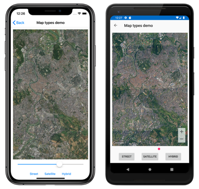
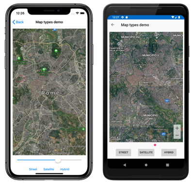
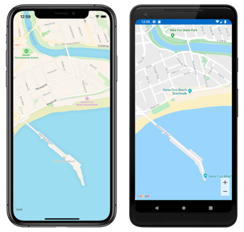

# Xamarin.Forms Map Control

[ Download the sample](/samples/xamarin/xamarin-forms-samples/workingwithmaps)

The [`Map`](xref:Xamarin.Forms.Maps.Map) control is a cross-platform view for displaying and annotating maps. It uses the native map control for each platform, providing a fast and familiar maps experience for users:

[](map-images/map-default-large.png#lightbox "Map control")

The [`Map`](xref:Xamarin.Forms.Maps.Map) class defines the following properties that control map appearance and behavior:

- [`IsShowingUser`](xref:Xamarin.Forms.Maps.Map.IsShowingUser), of type `bool`, indicates whether the map is showing the user's current location.
- [`ItemsSource`](xref:Xamarin.Forms.Maps.Map.ItemsSource), of type `IEnumerable`, which specifies the collection of `IEnumerable` items to be displayed.
- [`ItemTemplate`](xref:Xamarin.Forms.Maps.Map.ItemTemplate), of type [`DataTemplate`](xref:Xamarin.Forms.DataTemplate), which specifies the [`DataTemplate`](xref:Xamarin.Forms.DataTemplate) to apply to each item in the collection of displayed items.
- `ItemTemplateSelector`, of type [`DataTemplateSelector`](xref:Xamarin.Forms.DataTemplateSelector), which specifies the [`DataTemplateSelector`](xref:Xamarin.Forms.DataTemplateSelector) that will be used to choose a [`DataTemplate`](xref:Xamarin.Forms.DataTemplate) for an item at runtime.
- [`HasScrollEnabled`](xref:Xamarin.Forms.Maps.Map.HasScrollEnabled), of type `bool`, determines whether the map is allowed to scroll.
- [`HasZoomEnabled`](xref:Xamarin.Forms.Maps.Map.HasZoomEnabled), of type `bool`, determines whether the map is allowed to zoom.
- `MapElements`, of type `IList<MapElement>`, represents the list of elements on the map, such as polygons and polylines.
- [`MapType`](xref:Xamarin.Forms.Maps.Map.MapType), of type [`MapType`](xref:Xamarin.Forms.Maps.Map.MapType), indicates the display style of the map.
- `MoveToLastRegionOnLayoutChange`, of type `bool`, controls whether the displayed map region will move from its current region to its previously set region when a layout change occurs.
- [`Pins`](xref:Xamarin.Forms.Maps.Map.Pins), of type `IList<Pin>`, represents the list of pins on the map.
- `TrafficEnabled`, of type `bool`, indicates whether traffic data is overlaid on the map.
- [`VisibleRegion`](xref:Xamarin.Forms.Maps.Map.VisibleRegion), of type [`MapSpan`](xref:Xamarin.Forms.Maps.MapSpan), returns the currently displayed region of the map.

These properties, with the exception of the `MapElements`, `Pins`, and `VisibleRegion` properties, are backed by [`BindableProperty`](xref:Xamarin.Forms.BindableProperty) objects, which mean they can be targets of data bindings.

The [`Map`](xref:Xamarin.Forms.Maps.Map) class also defines a `MapClicked` event that's fired when the map is tapped. The `MapClickedEventArgs` object that accompanies the event has a single property named `Position`, of type [`Position`](xref:Xamarin.Forms.Maps.Position). When the event is fired, the `Position` property is set to the map location that was tapped. For information about the [`Position`](xref:Xamarin.Forms.Maps.Position) struct, see [Map Position and Distance](position-distance.md).

For information about the [`ItemsSource`](xref:Xamarin.Forms.Maps.Map.ItemsSource), [`ItemTemplate`](xref:Xamarin.Forms.Maps.Map.ItemTemplate), and `ItemTemplateSelector` properties, see [Display a pin collection](pins.md#display-a-pin-collection).

## Display a map

A [`Map`](xref:Xamarin.Forms.Maps.Map) can be displayed by adding it to a layout or page:

```xaml
<ContentPage ...
             xmlns:maps="clr-namespace:Xamarin.Forms.Maps;assembly=Xamarin.Forms.Maps">
    <maps:Map x:Name="map" />
</ContentPage>
```

> [!NOTE]
> An additional `xmlns` namespace definition is required to reference the Xamarin.Forms.Maps controls. In the previous example the `Xamarin.Forms.Maps` namespace is referenced through the `maps` keyword.

The equivalent C# code is:

```csharp
using Xamarin.Forms;
using Xamarin.Forms.Maps;

namespace WorkingWithMaps
{
    public class MapTypesPageCode : ContentPage
    {
        public MapTypesPageCode()
        {
            Map map = new Map();
            Content = map;
        }
    }
}
```

This example calls the default [`Map`](xref:Xamarin.Forms.Maps.Map) constructor, which centers the map on Rome:

[](map-images/map-default-large.png#lightbox "Map control with default location")

Alternatively, a [`MapSpan`](xref:Xamarin.Forms.Maps.MapSpan) argument can be passed to a [`Map`](xref:Xamarin.Forms.Maps.Map) constructor to set the center point and zoom level of the map when it's loaded. For more information, see [Display a specific location on a map](#display-a-specific-location-on-a-map).

## Map types

The [`Map.MapType`](xref:Xamarin.Forms.Maps.Map.MapType) property can be set to a [`MapType`](xref:Xamarin.Forms.Maps.MapType) enumeration member to define the display style of the map. The `MapType` enumeration defines the following members:

- `Street` specifies that a street map will be displayed.
- `Satellite` specifies that a map containing satellite imagery will be displayed.
- `Hybrid` specifies that a map combining street and satellite data will be displayed.

By default, a [`Map`](xref:Xamarin.Forms.Maps.Map) will display a street map if the [`MapType`](xref:Xamarin.Forms.Maps.Map.MapType) property is undefined. Alternatively, the `MapType` property can be set to one of the [`MapType`](xref:Xamarin.Forms.Maps.MapType) enumeration members:

```xaml
<maps:Map MapType="Satellite" />
```

The equivalent C# code is:

```csharp
Map map = new Map
{
    MapType = MapType.Satellite
};
```

The following screenshots show a [`Map`](xref:Xamarin.Forms.Maps.Map) when the [`MapType`](xref:Xamarin.Forms.Maps.Map.MapType) property is set to `Street`:

[](map-images/maptype-street-large.png#lightbox "Map control with the street map type")

The following screenshots show a [`Map`](xref:Xamarin.Forms.Maps.Map) when the [`MapType`](xref:Xamarin.Forms.Maps.Map.MapType) property is set to `Satellite`:

[](map-images/maptype-satellite-large.png#lightbox "Map control with the satellite map type")

The following screenshots show a [`Map`](xref:Xamarin.Forms.Maps.Map) when the [`MapType`](xref:Xamarin.Forms.Maps.Map.MapType) property is set to `Hybrid`:

[](map-images/maptype-hybrid-large.png#lightbox "Map control with the hybrid map type")

## Display a specific location on a map

The region of a map to display when a map is loaded can be set by passing a [`MapSpan`](xref:Xamarin.Forms.Maps.MapSpan) argument to the [`Map`](xref:Xamarin.Forms.Maps.Map) constructor:

```xaml
<maps:Map>
    <x:Arguments>
        <maps:MapSpan>
            <x:Arguments>
                <maps:Position>
                    <x:Arguments>
                        <x:Double>36.9628066</x:Double>
                        <x:Double>-122.0194722</x:Double>
                    </x:Arguments>
                </maps:Position>
                <x:Double>0.01</x:Double>
                <x:Double>0.01</x:Double>
            </x:Arguments>
        </maps:MapSpan>
    </x:Arguments>
</maps:Map>
```

The equivalent C# code is:

```csharp
Position position = new Position(36.9628066, -122.0194722);
MapSpan mapSpan = new MapSpan(position, 0.01, 0.01);
Map map = new Map(mapSpan);
```

This example creates a [`Map`](xref:Xamarin.Forms.Maps.Map) object that shows the region that is specified by the [`MapSpan`](xref:Xamarin.Forms.Maps.MapSpan) object. The `MapSpan` object is centered on the latitude and longitude represented by a [`Position`](xref:Xamarin.Forms.Maps.Position) object, and spans 0.01 latitude and 0.01 longitude degrees. For information about the [`Position`](xref:Xamarin.Forms.Maps.Position) struct, see [Map Position and Distance](position-distance.md). For information about passing arguments in XAML, see [Passing Arguments in XAML](~/xamarin-forms/xaml/passing-arguments.md).

The result is that when the map is displayed, it's centered on a specific location, and spans a specific number of latitude and longitude degrees:

[](map-images/map-region-large.png#lightbox "Map control with a specified location")

## Create a MapSpan object

There are a number of approaches for creating [`MapSpan`](xref:Xamarin.Forms.Maps.MapSpan) objects. A common approach is supply the required arguments to the `MapSpan` constructor. These are a latitude and longitude represented by a [`Position`](xref:Xamarin.Forms.Maps.Position) object, and `double` values that represent the degrees of latitude and longitude that are spanned by the `MapSpan`. For information about the [`Position`](xref:Xamarin.Forms.Maps.Position) struct, see [Map Position and Distance](position-distance.md).

Alternatively, there are three methods in the [`MapSpan`](xref:Xamarin.Forms.Maps.MapSpan) class that return new `MapSpan` objects:

1. [`ClampLatitude`](xref:Xamarin.Forms.Maps.MapSpan.ClampLatitude*) returns a `MapSpan` with the same `LongitudeDegrees` as the method's class instance, and a radius defined by its `north` and `south` arguments.
1. [`FromCenterAndRadius`](xref:Xamarin.Forms.Maps.MapSpan.FromCenterAndRadius*) returns a `MapSpan` that is defined by its [`Position`](xref:Xamarin.Forms.Maps.Position) and [`Distance`](xref:Xamarin.Forms.Maps.Distance) arguments.
1. [`WithZoom`](xref:Xamarin.Forms.Maps.MapSpan.WithZoom*) returns a `MapSpan` with the same center as the method's class instance, but with a radius multiplied by its `double` argument.

For information about the [`Distance`](xref:Xamarin.Forms.Maps.Distance) struct, see [Map Position and Distance](position-distance.md).

Once a [`MapSpan`](xref:Xamarin.Forms.Maps.MapSpan) has been created, the following properties can be accessed to retrieve data about it:

- [`Center`](xref:Xamarin.Forms.Maps.MapSpan.Center), which represents the [`Position`](xref:Xamarin.Forms.Maps.Position) in the geographical center of the `MapSpan`.
- [`LatitudeDegrees`](xref:Xamarin.Forms.Maps.MapSpan.LatitudeDegrees), which represents the degrees of latitude that are spanned by the `MapSpan`.
- [`LongitudeDegrees`](xref:Xamarin.Forms.Maps.MapSpan.LongitudeDegrees), which represents the degrees of longitude that are spanned by the `MapSpan`.
- [`Radius`](xref:Xamarin.Forms.Maps.MapSpan.Radius), which represents the `MapSpan` radius.

## Move the map

The [`Map.MoveToRegion`](xref:Xamarin.Forms.Maps.Map.MoveToRegion*) method can be called to change the position and zoom level of a map. This method accepts a [`MapSpan`](xref:Xamarin.Forms.Maps.MapSpan) argument that defines the region of the map to display, and its zoom level.

The following code shows an example of moving the displayed region on a map:

```csharp
MapSpan mapSpan = MapSpan.FromCenterAndRadius(position, Distance.FromKilometers(0.444));
map.MoveToRegion(mapSpan);
```

## Zoom the map

The zoom level of a [`Map`](xref:Xamarin.Forms.Maps.Map) can be changed without altering its location. This can be accomplished using the map UI, or programatically by calling the [`MoveToRegion`](xref:Xamarin.Forms.Maps.Map.MoveToRegion*) method with a [`MapSpan`](xref:Xamarin.Forms.Maps.MapSpan) argument that uses the current location as the [`Position`](xref:Xamarin.Forms.Maps.Position) argument:

```csharp
double zoomLevel = 0.5;
double latlongDegrees = 360 / (Math.Pow(2, zoomLevel));
if (map.VisibleRegion != null)
{
    map.MoveToRegion(new MapSpan(map.VisibleRegion.Center, latlongDegrees, latlongDegrees));
}
```

In this example, the [`MoveToRegion`](xref:Xamarin.Forms.Maps.Map.MoveToRegion*) method is called with a [`MapSpan`](xref:Xamarin.Forms.Maps.MapSpan) argument that specifies the current location of the map, via the [`Map.VisibleRegion`](xref:Xamarin.Forms.Maps.Map.VisibleRegion) property, and the zoom level as degrees of latitude and longitude. The overall result is that the zoom level of the map is changed, but its location isn't. An alternative approach for implementing zoom on a map is to use the [`MapSpan.WithZoom`](xref:Xamarin.Forms.Maps.MapSpan.WithZoom*) method to control the zoom factor.

> [!IMPORTANT]
> Zooming a map, whether via the map UI or programatically, requires that the [`Map.HasZoomEnabled`](xref:Xamarin.Forms.Maps.Map.HasZoomEnabled) property is `true`. For more information about this property, see [Disable zoom](#disable-zoom).

## Customize map behavior

The behavior of a [`Map`](xref:Xamarin.Forms.Maps.Map) can be customized by setting some of its properties, and by handling the `MapClicked` event.

> [!NOTE]
> Additional map behavior customization can be achieved by creating a map custom renderer. For more information, see [Customizing a Xamarin.Forms Map](~/xamarin-forms/app-fundamentals/custom-renderer/map-pin.md).

### Show traffic data

The [`Map`](xref:Xamarin.Forms.Maps.Map) class defines a `TrafficEnabled` property of type `bool`. By default this property is `false`, which indicates that traffic data won't be overlaid on the map. When this property is set to `true`, traffic data is overlaid on the map. The following example shows setting this property:

```xaml
<maps:Map TrafficEnabled="true" />
```

The equivalent C# code is:

```csharp
Map map = new Map
{
    TrafficEnabled = true
};
```

### Disable scroll

The [`Map`](xref:Xamarin.Forms.Maps.Map) class defines a [`HasScrollEnabled`](xref:Xamarin.Forms.Maps.Map.HasScrollEnabled) property of type `bool`. By default this property is `true`, which indicates that the map is allowed to scroll. When this property is set to `false`, the map will not scroll. The following example shows setting this property:

```xaml
<maps:Map HasScrollEnabled="false" />
```

The equivalent C# code is:

```csharp
Map map = new Map
{
    HasScrollEnabled = false
};
```

### Disable zoom

The [`Map`](xref:Xamarin.Forms.Maps.Map) class defines a [`HasZoomEnabled`](xref:Xamarin.Forms.Maps.Map.HasZoomEnabled) property of type `bool`. By default this property is `true`, which indicates that zoom can be performed on the map. When this property is set to `false`, the map can't be zoomed. The following example shows setting this property:

```xaml
<maps:Map HasZoomEnabled="false" />
```

The equivalent C# code is:

```csharp
Map map = new Map
{
    HasZoomEnabled = false
};
```

### Show the user's location

The [`Map`](xref:Xamarin.Forms.Maps.Map) class defines a [`IsShowingUser`](xref:Xamarin.Forms.Maps.Map.IsShowingUser) property of type `bool`. By default this property is `false`, which indicates that the map is not showing the user's current location. When this property is set to `true`, the map shows the user's current location. The following example shows setting this property:

```xaml
<maps:Map IsShowingUser="true" />
```

The equivalent C# code is:

```csharp
Map map = new Map
{
    IsShowingUser = true
};
```

> [!IMPORTANT]
> On iOS, Android, and the Universal Windows Platform, accessing the user's location requires location permissions to have been granted to the application. For more information, see [Platform configuration](setup.md#platform-configuration).

### Maintain map region on layout change

The [`Map`](xref:Xamarin.Forms.Maps.Map) class defines a `MoveToLastRegionOnLayoutChange` property of type `bool`. By default this property is `true`, which indicates that the displayed map region will move from its current region to its previously set region when a layout change occurs, such as on device rotation. When this property is set to `false`, the displayed map region will remain centered when a layout change occurs. The following example shows setting this property:

```xaml
<maps:Map MoveToLastRegionOnLayoutChange="false" />
```

The equivalent C# code is:

```csharp
Map map = new Map
{
    MoveToLastRegionOnLayoutChange = false
};
```

### Map clicks

The [`Map`](xref:Xamarin.Forms.Maps.Map) class defines a `MapClicked` event that's fired when the map is tapped. The `MapClickedEventArgs` object that accompanies the event has a single property named `Position`, of type [`Position`](xref:Xamarin.Forms.Maps.Position). When the event is fired, the `Position` property is set to the map location that was tapped. For information about the [`Position`](xref:Xamarin.Forms.Maps.Position) struct, see [Map Position and Distance](position-distance.md).

The following code example shows an event handler for the `MapClicked` event:

```csharp
void OnMapClicked(object sender, MapClickedEventArgs e)
{
    System.Diagnostics.Debug.WriteLine($"MapClick: {e.Position.Latitude}, {e.Position.Longitude}");
}
```

In this example, the `OnMapClicked` event handler outputs the latitude and longitude that represents the tapped map location. The event handler can be registered with the `MapClicked` event as follows:

```xaml
<maps:Map MapClicked="OnMapClicked" />
```

The equivalent C# code is:

```csharp
Map map = new Map();
map.MapClicked += OnMapClicked;
```

## Related links

- [Maps Sample](/samples/xamarin/xamarin-forms-samples/workingwithmaps)
- [Map Position and Distance](position-distance.md)
- [Customizing a Xamarin.Forms Map](~/xamarin-forms/app-fundamentals/custom-renderer/map-pin.md)
- [Passing Arguments in XAML](~/xamarin-forms/xaml/passing-arguments.md)