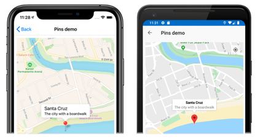
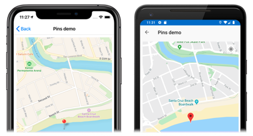
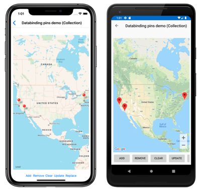

# Xamarin.Forms Map Pins

[ Download the sample](/samples/xamarin/xamarin-forms-samples/workingwithmaps)

The Xamarin.Forms [`Map`](xref:Xamarin.Forms.Maps.Map) control allows locations to be marked with [`Pin`](xref:Xamarin.Forms.Maps.Pin) objects. A `Pin` is a map marker that opens an information window when tapped:

[](pins-images/pin-and-information-window-large.png#lightbox "Map pin with information window")

When a [`Pin`](xref:Xamarin.Forms.Maps.Pin) object is added to the [`Map.Pins`](xref:Xamarin.Forms.Maps.Pin) collection, the pin is rendered on the map.

The [`Pin`](xref:Xamarin.Forms.Maps.Pin) class has the following properties:

- [`Address`](xref:Xamarin.Forms.Maps.Pin.Address), of type `string`, which typically represents the address for the pin location. However, it can be any `string` content, not just an address.
- [`Label`](xref:Xamarin.Forms.Maps.Pin.Label), of type `string`, which typically represents the pin title.
- [`Position`](xref:Xamarin.Forms.Maps.Pin.Position), of type [`Position`](xref:Xamarin.Forms.Maps.Position), which represents the latitude and longitude of the pin.
- [`Type`](xref:Xamarin.Forms.Maps.Pin.Type), of type [`PinType`](xref:Xamarin.Forms.Maps.PinType), which represents the type of pin.

These properties are backed by [`BindableProperty`](xref:Xamarin.Forms.BindableProperty) objects, which means a `Pin` can be the target of data bindings. For more information about data binding `Pin` objects, see [Display a pin collection](#display-a-pin-collection).

In addition, the [`Pin`](xref:Xamarin.Forms.Maps.Pin) class defines `MarkerClicked` and `InfoWindowClicked` events. The `MarkerClicked` event is fired when a pin is tapped, and the `InfoWindowClicked` event is fired when the information window is tapped. The `PinClickedEventArgs` object that accompanies both events has a single `HideInfoWindow` property, of type `bool`.

## Display a pin

A [`Pin`](xref:Xamarin.Forms.Maps.Pin) can be added to a [`Map`](xref:Xamarin.Forms.Maps.Map) in XAML:

```xaml
<ContentPage ...
             xmlns:maps="clr-namespace:Xamarin.Forms.Maps;assembly=Xamarin.Forms.Maps">
     <maps:Map x:Name="map"
               IsShowingUser="True"
               MoveToLastRegionOnLayoutChange="False">
         <x:Arguments>
             <maps:MapSpan>
                 <x:Arguments>
                     <maps:Position>
                         <x:Arguments>
                             <x:Double>36.9628066</x:Double>
                             <x:Double>-122.0194722</x:Double>
                         </x:Arguments>
                     </maps:Position>
                     <x:Double>0.01</x:Double>
                     <x:Double>0.01</x:Double>
                 </x:Arguments>
             </maps:MapSpan>
         </x:Arguments>
         <maps:Map.Pins>
             <maps:Pin Label="Santa Cruz"
                       Address="The city with a boardwalk"
                       Type="Place">
                 <maps:Pin.Position>
                     <maps:Position>
                         <x:Arguments>
                             <x:Double>36.9628066</x:Double>
                             <x:Double>-122.0194722</x:Double>
                         </x:Arguments>
                     </maps:Position>
                 </maps:Pin.Position>
             </maps:Pin>
         </maps:Map.Pins>
     </maps:Map>
</ContentPage>
```

This XAML creates a [`Map`](xref:Xamarin.Forms.Maps.Map) object that shows the region that is specified by the [`MapSpan`](xref:Xamarin.Forms.Maps.MapSpan) object. The `MapSpan` object is centered on the latitude and longitude represented by a [`Position`](xref:Xamarin.Forms.Maps.Position) object, which extends 0.01 latitude and longitude degrees. A [`Pin`](xref:Xamarin.Forms.Maps.Pin) object is added to the [`Map.Pins`](xref:Xamarin.Forms.Maps.Pin) collection, and drawn on the `Map` at the location specified by its [`Position`](xref:Xamarin.Forms.Maps.Pin.Position) property. For information about the [`Position`](xref:Xamarin.Forms.Maps.Position) struct, see [Map Position and Distance](position-distance.md). For information about passing arguments in XAML to objects that lack default constructors, see [Passing Arguments in XAML](~/xamarin-forms/xaml/passing-arguments.md).

The equivalent C# code is:

```csharp
using Xamarin.Forms.Maps;
// ...
Map map = new Map
{
  // ...
};
Pin pin = new Pin
{
  Label = "Santa Cruz",
  Address = "The city with a boardwalk",
  Type = PinType.Place,
  Position = new Position(36.9628066, -122.0194722)
};
map.Pins.Add(pin);
```

> [!WARNING]
> Failure to set the [`Pin.Label`](xref:Xamarin.Forms.Maps.Pin.Label) property will result in an `ArgumentException` being thrown when the [`Pin`](xref:Xamarin.Forms.Maps.Pin) is added to a [`Map`](xref:Xamarin.Forms.Maps.Map).

This example code results in a single pin being rendered on a map:

[](pins-images/pin-only-large.png#lightbox "Map pin")

## Interact with a pin

By default, when a [`Pin`](xref:Xamarin.Forms.Maps.Pin) is tapped its information window is displayed:

[](pins-images/pin-and-information-window-large.png#lightbox "Map pin with information window")

Tapping elsewhere on the map closes the information window.

The [`Pin`](xref:Xamarin.Forms.Maps.Pin) class defines a `MarkerClicked` event, which is fired when a `Pin` is tapped. It's not necessary to handle this event to display the information window. Instead, this event should be handled when there's a requirement to be notified that a specific pin has been tapped.

The [`Pin`](xref:Xamarin.Forms.Maps.Pin) class also defines a `InfoWindowClicked` event that's fired when an information window is tapped. This event should be handled when there's a requirement to be notified that a specific information window has been tapped.

The following code shows an example of handling these events:

```csharp
using Xamarin.Forms.Maps;
// ...
Pin boardwalkPin = new Pin
{
    Position = new Position(36.9641949, -122.0177232),
    Label = "Boardwalk",
    Address = "Santa Cruz",
    Type = PinType.Place
};
boardwalkPin.MarkerClicked += async (s, args) =>
{
    args.HideInfoWindow = true;
    string pinName = ((Pin)s).Label;
    await DisplayAlert("Pin Clicked", $"{pinName} was clicked.", "Ok");
};

Pin wharfPin = new Pin
{
    Position = new Position(36.9571571, -122.0173544),
    Label = "Wharf",
    Address = "Santa Cruz",
    Type = PinType.Place
};
wharfPin.InfoWindowClicked += async (s, args) =>
{
    string pinName = ((Pin)s).Label;
    await DisplayAlert("Info Window Clicked", $"The info window was clicked for {pinName}.", "Ok");
};
```

The `PinClickedEventArgs` object that accompanies both events has a single `HideInfoWindow` property, of type `bool`. When this property is set to `true` inside an event handler, the information window will be hidden.

## Pin types

[`Pin`](xref:Xamarin.Forms.Maps.Pin) objects include a [`Type`](xref:Xamarin.Forms.Maps.Pin.Type) property, of type [`PinType`](xref:Xamarin.Forms.Maps.PinType), which represents the type of pin. The `PinType` enumeration defines the following members:

- `Generic`, represents a generic pin.
- `Place`, represents a pin for a place.
- `SavedPin`, represents a pin for a saved location.
- `SearchResult`, represents a pin for a search result.

However, setting the [`Pin.Type`](xref:Xamarin.Forms.Maps.Pin.Type) property to any [`PinType`](xref:Xamarin.Forms.Maps.PinType) member does not change the appearance of the rendered pin. Instead, you must create a custom renderer to customize pin appearance. For more information, see [Customizing a map pin](~/xamarin-forms/app-fundamentals/custom-renderer/map-pin.md).

## Display a pin collection

The [`Map`](xref:Xamarin.Forms.Maps.Map) class defines the following properties:

- [`ItemsSource`](xref:Xamarin.Forms.Maps.Map.ItemsSource), of type `IEnumerable`, which specifies the collection of `IEnumerable` items to be displayed.
- [`ItemTemplate`](xref:Xamarin.Forms.Maps.Map.ItemTemplate), of type [`DataTemplate`](xref:Xamarin.Forms.DataTemplate), which specifies the [`DataTemplate`](xref:Xamarin.Forms.DataTemplate) to apply to each item in the collection of displayed items.
- `ItemTemplateSelector`, of type [`DataTemplateSelector`](xref:Xamarin.Forms.DataTemplateSelector), which specifies the [`DataTemplateSelector`](xref:Xamarin.Forms.DataTemplateSelector) that will be used to choose a [`DataTemplate`](xref:Xamarin.Forms.DataTemplate) for an item at runtime.

> [!IMPORTANT]
> The [`ItemTemplate`](xref:Xamarin.Forms.Maps.Map.ItemTemplate) property takes precedence when both the `ItemTemplate` and `ItemTemplateSelector` properties are set.

A [`Map`](xref:Xamarin.Forms.Maps.Map) can be populated with pins by using data binding to bind its [`ItemsSource`](xref:Xamarin.Forms.Maps.Map.ItemsSource) property to an `IEnumerable` collection:

```xaml
<ContentPage xmlns="http://xamarin.com/schemas/2014/forms"
             xmlns:x="http://schemas.microsoft.com/winfx/2009/xaml"
             xmlns:maps="clr-namespace:Xamarin.Forms.Maps;assembly=Xamarin.Forms.Maps"
             x:Class="WorkingWithMaps.PinItemsSourcePage">
    <Grid>
        ...
        <maps:Map x:Name="map"
                  ItemsSource="{Binding Locations}">
            <maps:Map.ItemTemplate>
                <DataTemplate>
                    <maps:Pin Position="{Binding Position}"
                              Address="{Binding Address}"
                              Label="{Binding Description}" />
                </DataTemplate>
            </maps:Map.ItemTemplate>
        </maps:Map>
        ...
    </Grid>
</ContentPage>
```

The [`ItemsSource`](xref:Xamarin.Forms.Maps.Map.ItemsSource) property data binds to the `Locations` property of the connected viewmodel, which returns an `ObservableCollection` of `Location` objects, which is a custom type. Each `Location` object defines `Address` and `Description` properties, of type `string`, and a `Position` property, of type [`Position`](xref:Xamarin.Forms.Maps.Position).

The appearance of each item in the `IEnumerable` collection is defined by setting the [`ItemTemplate`](xref:Xamarin.Forms.Maps.Map.ItemTemplate) property to a [`DataTemplate`](xref:Xamarin.Forms.DataTemplate) that contains a [`Pin`](xref:Xamarin.Forms.Maps.Pin) object that data binds to appropriate properties.

The following screenshots show a [`Map`](xref:Xamarin.Forms.Maps.Map) displaying a [`Pin`](xref:Xamarin.Forms.Maps.Pin) collection using data binding:

[](pins-images/pins-itemsource-large.png#lightbox "Map with data bound pins")

### Choose item appearance at runtime

The appearance of each item in the `IEnumerable` collection can be chosen at runtime, based on the item value, by setting the `ItemTemplateSelector` property to a [`DataTemplateSelector`](xref:Xamarin.Forms.DataTemplateSelector):

```xaml
<ContentPage ...
             xmlns:local="clr-namespace:WorkingWithMaps"
             xmlns:maps="clr-namespace:Xamarin.Forms.Maps;assembly=Xamarin.Forms.Maps">
    <ContentPage.Resources>
        <local:MapItemTemplateSelector x:Key="MapItemTemplateSelector">
            <local:MapItemTemplateSelector.DefaultTemplate>
                <DataTemplate>
                    <maps:Pin Position="{Binding Position}"
                              Address="{Binding Address}"
                              Label="{Binding Description}" />
                </DataTemplate>
            </local:MapItemTemplateSelector.DefaultTemplate>
            <local:MapItemTemplateSelector.XamarinTemplate>
                <DataTemplate>
                    <!-- Change the property values, or the properties that are bound to. -->
                    <maps:Pin Position="{Binding Position}"
                              Address="{Binding Address}"
                              Label="Xamarin!" />
                </DataTemplate>
            </local:MapItemTemplateSelector.XamarinTemplate>    
        </local:MapItemTemplateSelector>
    </ContentPage.Resources>

    <Grid>
        ...
        <maps:Map x:Name="map"
                  ItemsSource="{Binding Locations}"
                  ItemTemplateSelector="{StaticResource MapItemTemplateSelector}" />
        ...
    </Grid>
</ContentPage>
```

The following example shows the `MapItemTemplateSelector` class:

```csharp
public class MapItemTemplateSelector : DataTemplateSelector
{
    public DataTemplate DefaultTemplate { get; set; }
    public DataTemplate XamarinTemplate { get; set; }

    protected override DataTemplate OnSelectTemplate(object item, BindableObject container)
    {
        return ((Location)item).Address.Contains("San Francisco") ? XamarinTemplate : DefaultTemplate;
    }
}
```

The `MapItemTemplateSelector` class defines `DefaultTemplate` and `XamarinTemplate` [`DataTemplate`](xref:Xamarin.Forms.DataTemplate) properties that are set to different data templates. The `OnSelectTemplate` method returns the `XamarinTemplate`, which displays "Xamarin" as a label when a `Pin` is tapped, when the item has an address that contains "San Francisco". When the item doesn't have an address that contains "San Francisco", the `OnSelectTemplate` method returns the `DefaultTemplate`.

> [!NOTE]
> A use case for this functionality is binding properties of sub-classed [`Pin`](xref:Xamarin.Forms.Maps.Pin) objects to different properties, based on the `Pin` sub-type.

For more information about data template selectors, see [Creating a Xamarin.Forms DataTemplateSelector](~/xamarin-forms/app-fundamentals/templates/data-templates/selector.md).

## Related links

- [Maps Sample](/samples/xamarin/xamarin-forms-samples/workingwithmaps)
- [Map Custom Renderer](~/xamarin-forms/app-fundamentals/custom-renderer/map-pin.md)
- [Passing Arguments in XAML](~/xamarin-forms/xaml/passing-arguments.md)
- [Creating a Xamarin.Forms DataTemplateSelector](~/xamarin-forms/app-fundamentals/templates/data-templates/selector.md)