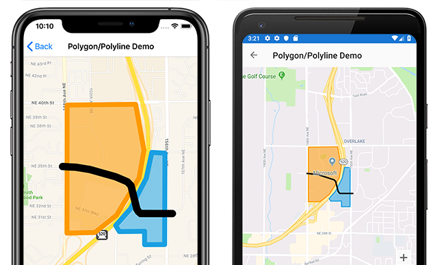

# Xamarin.Forms Map Polygons and Polylines

[ Download the sample](https://docs.microsoft.com/samples/xamarin/xamarin-forms-samples/workingwithmaps)

[](polygons-images/polygon-app.png#lightbox)

`Polygon` and `Polyline` elements allow you to highlight specific areas on a map. A `Polygon` is a fully enclosed shape that can have a stroke and fill color. A `Polyline` is a line that does not fully enclose an area.

> [!NOTE]
> Examples of `Polygon` and `Polyline` are found on the **PolygonsPage** in the sample project.

The `Polygon` and `Polyline` classes derive from `MapElement`, which exposes the following [`BindableProperty`](xref:Xamarin.Forms.BindableProperty) properties:

- `StrokeColor` is a `Color` property that determines the line color.
- `StrokeWidth` is a `float` property that determines the line width.
- `Geopath` is defined on both `Polygon` and `Polyline`, and is a list of [`Position`](xref:Xamarin.Forms.Maps.Position) objects that specify the points of the shape.

The `Polygon` class defines an additional property:

- `FillColor` is a `Color` property that determines the polygon's background color.

> [!NOTE]
> If the `StrokeColor` property is not specified the stroke will default to black. If the `FillColor` property is not specified, the fill will default to transparent. Therefore, if neither property is specified the shape will have a black outline with no fill.

## Create a polygon

A `Polygon` object can be added to a map by instantiating it and adding it to the map's `MapElements` collection:

```csharp
// instantiate a polygon
Polygon polygon = new Polygon
{
    StrokeWidth = 8,
    StrokeColor = Color.FromHex("#1BA1E2"),
    FillColor = Color.FromHex("#881BA1E2"),
    Geopath =
    {
        new Position(47.6368678, -122.137305),
        new Position(47.6368894, -122.134655),
        new Position(47.6359424, -122.134655),
        new Position(47.6359496, -122.1325521),
        new Position(47.6424124, -122.1325199),
        new Position(47.642463,  -122.1338932),
        new Position(47.6406414, -122.1344833),
        new Position(47.6384943, -122.1361248),
        new Position(47.6372943, -122.1376912)
    }
}

// add the polygon to the map's MapElements collection
map.MapElements.Add(polygon);
```

A `Polygon` can also be created in XAML:

```xaml
<maps:Map x:Name="map">
    <maps:Map.MapElements>
        <maps:Polygon StrokeColor="#FF9900"
                      StrokeWidth="8"
                      FillColor="#88FF9900">
            <maps:Polygon.Geopath>
                <maps:Position>
                    <x:Arguments>
                        <x:Double>47.6368678</x:Double>
                        <x:Double>-122.137305</x:Double>
                    </x:Arguments>
                </maps:Position>
                ...
            </maps:Polygon.Geopath>
        </maps:Polygon>
    </maps:Map.MapElements>
</maps:Map>
```

The `StrokeColor` and `StrokeWidth` properties are specified to customize the polygon's outline. The `FillColor` property value matches the `StrokeColor` property value but has an alpha value specified to make it transparent, allowing the underlying map to be visible through the shape. The `GeoPath` property contains a list of `Position` objects defining the geographic coordinates of the polygon points. A `Polygon` object is rendered on the map once it has been added to the `MapElements` collection of the `Map`.

> [!NOTE]
> A `Polygon` is a fully enclosed shape. The first and last points will automatically be connected if they do not match.

## Create a polyline

A `Polyline` object can be added to a map by instantiating it and adding it to the map's `MapElements` collection:

```csharp
// instantiate a polyline
Polyline polyline = new Polyline
{
    StrokeColor = Color.Blue,
    StrokeWidth = 12,
    Geopath =
    {
        new Position(47.6381401, -122.1317367),
        new Position(47.6381473, -122.1350841),
        new Position(47.6382847, -122.1353094),
        new Position(47.6384582, -122.1354703),
        new Position(47.6401136, -122.1360819),
        new Position(47.6403883, -122.1364681),
        new Position(47.6407426, -122.1377019),
        new Position(47.6412558, -122.1404056),
        new Position(47.6414148, -122.1418647),
        new Position(47.6414654, -122.1432702)
    }
};

// add the polyline to the map's MapElements collection
map.MapElements.Add(polyline);
```

A `Polyline` can also be created in XAML:

```xaml
<maps:Map x:Name="map">
    <maps:Map.MapElements>
        <maps:Polyline StrokeColor="Blue"
                       StrokeWidth="12">
            <maps:Polyline.Geopath>
                <maps:Position>
                    <x:Arguments>
                        <x:Double>47.6381401</x:Double>
                        <x:Double>-122.1317367</x:Double>
                    </x:Arguments>
                </maps:Position>
                ...
            </maps:Polyline.Geopath>
        </maps:Polyline>
    </maps:Map.MapElements>
</maps:Map>
```

The `StrokeColor` and `StrokeWidth` properties are specified to customize the line. The `GeoPath` property contains a list of `Position` objects defining the geographic coordinates of the polyline points. A `Polyline` object is rendered on the map once it has been added to the `MapElements` collection of the `Map`.

## Related links

- [Sample Map project](https://docs.microsoft.com/samples/xamarin/xamarin-forms-samples/workingwithmaps)
- [Xamarin.Forms Map](~/xamarin-forms/user-interface/map/index.md)
