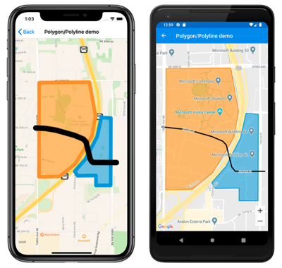
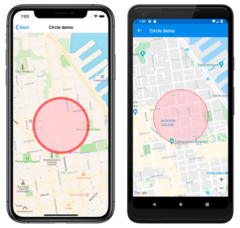

# Xamarin.Forms Map Polygons and Polylines

[ Download the sample](/samples/xamarin/xamarin-forms-samples/workingwithmaps)

`Polygon`, `Polyline`, and `Circle` elements allow you to highlight specific areas on a map. A `Polygon` is a fully enclosed shape that can have a stroke and fill color. A `Polyline` is a line that does not fully enclose an area. A `Circle` highlights a circular area of the map:

[](polygons-images/polygon-polyline-large.png#lightbox "Polygon and polyline on a map")
[](polygons-images/circle-large.png#lightbox "Circle on a map")

The `Polygon`, `Polyline`, and `Circle` classes derive from the `MapElement` class, which exposes the following bindable properties:

- `StrokeColor` is a `Color` object that determines the line color.
- `StrokeWidth` is a `float` object that determines the line width.

The `Polygon` class defines an additional bindable property:

- `FillColor` is a `Color` object that determines the polygon's background color.

In addition, the `Polygon` and `Polyline` classes both define a `GeoPath` property, which is a list of [`Position`](xref:Xamarin.Forms.Maps.Position) objects that specify the points of the shape.

The `Circle` class defines the following bindable properties:

- `Center` is a [`Position`](xref:Xamarin.Forms.Maps.Position) object that defines the center of the circle, in latitude and longitude.
- `Radius` is a [`Distance`](xref:Xamarin.Forms.Maps.Distance) object that defines the radius of the circle in meters, kilometers, or miles.
- `FillColor` is a `Color` property that determines the color within the circle perimeter.

> [!NOTE]
> If the `StrokeColor` property is not specified the stroke will default to black. If the `FillColor` property is not specified, the fill will default to transparent. Therefore, if neither property is specified the shape will have a black outline with no fill.

## Create a polygon

A `Polygon` object can be added to a map by instantiating it and adding it to the map's `MapElements` collection. This can be accomplished in XAML as follows:

```xaml
<ContentPage ...
             xmlns:maps="clr-namespace:Xamarin.Forms.Maps;assembly=Xamarin.Forms.Maps">
     <maps:Map>
         <maps:Map.MapElements>
             <maps:Polygon StrokeColor="#FF9900"
                           StrokeWidth="8"
                           FillColor="#88FF9900">
                 <maps:Polygon.Geopath>
                     <maps:Position>
                         <x:Arguments>
                             <x:Double>47.6368678</x:Double>
                             <x:Double>-122.137305</x:Double>
                         </x:Arguments>
                     </maps:Position>
                     ...
                 </maps:Polygon.Geopath>
             </maps:Polygon>
         </maps:Map.MapElements>
     </maps:Map>
</ContentPage>
```

The equivalent C# code is:

```csharp
using Xamarin.Forms.Maps;
// ...
Map map = new Map
{
  // ...
};

// instantiate a polygon
Polygon polygon = new Polygon
{
    StrokeWidth = 8,
    StrokeColor = Color.FromHex("#1BA1E2"),
    FillColor = Color.FromHex("#881BA1E2"),
    Geopath =
    {
        new Position(47.6368678, -122.137305),
        new Position(47.6368894, -122.134655),
        new Position(47.6359424, -122.134655),
        new Position(47.6359496, -122.1325521),
        new Position(47.6424124, -122.1325199),
        new Position(47.642463,  -122.1338932),
        new Position(47.6406414, -122.1344833),
        new Position(47.6384943, -122.1361248),
        new Position(47.6372943, -122.1376912)
    }
};

// add the polygon to the map's MapElements collection
map.MapElements.Add(polygon);
```

The `StrokeColor` and `StrokeWidth` properties are specified to customize the polygon's outline. The `FillColor` property value matches the `StrokeColor` property value but has an alpha value specified to make it transparent, allowing the underlying map to be visible through the shape. The `GeoPath` property contains a list of `Position` objects defining the geographic coordinates of the polygon points. A `Polygon` object is rendered on the map once it has been added to the `MapElements` collection of the `Map`.

> [!NOTE]
> A `Polygon` is a fully enclosed shape. The first and last points will automatically be connected if they do not match.

## Create a polyline

A `Polyline` object can be added to a map by instantiating it and adding it to the map's `MapElements` collection. This can be accomplished in XAML as follows:

```xaml
<ContentPage ...
             xmlns:maps="clr-namespace:Xamarin.Forms.Maps;assembly=Xamarin.Forms.Maps">
     <maps:Map>
         <maps:Map.MapElements>
             <maps:Polyline StrokeColor="Blue"
                            StrokeWidth="12">
                 <maps:Polyline.Geopath>
                     <maps:Position>
                         <x:Arguments>
                             <x:Double>47.6381401</x:Double>
                             <x:Double>-122.1317367</x:Double>
                         </x:Arguments>
                     </maps:Position>
                     ...
                 </maps:Polyline.Geopath>
             </maps:Polyline>
         </maps:Map.MapElements>
     </maps:Map>
</ContentPage>
```

```csharp
using Xamarin.Forms.Maps;
// ...
Map map = new Map
{
  // ...
};
// instantiate a polyline
Polyline polyline = new Polyline
{
    StrokeColor = Color.Blue,
    StrokeWidth = 12,
    Geopath =
    {
        new Position(47.6381401, -122.1317367),
        new Position(47.6381473, -122.1350841),
        new Position(47.6382847, -122.1353094),
        new Position(47.6384582, -122.1354703),
        new Position(47.6401136, -122.1360819),
        new Position(47.6403883, -122.1364681),
        new Position(47.6407426, -122.1377019),
        new Position(47.6412558, -122.1404056),
        new Position(47.6414148, -122.1418647),
        new Position(47.6414654, -122.1432702)
    }
};

// add the polyline to the map's MapElements collection
map.MapElements.Add(polyline);
```

The `StrokeColor` and `StrokeWidth` properties are specified to customize the line. The `GeoPath` property contains a list of `Position` objects defining the geographic coordinates of the polyline points. A `Polyline` object is rendered on the map once it has been added to the `MapElements` collection of the `Map`.

## Create a circle

A `Circle` object can be added to a map by instantiating it and adding it to the map's `MapElements` collection. This can be accomplished in XAML as follows:

```xaml
<ContentPage ...
             xmlns:maps="clr-namespace:Xamarin.Forms.Maps;assembly=Xamarin.Forms.Maps">
      <maps:Map>
          <maps:Map.MapElements>
              <maps:Circle StrokeColor="#88FF0000"
                           StrokeWidth="8"
                           FillColor="#88FFC0CB">
                  <maps:Circle.Center>
                      <maps:Position>
                          <x:Arguments>
                              <x:Double>37.79752</x:Double>
                              <x:Double>-122.40183</x:Double>
                          </x:Arguments>
                      </maps:Position>
                  </maps:Circle.Center>
                  <maps:Circle.Radius>
                      <maps:Distance>
                          <x:Arguments>
                              <x:Double>250</x:Double>
                          </x:Arguments>
                      </maps:Distance>
                  </maps:Circle.Radius>
              </maps:Circle>             
          </maps:Map.MapElements>
          ...
      </maps:Map>
</ContentPage>
```

The equivalent C# code is:

```csharp
using Xamarin.Forms.Maps;
// ...
Map map = new Map();

// Instantiate a Circle
Circle circle = new Circle
{
    Center = new Position(37.79752, -122.40183),
    Radius = new Distance(250),
    StrokeColor = Color.FromHex("#88FF0000"),
    StrokeWidth = 8,
    FillColor = Color.FromHex("#88FFC0CB")
};

// Add the Circle to the map's MapElements collection
map.MapElements.Add(circle);
```

The location of the `Circle` on the Map is determined by the value of the `Center` and `Radius` properties. The `Center` property defines the center of the circle, in latitude and longitude, while the `Radius` property defines the radius of the circle in meters. The `StrokeColor` and `StrokeWidth` properties are specified to customize the circle's outline. The `FillColor` property value specifies the color within the circle perimeter. Both of the color values specify an alpha channel, allowing the underlying map to be visible through the circle. The `Circle` object is rendered on the map once it has been added to the `MapElements` collection of the `Map`.

> [!NOTE]
> The `GeographyUtils` class has a `ToCircumferencePositions` extension method that converts a `Circle` object (that defines `Center` and `Radius` property values) to a list of `Position` objects that make up the latitude and longitude coordinates of the circle perimeter.

## Related links

- [Maps Sample](/samples/xamarin/xamarin-forms-samples/workingwithmaps)