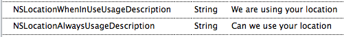
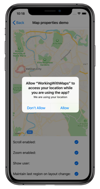
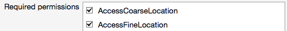
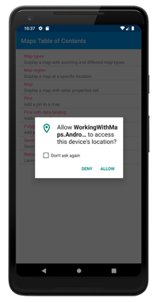

# Xamarin.Forms Map Initialization and Configuration

[ Download the sample](/samples/xamarin/xamarin-forms-samples/workingwithmaps)

The [`Map`](xref:Xamarin.Forms.Maps.Map) control uses the native map control on each platform. This provides a fast, familiar maps experience for users, but means that some configuration steps are needed to adhere to each platforms API requirements.

## Map initialization

The [`Map`](xref:Xamarin.Forms.Maps.Map) control is provided by the [Xamarin.Forms.Maps](https://www.nuget.org/packages/Xamarin.Forms.Maps/) NuGet package, which should be added to every project in the solution.

After installing the [Xamarin.Forms.Maps](https://www.nuget.org/packages/Xamarin.Forms.Maps/) NuGet package, it must be initialized in each platform project.

On iOS, this should occur in **AppDelegate.cs** by invoking the `Xamarin.FormsMaps.Init` method *after* the `Xamarin.Forms.Forms.Init` method:

```csharp
Xamarin.FormsMaps.Init();
```

On Android, this should occur in **MainActivity.cs** by invoking the `Xamarin.FormsMaps.Init` method *after* the `Xamarin.Forms.Forms.Init` method:

```csharp
Xamarin.FormsMaps.Init(this, savedInstanceState);
```

On the Universal Windows Platform (UWP), this should occur in **MainPage.xaml.cs** by invoking the `Xamarin.FormsMaps.Init` method from the `MainPage` constructor:

```csharp
Xamarin.FormsMaps.Init("INSERT_AUTHENTICATION_TOKEN_HERE");
```

For information about the authentication token required on UWP, see [Universal Windows Platform](#universal-windows-platform).

Once the NuGet package has been added and the initialization method called inside each application, `Xamarin.Forms.Maps` APIs can be used in the shared code project.

## Platform configuration

Additional configuration is required on Android and the Universal Windows Platform (UWP) before the map will display. In addition, on iOS, Android, and UWP, accessing the user's location requires location permissions to have been granted to the application.

### iOS

Displaying and interacting with a map on iOS doesn't require any additional configuration. However, to access location services, you must set the following keys in **Info.plist**:

- iOS 11 and later
  - [`NSLocationWhenInUseUsageDescription`](https://developer.apple.com/library/ios/documentation/General/Reference/InfoPlistKeyReference/Articles/CocoaKeys.html#//apple_ref/doc/uid/TP40009251-SW26) – for using location services when the application is in use
  - [`NSLocationAlwaysAndWhenInUseUsageDescription`](https://developer.apple.com/documentation/bundleresources/information_property_list/nslocationalwaysandwheninuseusagedescription) – for using location services at all times
- iOS 10 and earlier
  - [`NSLocationWhenInUseUsageDescription`](https://developer.apple.com/library/ios/documentation/General/Reference/InfoPlistKeyReference/Articles/CocoaKeys.html#//apple_ref/doc/uid/TP40009251-SW26) – for using location services when the application is in use
  - [`NSLocationAlwaysUsageDescription`](https://developer.apple.com/library/ios/documentation/General/Reference/InfoPlistKeyReference/Articles/CocoaKeys.html#//apple_ref/doc/uid/TP40009251-SW18) – for using location services at all times    

To support iOS 11 and earlier, you can include all three keys: `NSLocationWhenInUseUsageDescription`, `NSLocationAlwaysAndWhenInUseUsageDescription`, and `NSLocationAlwaysUsageDescription`.

The XML representation for these keys in **Info.plist** is shown below. You should update the `string` values to reflect how your application is using the location information:

```xml
<key>NSLocationAlwaysUsageDescription</key>
<string>Can we use your location at all times?</string>
<key>NSLocationWhenInUseUsageDescription</key>
<string>Can we use your location when your application is being used?</string>
<key>NSLocationAlwaysAndWhenInUseUsageDescription</key>
<string>Can we use your location at all times?</string>
```

The **Info.plist** entries can also be added in **Source** view while editing the **Info.plist** file:



A prompt is then displayed when the application attempts to access the user's location, requesting access:

[](setup-images/permission-ios-large.png#lightbox "iOS permission request")

### Android

The configuration process for displaying and interacting with a map on Android is:

1. Get a Google Maps API key and add it to the manifest.
1. Specify the Google Play services version number in the manifest.
1. Specify the requirement for Apache HTTP Legacy library in the manifest.
1. [optional] Specify the WRITE_EXTERNAL_STORAGE permission in the manifest.
1. [optional] Specify location permissions in the manifest.
1. [optional] Request runtime location permissions in the `MainActivity` class.

For an example of a correctly configured manifest file, see [AndroidManifest.xml](https://github.com/xamarin/xamarin-forms-samples/blob/master/WorkingWithMaps/WorkingWithMaps/WorkingWithMaps.Android/Properties/AndroidManifest.xml) from the sample application.

#### Get a Google Maps API key

To use the [Google Maps API](https://developers.google.com/maps/documentation/android/) on Android you must generate an API key. To do this, follow the instructions in [Obtaining a Google Maps API key](~/android/platform/maps-and-location/maps/obtaining-a-google-maps-api-key.md).

Once you've obtained an API key it must be added within the `<application>` element of the **Properties/AndroidManifest.xml** file:

```xml
<application ...>
    <meta-data android:name="com.google.android.geo.API_KEY" android:value="PASTE-YOUR-API-KEY-HERE" />
</application>
```

This embeds the API key into the manifest. Without a valid API key the [`Map`](xref:Xamarin.Forms.Maps.Map) control will display a blank grid.

> [!NOTE]
> `com.google.android.geo.API_KEY` is the recommended metadata name for the API key. For backwards compatibility, the `com.google.android.maps.v2.API_KEY` metadata name can be used, but only allows authentication to the Android Maps API v2.

For your APK to access Google Maps, you must include SHA-1 fingerprints and package names for every keystore (debug and release) that you use to sign your APK. For example, if you use one computer for debug and another computer for generating the release APK, you should include the SHA-1 certificate fingerprint from the debug keystore of the first computer and the SHA-1 certificate fingerprint from the release keystore of the second computer. Also remember to edit the key credentials if the app's **Package Name** changes. See [Obtaining a Google Maps API key](~/android/platform/maps-and-location/maps/obtaining-a-google-maps-api-key.md).

#### Specify the Google Play services version number

Add the following declaration within the `<application>` element of **AndroidManifest.xml**:

```xml
<meta-data android:name="com.google.android.gms.version" android:value="@integer/google_play_services_version" />
```

This embeds the version of Google Play services that the application was compiled with, into the manifest.

#### Specify the requirement for the Apache HTTP legacy library

If your Xamarin.Forms application targets API 28 or higher, you must add the following declaration within the `<application>` element of **AndroidManifest.xml**:

```xml
<uses-library android:name="org.apache.http.legacy" android:required="false" />    
```

This tells the application to use the Apache Http client library, which has been removed from the `bootclasspath` in Android 9.

#### Specify the WRITE_EXTERNAL_STORAGE permission

If your application targets API 22 or lower, it may be necessary to add the `WRITE_EXTERNAL_STORAGE` permission to the manifest, as a child of the `<manifest>` element:

```xml
<uses-permission android:name="android.permission.WRITE_EXTERNAL_STORAGE" />
```

This is not required if your application targets API 23 or greater.

#### Specify location permissions

If your application needs to access the user's location, you must request permission by adding the `ACCESS_COARSE_LOCATION` or `ACCESS_FINE_LOCATION` permissions to the manifest (or both), as a child of the `<manifest>` element:

```xml
<manifest xmlns:android="http://schemas.android.com/apk/res/android" android:versionCode="1" android:versionName="1.0" package="com.companyname.myapp">
  ...
  <uses-permission android:name="android.permission.ACCESS_COARSE_LOCATION" />
  <uses-permission android:name="android.permission.ACCESS_FINE_LOCATION" />
</manifest>
```

The `ACCESS_COARSE_LOCATION` permission allows the API to use WiFi or mobile data, or both, to determine the device's location. The `ACCESS_FINE_LOCATION` permissions allows the API to use the Global Positioning System (GPS), WiFi, or mobile data to determine a precise a location as possible.

Alternatively, these permissions can be enabled by using the manifest editor to add the following permissions:

- `AccessCoarseLocation`
- `AccessFineLocation`

These are shown in the screenshot below:



#### Request runtime location permissions

If your application targets API 23 or later and needs to access the user's location, it must check to see if it has the required permission at runtime, and request it if it does not have it. This can be accomplished as follows:

1. In the `MainActivity` class, add the following fields:

    ```csharp
    const int RequestLocationId = 0;

    readonly string[] LocationPermissions =
    {
        Manifest.Permission.AccessCoarseLocation,
        Manifest.Permission.AccessFineLocation
    };
    ```

1. In the `MainActivity` class, add the following `OnStart` override:

    ```csharp
    protected override void OnStart()
    {
        base.OnStart();

        if ((int)Build.VERSION.SdkInt >= 23)
        {
            if (CheckSelfPermission(Manifest.Permission.AccessFineLocation) != Permission.Granted)
            {
                RequestPermissions(LocationPermissions, RequestLocationId);
            }
            else
            {
                // Permissions already granted - display a message.
            }
        }
    }
    ```

    Provided that the application is targeting API 23 or greater, this code performs a runtime permission check for the `AccessFineLocation` permission. If permission has not been granted, a permission request is made by calling the `RequestPermissions` method.

1. In the `MainActivity` class, add the following `OnRequestPermissionsResult` override:

    ```csharp
    public override void OnRequestPermissionsResult(int requestCode, string[] permissions, [GeneratedEnum] Permission[] grantResults)
    {
        if (requestCode == RequestLocationId)
        {
            if ((grantResults.Length == 1) && (grantResults[0] == (int)Permission.Granted))
                // Permissions granted - display a message.
            else
                // Permissions denied - display a message.
        }
        else
        {
            base.OnRequestPermissionsResult(requestCode, permissions, grantResults);
        }
    }
    ```

    This override handles the result of the permission request.

The overall effect of this code is that when the application requests the user's location, the following dialog is displayed which requests permission:

[](setup-images/permission-android-large.png#lightbox "Android permission request")

### Universal Windows Platform

On UWP, your application must be authenticated before it can display a map and consume map services. To authenticate your application, you must specify a maps authentication key. For more information, see [Request a maps authentication key](/windows/uwp/maps-and-location/authentication-key). The authentication token should then be specified in the `FormsMaps.Init("AUTHORIZATION_TOKEN")` method call, to authenticate the application with Bing Maps.

> [!NOTE]
> On UWP, to use map services such as geocoding you must also set the `MapService.ServiceToken` property to the authentication key value. This can be accomplished with the following line of code: `Windows.Services.Maps.MapService.ServiceToken = "INSERT_AUTH_TOKEN_HERE";`.

In addition, if your application needs to access the user's location, you must enable the location capability in the package manifest. This can be accomplished as follows:

1. In **Solution Explorer**, double-click **package.appxmanifest** and select the **Capabilities** tab.
1. In the **Capabilities** list, check the box for **Location**. This add the `location` device capability to the package manifest file.

    ```xml
    <Capabilities>
      <!-- DeviceCapability elements must follow Capability elements (if present) -->
      <DeviceCapability Name="location"/>
    </Capabilities>
    ```

#### Release builds

UWP release builds use .NET native compilation to compile the application directly to native code. However, a consequence of this is that the renderer for the [`Map`](xref:Xamarin.Forms.Maps.Map) control on UWP may be linked out of the executable. This can be fixed by using a UWP-specific overload of the `Forms.Init` method in **App.xaml.cs**:

```csharp
var assembliesToInclude = new [] { typeof(Xamarin.Forms.Maps.UWP.MapRenderer).GetTypeInfo().Assembly };
Xamarin.Forms.Forms.Init(e, assembliesToInclude);
```

This code passes the assembly in which the `Xamarin.Forms.Maps.UWP.MapRenderer` class resides, to the `Forms.Init` method. This ensures that the assembly isn't linked out of the executable by the .NET native compilation process.

> [!IMPORTANT]
> Failure to do this will result in the [`Map`](xref:Xamarin.Forms.Maps.Map) control not appearing when running a release build.

## Related links

- [Maps Sample](/samples/xamarin/xamarin-forms-samples/workingwithmaps)
- [Xamarin.Forms.Maps Pins](~/xamarin-forms/user-interface/map/pins.md).
- [Maps API](xref:Xamarin.Forms.Maps)
- [Map Custom Renderer](~/xamarin-forms/app-fundamentals/custom-renderer/map-pin.md)