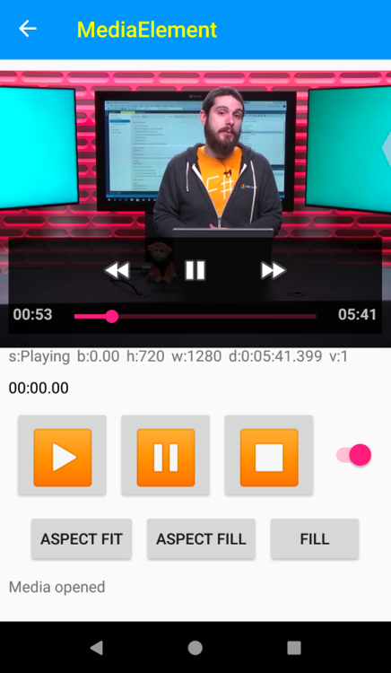

# Xamarin.Forms MediaElement


[ Download the sample](https://github.com/xamarin/xamarin-forms-samples/WorkingWithMediaElement)

`MediaElement` renders a media player for playback of video and audio. The operating system playback controls, referred to as transport controls, can be used, or you can hide those and provide your own controls to meet your design requirements.

Before you can use this new preview control, you must opt-in to using it by setting the appropriate flag in your `App.xaml.xs`:

```csharp
Device.SetFlags(new string[]{ "MediaElement_Experimental" });
```

Platforms supported:

- Android
- iOS
- UWP
- WPF
- macOS
- Tizen

## Setting media source

The `MediaElement` property `Source` can take a URI or local file path. Playback will begin immediately upon the media opening.

```xaml
<MediaElement Source="http://sec.ch9.ms/ch9/5d93/a1eab4bf-3288-4faf-81c4-294402a85d93/XamarinShow_mid.mp4" />
```



To set the source to a local asset from your platform project, use the "ms-appx" URI scheme. 

```xaml
<MediaElement Source="ms-appx://XamarinShow_mid.mp4" />
```

When using data binding you may want to use a value converter to apply this URI scheme:

```csharp
public class VideoSourceConverter : IValueConverter
{
    public object Convert(object value, Type targetType, object parameter, CultureInfo culture)
    {
        if (value == null)
            return null;

        if (String.IsNullOrWhiteSpace(value.ToString()))
            return null;

        if(Device.RuntimePlatform == Device.UWP)
            return new Uri($"ms-appx:///Assets/{value}");
        else
            return new Uri($"ms-appx:///{value}");
    }

    public object ConvertBack(object value, Type targetType, object parameter, CultureInfo culture)
    {
        throw new NotImplementedException();
    }
}
```

```xaml
<MediaElement
    Source="{Binding VideoSource, Converter={StaticResource VideoSourceConverter}}" />
```

## Controlling playback

By default the `MediaElement` will use the platforms native playback controls for play/pause, volume and mute, seeking, and time display. 

To override and implement your own controls, first disable the platform controls by setting `ShowsPlaybackControls="False"`. You can now use your own controls to reflect the playback status and control playback using the following properties, methods, and events:

- `Play()`, `Pause()`, `Stop()` methods to control playback
- `AutoPlay` to set initial behavior
- `CanSeek` to enable or disable seeking
- `Position` and `Duration` properties for time
- `Volume` property for changing volume and muting
- `IsLooping` property for repeating when playback completes
- `StateRequested`, `PositionRequested`, `VolumeRequested` for handling UI updates

### Handling additional media events

You can respond to common media events such as the `MediaOpened`, `MediaEnded`, `MediaFailed`, and `CurrentStateChanged` events. It is good practice to always handle the MediaFailed event.
CurrentStateChanged give information about the playback status. Using a value of the `MediaElementState` enum:

- **Closed**: contains no media and displays a transparent frame
- **Opening**: is validating and attempting to load the specified source
- **Buffering**: is loading the media for playback
  - Its `Position` does not advance during this state
  - If already playing video, it continues to display the last displayed frame
- **Playing**: is playing the current media source
- **Paused**: does not advance its `Position` 
  - If playing video, it continues to display the current frame
- **Stopped**: contains media but is not playing or paused
  - Its `Position` is 0 and does not advance
  - If the loaded media is video, the `MediaElement` displays the first frame.

## Controlling display

Similar to [`Image`](xref:Xamarin.Forms.Image), the `MediaElement` control has `VideoHeight`, `VideoWidth`, and `Aspect`. Aspect takes three different options:

- **AspectFill**: the video will fill the entire width and height of the control, often bleeding outside the control bounds, while maintaining the source aspect
- **AspectFit**: the video will fit inside the width and height of the control while maintaining the source aspect
- **Fill**: the video will fill the width and height of the control

## Additional properties

- `VideoWidth`: width of the control
- `VideoHeight`: height of the control
- `KeepScreenOn`: if the device screen should stay on during playback 

## Related links

- [MediaElement (sample)](https://github.com/xamarin/xamarin-forms-samples/WorkingWithMediaElement)
