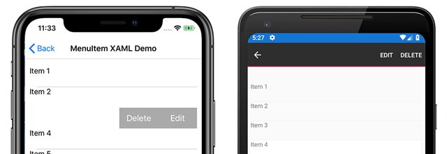
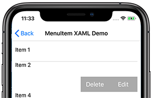
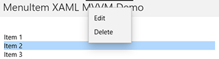

# Xamarin.Forms MenuItem

[ Download the sample](/samples/xamarin/xamarin-forms-samples/userinterface-menuitemdemos/)

The Xamarin.Forms [`MenuItem`](xref:Xamarin.Forms.MenuItem) class defines menu items for menus such as `ListView` item context menus and Shell application flyout menus.

The following screenshots show `MenuItem` objects in a `ListView` context menu on iOS and Android:

[](menuitem-images/menuitem-demo-full.png#lightbox "MenuItems on iOS and Android full image")

The `MenuItem` class defines the following properties:

* [`Command`](xref:Xamarin.Forms.MenuItem.Command) is an `ICommand` that allows binding user actions, such as finger taps or clicks, to commands defined on a viewmodel.
* [`CommandParameter`](xref:Xamarin.Forms.MenuItem.CommandParameter) is an `object` that specifies the parameter that should be passed to the `Command`.
* [`IconImageSource`](xref:Xamarin.Forms.MenuItem.IconImageSource) is an `ImageSource` value that defines the display icon.
* [`IsDestructive`](xref:Xamarin.Forms.MenuItem.IsDestructive) is a `bool` value that indicates whether the `MenuItem` removes its associated UI element from the list.
* [`IsEnabled`](xref:Xamarin.Forms.MenuItem.IsEnabled) is a `bool` value that indicates whether this object responds to user input.
* [`Text`](xref:Xamarin.Forms.MenuItem.Text) is a `string` value that specifies the display text.

These properties are backed by [`BindableProperty`](xref:Xamarin.Forms.BindableProperty) objects so the `MenuItem` instance can be the target of data bindings.

## Create a MenuItem

`MenuItem` objects can be used within a context menu on a `ListView` object's items. The most common pattern is to create `MenuItem` objects within a `ViewCell` instance, which is used as the `DataTemplate` object for the `ListView`s `ItemTemplate`. When the `ListView` object is populated it will create each item using the `DataTemplate`, exposing the `MenuItem` choices when the context menu is activated for an item.

The following example shows `MenuItem` instantiation within the context of a `ListView` object:

```xaml
<ListView>
    <ListView.ItemTemplate>
        <DataTemplate>
            <ViewCell>
                <ViewCell.ContextActions>
                    <MenuItem Text="Context Menu Option" />
                </ViewCell.ContextActions>
                <Label Text="{Binding .}" />
            </ViewCell>
        </DataTemplate>
    </ListView.ItemTemplate>
</ListView>
```

A `MenuItem` can also be created in code:

```csharp
// A function returns a ViewCell instance that
// is used as the template for each list item
DataTemplate dataTemplate = new DataTemplate(() =>
{
    // A Label displays the list item text
    Label label = new Label();
    label.SetBinding(Label.TextProperty, ".");

    // A ViewCell serves as the DataTemplate
    ViewCell viewCell = new ViewCell
    {
        View = label
    };

    // Add a MenuItem instance to the ContextActions
    MenuItem menuItem = new MenuItem
    {
        Text = "Context Menu Option"
    };
    viewCell.ContextActions.Add(menuItem);

    // The function returns the custom ViewCell
    // to the DataTemplate constructor
    return viewCell;
});

// Finally, the dataTemplate is provided to
// the ListView object
ListView listView = new ListView
{
    ...
    ItemTemplate = dataTemplate
};
```

## Define MenuItem behavior with events

The `MenuItem` class exposes a `Clicked` event. An event handler can be attached to this event to react to taps or clicks on the `MenuItem` instance in XAML:

```xaml
<MenuItem ...
          Clicked="OnItemClicked" />
```

An event handler can also be attached in code:

```csharp
MenuItem item = new MenuItem { ... }
item.Clicked += OnItemClicked;
```

Previous examples referenced an `OnItemClicked` event handler. The following code shows an example implementation:

```csharp
void OnItemClicked(object sender, EventArgs e)
{
    // The sender is the menuItem
    MenuItem menuItem = sender as MenuItem;

    // Access the list item through the BindingContext
    var contextItem = menuItem.BindingContext;

    // Do something with the contextItem here
}
```

## Define MenuItem behavior with MVVM

The `MenuItem` class supports the Model-View-ViewModel (MVVM) pattern through [`BindableProperty`](xref:Xamarin.Forms.BindableProperty) objects and the `ICommand` interface. The following XAML shows `MenuItem` instances bound to commands defined on a viewmodel:

```xaml
<ContentPage.BindingContext>
    <viewmodels:ListPageViewModel />
</ContentPage.BindingContext>

<StackLayout>
    <Label Text="{Binding Message}" ... />
    <ListView ItemsSource="{Binding Items}">
        <ListView.ItemTemplate>
            <DataTemplate>
                <ViewCell>
                    <ViewCell.ContextActions>
                        <MenuItem Text="Edit"
                                    IconImageSource="icon.png"
                                    Command="{Binding Source={x:Reference contentPage}, Path=BindingContext.EditCommand}"
                                    CommandParameter="{Binding .}"/>
                        <MenuItem Text="Delete"
                                    Command="{Binding Source={x:Reference contentPage}, Path=BindingContext.DeleteCommand}"
                                    CommandParameter="{Binding .}"/>
                    </ViewCell.ContextActions>
                    <Label Text="{Binding .}" />
                </ViewCell>
            </DataTemplate>
        </ListView.ItemTemplate>
    </ListView>
</StackLayout>
```

In the previous example, two `MenuItem` objects are defined with their `Command` and `CommandParameter` properties bound to commands on the viewmodel. The viewmodel contains the commands referenced in the XAML:

```csharp
public class ListPageViewModel : INotifyPropertyChanged
{
    ...

    public ICommand EditCommand => new Command<string>((string item) =>
    {
        Message = $"Edit command was called on: {item}";
    });

    public ICommand DeleteCommand => new Command<string>((string item) =>
    {
        Message = $"Delete command was called on: {item}";
    });
}
```

The sample application includes a `DataService` class used to get a list of items for populating the `ListView` objects. A viewmodel is instantiated, with items from the `DataService` class, and set as the `BindingContext` in the code-behind:

```csharp
public MenuItemXamlMvvmPage()
{
    InitializeComponent();
    BindingContext = new ListPageViewModel(DataService.GetListItems());
}
```

## MenuItem icons

> [!WARNING]
> `MenuItem` objects only display icons on Android. On other platforms, only the text specified by the `Text` property will be displayed.

 Icons are specified using the `IconImageSource` property. If an icon is specified, the text specified by the `Text` property will not be displayed. The following screenshot shows a `MenuItem` with an icon on Android:


For more information on using images in Xamarin.Forms, see [Images in Xamarin.Forms](~/xamarin-forms/user-interface/images.md).

## Enable or disable a MenuItem at runtime

To enable of disable a `MenuItem` at runtime, bind its `Command` property to an `ICommand` implementation, and ensure that a `canExecute` delegate enables and disables the `ICommand` as appropriate.

> [!IMPORTANT]
> Do not bind the `IsEnabled` property to another property when using the `Command` property to enable or disable the `MenuItem`.

The following example shows a `MenuItem` whose `Command` property binds to an `ICommand` named `MyCommand`:

```xaml
<MenuItem Text="My menu item"
          Command="{Binding MyCommand}" />
```

The `ICommand` implementation requires a `canExecute` delegate that returns the value of a `bool` property to enable and disable the `MenuItem`:

```csharp
public class MyViewModel : INotifyPropertyChanged
{
    bool isMenuItemEnabled = false;
    public bool IsMenuItemEnabled
    {
        get { return isMenuItemEnabled; }
        set
        {
            isMenuItemEnabled = value;
            MyCommand.ChangeCanExecute();
        }
    }

    public Command MyCommand { get; private set; }

    public MyViewModel()
    {
        MyCommand = new Command(() =>
        {
            // Execute logic here
        },
        () => IsMenuItemEnabled);
    }
}
```

In this example, the `MenuItem` is disabled until the `IsMenuItemEnabled` property is set. When this occurs, the `Command.ChangeCanExecute` method is called which causes the `canExecute` delegate for `MyCommand` to be re-evaluated.

## Cross-platform context menu behavior

Context menus are accessed and displayed differently on each platform.

On Android, the context menu is activated by long-press on a list item. The context menu replaces the title and navigation bar area and `MenuItem` options are displayed as horizontal buttons.


On iOS, the context menu is activated by swiping on a list item. The context menu is displayed on the list item and `MenuItems` are displayed as horizontal buttons.



On UWP, the context menu is activated by right-clicking on a list item. The context menu is displayed near the cursor as a vertical list.



## Related links

* [MenuItem Demos](/samples/xamarin/xamarin-forms-samples/userinterface-menuitemdemos/)
* [Images in Xamarin.Forms](~/xamarin-forms/user-interface/images.md)