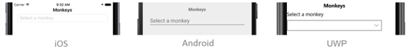
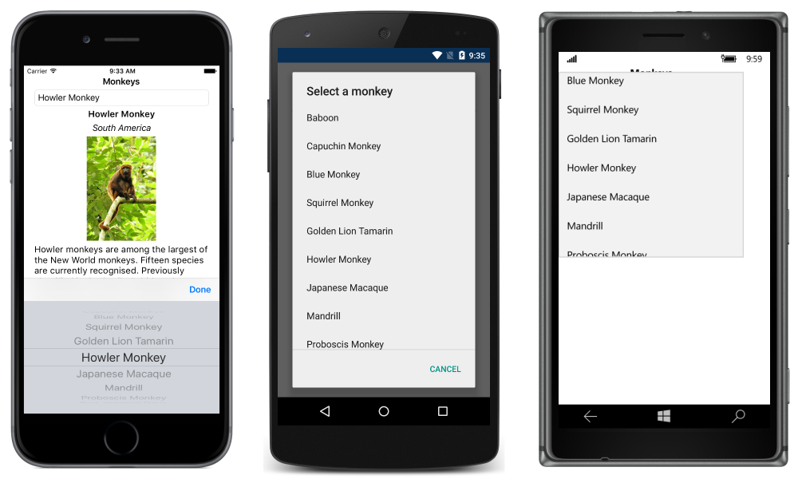
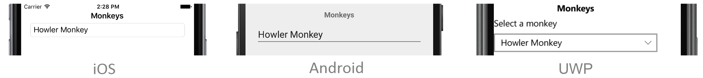

# Xamarin.Forms Picker

_The Picker view is a control for selecting a text item from a list of data._

The Xamarin.Forms [`Picker`](xref:Xamarin.Forms.Picker) displays a short list of items, from which the user can select an item. `Picker` defines the following properties:

- [`CharacterSpacing`](xref:Xamarin.Forms.Picker.CharacterSpacing), of type `double`, is the spacing between characters of the item displayed by the `Picker`.
- [`FontAttributes`](xref:Xamarin.Forms.Picker.FontAttributes) of type [`FontAttributes`](xref:Xamarin.Forms.FontAttributes), which defaults to [`FontAtributes.None`](xref:Xamarin.Forms.FontAttributes.None).
- [`FontFamily`](xref:Xamarin.Forms.Picker.FontFamily) of type `string`, which defaults to `null`.
- [`FontSize`](xref:Xamarin.Forms.Picker.FontSize) of type `double`, which defaults to -1.0.
- `HorizontalTextAlignment`, of type [`TextAlignment`](xref:Xamarin.Forms.TextAlignment), is the horizontal alignment of the text displayed by the `Picker`.
- [`ItemsSource`](xref:Xamarin.Forms.Picker.ItemsSource) of type `IList`, the source list of items to display, which defaults to `null`.
- [`SelectedIndex`](xref:Xamarin.Forms.Picker.SelectedIndex) of type `int`, the index of the selected item, which defaults to -1.
- [`SelectedItem`](xref:Xamarin.Forms.Picker.SelectedItem) of type `object`, the selected item, which defaults to `null`.
- [`TextColor`](xref:Xamarin.Forms.Picker.TextColor) of type [`Color`](xref:Xamarin.Forms.Color), the color used to display the text, which defaults to [`Color.Default`](xref:Xamarin.Forms.Color.Default).
- [`Title`](xref:Xamarin.Forms.Picker.Title) of type `string`, which defaults to `null`.
- [`TitleColor`](xref:Xamarin.Forms.Picker.TitleColor) of type [`Color`](xref:Xamarin.Forms.Color), the color used to display the `Title` text.
- `VerticalTextAlignment`, of type [`TextAlignment`](xref:Xamarin.Forms.TextAlignment), is the vertical alignment of the text displayed by the `Picker`.

All of the properties are backed by [`BindableProperty`](xref:Xamarin.Forms.BindableProperty) objects, which means that they can be styled, and the properties can be targets of data bindings. The [`SelectedIndex`](xref:Xamarin.Forms.Picker.SelectedIndex) and [`SelectedItem`](xref:Xamarin.Forms.Picker.SelectedItem) properties have a default binding mode of [`BindingMode.TwoWay`](xref:Xamarin.Forms.BindingMode.TwoWay), which means that they can be targets of data bindings in an application that uses the [Model-View-ViewModel (MVVM)](~/xamarin-forms/enterprise-application-patterns/mvvm.md) architecture. For information about setting font properties, see [Fonts](~/xamarin-forms/user-interface/text/fonts.md).

A [`Picker`](xref:Xamarin.Forms.Picker) doesn't show any data when it's first displayed. Instead, the value of its [`Title`](xref:Xamarin.Forms.Picker.Title) property is shown as a placeholder on the iOS and Android platforms:

When the [`Picker`](xref:Xamarin.Forms.Picker) gains focus, its data is displayed and the user can select an item:

The [`Picker`](xref:Xamarin.Forms.Picker) fires a [`SelectedIndexChanged`](xref:Xamarin.Forms.Picker.SelectedIndexChanged) event when the user selects an item. Following selection, the selected item is displayed by the `Picker`:

There are two techniques for populating a [`Picker`](xref:Xamarin.Forms.Picker) with data:

- Setting the [`ItemsSource`](xref:Xamarin.Forms.Picker.ItemsSource) property to the data to be displayed. This is the recommended technique. For more information, see [Setting a Picker's ItemsSource Property](populating-itemssource.md).
- Adding the data to be displayed to the [`Items`](xref:Xamarin.Forms.Picker.Items) collection. This technique was the original process for populating a [`Picker`](xref:Xamarin.Forms.Picker) with data. For more information, see [Adding Data to a Picker's Items Collection](populating-items.md).

## Related links

- [Picker](xref:Xamarin.Forms.Picker)
