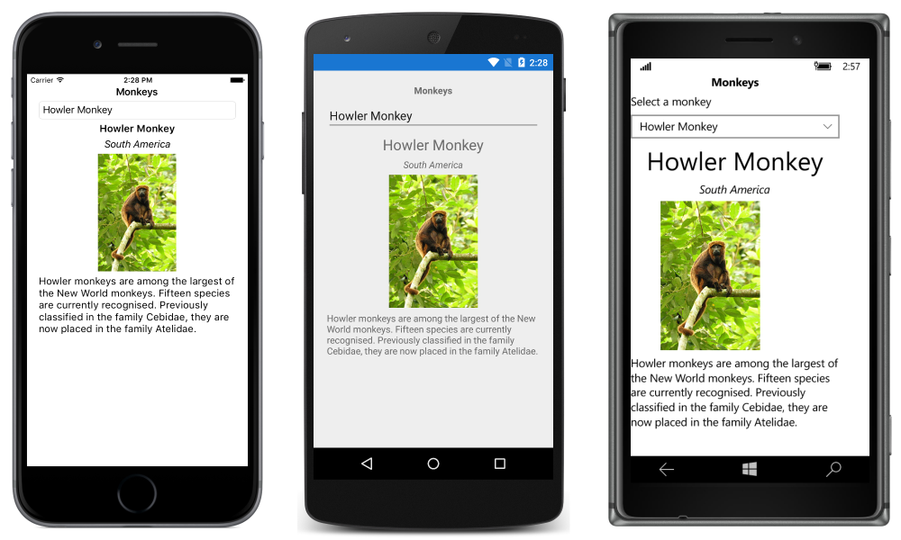

# Setting a Picker's ItemsSource Property

[ Download the sample](/samples/xamarin/xamarin-forms-samples/userinterface-monkeyapppicker)

_The Picker view is a control for selecting a text item from a list of data. This article explains how to populate a Picker with data by setting the ItemsSource property, and how to respond to item selection by the user._

Xamarin.Forms 2.3.4 has enhanced the [`Picker`](xref:Xamarin.Forms.Picker) view by adding the ability to populate it with data by setting its [`ItemsSource`](xref:Xamarin.Forms.Picker.ItemsSource) property, and to retrieve the selected item from the [`SelectedItem`](xref:Xamarin.Forms.Picker.SelectedItem) property. In addition, the color of the text for the selected item can be changed by setting the [`TextColor`](xref:Xamarin.Forms.Picker.TextColor) property to a [`Color`](xref:Xamarin.Forms.Color).

## Populating a Picker with data

A [`Picker`](xref:Xamarin.Forms.Picker) can be populated with data by setting its [`ItemsSource`](xref:Xamarin.Forms.Picker.ItemsSource) property to an `IList` collection. Each item in the collection must be of, or derived from, type `object`. Items can be added in XAML by initializing the `ItemsSource` property from an array of items:

```xaml
<Picker x:Name="picker"
        Title="Select a monkey"
        TitleColor="Red">
  <Picker.ItemsSource>
    <x:Array Type="{x:Type x:String}">
      <x:String>Baboon</x:String>
      <x:String>Capuchin Monkey</x:String>
      <x:String>Blue Monkey</x:String>
      <x:String>Squirrel Monkey</x:String>
      <x:String>Golden Lion Tamarin</x:String>
      <x:String>Howler Monkey</x:String>
      <x:String>Japanese Macaque</x:String>
    </x:Array>
  </Picker.ItemsSource>
</Picker>
```

> [!NOTE]
> Note that the `x:Array` element requires a `Type` attribute indicating the type of the items in the array.

The equivalent C# code is shown below:

```csharp
var monkeyList = new List<string>();
monkeyList.Add("Baboon");
monkeyList.Add("Capuchin Monkey");
monkeyList.Add("Blue Monkey");
monkeyList.Add("Squirrel Monkey");
monkeyList.Add("Golden Lion Tamarin");
monkeyList.Add("Howler Monkey");
monkeyList.Add("Japanese Macaque");

var picker = new Picker { Title = "Select a monkey", TitleColor = Color.Red };
picker.ItemsSource = monkeyList;
```

## Responding to item selection

A [`Picker`](xref:Xamarin.Forms.Picker) supports selection of one item at a time. When a user selects an item, the [`SelectedIndexChanged`](xref:Xamarin.Forms.Picker.SelectedIndexChanged) event fires, the [`SelectedIndex`](xref:Xamarin.Forms.Picker.SelectedIndex) property is updated to an integer representing the index of the selected item in the list, and the [`SelectedItem`](xref:Xamarin.Forms.Picker.SelectedItem) property is updated to the `object` representing the selected item. The [`SelectedIndex`](xref:Xamarin.Forms.Picker.SelectedIndex) property is a zero-based number indicating the item the user selected. If no item is selected, which is the case when the [`Picker`](xref:Xamarin.Forms.Picker) is first created and initialized, `SelectedIndex` will be -1.

> [!NOTE]
> Item selection behavior in a [`Picker`](xref:Xamarin.Forms.Picker) can be customized on iOS with a platform-specific. For more information, see [Controlling Picker Item Selection](~/xamarin-forms/platform/ios/picker-selection.md).

The following code example shows how to retrieve the [`SelectedItem`](xref:Xamarin.Forms.Picker.SelectedItem) property value from the [`Picker`](xref:Xamarin.Forms.Picker) in XAML:

```xaml
<Label Text="{Binding Source={x:Reference picker}, Path=SelectedItem}" />
```

The equivalent C# code is shown below:

```csharp
var monkeyNameLabel = new Label();
monkeyNameLabel.SetBinding(Label.TextProperty, new Binding("SelectedItem", source: picker));
```

In addition, an event handler can be executed when the [`SelectedIndexChanged`](xref:Xamarin.Forms.Picker.SelectedIndexChanged) event fires:

```csharp
void OnPickerSelectedIndexChanged(object sender, EventArgs e)
{
  var picker = (Picker)sender;
  int selectedIndex = picker.SelectedIndex;

  if (selectedIndex != -1)
  {
    monkeyNameLabel.Text = (string)picker.ItemsSource[selectedIndex];
  }
}
```

This method obtains the [`SelectedIndex`](xref:Xamarin.Forms.Picker.SelectedIndex) property value, and uses the value to retrieve the selected item from the [`ItemsSource`](xref:Xamarin.Forms.Picker.ItemsSource) collection. This is functionally equivalent to retrieving the selected item from the [`SelectedItem`](xref:Xamarin.Forms.Picker.SelectedItem) property. Note that each item in the `ItemsSource` collection is of type `object`, and so must be cast to a `string` for display.

> [!NOTE]
> A [`Picker`](xref:Xamarin.Forms.Picker) can be initialized to display a specific item by setting the [`SelectedIndex`](xref:Xamarin.Forms.Picker.SelectedIndex) or [`SelectedItem`](xref:Xamarin.Forms.Picker.SelectedItem) properties. However, these properties must be set after initializing the [`ItemsSource`](xref:Xamarin.Forms.Picker.ItemsSource) collection.

## Populating a Picker with data using data binding

A [`Picker`](xref:Xamarin.Forms.Picker) can be also populated with data by using data binding to bind its [`ItemsSource`](xref:Xamarin.Forms.Picker.ItemsSource) property to an `IList` collection. In XAML this is achieved with the [`Binding`](xref:Xamarin.Forms.Xaml.BindingExtension) markup extension:

```xaml
<Picker Title="Select a monkey"
        TitleColor="Red"
        ItemsSource="{Binding Monkeys}"
        ItemDisplayBinding="{Binding Name}" />
```

The equivalent C# code is shown below:

```csharp
var picker = new Picker { Title = "Select a monkey", TitleColor = Color.Red };
picker.SetBinding(Picker.ItemsSourceProperty, "Monkeys");
picker.ItemDisplayBinding = new Binding("Name");
```

The [`ItemsSource`](xref:Xamarin.Forms.Picker.ItemsSource) property data binds to the `Monkeys` property of the connected view model, which returns an `IList<Monkey>` collection. The following code example shows the `Monkey` class, which contains four properties:

```csharp
public class Monkey
{
  public string Name { get; set; }
  public string Location { get; set; }
  public string Details { get; set; }
  public string ImageUrl { get; set; }
}
```

When binding to a list of objects, the [`Picker`](xref:Xamarin.Forms.Picker) must be told which property to display from each object. This is achieved by setting the [`ItemDisplayBinding`](xref:Xamarin.Forms.Picker.ItemDisplayBinding) property to the required property from each object. In the code examples above, the `Picker` is set to display each `Monkey.Name` property value.

### Responding to item selection

Data binding can be used to set an object to the [`SelectedItem`](xref:Xamarin.Forms.Picker.SelectedItem) property value when it changes:

```xaml
<Picker Title="Select a monkey"
        TitleColor="Red"
        ItemsSource="{Binding Monkeys}"
        ItemDisplayBinding="{Binding Name}"
        SelectedItem="{Binding SelectedMonkey}" />
<Label Text="{Binding SelectedMonkey.Name}" ... />
<Label Text="{Binding SelectedMonkey.Location}" ... />
<Image Source="{Binding SelectedMonkey.ImageUrl}" ... />
<Label Text="{Binding SelectedMonkey.Details}" ... />
```

The equivalent C# code is shown below:

```csharp
var picker = new Picker { Title = "Select a monkey", TitleColor = Color.Red };
picker.SetBinding(Picker.ItemsSourceProperty, "Monkeys");
picker.SetBinding(Picker.SelectedItemProperty, "SelectedMonkey");
picker.ItemDisplayBinding = new Binding("Name");

var nameLabel = new Label { ... };
nameLabel.SetBinding(Label.TextProperty, "SelectedMonkey.Name");

var locationLabel = new Label { ... };
locationLabel.SetBinding(Label.TextProperty, "SelectedMonkey.Location");

var image = new Image { ... };
image.SetBinding(Image.SourceProperty, "SelectedMonkey.ImageUrl");

var detailsLabel = new Label();
detailsLabel.SetBinding(Label.TextProperty, "SelectedMonkey.Details");
```

The [`SelectedItem`](xref:Xamarin.Forms.Picker.SelectedItem) property data binds to the `SelectedMonkey` property of the connected view model, which is of type `Monkey`. Therefore, when the user selects an item in the [`Picker`](xref:Xamarin.Forms.Picker), the `SelectedMonkey` property will be set to the selected `Monkey` object. The `SelectedMonkey` object data is displayed in the user interface by [`Label`](xref:Xamarin.Forms.Label) and [`Image`](xref:Xamarin.Forms.Image) views:



> [!NOTE]
> Note that the [`SelectedItem`](xref:Xamarin.Forms.Picker.SelectedItem) and [`SelectedIndex`](xref:Xamarin.Forms.Picker.SelectedIndex) properties both support two-way bindings by default.

## Related links

- [Monkey App (sample)](/samples/xamarin/xamarin-forms-samples/userinterface-monkeyapppicker)
- [Bindable Picker (sample)](/samples/xamarin/xamarin-forms-samples/userinterface-bindablepicker)
- [Picker API](xref:Xamarin.Forms.Picker)
