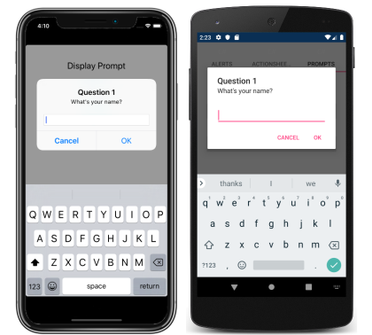
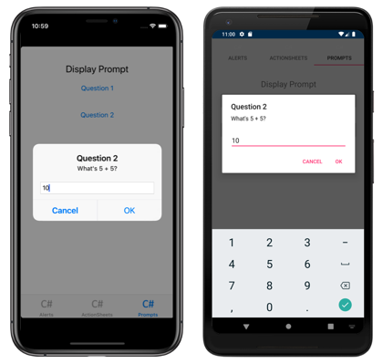

# Display Pop-ups

[ Download the sample](/samples/xamarin/xamarin-forms-samples/navigation-pop-ups)

Displaying an alert, asking a user to make a choice, or displaying a prompt is a common UI task. Xamarin.Forms has three methods on the [`Page`](xref:Xamarin.Forms.Page) class for interacting with the user via a pop-up: [`DisplayAlert`](xref:Xamarin.Forms.Page.DisplayAlert*), [`DisplayActionSheet`](xref:Xamarin.Forms.Page.DisplayActionSheet*), and `DisplayPromptAsync`. They are rendered with appropriate native controls on each platform.

## Display an alert

All Xamarin.Forms-supported platforms have a modal pop-up to alert the user or ask simple questions of them. To display these alerts in Xamarin.Forms, use the [`DisplayAlert`](xref:Xamarin.Forms.Page.DisplayAlert*) method on any [`Page`](xref:Xamarin.Forms.Page). The following line of code shows a simple message to the user:

```csharp
await DisplayAlert ("Alert", "You have been alerted", "OK");
```

[](pop-ups-images/simple-alert-large.png#lightbox)

This example does not collect information from the user. The alert displays modally and once dismissed the user continues interacting with the application.

The [`DisplayAlert`](xref:Xamarin.Forms.Page.DisplayAlert*) method can also be used to capture a user's response by presenting two buttons and returning a `boolean`. To get a response from an alert, supply text for both buttons and `await` the method. After the user selects one of the options the answer will be returned to your code. Note the `async` and `await` keywords in the sample code below:

```csharp
async void OnAlertYesNoClicked (object sender, EventArgs e)
{
  bool answer = await DisplayAlert ("Question?", "Would you like to play a game", "Yes", "No");
  Debug.WriteLine ("Answer: " + answer);
}
```

[](pop-ups-images/two-button-alert.png#lightbox)

The [`DisplayAlert`](xref:Xamarin.Forms.Page.DisplayAlert*) method also has overloads that accept a [`FlowDirection`](xref:Xamarin.Forms.FlowDirection) argument that specifies the direction in which UI elements flow within the alert. For more information about flow direction, see [Right-to-left localization](~/xamarin-forms/app-fundamentals/localization/right-to-left.md).

> [!WARNING]
> By default on UWP, when an alert is displayed any access keys that are defined on the page behind the alert can still be activated. For more information, see [VisualElement Access Keys on Windows](~/xamarin-forms/platform/windows/visualelement-access-keys.md).

## Guide users through tasks

The [UIActionSheet](https://developer.apple.com/library/ios/documentation/uikit/reference/uiactionsheet_class/Reference/Reference.html) is a common UI element in iOS. The Xamarin.Forms [`DisplayActionSheet`](xref:Xamarin.Forms.Page.DisplayActionSheet*) method lets you include this control in cross-platforms apps, rendering native alternatives in Android and UWP.

To display an action sheet, `await` [`DisplayActionSheet`](xref:Xamarin.Forms.Page.DisplayActionSheet*) in any [`Page`](xref:Xamarin.Forms.Page), passing the message and button labels as strings. The method returns the string label of the button that was clicked by the user. A simple example is shown here:

```csharp
async void OnActionSheetSimpleClicked (object sender, EventArgs e)
{
  string action = await DisplayActionSheet ("ActionSheet: Send to?", "Cancel", null, "Email", "Twitter", "Facebook");
  Debug.WriteLine ("Action: " + action);
}
```

[](pop-ups-images/simple-actionsheet-large.png#lightbox)

The `destroy` button is rendered differently to the other buttons on iOS, and can be left `null` or specified as the third string parameter. The following example uses the `destroy` button:

```csharp
async void OnActionSheetCancelDeleteClicked (object sender, EventArgs e)
{
  string action = await DisplayActionSheet ("ActionSheet: SavePhoto?", "Cancel", "Delete", "Photo Roll", "Email");
  Debug.WriteLine ("Action: " + action);
}
```

[](pop-ups-images/actionsheet-destroy-button-large.png#lightbox)

The [`DisplayActionSheet`](xref:Xamarin.Forms.Page.DisplayActionSheet*) method also has an overload that accepts a [`FlowDirection`](xref:Xamarin.Forms.FlowDirection) argument that specifies the direction in which UI elements flow within the action sheet. For more information about flow direction, see [Right-to-left localization](~/xamarin-forms/app-fundamentals/localization/right-to-left.md).

## Display a prompt

To display a prompt, call the `DisplayPromptAsync` in any [`Page`](xref:Xamarin.Forms.Page), passing a title and message as `string` arguments:

```csharp
string result = await DisplayPromptAsync("Question 1", "What's your name?");
```

The prompt is displayed modally:

[](pop-ups-images/simple-prompt-large.png#lightbox "Modal prompt")

If the OK button is tapped, the entered response is returned as a `string`. If the Cancel button is tapped, `null` is returned.

The full argument list for the `DisplayPromptAsync` method is:

- `title`, of type `string`, is the title to display in the prompt.
- `message`, of type `string`, is the message to display in the prompt.
- `accept`, of type `string`, is the text for the accept button. This is an optional argument, whose default value is OK.
- `cancel`, of type `string`, is the text for the cancel button. This is an optional argument, whose default value is Cancel.
- `placeholder`, of type `string`, is the placeholder text to display in the prompt. This is an optional argument, whose default value is `null`.
- `maxLength`, of type `int`, is the maximum length of the user response. This is an optional argument, whose default value is -1.
- `keyboard`, of type `Keyboard`, is the keyboard type to use for the user response. This is an optional argument, whose default value is `Keyboard.Default`.
- `initialValue`, of type `string`, is a pre-defined response that will be displayed, and which can be edited. This is an optional argument, whose default value is an empty `string`.

The following example shows setting some of the optional arguments:

```csharp
string result = await DisplayPromptAsync("Question 2", "What's 5 + 5?", initialValue: "10", maxLength: 2, keyboard: Keyboard.Numeric);
```

This code displays a predefined response of 10, limits the number of characters that can be input to 2, and displays the numeric keyboard for user input:

[](pop-ups-images/keyboard-prompt-large.png#lightbox "Modal prompt")

> [!WARNING]
> By default on UWP, when a prompt is displayed any access keys that are defined on the page behind the prompt can still be activated. For more information, see [VisualElement Access Keys on Windows](~/xamarin-forms/platform/windows/visualelement-access-keys.md).

## Related links

- [PopupsSample](/samples/xamarin/xamarin-forms-samples/navigation-pop-ups)
- [Right-to-left localization](~/xamarin-forms/app-fundamentals/localization/right-to-left.md)
