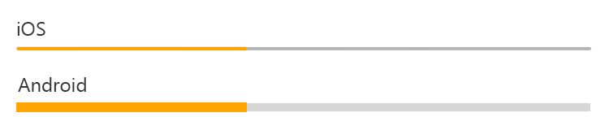

# Xamarin.Forms ProgressBar
[ Download the sample](/samples/xamarin/xamarin-forms-samples/userinterface-progressbardemos/)

The Xamarin.Forms [`ProgressBar`](xref:Xamarin.Forms.ProgressBar) control visually represents progress as a horizontal bar that is filled to a percentage represented by a `float` value. The `ProgressBar` class inherits from [`View`](xref:Xamarin.Forms.View).

The following screenshots show a `ProgressBar` on iOS and Android:


The `ProgressBar` control defines two properties:

* [`Progress`](xref:Xamarin.Forms.ProgressBar.Progress) is a `float` value that represents the current progress as a value from 0 to 1. `Progress` values less than 0 will be clamped to 0, values greater than 1 will be clamped to 1.
* [`ProgressColor`](xref:Xamarin.Forms.ProgressBar.ProgressColor) is a `Color` that affects the interior bar color representing the current progress.

These properties are backed by [`BindableProperty`](xref:Xamarin.Forms.BindableProperty) objects, which means that the `ProgressBar` can be styled and be the target of data bindings.

The `ProgressBar` control also defines a `ProgressTo` method that animates the bar from its current value to a specified value. For more information, see [Animate a ProgressBar](#animate-a-progressbar).

> [!NOTE]
> The `ProgressBar` does not accept user manipulation so it is skipped when using the Tab key to select controls.

## Create a ProgressBar

A `ProgressBar` can be instantiated in XAML. Its `Progress` property determines the fill percentage of the inner, colored bar. The default `Progress` property value is 0. The following example shows how to instantiate a `ProgressBar` in XAML with the optional `Progress` property set:

```xaml
<ProgressBar Progress="0.5" />
```

A `ProgressBar` can also be created in code:

```csharp
ProgressBar progressBar = new ProgressBar { Progress = 0.5f };
```

> [!WARNING]
> Do not use unconstrained horizontal layout options such as `Center`, `Start`, or `End` with `ProgressBar`. On UWP, the `ProgressBar` collapses to a bar of zero width. Keep the default `HorizontalOptions` value of `Fill` and don't use a width of `Auto` when putting a `ProgressBar` in a `Grid` layout.

## ProgressBar appearance properties

The `ProgressColor` property defines the inner bar color when the `Progress` property is greater than zero. The following example shows how to instantiate a `ProgressBar` in XAML with the `ProgressColor` property set:

```xaml
<ProgressBar ProgressColor="Orange" />
```

The `ProgressColor` property can also be set when creating a `ProgressBar` in code:

```csharp
ProgressBar progressBar = new ProgressBar { ProgressColor = Color.Orange };
```

The following screenshots show the `ProgressBar` with the `ProgressColor` property set to `Color.Orange` on iOS and Android:



## Animate a ProgressBar

The `ProgressTo` method animates the `ProgressBar` from its current `Progress` value to a provided value over time. The method accepts a `float` progress value, a `uint` duration in milliseconds, an `Easing` enum value and returns a `Task<bool>`. The following code demonstrates how to animate a `ProgressBar`:

```csharp
// animate to 75% progress over 500 milliseconds with linear easing
await progressBar.ProgressTo(0.75, 500, Easing.Linear);
```

For more information about the `Easing` enumeration, see [Easing functions in Xamarin.Forms](~/xamarin-forms/user-interface/animation/easing.md).

## Related links

* [ProgressBar Demos](/samples/xamarin/xamarin-forms-samples/userinterface-progressbardemos/)