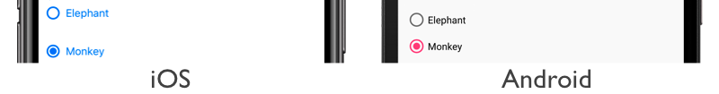
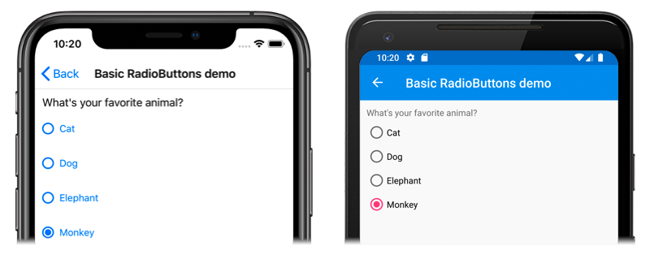
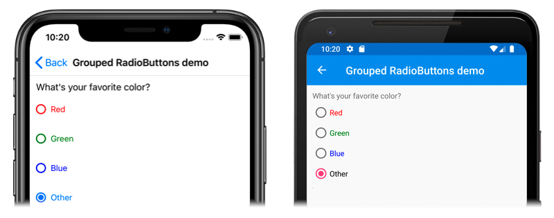
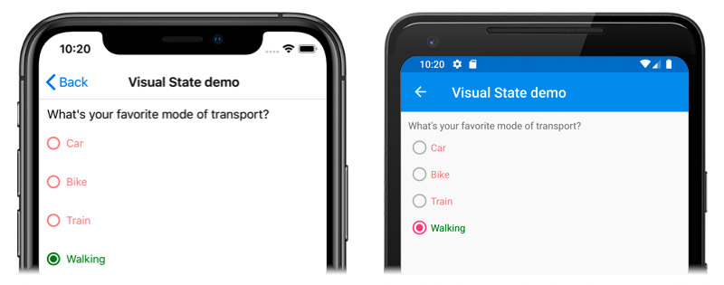

# Xamarin.Forms RadioButton

[ Download the sample](https://docs.microsoft.com/samples/xamarin/xamarin-forms-samples/userinterface-radiobuttondemos/)

The Xamarin.Forms `RadioButton` is a type of button that allows users to select one option from a set. Each option is represented by one radio button, and you can only select one radio button in a group. The `RadioButton` class inherits from the [`Button`](xref:Xamarin.Forms.Button) class.

The following screenshots show `RadioButton` objects in their cleared and selected states, on iOS and Android:



> [!IMPORTANT]
> `RadioButton` is currently experimental and can only be used by setting the `RadioButton_Experimental` flag. For more information, see [Experimental Flags](~/xamarin-forms/internals/experimental-flags.md).

The `RadioButton` control defines the following properties:

- `IsChecked`, of type `bool`, which defines whether the `RadioButton` is selected. This property uses a `TwoWay` binding, and has a default value of `false`.
- `GroupName`, of type `string`, which defines the name that specifies which `RadioButton` controls are mutually exclusive. This property has a default value of `null`.

These properties are backed by [`BindableProperty`](xref:Xamarin.Forms.BindableProperty) objects, which means that they can be targets of data bindings, and styled.

The `RadioButton` control defines a `CheckedChanged` event that's fired when the `IsChecked` property changes, either through user or programmatic manipulation. The `CheckedChangedEventArgs` object that accompanies the `CheckedChanged` event has a single property named `Value`, of type `bool`. When the event is fired, the value of the `Value` property is set to the new value of the `IsChecked` property.

In addition, the `RadioButton` class inherits the following typically-used properties from the [`Button`](xref:Xamarin.Forms.Button) class:

- [`Command`](xref:Xamarin.Forms.Button.Command), of type `ICommand`, which is executed when the `RadioButton` is selected.
- [`CommandParameter`](xref:Xamarin.Forms.Button.CommandParameter), of type `object`, which is the parameter that's passed to the `Command`.
- [`FontAttributes`](xref:Xamarin.Forms.Button.FontAttributes), of type [`FontAttributes`](xref:Xamarin.Forms.FontAttributes), which determines text style.
- [`FontFamily`](xref:Xamarin.Forms.Button.FontFamily), of type `string`, which defines the font family.
- [`FontSize`](xref:Xamarin.Forms.Button.FontSize), of type `double`, which defines the font size.
- [`Text`](xref:Xamarin.Forms.Button.Text), of type `string`, which defines the text to be displayed.
- [`TextColor`](xref:Xamarin.Forms.Button.TextColor), of type [`Color`](xref:Xamarin.Forms.Color), which defines the color of the displayed text.

For more information about the [`Button`](xref:Xamarin.Forms.Button) control, see [Xamarin.Forms Button](~/xamarin-forms/user-interface/button.md).

## Create RadioButtons

The following example shows how to instantiate `RadioButton` objects in XAML:

```xaml
<StackLayout>
    <Label Text="What's your favorite animal?" />
    <RadioButton Text="Cat" />
    <RadioButton Text="Dog" />
    <RadioButton Text="Elephant" />
    <RadioButton Text="Monkey"
                 IsChecked="true" />
</StackLayout>
```

In this example, `RadioButton` objects are implicitly grouped inside the same parent container. This XAML results in the appearance shown in the following screenshots:



Alternatively, `RadioButton` objects can be created in code:

```csharp
StackLayout stackLayout = new StackLayout
{
    Children =
    {
        new Label { Text = "What's your favorite animal?" },
        new RadioButton { Text = "Cat" },
        new RadioButton { Text = "Dog" },
        new RadioButton { Text = "Elephant" },
        new RadioButton { Text = "Monkey", IsChecked = true }
    }
};
```

## Group RadioButtons

Radio buttons work in groups, and there are two approaches to grouping radio buttons:

- By putting them inside the same parent container. This is known as implicit grouping.
- By setting the `GroupName` property on each radio button to the same value. This is known as explicit grouping.

The following XAML example shows explicitly grouping `RadioButton` objects by setting their `GroupName` properties:

```xaml
<Label Text="What's your favorite color?" />
<RadioButton Text="Red"
             TextColor="Red"
             GroupName="colors" />
<RadioButton Text="Green"
             TextColor="Green"
             GroupName="colors" />
<RadioButton Text="Blue"
             TextColor="Blue"
             GroupName="colors" />
<RadioButton Text="Other"
             GroupName="colors" />
```

In this example, each `RadioButton` is mutually exclusive because it shares the same `GroupName` value. This XAML results in the appearance shown in the following screenshots:



## Respond to a RadioButton state change

A radio button has two states: selected or cleared. When a radio button is selected, its `IsChecked` property is `true`. When a radio button is cleared, its `IsChecked` property is `false`. A radio button can be cleared by clicking another radio button in the same group, but it cannot be cleared by clicking it again. However, you can clear a radio button programmatically by setting its `IsChecked` property to `false`.

When the `IsChecked` property changes, either through user or programmatic manipulation, the `CheckedChanged` event fires. An event handler for this event can be registered to respond to the change:

```xaml
<RadioButton Text="Red"
             TextColor="Red"
             GroupName="colors"
             CheckedChanged="OnColorsRadioButtonCheckedChanged" />
```

The code-behind contains the handler for the `CheckedChanged` event:

```csharp
void OnColorsRadioButtonCheckedChanged(object sender, CheckedChangedEventArgs e)
{
    // Perform required operation
}
```

The `sender` argument is the `RadioButton` responsible for this event. You can use this to access the `RadioButton` object, or to distinguish between multiple `RadioButton` objects sharing the same `CheckedChanged` event handler.

Alternatively, an event handler for the `CheckedChanged` event can be registered in code:

```csharp
RadioButton radioButton = new RadioButton { ... };
radioButton.CheckedChanged += (sender, e) =>
{
    // Perform required operation
};
```

> [!NOTE]
> An alternative approach for responding to a `RadioButton` state change is to define an `ICommand` and assign it to the `RadioButton.Command` property. For more information, see [Button: Using the command interface](~/xamarin-forms/user-interface/button.md#using-the-command-interface).

## RadioButton visual states

`RadioButton` has an `IsChecked` [`VisualState`](xref:Xamarin.Forms.VisualState) that can be used to initiate a visual change when a `RadioButton` is selected.

The following XAML example shows how to define a visual state for the `IsChecked` state:

```xaml
<ContentPage ...>
    <ContentPage.Resources>
        <Style TargetType="RadioButton">
            <Setter Property="VisualStateManager.VisualStateGroups">
                <VisualStateGroupList>
                    <VisualStateGroup x:Name="CommonStates">
                        <VisualState x:Name="Normal">
                            <VisualState.Setters>
                                <Setter Property="TextColor"
                                        Value="Red" />
                                <Setter Property="Opacity"
                                        Value="0.5" />
                            </VisualState.Setters>
                        </VisualState>
                        <VisualState x:Name="IsChecked">
                            <VisualState.Setters>
                                <Setter Property="TextColor"
                                        Value="Green" />
                                <Setter Property="Opacity"
                                        Value="1" />
                            </VisualState.Setters>
                        </VisualState>
                    </VisualStateGroup>
                </VisualStateGroupList>
            </Setter>
        </Style>
    </ContentPage.Resources>
    <StackLayout>
        <Label Text="What's your favorite mode of transport?" />
        <RadioButton Text="Car"
                     CheckedChanged="OnRadioButtonCheckedChanged" />
        <RadioButton Text="Bike"
                     CheckedChanged="OnRadioButtonCheckedChanged" />
        <RadioButton Text="Train"
                     CheckedChanged="OnRadioButtonCheckedChanged" />
        <RadioButton Text="Walking"
                     CheckedChanged="OnRadioButtonCheckedChanged" />
    </StackLayout>
</ContentPage>
```

In this example, the implicit [`Style`](xref:Xamarin.Forms.Style) targets `RadioButton` objects. The `IsChecked` [`VisualState`](xref:Xamarin.Forms.VisualState) specifies that when a `RadioButton` is selected, its `TextColor` property will be set to green with an `Opacity` value of 1. The `Normal` `VisualState` specifies that when a `RadioButton` is in a cleared state, its `TextColor` property will be set to red with an `Opacity` value of 0.5. Therefore, the overall effect is that when a `RadioButton` is cleared it's red and partially transparent, and is green without transparency when it's selected:



For more information about visual states, see [Xamarin.Forms Visual State Manager](~/xamarin-forms/user-interface/visual-state-manager.md).

## Disable a RadioButton

Sometimes an application enters a state where a `RadioButton` being checked is not a valid operation. In such cases, the `RadioButton` can be disabled by setting its `IsEnabled` property to `false`.

## Related links

- [RadioButton Demos (sample)](/samples/xamarin/xamarin-forms-samples/userinterface-radiobuttondemos/)
- [Xamarin.Forms Button](~/xamarin-forms/user-interface/button.md)
- [Xamarin.Forms Visual State Manager](~/xamarin-forms/user-interface/visual-state-manager.md)