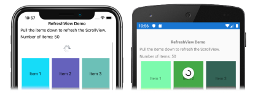
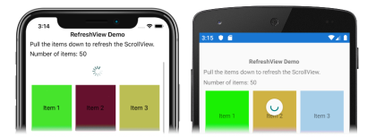

# Xamarin.Forms RefreshView

[ Download the sample](/samples/xamarin/xamarin-forms-samples/userinterface-refreshviewdemo/)

The `RefreshView` is a container control that provides pull to refresh functionality for scrollable content. Therefore, the child of a `RefreshView` must be a scrollable control, such as [`ScrollView`](xref:Xamarin.Forms.ScrollView), [`CollectionView`](xref:Xamarin.Forms.CollectionView), or [`ListView`](xref:Xamarin.Forms.ListView).

`RefreshView` defines the following properties:

- `Command`, of type `ICommand`, which is executed when a refresh is triggered.
- `CommandParameter`, of type `object`, which is the parameter that's passed to the `Command`.
- `IsRefreshing`, of type `bool`, which indicates the current state of the `RefreshView`.
- `RefreshColor`, of type `Color`, the color of the progress circle that appears during the refresh.

These properties are backed by [`BindableProperty`](xref:Xamarin.Forms.BindableProperty) objects, which means that they can be targets of data bindings, and styled.

> [!NOTE]
> On the Universal Windows Platform, the pull direction of a `RefreshView` can be set with a platform-specific. For more information, see [RefreshView Pull Direction](~/xamarin-forms/platform/windows/refreshview-pulldirection.md).

## Create a RefreshView

The following example shows how to instantiate a `RefreshView` in XAML:

```xaml
<RefreshView IsRefreshing="{Binding IsRefreshing}"
             Command="{Binding RefreshCommand}">
    <ScrollView>
        <FlexLayout Direction="Row"
                    Wrap="Wrap"
                    AlignItems="Center"
                    AlignContent="Center"
                    BindableLayout.ItemsSource="{Binding Items}"
                    BindableLayout.ItemTemplate="{StaticResource ColorItemTemplate}" />
    </ScrollView>
</RefreshView>
```

A `RefreshView` can also be created in code:

```csharp
RefreshView refreshView = new RefreshView();
ICommand refreshCommand = new Command(() =>
{
    // IsRefreshing is true
    // Refresh data here
    refreshView.IsRefreshing = false;
});
refreshView.Command = refreshCommand;

ScrollView scrollView = new ScrollView();
FlexLayout flexLayout = new FlexLayout { ... };
scrollView.Content = flexLayout;
refreshView.Content = scrollView;
```

In this example, the `RefreshView` provides pull to refresh functionality to a [`ScrollView`](xref:Xamarin.Forms.ScrollView) whose child is a [`FlexLayout`](xref:Xamarin.Forms.FlexLayout). The `FlexLayout` uses a bindable layout to generate its content by binding to a collection of items, and sets the appearance of each item with a [`DataTemplate`](xref:Xamarin.Forms.DataTemplate). For more information about bindable layouts, see [Bindable Layouts in Xamarin.Forms](~/xamarin-forms/user-interface/layouts/bindable-layouts.md).

The value of the `RefreshView.IsRefreshing` property indicates the current state of the `RefreshView`. When a refresh is triggered by the user, this property will automatically transition to `true`. Once the refresh completes, you should reset the property to `false`.

When the user initiates a refresh, the `ICommand` defined by the `Command` property is executed, which should refresh the items being displayed. A refresh visualization is shown while the refresh occurs, which consists of an animated progress circle:

[](refreshview-images/default-progress-circle-large.png#lightbox "RefreshView refreshing data")

> [!NOTE]
> Manually setting the `IsRefreshing` property to `true` will trigger the refresh visualization, and will execute the `ICommand` defined by the `Command` property.

## RefreshView appearance

In addition to the properties that `RefreshView` inherits from the [`VisualElement`](xref:Xamarin.Forms.VisualElement) class, `RefreshView` also defines the `RefreshColor` property. This property can be set to define the color of the progress circle that appears during the refresh:

```xaml
<RefreshView RefreshColor="Teal"
             ... />
```

The following screenshot shows a `RefreshView` with the `RefreshColor` property set:

[](refreshview-images/teal-progress-circle-large.png#lightbox "RefreshView with a teal progress circle")

In addition, the `BackgroundColor` property can be set to a [`Color`](xref:Xamarin.Forms.Color) that represents the background color of the progress circle.

> [!NOTE]
> On iOS, the `BackgroundColor` property sets the background color of the `UIView` that contains the progress circle.

## Disable a RefreshView

An application may enter a state where pull to refresh is not a valid operation. In such cases, the `RefreshView` can be disabled by setting its `IsEnabled` property to `false`. This will prevent users from being able to trigger pull to refresh.

Alternatively, when defining the `Command` property, the `CanExecute` delegate of the `ICommand` can be specified to enable or disable the command.

## Related links

- [RefreshView (sample)](/samples/xamarin/xamarin-forms-samples/userinterface-refreshviewdemo/)
- [Bindable Layouts in Xamarin.Forms](~/xamarin-forms/user-interface/layouts/bindable-layouts.md)
- [RefreshView Pull Direction platform-specific](~/xamarin-forms/platform/windows/refreshview-pulldirection.md)