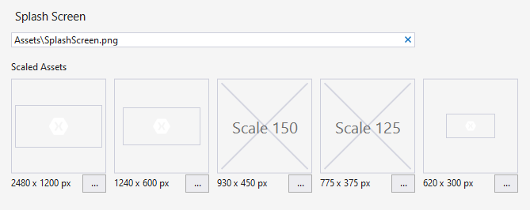

# Xamarin.Forms splash screen

Applications often have a startup delay while the application completes its initialization process. Developers may want to offer a branded experience, typically called a splash screen, while the application is starting. This article explains how to create splash screens for Xamarin.Forms applications.

Xamarin.Forms is initialized on each platform after the native startup sequence has completed. Xamarin.Forms is initialized:

- In the `OnCreate` method of the `MainActivity` class on Android.
- In the `FinishedLaunching` method of the `AppDelegate` class on iOS.
- In the `OnLaunched` method of the `App` class on UWP.

The splash screen should be shown as soon as possible when the application is launched, but Xamarin.Forms is not initialized until late in the startup sequence, which means that the splash screen must be implemented outside of Xamarin.Forms on each platform. The following sections explain how to create a splash screens on each platform.

## Xamarin.Forms Android splash screen

Creating a splash screen on Android requires creating a splash `Activity` as the `MainLauncher` with a special theme. As soon as the splash `Activity` is started, it launches the main `Activity` with the normal application theme.

For more information about splash screens on Xamarin.Android, see [Xamarin.Android splash screen](~/android/user-interface/splash-screen.md).

## Xamarin.Forms iOS splash screen

A splash screen on iOS is referred to as a Launch Screen. Creating a Launch Screen on iOS requires creating a Storyboard that defines the UI of the launch screen, and then setting the Storyboard as the Launch Screen in the **Info.plist**.

For more information about Launch Screens on Xamarin.iOS, see [Xamarin.iOS Launch Screen](~/ios/app-fundamentals/images-icons/launch-screens.md).

## Xamarin.Forms UWP splash screen

On UWP, the **Package.appxmanifest** contains a **Visual Assets** tab with a **Splash Screen** submenu. The splash screen graphics can be specified in this menu:

## Related links

- [Xamarin.Android splash screen](~/android/user-interface/splash-screen.md)
- [Xamarin.iOS Launch Screen](~/ios/app-fundamentals/images-icons/launch-screens.md)
