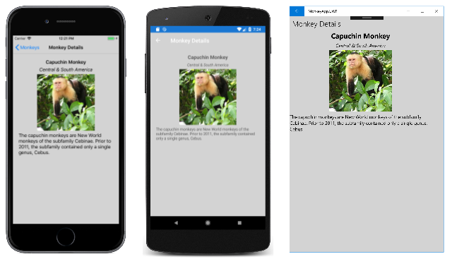

# Styling Xamarin.Forms apps using Cascading Style Sheets (CSS)

[ Download the sample](/samples/xamarin/xamarin-forms-samples/userinterface-styles-monkeyappcss)

_Xamarin.Forms supports styling visual elements using Cascading Style Sheets (CSS)._

Xamarin.Forms applications can be styled using CSS. A style sheet consists of a list of rules, with each rule consisting of one or more selectors and a declaration block. A declaration block consists of a list of declarations in braces, with each declaration consisting of a property, a colon, and a value. When there are multiple declarations in  a block, a semi-colon is inserted as a separator. The following code example shows some Xamarin.Forms compliant CSS:

```css
navigationpage {
    -xf-bar-background-color: lightgray;
}

^contentpage {
    background-color: lightgray;
}

#listView {
    background-color: lightgray;
}

stacklayout {
    margin: 20;
}

.mainPageTitle {
    font-style: bold;
    font-size: medium;
}

.mainPageSubtitle {
    margin-top: 15;
}

.detailPageTitle {
    font-style: bold;
    font-size: medium;
    text-align: center;
}

.detailPageSubtitle {
    text-align: center;
    font-style: italic;
}

listview image {
    height: 60;
    width: 60;
}

stacklayout>image {
    height: 200;
    width: 200;
}
```

In Xamarin.Forms, CSS style sheets are parsed and evaluated at runtime, rather than compile time, and style sheets are re-parsed on use.

> [!NOTE]
> Currently, all of the styling that's possible with XAML styling cannot be performed with CSS. However, XAML styles can be used to supplement CSS for properties that are currently unsupported by Xamarin.Forms. For more information about XAML styles, see [Styling Xamarin.Forms Apps using XAML Styles](~/xamarin-forms/user-interface/styles/xaml/index.md).

The [MonkeyAppCSS](/samples/xamarin/xamarin-forms-samples/userinterface-styles-monkeyappcss) sample demonstrates using CSS to style a simple app, and is shown in the following screenshots:

[](css-images/MonkeyAppMainPage-Large.png#lightbox "MonkeyApp Main Page with CSS styling")

[](css-images/MonkeyAppDetailPage-Large.png#lightbox "MonkeyApp Detail Page with CSS styling")

## Consuming a style sheet

The process for adding a style sheet to a solution is as follows:

1. Add an empty CSS file to your .NET Standard library project.
1. Set the build action of the CSS file to **EmbeddedResource**.

### Loading a style sheet

There are a number of approaches that can be used to load a style sheet.

> [!NOTE]
> It's not currently possible to change a style sheet at runtime and have the new style sheet applied.

### XAML

A style sheet can be loaded and parsed with the [`StyleSheet`](xref:Xamarin.Forms.StyleSheets.StyleSheet) class before being added to a [`ResourceDictionary`](xref:Xamarin.Forms.ResourceDictionary):

```xaml
<Application ...>
    <Application.Resources>
        <StyleSheet Source="/Assets/styles.css" />
    </Application.Resources>
</Application>
```

The [`StyleSheet.Source`](xref:Xamarin.Forms.Xaml.StyleSheetExtension.Source) property specifies the style sheet as a URI relative to the location of the enclosing XAML file, or relative to the project root if the URI starts with a `/`.

> [!WARNING]
> The CSS file will fail to load if its build action is not set to  **EmbeddedResource**.

Alternatively, a style sheet can be loaded and parsed with the [`StyleSheet`](xref:Xamarin.Forms.StyleSheets.StyleSheet) class, before being added to a [`ResourceDictionary`](xref:Xamarin.Forms.ResourceDictionary), by inlining it in a `CDATA` section:

```xaml
<ContentPage ...>
    <ContentPage.Resources>
        <StyleSheet>
            <![CDATA[
            ^contentpage {
                background-color: lightgray;
            }
            ]]>
        </StyleSheet>
    </ContentPage.Resources>
    ...
</ContentPage>
```

For more information about resource dictionaries, see [Resource Dictionaries](~/xamarin-forms/xaml/resource-dictionaries.md).

### C\#

In C#, a style sheet can be loaded from a `StringReader` and added to a [`ResourceDictionary`](xref:Xamarin.Forms.ResourceDictionary):

```csharp
public partial class MyPage : ContentPage
{
    public MyPage()
    {
        InitializeComponent();

        using (var reader = new StringReader("^contentpage { background-color: lightgray; }"))
        {
            this.Resources.Add(StyleSheet.FromReader(reader));
        }
    }
}
```

The argument to the `StyleSheet.FromReader` method is the `TextReader` that has read the style sheet.

## Selecting elements and applying properties

CSS uses selectors to determine which elements to target. Styles with matching selectors are applied consecutively, in definition order. Styles defined on a specific item are always applied last. For more information about supported selectors, see [Selector Reference](#selector-reference).

CSS uses properties to style a selected element. Each property has a set of possible values, and some properties can affect any type of element, while others apply to groups of elements. For more information about supported properties, see [Property Reference](#property-reference).

Child stylesheets always override parent stylesheets if they set the same properties. Therefore, the following precedence rules are followed when applying styles that set the same properties:

- A style defined in the application resources will be overwritten by a style defined in the page resources, if they set the same properties.
- A style defined in page resources will be overwritten by a style defined in the control resources, if they set the same properties.
- A style defined in the application resources will be overwritten by a style defined in the control resources, if they set the same properties.

> [!IMPORTANT]
> CSS variables are unsupported.

### Selecting elements by type

Elements in the visual tree can be selected by type with the case insensitive `element` selector:

```css
stacklayout {
    margin: 20;
}
```

This selector identifies any [`StackLayout`](xref:Xamarin.Forms.StackLayout) elements on pages that consume the style sheet, and sets their margins to a uniform thickness of 20.

> [!NOTE]
> The `element` selector does not identify subclasses of the specified type.

### Selecting elements by base class

Elements in the visual tree can be selected by base class with the case insensitive `^base` selector:

```css
^contentpage {
    background-color: lightgray;
}
```

This selector identifies any [`ContentPage`](xref:Xamarin.Forms.ContentPage) elements that consume the style sheet, and sets their background color to `lightgray`.

> [!NOTE]
> The `^base` selector is specific to Xamarin.Forms, and isn't part of the CSS specification.

### Selecting an element by name

Individual elements in the visual tree can be selected with the case sensitive `#id` selector:

```css
#listView {
    background-color: lightgray;
}
```

This selector identifies the element whose [`StyleId`](xref:Xamarin.Forms.Element.StyleId) property is set to `listView`. However, if the `StyleId` property is not set, the selector will fall back to using the `x:Name` of the element. Therefore, in the following XAML example, the `#listView` selector will identify the [`ListView`](xref:Xamarin.Forms.ListView) whose `x:Name` attribute is set to `listView`, and will set it's background color to `lightgray`.

```xaml
<ContentPage ...>
    <ContentPage.Resources>
        <StyleSheet Source="/Assets/styles.css" />
    </ContentPage.Resources>
    <StackLayout>
        <ListView x:Name="listView" ...>
            ...
        </ListView>
    </StackLayout>
</ContentPage>
```

### Selecting elements with a specific class attribute

Elements with a specific class attribute can be selected with the case sensitive `.class` selector:

```css
.detailPageTitle {
    font-style: bold;
    font-size: medium;
    text-align: center;
}

.detailPageSubtitle {
    text-align: center;
    font-style: italic;
}
```

A CSS class can be assigned to a XAML element by setting the [`StyleClass`](xref:Xamarin.Forms.NavigableElement.StyleClass) property of the element to the CSS class name. Therefore, in the following XAML example, the styles defined by the `.detailPageTitle` class are assigned to the first [`Label`](xref:Xamarin.Forms.Label), while the styles defined by the `.detailPageSubtitle` class are assigned to the second `Label`.

```xaml
<ContentPage ...>
    <ContentPage.Resources>
        <StyleSheet Source="/Assets/styles.css" />
    </ContentPage.Resources>
    <ScrollView>
        <StackLayout>
            <Label ... StyleClass="detailPageTitle" />
            <Label ... StyleClass="detailPageSubtitle"/>
            ...
        </StackLayout>
    </ScrollView>
</ContentPage>
```

### Selecting child elements

Child elements in the visual tree can be selected with the case insensitive `element element` selector:

```css
listview image {
    height: 60;
    width: 60;
}
```

This selector identifies any [`Image`](xref:Xamarin.Forms.Image) elements that are children of [`ListView`](xref:Xamarin.Forms.ListView) elements, and sets their height and width to 60. Therefore, in the following XAML example, the `listview image` selector will identify the [`Image`](xref:Xamarin.Forms.Image) that's a child of the [`ListView`](xref:Xamarin.Forms.ListView), and sets its height and width to 60.

```xaml
<ContentPage ...>
    <ContentPage.Resources>
        <StyleSheet Source="/Assets/styles.css" />
    </ContentPage.Resources>
    <StackLayout>
        <ListView ...>
            <ListView.ItemTemplate>
                <DataTemplate>
                    <ViewCell>
                        <Grid>
                            ...
                            <Image ... />
                            ...
                        </Grid>
                    </ViewCell>
                </DataTemplate>
            </ListView.ItemTemplate>
        </ListView>
    </StackLayout>
</ContentPage>
```

> [!NOTE]
> The `element element` selector does not require the child element to be a _direct_ child of the parent – the child element may have a different parent. Selection occurs provided that an ancestor is the specified first element.

### Selecting direct child elements

Direct child elements in the visual tree can be selected with the case insensitive `element>element` selector:

```css
stacklayout>image {
    height: 200;
    width: 200;
}
```

This selector identifies any [`Image`](xref:Xamarin.Forms.Image) elements that are direct children of [`StackLayout`](xref:Xamarin.Forms.StackLayout) elements, and sets their height and width to 200. Therefore, in the following XAML example, the `stacklayout>image` selector will identify the [`Image`](xref:Xamarin.Forms.Image) that's a direct child of the [`StackLayout`](xref:Xamarin.Forms.StackLayout), and sets its height and width to 200.

```xaml
<ContentPage ...>
    <ContentPage.Resources>
        <StyleSheet Source="/Assets/styles.css" />
    </ContentPage.Resources>
    <ScrollView>
        <StackLayout>
            ...
            <Image ... />
            ...
        </StackLayout>
    </ScrollView>
</ContentPage>
```

> [!NOTE]
> The `element>element` selector requires that the child element is a _direct_ child of the parent.

## Selector reference

The following CSS selectors are supported by Xamarin.Forms:

|Selector|Example|Description|
|---|---|---|
|`.class`|`.header`|Selects all elements with the `StyleClass` property containing 'header'. Note that this selector is case sensitive.|
|`#id`|`#email`|Selects all elements with `StyleId` set to `email`. If `StyleId` is not set, fallback to `x:Name`. When using XAML, `x:Name` is preferred over `StyleId`. Note that this selector is case sensitive.|
|`*`|`*`|Selects all elements.|
|`element`|`label`|Selects all elements of type `Label`, but not subclasses. Note that this selector is case insensitive.|
|`^base`|`^contentpage`|Selects all elements with `ContentPage` as the base class, including `ContentPage` itself. Note that this selector is case insensitive and isn't part of the CSS specification.|
|`element,element`|`label,button`|Selects all `Button` elements and all `Label` elements. Note that this selector is case insensitive.|
|`element element`|`stacklayout label`|Selects all `Label` elements inside a `StackLayout`. Note that this selector is case insensitive.|
|`element>element`|`stacklayout>label`|Selects all `Label` elements with `StackLayout` as a direct parent. Note that this selector is case insensitive.|
|`element+element`|`label+entry`|Selects all `Entry` elements directly after a `Label`. Note that this selector is case insensitive.|
|`element~element`|`label~entry`|Selects all `Entry` elements preceded by a `Label`. Note that this selector is case insensitive.|

Styles with matching selectors are applied consecutively, in definition order. Styles defined on a specific item are always applied last.

> [!TIP]
> Selectors can be combined without limitation, such as `StackLayout>ContentView>label.email`.

The following selectors are currently unsupported:

- `[attribute]`
- `@media` and `@supports`
- `:` and `::`

> [!NOTE]
> Specificity, and specificity overrides are unsupported.

## Property reference

The following CSS properties are supported by Xamarin.Forms (in the **Values** column, types are _italic_, while string literals are `gray`):

|Property|Applies to|Values|Example|
|---|---|---|---|
|`align-content`|`FlexLayout`| `stretch` \| `center` \| `start` \| `end` \| `spacebetween` \| `spacearound` \| `spaceevenly` \| `flex-start` \| `flex-end` \| `space-between` \| `space-around` \| `initial` |`align-content: space-between;`|
|`align-items`|`FlexLayout`| `stretch` \| `center` \| `start` \| `end` \| `flex-start` \| `flex-end` \| `initial` |`align-items: flex-start;`|
|`align-self`|`VisualElement`| `auto` \| `stretch` \| `center` \| `start` \| `end` \| `flex-start` \| `flex-end` \| `initial`|`align-self: flex-end;`|
|`background-color`|`VisualElement`|_color_ \| `initial` |`background-color: springgreen;`|
|`background-image`|`Page`|_string_ \| `initial` |`background-image: bg.png;`|
|`border-color`|`Button`, `Frame`, `ImageButton`|_color_ \| `initial`|`border-color: #9acd32;`|
|`border-radius`|`BoxView`, `Button`, `Frame`, `ImageButton`|_double_ \| `initial` |`border-radius: 10;`|
|`border-width`|`Button`, `ImageButton`|_double_ \| `initial` |`border-width: .5;`|
|`color`|`ActivityIndicator`, `BoxView`, `Button`, `CheckBox`, `DatePicker`, `Editor`, `Entry`, `Label`, `Picker`, `ProgressBar`, `SearchBar`, `Switch`, `TimePicker`|_color_ \| `initial` |`color: rgba(255, 0, 0, 0.3);`|
|`column-gap`|`Grid`|_double_ \| `initial`|`column-gap: 9;`|
|`direction`|`VisualElement`|`ltr` \| `rtl` \| `inherit` \| `initial` |`direction: rtl;`|
|`flex-direction`|`FlexLayout`| `column` \| `columnreverse` \| `row` \| `rowreverse` \| `row-reverse` \| `column-reverse` \| `initial`|`flex-direction: column-reverse;`|
|`flex-basis`|`VisualElement`|_float_ \| `auto` \| `initial`. In addition, a percentage in the range 0% to 100% can be specified with the `%` sign.|`flex-basis: 25%;`|
|`flex-grow`|`VisualElement`|_float_ \| `initial`|`flex-grow: 1.5;`|
|`flex-shrink`|`VisualElement`|_float_ \| `initial`|`flex-shrink: 1;`|
|`flex-wrap`|`VisualElement`| `nowrap` \| `wrap` \| `reverse` \| `wrap-reverse` \| `initial`|`flex-wrap: wrap-reverse;`|
|`font-family`|`Button`, `DatePicker`, `Editor`, `Entry`, `Label`, `Picker`, `SearchBar`, `TimePicker`, `Span`|_string_ \| `initial` |`font-family: Consolas;`|
|`font-size`|`Button`, `DatePicker`, `Editor`, `Entry`, `Label`, `Picker`, `SearchBar`, `TimePicker`, `Span`|_double_  \| _namedsize_ \| `initial` |`font-size: 12;`|
|`font-style`|`Button`, `DatePicker`, `Editor`, `Entry`, `Label`, `Picker`, `SearchBar`, `TimePicker`, `Span`|`bold` \| `italic` \| `initial` |`font-style: bold;`|
|`height`|`VisualElement`|_double_ \| `initial` |`min-height: 250;`|
|`justify-content`|`FlexLayout`| `start` \| `center` \| `end` \| `spacebetween` \| `spacearound` \| `spaceevenly` \| `flex-start` \| `flex-end` \| `space-between` \| `space-around` \| `initial`|`justify-content: flex-end;`|
|`letter-spacing`|`Button`, `DatePicker`, `Editor`, `Entry`, `Label`, `Picker`, `SearchBar`, `SearchHandler`, `Span`, `TimePicker`|_double_ \| `initial`|`letter-spacing: 2.5;`|
|`line-height`|`Label`, `Span`|_double_ \| `initial` |`line-height: 1.8;`|
|`margin`|`View`|_thickness_ \| `initial` |`margin: 6 12;`|
|`margin-left`|`View`|_thickness_ \| `initial` |`margin-left: 3;`|
|`margin-top`|`View`|_thickness_ \| `initial` |`margin-top: 2;`|
|`margin-right`|`View`|_thickness_ \| `initial` |`margin-right: 1;`|
|`margin-bottom`|`View`|_thickness_ \| `initial` |`margin-bottom: 6;`|
|`max-lines`|`Label`|_int_ \| `initial`|`max-lines: 2;`|
|`min-height`|`VisualElement`|_double_ \| `initial` |`min-height: 50;`|
|`min-width`|`VisualElement`|_double_ \| `initial` |`min-width: 112;`|
|`opacity`|`VisualElement`|_double_ \| `initial` |`opacity: .3;`|
|`order`|`VisualElement`|_int_ \| `initial`|`order: -1;`|
|`padding`|`Button`, `ImageButton`, `Layout`, `Page`|_thickness_ \| `initial` |`padding: 6 12 12;`|
|`padding-left`|`Button`, `ImageButton`, `Layout`, `Page`|_double_ \| `initial`|`padding-left: 3;`|
|`padding-top`|`Button`, `ImageButton`, `Layout`, `Page`| _double_ \| `initial` |`padding-top: 4;`|
|`padding-right`|`Button`, `ImageButton`, `Layout`, `Page`| _double_ \| `initial` |`padding-right: 2;`|
|`padding-bottom`|`Button`, `ImageButton`, `Layout`, `Page`| _double_ \| `initial` |`padding-bottom: 6;`|
|`position`|`FlexLayout`| `relative` \| `absolute` \| `initial`|`position: absolute;`|
|`row-gap`|`Grid`| _double_ \| `initial`|`row-gap: 12;`|
|`text-align`| `Entry`, `EntryCell`, `Label`, `SearchBar`|`left` \| `top` \| `right` \| `bottom` \| `start` \| `center` \| `middle` \| `end` \| `initial`. `left` and `right` should be avoided in right-to-left environments.| `text-align: right;`|
|`text-decoration`|`Label`, `Span`|`none` \| `underline` \| `strikethrough` \| `line-through` \| `initial`|`text-decoration: underline, line-through;`|
|`text-transform`|`Button`,`Editor`, `Entry`, `Label`, `SearchBar`, `SearchHandler`|`none` \| `default` \| `uppercase` \| `lowercase` \| `initial` |`text-transform: uppercase;`|
|`transform`|`VisualElement`| `none`, `rotate`, `rotateX`, `rotateY`, `scale`, `scaleX`, `scaleY`, `translate`, `translateX`, `translateY`, `initial` |`transform: rotate(180), scaleX(2.5);`|
|`transform-origin`|`VisualElement`| _double_, _double_ \| `initial` |`transform-origin: 7.5, 12.5;`|
|`vertical-align`|`Label`|`left` \| `top` \| `right` \| `bottom` \| `start` \| `center` \| `middle` \| `end` \| `initial`|`vertical-align: bottom;`|
|`visibility`|`VisualElement`|`true` \| `visible` \| `false` \| `hidden` \| `collapse` \| `initial`|`visibility: hidden;`|
|`width`|`VisualElement`|_double_ \| `initial`|`min-width: 320;`|

> [!NOTE]
> `initial` is a valid value for all properties. It clears the value (resets to default) that was set from another style.

The following properties are currently unsupported:

- `all: initial`.
- Layout properties (box, or grid).
- Shorthand properties, such as `font`, and `border`.

In addition, there's no `inherit` value and so inheritance isn't supported. Therefore you can't, for example, set the `font-size` property on a layout and expect all the [`Label`](xref:Xamarin.Forms.Label) instances in the layout to inherit the value. The one exception is the `direction` property, which has a default value of `inherit`.

Targeting `Span` elements has a known issue preventing spans from being the target of CSS styles by both element and name (using the `#` symbol). The `Span` element derives from `GestureElement`, which does not have the `StyleClass` property so spans do not support CSS class targeting. For more information, see [Not able to apply CSS styling to Span control](https://github.com/xamarin/Xamarin.Forms/issues/5979).

### Xamarin.Forms specific properties

The following Xamarin.Forms specific CSS properties are also supported (in the **Values** column, types are _italic_, while string literals are `gray`):

|Property|Applies to|Values|Example|
|---|---|---|---|
|`-xf-bar-background-color`|`NavigationPage`, `TabbedPage`|_color_ \| `initial` |`-xf-bar-background-color: teal;`|
|`-xf-bar-text-color`|`NavigationPage`, `TabbedPage`|_color_ \| `initial` |`-xf-bar-text-color: gray`|
|`-xf-horizontal-scroll-bar-visibility`|`ScrollView`| `default` \| `always` \| `never` \| `initial` |`-xf-horizontal-scroll-bar-visibility: never;`|
|`-xf-max-length`|`Entry`, `Editor`, `SearchBar`|_int_ \| `initial` |`-xf-max-length: 20;`|
|`-xf-max-track-color`|`Slider`|_color_ \| `initial` |`-xf-max-track-color: red;`|
|`-xf-min-track-color`|`Slider`|_color_ \| `initial` |`-xf-min-track-color: yellow;`|
|`-xf-orientation`|`ScrollView`, `StackLayout`| `horizontal` \| `vertical` \| `both` \| `initial`. `both` is only supported on a `ScrollView`. |`-xf-orientation: horizontal;`|
|`-xf-placeholder`|`Entry`, `Editor`, `SearchBar`|_quoted text_ \| `initial` |`-xf-placeholder: Enter name;`|
|`-xf-placeholder-color`|`Entry`, `Editor`, `SearchBar`|_color_ \| `initial` |`-xf-placeholder-color: green;`|
|`-xf-spacing`|`StackLayout`|_double_ \| `initial` |`-xf-spacing: 8;`|
|`-xf-thumb-color`|`Slider`, `Switch`|_color_ \| `initial` |`-xf-thumb-color: limegreen;`|
|`-xf-vertical-scroll-bar-visibility`|`ScrollView`| `default` \| `always` \| `never` \| `initial` |`-xf-vertical-scroll-bar-visibility: always;`|
|`-xf-vertical-text-alignment`|`Label`| `start` \| `center` \| `end` \| `initial`|`-xf-vertical-text-alignment: end;`|
|`-xf-visual`|`VisualElement`|_string_ \| `initial` |`-xf-visual: material;`|

### Xamarin.Forms Shell specific properties

The following Xamarin.Forms Shell specific CSS properties are also supported (in the **Values** column, types are _italic_, while string literals are `gray`):

|Property|Applies to|Values|Example|
|---|---|---|---|
|`-xf-flyout-background`|`Shell`|_color_ \| `initial` |`-xf-flyout-background: red;`|
|`-xf-shell-background`|`Element`|_color_ \| `initial` |`-xf-shell-background: green;`|
|`-xf-shell-disabled`|`Element`|_color_ \| `initial` |`-xf-shell-disabled: blue;`|
|`-xf-shell-foreground`|`Element`|_color_ \| `initial` |`-xf-shell-foreground: yellow;`|
|`-xf-shell-tabbar-background`|`Element`|_color_ \| `initial` |`-xf-shell-tabbar-background: white;`|
|`-xf-shell-tabbar-disabled`|`Element`|_color_ \| `initial` |`-xf-shell-tabbar-disabled: black;`|
|`-xf-shell-tabbar-foreground`|`Element`|_color_ \| `initial` |`-xf-shell-tabbar-foreground: gray;`|
|`-xf-shell-tabbar-title`|`Element`|_color_ \| `initial` |`-xf-shell-tabbar-title: lightgray;`|
|`-xf-shell-tabbar-unselected`|`Element`|_color_ \| `initial` |`-xf-shell-tabbar-unselected: cyan;`|
|`-xf-shell-title`|`Element`|_color_ \| `initial` |`-xf-shell-title: teal;`|
|`-xf-shell-unselected`|`Element`|_color_ \| `initial` |`-xf-shell-unselected: limegreen;`|

### Color

The following `color` values are supported:

- `X11` [colors](https://en.wikipedia.org/wiki/X11_color_names), which match CSS colors, UWP pre-defined colors, and Xamarin.Forms colors. Note that these color values are case insensitive.
- hex colors: `#rgb`, `#argb`, `#rrggbb`, `#aarrggbb`
- rgb colors: `rgb(255,0,0)`, `rgb(100%,0%,0%)`. Values are in the range 0-255, or 0%-100%.
- rgba colors: `rgba(255, 0, 0, 0.8)`, `rgba(100%, 0%, 0%, 0.8)`. The opacity value is in the range 0.0-1.0.
- hsl colors: `hsl(120, 100%, 50%)`. The h value is in the range 0-360, while s and l are in the range 0%-100%.
- hsla colors: `hsla(120, 100%, 50%, .8)`. The opacity value is in the range 0.0-1.0.

### Thickness

One, two, three, or four `thickness` values are supported, each separated by white space:

- A single value indicates uniform thickness.
- Two values indicate vertical then horizontal thickness.
- Three values indicate top, then horizontal (left and right), then bottom thickness.
- Four values indicate top, then right, then bottom, then left thickness.

> [!NOTE]
> CSS `thickness` values differ from XAML [`Thickness`](xref:Xamarin.Forms.Thickness) values. For example, in XAML a two-value `Thickness` indicates horizontal then vertical thickness, while a four-value `Thickness` indicates left, then top, then right, then bottom thickness. In addition, XAML `Thickness` values are comma delimited.

### NamedSize

The following case insensitive `namedsize` values are supported:

- `default`
- `micro`
- `small`
- `medium`
- `large`

The exact meaning of each `namedsize` value is platform-dependent and view-dependent.

## Functions

Linear and radial gradients can be specified using the `linear-gradient()` and `radial-gradient()` CSS functions, respectively. The result of these functions should be assigned to the `background` property of a control.

## CSS in Xamarin.Forms with Xamarin.University

> [!VIDEO https://youtube.com/embed/va-Vb7vtan8]

**Xamarin.Forms 3.0 CSS video**

## Related Links

- [MonkeyAppCSS (sample)](/samples/xamarin/xamarin-forms-samples/userinterface-styles-monkeyappcss)
- [Resource Dictionaries](~/xamarin-forms/xaml/resource-dictionaries.md)
- [Styling Xamarin.Forms Apps using XAML Styles](~/xamarin-forms/user-interface/styles/xaml/index.md)