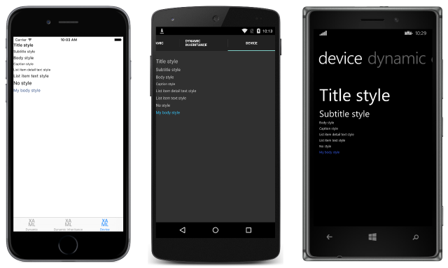
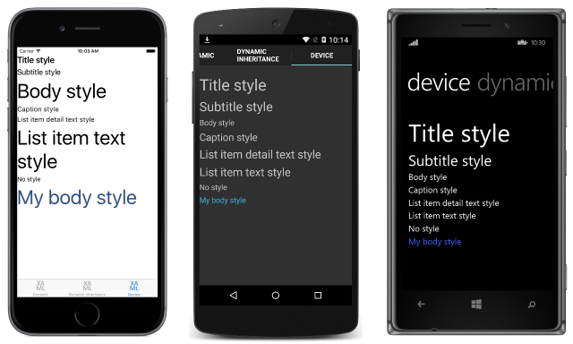

# Device Styles

_Xamarin.Forms includes six dynamic styles, known as device styles, in the Device.Styles class._

The *device* styles are:

- [`BodyStyle`](https://developer.xamarin.com/api/field/Xamarin.Forms.Device+Styles.BodyStyle/)
- [`CaptionStyle`](https://developer.xamarin.com/api/field/Xamarin.Forms.Device+Styles.CaptionStyle/)
- [`ListItemDetailTextStyle`](https://developer.xamarin.com/api/field/Xamarin.Forms.Device+Styles.ListItemDetailTextStyle/)
- [`ListItemTextStyle`](https://developer.xamarin.com/api/field/Xamarin.Forms.Device+Styles.ListItemTextStyle/)
- [`SubtitleStyle`](https://developer.xamarin.com/api/field/Xamarin.Forms.Device+Styles.SubtitleStyle/)
- [`TitleStyle`](https://developer.xamarin.com/api/field/Xamarin.Forms.Device+Styles.TitleStyle/)

All six styles can only be applied to [`Label`](https://developer.xamarin.com/api/type/Xamarin.Forms.Label/) instances. For example, a `Label` that's displaying the body of a paragraph might set its [`Style`](https://developer.xamarin.com/api/property/Xamarin.Forms.VisualElement.Style/) property to [`BodyStyle`](https://developer.xamarin.com/api/field/Xamarin.Forms.Device+Styles.BodyStyle/).

The following code example demonstrates using the *device* styles in a XAML page:

```xaml
<ContentPage xmlns="http://xamarin.com/schemas/2014/forms" xmlns:x="http://schemas.microsoft.com/winfx/2009/xaml" x:Class="Styles.DeviceStylesPage" Title="Device" Icon="xaml.png">
	<ContentPage.Resources>
		<ResourceDictionary>
			<Style x:Key="myBodyStyle" TargetType="Label"
			  BaseResourceKey="BodyStyle">
				<Setter Property="TextColor" Value="Accent" />
			</Style>
		</ResourceDictionary>
	</ContentPage.Resources>
	<ContentPage.Content>
		<StackLayout Padding="0,20,0,0">
			<Label Text="Title style"
			  Style="{DynamicResource TitleStyle}" />
			<Label Text="Subtitle text style"
			  Style="{DynamicResource SubtitleStyle}" />
			<Label Text="Body style"
			  Style="{DynamicResource BodyStyle}" />
			<Label Text="Caption style"
			  Style="{DynamicResource CaptionStyle}" />
			<Label Text="List item detail text style"
			  Style="{DynamicResource ListItemDetailTextStyle}" />
			<Label Text="List item text style"
			  Style="{DynamicResource ListItemTextStyle}" />
			<Label Text="No style" />
			<Label Text="My body style"
			  Style="{StaticResource myBodyStyle}" />
		</StackLayout>
	</ContentPage.Content>
</ContentPage>
```

The device styles are bound to using the `DynamicResource` markup extension. The dynamic nature of the styles can be seen in iOS by changing the **Accessibility** settings for text size. The appearance of the *device* styles is different on each platform, as shown in the following screenshots:


*Device* styles can also be derived from by setting the [`BaseResourceKey`](https://developer.xamarin.com/api/property/Xamarin.Forms.Style.BaseResourceKey/) property to the key name for the device style. In the code example above, `myBodyStyle` inherits from [`BodyStyle`](https://developer.xamarin.com/api/field/Xamarin.Forms.Device+Styles.BodyStyle/) and sets an accented text color. For more information about dynamic style inheritance, see [Dynamic Style Inheritance](~/xamarin-forms/user-interface/styles/dynamic.md#dynamic-style-inheritance).

The following code example demonstrates the equivalent page in C#:

```csharp
public class DeviceStylesPageCS : ContentPage
{
	public DeviceStylesPageCS ()
	{
		var myBodyStyle = new Style (typeof(Label)) {
			BaseResourceKey = Device.Styles.BodyStyleKey,
			Setters = {
				new Setter {
					Property = Label.TextColorProperty,
					Value = Color.Accent
				}
			}
		};

		Title = "Device";
		Icon = "csharp.png";
		Padding = new Thickness (0, 20, 0, 0);

		Content = new StackLayout {
			Children = {
				new Label { Text = "Title style", Style = Device.Styles.TitleStyle },
				new Label { Text = "Subtitle style", Style = Device.Styles.SubtitleStyle },
				new Label { Text = "Body style", Style = Device.Styles.BodyStyle },
				new Label { Text = "Caption style", Style = Device.Styles.CaptionStyle },
				new Label { Text = "List item detail text style",
				  Style = Device.Styles.ListItemDetailTextStyle },
				new Label { Text = "List item text style", Style = Device.Styles.ListItemTextStyle },
				new Label { Text = "No style" },
				new Label { Text = "My body style", Style = myBodyStyle }
			}
		};
	}
}
```

The [`Style`](https://developer.xamarin.com/api/property/Xamarin.Forms.VisualElement.Style/) property of each [`Label`](https://developer.xamarin.com/api/type/Xamarin.Forms.Label/) instance is set to the appropriate property from the [`Devices.Styles`](https://developer.xamarin.com/api/type/Xamarin.Forms.Device+Styles/) class.

## Accessibility

The *device* styles respect accessibility preferences, so font sizes will change as the accessibility preferences are altered on each platform. Therefore, to support accessible text, ensure that the *device* styles are used as the basis for any text styles within your application.

The following screenshots demonstrate the device styles on each platform, with the smallest accessible font size:

[](device-images/minimum-size-large.png#lightbox "Accessible Small Device Styles on Each Platform")

The following screenshots demonstrate the device styles on each platform, with the largest accessible font size:



## Summary

Xamarin.Forms includes six *dynamic* styles, known as *device* styles, in the [`Devices.Styles`](https://developer.xamarin.com/api/type/Xamarin.Forms.Device+Styles/) class. All six styles can only be applied to [`Label`](https://developer.xamarin.com/api/type/Xamarin.Forms.Label/) instances.


## Related Links

- [Text Styles](~/xamarin-forms/user-interface/text/styles.md)
- [XAML Markup Extensions](~/xamarin-forms/xaml/xaml-basics/xaml-markup-extensions.md)
- [Dynamic Styles (sample)](https://developer.xamarin.com/samples/xamarin-forms/UserInterface/Styles/DynamicStyles/)
- [Working with Styles (sample)](https://developer.xamarin.com/samples/xamarin-forms/WorkingWithStyles/)
- [Device.Styles](https://developer.xamarin.com/api/type/Xamarin.Forms.Device+Styles/)
- [ResourceDictionary](https://developer.xamarin.com/api/type/Xamarin.Forms.ResourceDictionary/)
- [Style](https://developer.xamarin.com/api/type/Xamarin.Forms.Style/)
- [Setter](https://developer.xamarin.com/api/type/Xamarin.Forms.Setter/)
