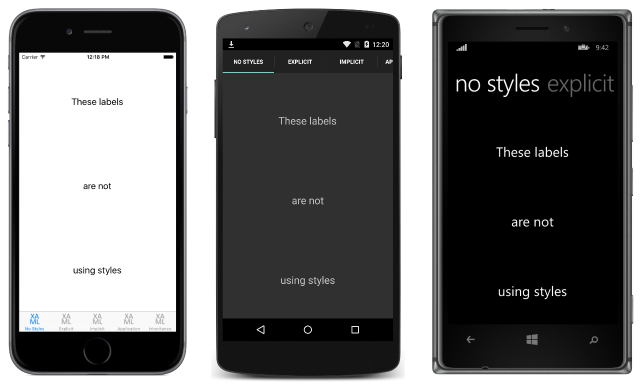

# Introduction to Styles

_Styles allow the appearance of visual elements to be customized. Styles are defined for a specific type and contain values for the properties available on that type._

Xamarin.Forms applications often contain multiple controls that have an identical appearance. For example, an application may have multiple [`Label`](https://developer.xamarin.com/api/type/Xamarin.Forms.Label/) instances that have the same font options and layout options, as shown in the following XAML code example:

```xaml
<ContentPage xmlns="http://xamarin.com/schemas/2014/forms"
    xmlns:x="http://schemas.microsoft.com/winfx/2009/xaml"
	x:Class="Styles.NoStylesPage"
	Title="No Styles"
	Icon="xaml.png">
	<ContentPage.Content>
		<StackLayout Padding="0,20,0,0">
			<Label Text="These labels"
			       HorizontalOptions="Center"
				   VerticalOptions="CenterAndExpand"
				   FontSize="Large" />
			<Label Text="are not"
			       HorizontalOptions="Center"
				   VerticalOptions="CenterAndExpand"
				   FontSize="Large" />
			<Label Text="using styles"
			       HorizontalOptions="Center"
				   VerticalOptions="CenterAndExpand"
				   FontSize="Large" />
		</StackLayout>
	</ContentPage.Content>
</ContentPage>
```

The following code example shows the equivalent page created in C#:

```csharp
public class NoStylesPageCS : ContentPage
{
	public NoStylesPageCS ()
	{
		Title = "No Styles";
		Icon = "csharp.png";
		Padding = new Thickness (0, 20, 0, 0);

		Content = new StackLayout {
			Children = {
				new Label {
					Text = "These labels",
					HorizontalOptions = LayoutOptions.Center,
					VerticalOptions = LayoutOptions.CenterAndExpand,
					FontSize = Device.GetNamedSize (NamedSize.Large, typeof(Label))
				},
				new Label {
					Text = "are not",
					HorizontalOptions = LayoutOptions.Center,
					VerticalOptions = LayoutOptions.CenterAndExpand,
					FontSize = Device.GetNamedSize (NamedSize.Large, typeof(Label))
				},
				new Label {
					Text = "using styles",
					HorizontalOptions = LayoutOptions.Center,
					VerticalOptions = LayoutOptions.CenterAndExpand,
					FontSize = Device.GetNamedSize (NamedSize.Large, typeof(Label))
				}
			}
		};
	}
}
```

Each [`Label`](https://developer.xamarin.com/api/type/Xamarin.Forms.Label/) instance has identical property values for controlling the appearance of the text displayed by the `Label`. This results in the appearance shown in the following screenshots:

[](introduction-images/no-styles-large.png "Label Appearance without Styles")

Setting the appearance of each individual control can be repetitive and error prone. Instead, a style can be created that defines the appearance, and then applied to the required controls.

## Creating a Style

The [`Style`](https://developer.xamarin.com/api/type/Xamarin.Forms.Style/) class groups a collection of property values into one object that can then be applied to multiple visual element instances. This helps to reduce repetitive markup, and allows an applications appearance to be more easily changed.

Although styles were designed primarily for XAML-based applications, they can also be created in C#:

- [`Style`](https://developer.xamarin.com/api/type/Xamarin.Forms.Style/) instances created in XAML are typically defined in a [`ResourceDictionary`](https://developer.xamarin.com/api/type/Xamarin.Forms.ResourceDictionary/) that's assigned to the [`Resources`](https://developer.xamarin.com/api/property/Xamarin.Forms.VisualElement.Resources/) collection of a control, page, or to the [`Resources`](https://developer.xamarin.com/api/property/Xamarin.Forms.Application.Resources/) collection of the application.
- [`Style`](https://developer.xamarin.com/api/type/Xamarin.Forms.Style/) instances created in C# are typically defined in the page's class, or in a class that can be globally accessed.

Choosing where to define a [`Style`](https://developer.xamarin.com/api/type/Xamarin.Forms.Style/) impacts where it can be used:

- [`Style`](https://developer.xamarin.com/api/type/Xamarin.Forms.Style/) instances defined at the control level can only be applied to the control and to its children.
- [`Style`](https://developer.xamarin.com/api/type/Xamarin.Forms.Style/) instances defined at the page level can only be applied to the page and to its children.
- [`Style`](https://developer.xamarin.com/api/type/Xamarin.Forms.Style/) instances defined at the application level can be applied throughout the application.

Each [`Style`](https://developer.xamarin.com/api/type/Xamarin.Forms.Style/) instance contains a collection of one or more [`Setter`](https://developer.xamarin.com/api/type/Xamarin.Forms.Setter/) objects, with each `Setter` having a [`Property`](https://developer.xamarin.com/api/property/Xamarin.Forms.Setter.Property/) and a [`Value`](https://developer.xamarin.com/api/property/Xamarin.Forms.Setter.Value/). The `Property` is the name of the bindable property of the element the style is applied to, and the `Value` is the value that is applied to the property.

Each [`Style`](https://developer.xamarin.com/api/type/Xamarin.Forms.Style/) instance can be *explicit*, or *implicit*:

- An *explicit* [`Style`](https://developer.xamarin.com/api/type/Xamarin.Forms.Style/) instance is defined by specifying a [`TargetType`](https://developer.xamarin.com/api/property/Xamarin.Forms.Style.TargetType/) and an `x:Key` value, and by setting the target element's [`Style`](https://developer.xamarin.com/api/property/Xamarin.Forms.VisualElement.Style/) property to the `x:Key` reference. For more information about *explicit* styles, see [Explicit Styles](~/xamarin-forms/user-interface/styles/explicit.md).
- An *implicit* [`Style`](https://developer.xamarin.com/api/type/Xamarin.Forms.Style/) instance is defined by specifying only a [`TargetType`](https://developer.xamarin.com/api/property/Xamarin.Forms.Style.TargetType/). The `Style` instance will then automatically be applied to all elements of that type. Note that subclasses of the `TargetType` do not automatically have the `Style` applied. For more information about *implicit* styles, see [Implicit Styles](~/xamarin-forms/user-interface/styles/implicit.md).

When creating a [`Style`](https://developer.xamarin.com/api/type/Xamarin.Forms.Style/), the [`TargetType`](https://developer.xamarin.com/api/property/Xamarin.Forms.Style.TargetType/) property is always required. The following code example shows an *explicit* style (note the `x:Key`) created in XAML:

```xaml
<Style x:Key="labelStyle" TargetType="Label">
	<Setter Property="HorizontalOptions" Value="Center" />
	<Setter Property="VerticalOptions" Value="CenterAndExpand" />
	<Setter Property="FontSize" Value="Large" />
</Style>
```

To apply a `Style`, the target object must be a [`VisualElement`](https://developer.xamarin.com/api/type/Xamarin.Forms.VisualElement/) that matches the [`TargetType`](https://developer.xamarin.com/api/property/Xamarin.Forms.Style.TargetType/) property value of the `Style`, as shown in the following XAML code example:

```xaml
<Label Text="Demonstrating an explicit style" Style="{StaticResource labelStyle}" />
```

Styles lower in the view hierarchy take precedence over those defined higher up. For example, setting a [`Style`](https://developer.xamarin.com/api/type/Xamarin.Forms.Style/) that sets [`Label.TextColor`](https://developer.xamarin.com/api/property/Xamarin.Forms.Label.TextColor/) to `Red` at the application level will be overridden by a page level style that sets `Label.TextColor` to `Green`. Similarly, a page level style will be overridden by a control level style. In addition, if `Label.TextColor` is set directly on a control property, this takes precedence over any styles.

The articles in this section demonstrate and explain how to create and apply *explicit* and *implicit* styles, how to create global styles, style inheritance, how to respond to style changes at runtime, and how to use the in-built styles included in Xamarin.Forms.

> [!NOTE]
> **What is StyleId?**
>
> Prior to Xamarin.Forms 2.2, the [`StyleId`](https://developer.xamarin.com/api/property/Xamarin.Forms.Element.StyleId/) property was used to identify individual elements in an application for identification in UI testing, and in theme engines such as Pixate. However, Xamarin.Forms 2.2 has introduced the [`AutomationId`](https://developer.xamarin.com/api/property/Xamarin.Forms.Element.AutomationId/) property, which has superseded the [`StyleId`](https://developer.xamarin.com/api/property/Xamarin.Forms.Element.StyleId/) property. For more information, see [Automate Xamarin.Forms testing with Xamarin.UITest and Test Cloud](~/xamarin-forms/deploy-test/uitest-and-test-cloud.md).

## Summary

Xamarin.Forms applications often contain multiple controls that have an identical appearance. Setting the appearance of each individual control can be repetitive and error prone. Instead, styles can be created that customize control appearance by grouping and settings properties available on the control type.


## Related Links

- [XAML Markup Extensions](~/xamarin-forms/xaml/xaml-basics/xaml-markup-extensions.md)
- [Style](https://developer.xamarin.com/api/type/Xamarin.Forms.Style/)
- [Setter](https://developer.xamarin.com/api/type/Xamarin.Forms.Setter/)
