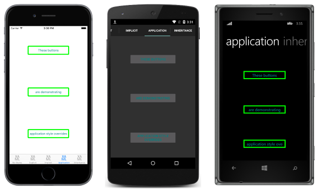
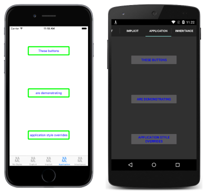

# Global Styles in Xamarin.Forms

[ Download the sample](/samples/xamarin/xamarin-forms-samples/userinterface-styles-basicstyles)

_Styles can be made available globally by adding them to the application's resource dictionary. This helps to avoid duplication of styles across pages or controls._

## Create a global style in XAML

By default, all Xamarin.Forms applications created from a template use the **App** class to implement the [`Application`](xref:Xamarin.Forms.Application) subclass. To declare a [`Style`](xref:Xamarin.Forms.Style) at the application level, in the application's [`ResourceDictionary`](xref:Xamarin.Forms.ResourceDictionary) using XAML, the default **App** class must be replaced with a XAML **App** class and associated code-behind. For more information, see [Working with the App Class](~/xamarin-forms/app-fundamentals/application-class.md).

The following code example shows a [`Style`](xref:Xamarin.Forms.Style) declared at the application level:

```xaml
<Application xmlns="http://xamarin.com/schemas/2014/forms" xmlns:x="http://schemas.microsoft.com/winfx/2009/xaml" x:Class="Styles.App">
    <Application.Resources>
        <ResourceDictionary>
            <Style x:Key="buttonStyle" TargetType="Button">
                <Setter Property="HorizontalOptions" Value="Center" />
                <Setter Property="VerticalOptions" Value="CenterAndExpand" />
                <Setter Property="BorderColor" Value="Lime" />
                <Setter Property="BorderRadius" Value="5" />
                <Setter Property="BorderWidth" Value="5" />
                <Setter Property="WidthRequest" Value="200" />
                <Setter Property="TextColor" Value="Teal" />
            </Style>
        </ResourceDictionary>
    </Application.Resources>
</Application>
```

This [`ResourceDictionary`](xref:Xamarin.Forms.ResourceDictionary) defines a single *explicit* style, `buttonStyle`, which will be used to set the appearance of [`Button`](xref:Xamarin.Forms.Button) instances. However, global styles can be *explicit* or *implicit*.

The following code example shows a XAML page applying the `buttonStyle` to the page's [`Button`](xref:Xamarin.Forms.Button) instances:

```xaml
<ContentPage xmlns="http://xamarin.com/schemas/2014/forms" xmlns:x="http://schemas.microsoft.com/winfx/2009/xaml" x:Class="Styles.ApplicationStylesPage" Title="Application" IconImageSource="xaml.png">
    <ContentPage.Content>
        <StackLayout Padding="0,20,0,0">
            <Button Text="These buttons" Style="{StaticResource buttonStyle}" />
            <Button Text="are demonstrating" Style="{StaticResource buttonStyle}" />
            <Button Text="application style overrides" Style="{StaticResource buttonStyle}" />
        </StackLayout>
    </ContentPage.Content>
</ContentPage>
```

This results in the appearance shown in the following screenshots:

[](application-images/application-styles-1-large.png#lightbox "Global Styles Example")

For information about creating styles in a page's [`ResourceDictionary`](xref:Xamarin.Forms.ResourceDictionary), see [Explicit Styles](~/xamarin-forms/user-interface/styles/explicit.md) and [Implicit Styles](~/xamarin-forms/user-interface/styles/implicit.md).

### Override styles

Styles lower in the view hierarchy take precedence over those defined higher up. For example, setting a [`Style`](xref:Xamarin.Forms.Style) that sets [`Button.TextColor`](xref:Xamarin.Forms.Button.TextColor) to `Red` at the application level will be overridden by a page level style that sets `Button.TextColor` to `Green`. Similarly, a page level style will be overridden by a control level style. In addition, if `Button.TextColor` is set directly on a control property, this will take precedence over any styles. This precedence is demonstrated in the following code example:

```xaml
<ContentPage xmlns="http://xamarin.com/schemas/2014/forms" xmlns:x="http://schemas.microsoft.com/winfx/2009/xaml" x:Class="Styles.ApplicationStylesPage" Title="Application" IconImageSource="xaml.png">
    <ContentPage.Resources>
        <ResourceDictionary>
            <Style x:Key="buttonStyle" TargetType="Button">
                ...
                <Setter Property="TextColor" Value="Red" />
            </Style>
        </ResourceDictionary>
    </ContentPage.Resources>
    <ContentPage.Content>
        <StackLayout Padding="0,20,0,0">
            <StackLayout.Resources>
                <ResourceDictionary>
                    <Style x:Key="buttonStyle" TargetType="Button">
                        ...
                        <Setter Property="TextColor" Value="Blue" />
                    </Style>
                </ResourceDictionary>
            </StackLayout.Resources>
            <Button Text="These buttons" Style="{StaticResource buttonStyle}" />
            <Button Text="are demonstrating" Style="{StaticResource buttonStyle}" />
            <Button Text="application style overrides" Style="{StaticResource buttonStyle}" />
        </StackLayout>
    </ContentPage.Content>
</ContentPage>
```

The original `buttonStyle`, defined at application level, is overridden by the `buttonStyle` instance defined at page level. In addition, the page level style is overridden by the control level `buttonStyle`. Therefore, the [`Button`](xref:Xamarin.Forms.Button) instances are displayed with blue text, as shown in the following screenshots:

[](application-images/application-styles-2-large.png#lightbox "Overriding Styles Example")

## Create a global style in C&#35;

[`Style`](xref:Xamarin.Forms.Style) instances can be added to the application's [`Resources`](xref:Xamarin.Forms.VisualElement.Resources) collection in C# by creating a new [`ResourceDictionary`](xref:Xamarin.Forms.ResourceDictionary), and then by adding the `Style` instances to the `ResourceDictionary`, as shown in the following code example:

```csharp
public class App : Application
{
    public App ()
    {
        var buttonStyle = new Style (typeof(Button)) {
            Setters = {
                ...
                new Setter { Property = Button.TextColorProperty,    Value = Color.Teal }
            }
        };

        Resources = new ResourceDictionary ();
        Resources.Add ("buttonStyle", buttonStyle);
        ...
    }
    ...
}
```

The constructor defines a single *explicit* style for applying to [`Button`](xref:Xamarin.Forms.Button) instances throughout the application. *Explicit* [`Style`](xref:Xamarin.Forms.Style) instances are added to the [`ResourceDictionary`](xref:Xamarin.Forms.ResourceDictionary) using the [`Add`](xref:Xamarin.Forms.ResourceDictionary.Add(System.String,System.Object)) method, specifying a `key` string to refer to the `Style` instance. The `Style` instance can then be applied to any controls of the correct type in the application. However, global styles can be *explicit* or *implicit*.

The following code example shows a C# page applying the `buttonStyle` to the page's [`Button`](xref:Xamarin.Forms.Button) instances:

```csharp
public class ApplicationStylesPageCS : ContentPage
{
    public ApplicationStylesPageCS ()
    {
        ...
        Content = new StackLayout {
            Children = {
                new Button { Text = "These buttons", Style = (Style)Application.Current.Resources ["buttonStyle"] },
                new Button { Text = "are demonstrating", Style = (Style)Application.Current.Resources ["buttonStyle"] },
                new Button { Text = "application styles", Style = (Style)Application.Current.Resources ["buttonStyle"]
                }
            }
        };
    }
}
```

The `buttonStyle` is applied to the [`Button`](xref:Xamarin.Forms.Button) instances by setting their [`Style`](xref:Xamarin.Forms.NavigableElement.Style) properties, and controls the appearance of the `Button` instances.

## Related links

- [XAML Markup Extensions](~/xamarin-forms/xaml/xaml-basics/xaml-markup-extensions.md)
- [Basic Styles (sample)](/samples/xamarin/xamarin-forms-samples/userinterface-styles-basicstyles)
- [Working with Styles (sample)](/samples/xamarin/xamarin-forms-samples/workingwithstyles)
- [ResourceDictionary](xref:Xamarin.Forms.ResourceDictionary)
- [Style](xref:Xamarin.Forms.Style)
- [Setter](xref:Xamarin.Forms.Setter)