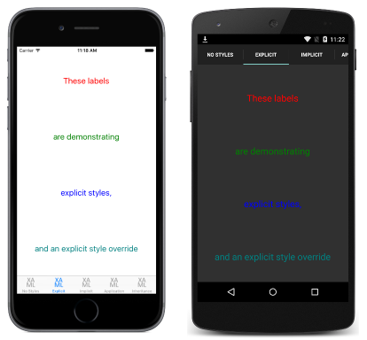

# Explicit Styles in Xamarin.Forms

[ Download the sample](/samples/xamarin/xamarin-forms-samples/userinterface-styles-basicstyles)

_An explicit style is one that is selectively applied to controls by setting their Style properties._

## Create an explicit style in XAML

To declare a [`Style`](xref:Xamarin.Forms.Style) at the page level, a [`ResourceDictionary`](xref:Xamarin.Forms.ResourceDictionary) must be added to the page and then one or more `Style` declarations can be included in the `ResourceDictionary`. A `Style` is made *explicit* by giving its declaration an `x:Key` attribute, which gives it a descriptive key in the `ResourceDictionary`. *Explicit* styles must then be applied to specific visual elements by setting their [`Style`](xref:Xamarin.Forms.NavigableElement.Style) properties.

The following code example shows *explicit* styles declared in XAML in a page's `ResourceDictionary` and applied to the page's [`Label`](xref:Xamarin.Forms.Label) instances:

```xaml
<ContentPage xmlns="http://xamarin.com/schemas/2014/forms" xmlns:x="http://schemas.microsoft.com/winfx/2009/xaml" x:Class="Styles.ExplicitStylesPage" Title="Explicit" IconImageSource="xaml.png">
    <ContentPage.Resources>
        <ResourceDictionary>
            <Style x:Key="labelRedStyle" TargetType="Label">
                <Setter Property="HorizontalOptions"
                        Value="Center" />
                <Setter Property="VerticalOptions"
                        Value="CenterAndExpand" />
                <Setter Property="FontSize" Value="Large" />
                <Setter Property="TextColor" Value="Red" />
            </Style>
            <Style x:Key="labelGreenStyle" TargetType="Label">
                ...
                <Setter Property="TextColor" Value="Green" />
            </Style>
            <Style x:Key="labelBlueStyle" TargetType="Label">
                ...
                <Setter Property="TextColor" Value="Blue" />
            </Style>
        </ResourceDictionary>
    </ContentPage.Resources>
    <ContentPage.Content>
        <StackLayout Padding="0,20,0,0">
            <Label Text="These labels"
                   Style="{StaticResource labelRedStyle}" />
            <Label Text="are demonstrating"
                   Style="{StaticResource labelGreenStyle}" />
            <Label Text="explicit styles,"
                   Style="{StaticResource labelBlueStyle}" />
            <Label Text="and an explicit style override"
                   Style="{StaticResource labelBlueStyle}"
                   TextColor="Teal" />
        </StackLayout>
    </ContentPage.Content>
</ContentPage>
```

The [`ResourceDictionary`](xref:Xamarin.Forms.ResourceDictionary) defines three *explicit* styles that are applied to the page's [`Label`](xref:Xamarin.Forms.Label) instances. Each `Style` is used to display text in a different color, while also setting the font size and horizontal and vertical layout options. Each `Style` is applied to a different `Label` by setting its [`Style`](xref:Xamarin.Forms.NavigableElement.Style) properties using the `StaticResource` markup extension. This results in the appearance shown in the following screenshots:

[](explicit-images/explicit-styles-large.png#lightbox)

In addition, the final [`Label`](xref:Xamarin.Forms.Label) has a [`Style`](xref:Xamarin.Forms.Style) applied to it, but also overrides the [`TextColor`](xref:Xamarin.Forms.Label.TextColor) property to a different `Color` value.

### Create an explicit style at the control level

In addition to creating *explicit* styles at the page level, they can also be created at the control level, as shown in the following code example:

```xaml
<ContentPage xmlns="http://xamarin.com/schemas/2014/forms" xmlns:x="http://schemas.microsoft.com/winfx/2009/xaml" x:Class="Styles.ExplicitStylesPage" Title="Explicit" IconImageSource="xaml.png">
    <ContentPage.Content>
        <StackLayout Padding="0,20,0,0">
            <StackLayout.Resources>
                <ResourceDictionary>
                    <Style x:Key="labelRedStyle" TargetType="Label">
                      ...
                    </Style>
                    ...
                </ResourceDictionary>
            </StackLayout.Resources>
            <Label Text="These labels" Style="{StaticResource labelRedStyle}" />
            ...
        </StackLayout>
    </ContentPage.Content>
</ContentPage>
```

In this example, the *explicit* [`Style`](xref:Xamarin.Forms.Style) instances are assigned to the [`Resources`](xref:Xamarin.Forms.VisualElement.Resources) collection of the [`StackLayout`](xref:Xamarin.Forms.StackLayout) control. The styles can then be applied to the control and its children.

For information about creating styles in an application's [`ResourceDictionary`](xref:Xamarin.Forms.ResourceDictionary), see [Global Styles](~/xamarin-forms/user-interface/styles/application.md).

## Create an explicit style in C&#35;

[`Style`](xref:Xamarin.Forms.Style) instances can be added to a page's [`Resources`](xref:Xamarin.Forms.VisualElement.Resources) collection in C# by creating a new [`ResourceDictionary`](xref:Xamarin.Forms.ResourceDictionary), and then by adding the `Style` instances to the `ResourceDictionary`, as shown in the following code example:

```csharp
public class ExplicitStylesPageCS : ContentPage
{
    public ExplicitStylesPageCS ()
    {
        var labelRedStyle = new Style (typeof(Label)) {
            Setters = {
                ...
                new Setter { Property = Label.TextColorProperty, Value = Color.Red    }
            }
        };
        var labelGreenStyle = new Style (typeof(Label)) {
            Setters = {
                ...
                new Setter { Property = Label.TextColorProperty, Value = Color.Green }
            }
        };
        var labelBlueStyle = new Style (typeof(Label)) {
            Setters = {
                ...
                new Setter { Property = Label.TextColorProperty, Value = Color.Blue }
            }
        };

        Resources = new ResourceDictionary ();
        Resources.Add ("labelRedStyle", labelRedStyle);
        Resources.Add ("labelGreenStyle", labelGreenStyle);
        Resources.Add ("labelBlueStyle", labelBlueStyle);
        ...

        Content = new StackLayout {
            Children = {
                new Label { Text = "These labels",
                            Style = (Style)Resources ["labelRedStyle"] },
                new Label { Text = "are demonstrating",
                            Style = (Style)Resources ["labelGreenStyle"] },
                new Label { Text = "explicit styles,",
                            Style = (Style)Resources ["labelBlueStyle"] },
                new Label {    Text = "and an explicit style override",
                            Style = (Style)Resources ["labelBlueStyle"], TextColor = Color.Teal }
            }
        };
    }
}
```

The constructor defines three *explicit* styles that are applied to the page's [`Label`](xref:Xamarin.Forms.Label) instances. Each *explicit* [`Style`](xref:Xamarin.Forms.Style) is added to the [`ResourceDictionary`](xref:Xamarin.Forms.ResourceDictionary) using the [`Add`](xref:Xamarin.Forms.ResourceDictionary.Add(System.String,System.Object)) method, specifying a `key` string to refer to the `Style` instance. Each `Style` is applied to a different `Label` by setting their [`Style`](xref:Xamarin.Forms.NavigableElement.Style) properties.

However, there is no advantage to using a [`ResourceDictionary`](xref:Xamarin.Forms.ResourceDictionary) here. Instead, [`Style`](xref:Xamarin.Forms.Style) instances can be assigned directly to the [`Style`](xref:Xamarin.Forms.NavigableElement.Style) properties of the required visual elements, and the `ResourceDictionary` can be removed, as shown in the following code example:

```csharp
public class ExplicitStylesPageCS : ContentPage
{
    public ExplicitStylesPageCS ()
    {
        var labelRedStyle = new Style (typeof(Label)) {
            ...
        };
        var labelGreenStyle = new Style (typeof(Label)) {
            ...
        };
        var labelBlueStyle = new Style (typeof(Label)) {
            ...
        };
        ...
        Content = new StackLayout {
            Children = {
                new Label { Text = "These labels", Style = labelRedStyle },
                new Label { Text = "are demonstrating", Style = labelGreenStyle },
                new Label { Text = "explicit styles,", Style = labelBlueStyle },
                new Label { Text = "and an explicit style override", Style = labelBlueStyle,
                            TextColor = Color.Teal }
            }
        };
    }
}
```

The constructor defines three *explicit* styles that are applied to the page's [`Label`](xref:Xamarin.Forms.Label) instances. Each `Style` is used to display text in a different color, while also setting the font size and horizontal and vertical layout options. Each `Style` is applied to a different `Label` by setting its [`Style`](xref:Xamarin.Forms.NavigableElement.Style) properties. In addition, the final `Label` has a `Style` applied to it, but also overrides the `TextColor` property to a different `Color` value.

## Related links

- [XAML Markup Extensions](~/xamarin-forms/xaml/xaml-basics/xaml-markup-extensions.md)
- [Basic Styles (sample)](/samples/xamarin/xamarin-forms-samples/userinterface-styles-basicstyles)
- [Working with Styles (sample)](/samples/xamarin/xamarin-forms-samples/workingwithstyles)
- [ResourceDictionary](xref:Xamarin.Forms.ResourceDictionary)
- [Style](xref:Xamarin.Forms.Style)
- [Setter](xref:Xamarin.Forms.Setter)