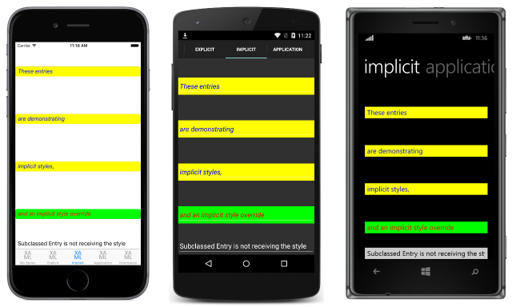

# Implicit Styles in Xamarin.Forms

[ Download the sample](/samples/xamarin/xamarin-forms-samples/userinterface-styles-basicstyles)

_An implicit style is one that's used by all controls of the same TargetType, without requiring each control to reference the style._

## Create an implicit style in XAML

To declare a [`Style`](xref:Xamarin.Forms.Style) at the page level, a [`ResourceDictionary`](xref:Xamarin.Forms.ResourceDictionary) must be added to the page and then one or more `Style` declarations can be included in the `ResourceDictionary`. A `Style` is made *implicit* by not specifying an `x:Key` attribute. The style will then be applied to visual elements that match the `TargetType` exactly, but not to elements that are derived from the `TargetType` value.

The following code example shows an *implicit* style declared in XAML in a page's `ResourceDictionary`, and applied to the page's [`Entry`](xref:Xamarin.Forms.Entry) instances:

```xaml
<ContentPage xmlns="http://xamarin.com/schemas/2014/forms" xmlns:x="http://schemas.microsoft.com/winfx/2009/xaml" xmlns:local="clr-namespace:Styles;assembly=Styles" x:Class="Styles.ImplicitStylesPage" Title="Implicit" IconImageSource="xaml.png">
    <ContentPage.Resources>
        <ResourceDictionary>
            <Style TargetType="Entry">
                <Setter Property="HorizontalOptions" Value="Fill" />
                <Setter Property="VerticalOptions" Value="CenterAndExpand" />
                <Setter Property="BackgroundColor" Value="Yellow" />
                <Setter Property="FontAttributes" Value="Italic" />
                <Setter Property="TextColor" Value="Blue" />
            </Style>
        </ResourceDictionary>
    </ContentPage.Resources>
    <ContentPage.Content>
        <StackLayout Padding="0,20,0,0">
            <Entry Text="These entries" />
            <Entry Text="are demonstrating" />
            <Entry Text="implicit styles," />
            <Entry Text="and an implicit style override" BackgroundColor="Lime" TextColor="Red" />
            <local:CustomEntry Text="Subclassed Entry is not receiving the style" />
        </StackLayout>
    </ContentPage.Content>
</ContentPage>
```

The [`ResourceDictionary`](xref:Xamarin.Forms.ResourceDictionary) defines a single *implicit* style that's applied to the page's [`Entry`](xref:Xamarin.Forms.Entry) instances. The `Style` is used to display blue text on a yellow background, while also setting other appearance options. The `Style` is added to the page's [`ResourceDictionary`](xref:Xamarin.Forms.ResourceDictionary) without specifying an `x:Key` attribute. Therefore, the `Style` is applied to all the `Entry` instances implicitly as they match the [`TargetType`](xref:Xamarin.Forms.Style.TargetType) property of the `Style` exactly. However, the `Style` is not applied to the `CustomEntry` instance, which is a subclassed `Entry`. This results in the appearance shown in the following screenshots:

[](implicit-images/implicit-styles-large.png#lightbox)

In addition, the fourth [`Entry`](xref:Xamarin.Forms.Entry) overrides the [`BackgroundColor`](xref:Xamarin.Forms.VisualElement.BackgroundColor) and [`TextColor`](xref:Xamarin.Forms.InputView.TextColor) properties of the implicit style to different `Color` values.

### Create an implicit style at the control level

In addition to creating *implicit* styles at the page level, they can also be created at the control level, as shown in the following code example:

```xaml
<ContentPage xmlns="http://xamarin.com/schemas/2014/forms" xmlns:x="http://schemas.microsoft.com/winfx/2009/xaml" xmlns:local="clr-namespace:Styles;assembly=Styles" x:Class="Styles.ImplicitStylesPage" Title="Implicit" IconImageSource="xaml.png">
    <ContentPage.Content>
        <StackLayout Padding="0,20,0,0">
            <StackLayout.Resources>
                <ResourceDictionary>
                    <Style TargetType="Entry">
                        <Setter Property="HorizontalOptions" Value="Fill" />
                        ...
                    </Style>
                </ResourceDictionary>
            </StackLayout.Resources>
            <Entry Text="These entries" />
            ...
        </StackLayout>
    </ContentPage.Content>
</ContentPage>
```

In this example, the *implicit* [`Style`](xref:Xamarin.Forms.Style) is assigned to the [`Resources`](xref:Xamarin.Forms.VisualElement.Resources) collection of the [`StackLayout`](xref:Xamarin.Forms.StackLayout) control. The *implicit* style can then be applied to the control and its children.

For information about creating styles in an application's [`ResourceDictionary`](xref:Xamarin.Forms.ResourceDictionary), see [Global Styles](~/xamarin-forms/user-interface/styles/application.md).

## Create an implicit style in C&#35;

[`Style`](xref:Xamarin.Forms.Style) instances can be added to a page's [`Resources`](xref:Xamarin.Forms.VisualElement.Resources) collection in C# by creating a new [`ResourceDictionary`](xref:Xamarin.Forms.ResourceDictionary), and then by adding the `Style` instances to the `ResourceDictionary`, as shown in the following code example:

```csharp
public class ImplicitStylesPageCS : ContentPage
{
    public ImplicitStylesPageCS ()
    {
        var entryStyle = new Style (typeof(Entry)) {
            Setters = {
                ...
                new Setter { Property = Entry.TextColorProperty, Value = Color.Blue }
            }
        };

        ...
        Resources = new ResourceDictionary ();
        Resources.Add (entryStyle);

        Content = new StackLayout {
            Children = {
                new Entry { Text = "These entries" },
                new Entry { Text = "are demonstrating" },
                new Entry { Text = "implicit styles," },
                new Entry { Text = "and an implicit style override", BackgroundColor = Color.Lime, TextColor = Color.Red },
                new CustomEntry  { Text = "Subclassed Entry is not receiving the style" }
            }
        };
    }
}
```

The constructor defines a single *implicit* style that's applied to the page's [`Entry`](xref:Xamarin.Forms.Entry) instances. The `Style` is used to display blue text on a yellow background, while also setting other appearance options. The `Style` is added to the page's [`ResourceDictionary`](xref:Xamarin.Forms.ResourceDictionary) without specifying a `key` string. Therefore, the `Style` is applied to all the `Entry` instances implicitly as they match the [`TargetType`](xref:Xamarin.Forms.Style.TargetType) property of the `Style` exactly. However, the `Style` is not applied to the `CustomEntry` instance, which is a subclassed `Entry`.

## Apply a style to derived types

The [`Style.ApplyToDerivedTypes`](xref:Xamarin.Forms.Style.ApplyToDerivedTypes) property enables a style to be applied to controls that are derived from the base type referenced by the [`TargetType`](xref:Xamarin.Forms.Style.TargetType) property. Therefore, setting this property to `true` enables a single style to target multiple types, provided that the types derive from the base type specified in the `TargetType` property.

The following example shows an implicit style that sets the background color of [`Button`](xref:Xamarin.Forms.Button) instances to red:

```xaml
<Style TargetType="Button"
       ApplyToDerivedTypes="True">
    <Setter Property="BackgroundColor"
            Value="Red" />
</Style>
```

Placing this style in a page-level [`ResourceDictionary`](xref:Xamarin.Forms.ResourceDictionary) will result in it being applied to all [`Button`](xref:Xamarin.Forms.Button) instances on the page, and also to any controls that derive from `Button`. However, if the [`ApplyToDerivedTypes`](xref:Xamarin.Forms.Style.ApplyToDerivedTypes) property remained unset, the style would only be applied to `Button` instances.

The equivalent C# code is:

```csharp
var buttonStyle = new Style(typeof(Button))
{
    ApplyToDerivedTypes = true,
    Setters =
    {
        new Setter
        {
            Property = VisualElement.BackgroundColorProperty,
            Value = Color.Red
        }
    }
};

Resources = new ResourceDictionary { buttonStyle };
```

## Related links

- [XAML Markup Extensions](~/xamarin-forms/xaml/xaml-basics/xaml-markup-extensions.md)
- [Basic Styles (sample)](/samples/xamarin/xamarin-forms-samples/userinterface-styles-basicstyles)
- [Working with Styles (sample)](/samples/xamarin/xamarin-forms-samples/workingwithstyles)
- [ResourceDictionary](xref:Xamarin.Forms.ResourceDictionary)
- [Style](xref:Xamarin.Forms.Style)
- [Setter](xref:Xamarin.Forms.Setter)