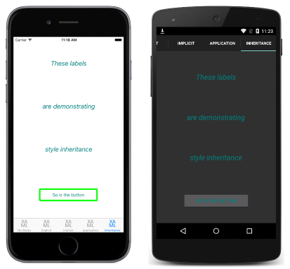

# Style Inheritance in Xamarin.Forms

[ Download the sample](/samples/xamarin/xamarin-forms-samples/userinterface-styles-basicstyles)

_Styles can inherit from other styles to reduce duplication and enable reuse._

## Style inheritance in XAML

Style inheritance is performed by setting the [`Style.BasedOn`](xref:Xamarin.Forms.Style.BasedOn) property to an existing [`Style`](xref:Xamarin.Forms.Style). In XAML, this is achieved by setting the `BasedOn` property to a `StaticResource` markup extension that references a previously created `Style`. In C#, this is achieved by setting the `BasedOn` property to a `Style` instance.

Styles that inherit from a base style can include [`Setter`](xref:Xamarin.Forms.Setter) instances for new properties, or use them to override styles from the base style. In addition, styles that inherit from a base style must target the same type, or a type that derives from the type targeted by the base style. For example, if a base style targets [`View`](xref:Xamarin.Forms.View) instances, styles that are based on the base style can target `View` instances or types that derive from the `View` class, such as [`Label`](xref:Xamarin.Forms.Label) and [`Button`](xref:Xamarin.Forms.Button) instances.

The following code demonstrates *explicit* style inheritance in a XAML page:

```xaml
<ContentPage xmlns="http://xamarin.com/schemas/2014/forms" xmlns:x="http://schemas.microsoft.com/winfx/2009/xaml" x:Class="Styles.StyleInheritancePage" Title="Inheritance" IconImageSource="xaml.png">
    <ContentPage.Resources>
        <ResourceDictionary>
            <Style x:Key="baseStyle" TargetType="View">
                <Setter Property="HorizontalOptions"
                        Value="Center" />
                <Setter Property="VerticalOptions"
                        Value="CenterAndExpand" />
            </Style>
            <Style x:Key="labelStyle" TargetType="Label"
                   BasedOn="{StaticResource baseStyle}">
                ...
                <Setter Property="TextColor" Value="Teal" />
            </Style>
            <Style x:Key="buttonStyle" TargetType="Button"
                   BasedOn="{StaticResource baseStyle}">
                <Setter Property="BorderColor" Value="Lime" />
                ...
            </Style>
        </ResourceDictionary>
    </ContentPage.Resources>
    <ContentPage.Content>
        <StackLayout Padding="0,20,0,0">
            <Label Text="These labels"
                   Style="{StaticResource labelStyle}" />
            ...
            <Button Text="So is the button"
                    Style="{StaticResource buttonStyle}" />
        </StackLayout>
    </ContentPage.Content>
</ContentPage>
```

The `baseStyle` targets [`View`](xref:Xamarin.Forms.View) instances, and sets the [`HorizontalOptions`](xref:Xamarin.Forms.View.HorizontalOptions) and [`VerticalOptions`](xref:Xamarin.Forms.View.VerticalOptions) properties. The `baseStyle` is not set directly on any controls. Instead, `labelStyle` and `buttonStyle` inherit from it, setting additional bindable property values. The `labelStyle` and `buttonStyle` are then applied to the [`Label`](xref:Xamarin.Forms.Label) instances and [`Button`](xref:Xamarin.Forms.Button) instance, by setting their [`Style`](xref:Xamarin.Forms.NavigableElement.Style) properties. This results in the appearance shown in the following screenshots:

[](inheritance-images/style-inheritance-large.png#lightbox)

> [!NOTE]
> An implicit style can be derived from an explicit style, but an explicit style can't be derived from an implicit style.

### Respecting the inheritance chain

A style can only inherit from styles at the same level, or above, in the view hierarchy. This means that:

- An application level resource can only inherit from other application level resources.
- A page level resource can inherit from application level resources, and other page level resources.
- A control level resource can inherit from application level resources, page level resources, and other control level resources.

This inheritance chain is demonstrated in the following code example:

```xaml
<ContentPage xmlns="http://xamarin.com/schemas/2014/forms" xmlns:x="http://schemas.microsoft.com/winfx/2009/xaml" x:Class="Styles.StyleInheritancePage" Title="Inheritance" IconImageSource="xaml.png">
    <ContentPage.Resources>
        <ResourceDictionary>
            <Style x:Key="baseStyle" TargetType="View">
              ...
            </Style>
        </ResourceDictionary>
    </ContentPage.Resources>
    <ContentPage.Content>
        <StackLayout Padding="0,20,0,0">
            <StackLayout.Resources>
                <ResourceDictionary>
                    <Style x:Key="labelStyle" TargetType="Label" BasedOn="{StaticResource baseStyle}">
                      ...
                    </Style>
                    <Style x:Key="buttonStyle" TargetType="Button" BasedOn="{StaticResource baseStyle}">
                      ...
                    </Style>
                </ResourceDictionary>
            </StackLayout.Resources>
            ...
        </StackLayout>
    </ContentPage.Content>
</ContentPage>
```

In this example, `labelStyle` and `buttonStyle` are control level resources, while `baseStyle` is a page level resource. However, while `labelStyle` and `buttonStyle` inherit from `baseStyle`, it's not possible for `baseStyle` to inherit from `labelStyle` or `buttonStyle`, due to their respective locations in the view hierarchy.

## Style inheritance in C&#35;

The equivalent C# page, where [`Style`](xref:Xamarin.Forms.Style) instances are assigned directly to the [`Style`](xref:Xamarin.Forms.NavigableElement.Style) properties of the required controls, is shown in the following code example:

```csharp
public class StyleInheritancePageCS : ContentPage
{
    public StyleInheritancePageCS ()
    {
        var baseStyle = new Style (typeof(View)) {
            Setters = {
                new Setter {
                    Property = View.HorizontalOptionsProperty, Value = LayoutOptions.Center    },
                ...
            }
        };

        var labelStyle = new Style (typeof(Label)) {
            BasedOn = baseStyle,
            Setters = {
                ...
                new Setter { Property = Label.TextColorProperty, Value = Color.Teal    }
            }
        };

        var buttonStyle = new Style (typeof(Button)) {
            BasedOn = baseStyle,
            Setters = {
                new Setter { Property = Button.BorderColorProperty, Value =    Color.Lime },
                ...
            }
        };
        ...

        Content = new StackLayout {
            Children = {
                new Label { Text = "These labels", Style = labelStyle },
                ...
                new Button { Text = "So is the button", Style = buttonStyle }
            }
        };
    }
}
```

The `baseStyle` targets [`View`](xref:Xamarin.Forms.View) instances, and sets the [`HorizontalOptions`](xref:Xamarin.Forms.View.HorizontalOptions) and [`VerticalOptions`](xref:Xamarin.Forms.View.VerticalOptions) properties. The `baseStyle` is not set directly on any controls. Instead, `labelStyle` and `buttonStyle` inherit from it, setting additional bindable property values. The `labelStyle` and `buttonStyle` are then applied to the [`Label`](xref:Xamarin.Forms.Label) instances and [`Button`](xref:Xamarin.Forms.Button) instance, by setting their [`Style`](xref:Xamarin.Forms.NavigableElement.Style) properties.

## Related links

- [XAML Markup Extensions](~/xamarin-forms/xaml/xaml-basics/xaml-markup-extensions.md)
- [Basic Styles (sample)](/samples/xamarin/xamarin-forms-samples/userinterface-styles-basicstyles)
- [Working with Styles (sample)](/samples/xamarin/xamarin-forms-samples/workingwithstyles)
- [ResourceDictionary](xref:Xamarin.Forms.ResourceDictionary)
- [Style](xref:Xamarin.Forms.Style)
- [Setter](xref:Xamarin.Forms.Setter)