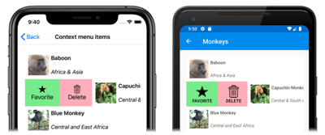
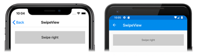
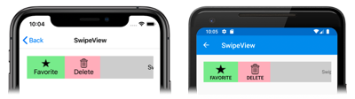

# Xamarin.Forms SwipeView


[ Download the sample](https://docs.microsoft.com/samples/xamarin/xamarin-forms-samples/userinterface-swipeviewdemos/)

The `SwipeView` is a container control that wraps around an item of content, and provides context menu items that are revealed by a swipe gesture:

[](swipeview-images/swipeview-collectionview-large.png#lightbox "SwipeView swipe items")

`SwipeView` is available in Xamarin.Forms 4.4. However, it's currently experimental and can only be used by adding the following line of code to your `AppDelegate` class on iOS, to your `MainActivity` class on Android, or to your `App` class on UWP, before calling `Forms.Init`:

```csharp
Forms.SetFlags("SwipeView_Experimental");
```

`SwipeView` defines the following properties:

- `LeftItems`, of type `SwipeItems`, which represents the context items that can be invoked when the control is swiped from the left side.
- `RightItems`, of type `SwipeItems`, which represents the context items that can be invoked when the control is swiped from the right side.
- `TopItems`, of type `SwipeItems`, which represents the context items that can be invoked when the control is swiped from the top down.
- `BottomItems`, of type `SwipeItems`, which represents the context items that can be invoked when the control is swiped from the bottom up.

These properties are backed by [`BindableProperty`](xref:Xamarin.Forms.BindableProperty) objects, which means that they can be targets of data bindings, and styled.

In addition, the `SwipeView` inherits the [`Content`](xref:Xamarin.Forms.ContentView.Content) property from the [`ContentView`](xref:Xamarin.Forms.ContentView) class. The `Content` property is the content property of the `SwipeView` class, and therefore does not need to be explicitly set.

The `SwipeView` class also defines four events:

- `SwipeStarted` is fired when a swipe starts. The `SwipeStartedEventArgs` object that accompanies this event has a `SwipeDirection` property, of type `SwipeDirection`.
- `SwipeChanging` is fired as the swipe moves. The `SwipeChangingEventArgs` object that accompanies this event has a `SwipeDirection` property, of type `SwipeDirection`, and an `Offset` property of type `double`.
- `SwipeEnded` is fired when a swipe ends. The `SwipeEndedEventArgs` object that accompanies this event has a `SwipeDirection` property, of type `SwipeDirection`.
- `CloseRequested` is fired when the context menu items are closed.

In addition, `SwipeView` defines a `Close` method, which closes the context menu items.

## Create a SwipeView

A `SwipeView` has two components that must be defined: the content that the `SwipeView` wraps around, and the swipe context items. The swipe context items are one or more `SwipeItem` objects that are placed in one of the four `SwipeView` directional collections - `LeftItems`, `RightItems`, `TopItems`, or `BottomItems`.

The following example shows how to instantiate a `SwipeView` in XAML:

```xaml
<SwipeView>
    <SwipeView.LeftItems>
        <SwipeItems>
            <SwipeItem Text="Favorite"
                       IconImageSource="favorite.png"
                       BackgroundColor="LightGreen"
                       Invoked="OnFavoriteSwipeItemInvoked" />
            <SwipeItem Text="Delete"
                       IconImageSource="delete.png"
                       BackgroundColor="LightPink"
                       Invoked="OnDeleteSwipeItemInvoked" />
        </SwipeItems>
    </SwipeView.LeftItems>
    <!-- Content -->
    <Grid HeightRequest="60"
          WidthRequest="300"
          BackgroundColor="LightGray">
        <Label Text="Swipe right"
               HorizontalOptions="Center"
               VerticalOptions="Center" />
    </Grid>
</SwipeView>
```

In this example, the `SwipeView` content is a [`Grid`](xref:Xamarin.Forms.Grid) that contains a [`Label`](xref:Xamarin.Forms.Label):

[](swipeview-images/swipeview-content-large.png#lightbox "SwipeView content")

The swipe context items are used to **Favorite** and **Delete** the `SwipeView` content, and are revealed when the control is swiped from the left side.

[](swipeview-images/swipeview-swipeitems-large.png#lightbox "SwipeView swipe items")

By default, a swipe context action is executed when it is tapped by the user. However, this behavior can be changed. For more information, see [Swipe mode](#swipe-mode).

By default, once a swipe context action has been executed the context actions are hidden and the `SwipeView` content is re-displayed. However, this behavior can be changed. For more information, see [Swipe behavior](#swipe-behavior).

> [!NOTE]
> Swipe content and swipe items can be placed inline, or defined as resources.

## Swipe items

The `LeftItems`, `RightItems`, `TopItems`, and `BottomItems` collections are all of type `SwipeItems`. The `SwipeItems` class defines the following properties:

- `Mode`, of type `SwipeMode`, which indicates the effect of a swipe interaction. For more information about swipe mode, see [Swipe mode](#swipe-mode).
- `SwipeBehaviorOnInvoked`, of type `SwipeBehaviorOnInvoked`, which indicates how a `SwipeView` behaves after an item is invoked. For more information about swipe behavior, see [Swipe behavior](#swipe-behavior).

These properties are backed by [`BindableProperty`](xref:Xamarin.Forms.BindableProperty) objects, which means that they can be targets of data bindings, and styled.

Each swipe item is a `SwipeItem` object that's placed in one of the four `SwipeView` directional collections. The `SwipeItem` class derives from the [`MenuItem`](xref:Xamarin.Forms.MenuItem) class, and adds the following members:

- A `BackgroundColor` property, of type `Color`, that defines the background color of the swipe item. This property is backed by a bindable property.
- An `Invoked` event, which is fired when the swipe item is executed.

> [!IMPORTANT]
> The [`MenuItem`](xref:Xamarin.Forms.MenuItem) class defines several properties, including `Command`, `CommandParameter`, `IconImageSource`, and `Text`. These properties can be set on a `SwipeItem` object to define its appearance, and to define an `ICommand` that executes when the swipe item is invoked. For more information, see [Xamarin.Forms MenuItem](~/xamarin-forms/user-interface/menuitem.md).

The following example shows two `SwipeItem` objects in the `LeftItems` collection of a `SwipeView`:

```xaml
<SwipeView>
    <SwipeView.LeftItems>
        <SwipeItems>
            <SwipeItem Text="Favorite"
                       IconImageSource="favorite.png"
                       BackgroundColor="LightGreen"
                       Invoked="OnFavoriteSwipeItemInvoked" />
            <SwipeItem Text="Delete"
                       IconImageSource="delete.png"
                       BackgroundColor="LightPink"
                       Invoked="OnDeleteSwipeItemInvoked" />
        </SwipeItems>
    </SwipeView.LeftItems>
    <!-- Content -->
</SwipeView>
```

The appearance of each `SwipeItem` is defined by the `Text`, `IconImageSource`, and `BackgroundColor` properties:

[](swipeview-images/swipeview-swipeitems-large.png#lightbox "SwipeView swipe items")

When a `SwipeItem` is tapped, its `Invoked` event fires and is handled by its registered event handler. Alternatively, the `Command` property can be set to an `ICommand` implementation that will be executed when the `SwipeItem` is invoked.

> [!NOTE]
> In addition to defining swipe items as `SwipeItem` objects, it's also possible to define custom swipe item views. For more information, see [Custom swipe items](#custom-swipe-items).

## Custom swipe items

Custom swipe items can be defined with the `SwipeItemView` type. The `SwipeItemView` class derives from the [`ContentView`](xref:Xamarin.Forms.ContentView) class, and adds the following properties:

- `Command`, of type `ICommand`, which is executed when an item is tapped.
- `CommandParameter`, of type `object`, which is the parameter that's passed to the `Command`.

These properties are backed by [`BindableProperty`](xref:Xamarin.Forms.BindableProperty) objects, which means that they can be targets of data bindings, and styled.

The `SwipeItemView` class also defines an `Invoked` event that's fired when the item is tapped, after the `Command` is executed.

The following example shows a `SwipeItemView` object in the `LeftItems` collection of a `SwipeView`:

```xaml
<SwipeView>
    <SwipeView.LeftItems>
        <SwipeItems>
            <SwipeItemView Command="{Binding CheckAnswerCommand}"
                           CommandParameter="{Binding Source={x:Reference resultEntry}, Path=Text}">
                <StackLayout Margin="10"
                             WidthRequest="300">
                    <Entry x:Name="resultEntry"
                           Placeholder="Enter answer"
                           HorizontalOptions="CenterAndExpand" />
                    <Label Text="Check"
                           FontAttributes="Bold"
                           HorizontalOptions="Center" />
                </StackLayout>
            </SwipeItemView>
        </SwipeItems>
    </SwipeView.LeftItems>
    <!-- Content -->
</SwipeView>
```

In this example, the `SwipeItemView` comprises a [`StackLayout`](xref:Xamarin.Forms.StackLayout) containing an [`Entry`](xref:Xamarin.Forms.Entry) and a [`Label`](xref:Xamarin.Forms.Label). After the user enters input into the `Entry`, the rest of the `SwipeViewItem` can be tapped which executes the `ICommand` defined by the `SwipeItemView.Command` property.

## Swipe direction

`SwipeView` supports four different swipe directions, with the swipe direction being defined by the directional collection the `SwipeItem` objects are added to. Each swipe direction can hold its own swipe items. For example, the following example shows a `SwipeView` whose swipe items depend on the swipe direction:

```xaml
<SwipeView>
    <SwipeView.LeftItems>
        <SwipeItems>
            <SwipeItem Text="Delete"
                       IconImageSource="delete.png"
                       BackgroundColor="LightPink"
                       Command="{Binding DeleteCommand}" />
        </SwipeItems>
    </SwipeView.LeftItems>
    <SwipeView.RightItems>
        <SwipeItems>
            <SwipeItem Text="Favorite"
                       IconImageSource="favorite.png"
                       BackgroundColor="LightGreen"
                       Command="{Binding FavoriteCommand}" />
            <SwipeItem Text="Share"
                       IconImageSource="share.png"
                       BackgroundColor="LightYellow"
                       Command="{Binding ShareCommand}" />
        </SwipeItems>
    </SwipeView.RightItems>
    <!-- Content -->
</SwipeView>
```

In this example, the `SwipeView` content can be swiped right or left. Swiping to the right will show the **Delete** swipe item, while swiping to the left will show the **Favorite** and **Share** swipe items.

> [!WARNING]
> Only one instance of a directional collection can be set at a time on a `SwipeView`. Therefore, you cannot have two `LeftItems` definitions on a `SwipeView`.

The `SwipeStarted`, `SwipeChanging`, and `SwipeEnded` events report the swipe direction via a `SwipeDirection` property in the event arguments. This property is of type `SwipeDirection`, which is an enumeration consisting of four members:

- `Right` indicates that a right swipe occurred.
- `Left` indicates that a left swipe occurred.
- `Up` indicates that an upwards swipe occurred.
- `Down` indicates that a downwards swipe occurred.

## Swipe mode

The `SwipeItems` class has a `Mode` property, which indicates the effect of a swipe interaction. This property should be set to one of the `SwipeMode` enumeration members:

- `Reveal` indicates that a swipe reveals the swipe items. This is the default value of the `SwipeItems.Mode` property.
- `Execute` indicates that a swipe executes the swipe items.

In reveal mode, the user swipes a `SwipeView` to open a menu consisting of one or more context items, and must explicitly tap a swipe item to execute it. After the swipe item has been executed the swipe items are hidden and the `SwipeView` content is re-displayed. In execute mode, the user swipes a `SwipeView` to open a menu consisting of one more context items, which are then automatically executed. Following execution, the swipe items are hidden and the `SwipeView` content is re-displayed.

The following example shows a `SwipeView` configured to use execute mode:

```xaml
<SwipeView>
    <SwipeView.LeftItems>
        <SwipeItems Mode="Execute">
            <SwipeItem Text="Delete"
                       IconImageSource="delete.png"
                       BackgroundColor="LightPink"
                       Command="{Binding DeleteCommand}" />
        </SwipeItems>
    </SwipeView.LeftItems>
    <!-- Content -->
</SwipeView>
```

In this example, the `SwipeView` content can be swiped right to reveal the **Delete** swipe item, which is executed immediately. Following execution, the `SwipeView` content is re-displayed.

## Swipe behavior

The `SwipeItems` class has a `SwipeBehaviorOnInvoked` property, which indicates how a `SwipeView` behaves after an item is invoked. This property should be set to one of the `SwipeBehaviorOnInvoked` enumeration members:

- `Auto` indicates that in reveal mode the `SwipeView` closes after an item is invoked, whereas in execute mode the `SwipeView` remains open after an item is invoked. This is the default value of the `SwipeBehaviorOnInvoked` property.
- `Close` indicates that the `SwipeView` closes after an item is invoked.
- `RemainOpen` indicates that the `SwipeView` remains open after an item is invoked.

The following example shows a `SwipeView` configured to remain open after an item is invoked:

```xaml
<SwipeView>
    <SwipeView.LeftItems>
        <SwipeItems SwipeBehaviorOnInvoked="RemainOpen">
            <SwipeItem Text="Favorite"
                       IconImageSource="favorite.png"
                       BackgroundColor="LightGreen"
                       Invoked="OnFavoriteSwipeItemInvoked" />
            <SwipeItem Text="Delete"
                       IconImageSource="delete.png"
                       BackgroundColor="LightPink"
                       Invoked="OnDeleteSwipeItemInvoked" />
        </SwipeItems>
    </SwipeView.LeftItems>
    <!-- Content -->
</SwipeView>
```

## Disable a SwipeView

An application may enter a state where swiping an item is not a valid operation. In such cases, the `SwipeView` can be disabled by setting its `IsEnabled` property to `false`. This will prevent users from being able to swipe to reveal context menu items.

In addition, when defining the `Command` property of a `SwipeItem` or `SwipeItemView`, the `CanExecute` delegate of the `ICommand` can be specified to enable or disable the swipe item.

## Related links

- [SwipeView (sample)](https://docs.microsoft.com/samples/xamarin/xamarin-forms-samples/userinterface-swipeviewdemos/)
