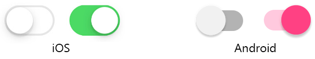

# Xamarin.Forms Switch

[ Download the sample](https://github.com/xamarin/xamarin-forms-samples/tree/master/UserInterface/SwitchDemos)

The Xamarin.Forms [`Switch`](xref:Xamarin.Forms.Switch) is a horizontal toggle button that can be manipulated by the user to toggle between on and off states, which are represented by a `boolean` value. The `Switch` class inherits from [`View`](xref:Xamarin.Forms.View).

The following screenshot shows a `Switch` control in its **on** and **off** toggle states on iOS and Android:



The `Switch` control defines two properties:

* [`OnColor`](xref:Xamarin.Forms.Switch.OnColor) is a `Color` that affects how the `Switch` is rendered in the toggled, or **on**, state.
* [`IsToggled`](xref:Xamarin.Forms.Switch.IsToggled) is a `boolean` value that indicates whether the the `Switch` is **on**.

These properties are backed by a [`BindableProperty`](xref:Xamarin.Forms.BindableProperty) object, which means the `Switch` can be styled and be the target of data bindings.

The `Switch` control defines a `Toggled` event that is fired when the `IsToggled` property changes, either through user manipulation or when an application sets the `IsToggled` property. The `ToggledEventArgs` object that accompanies the `Toggled` event has a single property named `Value`, of type `bool`. When the event is fired, the value of the `Value` property reflects the new value of the `IsToggled` property.

## Create a Switch

A `Switch` can be instantiated in XAML. Its `IsToggled` property can be set to toggle the `Switch`. By default, the `IsToggled` property is `false`. The following example shows how to instantiate a `Switch` in XAML with the optional `IsToggled` property set:

```xaml
<Switch IsToggled="true"/>
```

A `Switch can also be created in code:

```csharp
Switch switch = new Switch { IsToggled = true };
```

### Switch style properties

The `OnColor` property can be set to define the `Switch` color when it is toggled to its **on** state. The following example shows how to instantiate a `Switch` in XAML with the `OnColor` property set:

```xaml
<Switch OnColor="Orange" />
```

The `OnColor` property can also be set when creating a `Switch` in code:

```csharp
Switch switch = new Switch { OnColor = Color.Orange };
```

The following screenshot shows the `Switch` in its **on** and **off** toggle states, with the `OnColor` property set to `Color.Orange` on iOS and Android:


## Respond to a Switch state change

When the `IsToggled` property changes, either through user manipulation or when an application sets the `IsToggled` property, the `Toggled` event fires. An event handler for this event can be registered to respond to the change:

```xaml
<Switch Toggled="OnToggled" />
```

The code-behind file contains the handler for the `Toggled` event:

```csharp
void OnToggled(object sender, ToggledEventArgs e)
{
    // Perform an action after examining e.Value
}
```

The `sender` argument in the event handler is the `Switch` responsible for firing this event. You can use the `sender` property to access the `Switch` object, or to distinguish between multiple `Switch` objects sharing the same `Toggled` event handler.

The `Toggled` event handler can also be assigned in code:

```csharp
Switch switch = new Switch {...};
switch.Toggled += (sender, e) =>
{
    // Perform an action after examining e.Value
}
```

## Data bind a Switch

The `Toggled` event handler can be eliminated by using data binding and triggers to respond to a `Switch` changing toggle states.

```xaml
<Switch x:Name="styleSwitch" />
<Label Text="Lorem ipsum dolor sit amet, elit rutrum, enim hendrerit augue vitae praesent sed non, lorem aenean quis praesent pede.">
    <Label.Triggers>
        <DataTrigger TargetType="Label"
                     Binding="{Binding Source={x:Reference styleSwitch}, Path=IsToggled}"
                     Value="true">
            <Setter Property="FontAttributes"
                    Value="Italic, Bold" />
            <Setter Property="FontSize"
                    Value="Large" />
        </DataTrigger>
    </Label.Triggers>
</Label>
```

In this example, the [`Label`](xref:Xamarin.Forms.Label) uses a binding expression in a `DataTrigger` to monitor the `IsToggled` property of the `Switch` named `styleSwitch`. When this property becomes `true`, the `FontAttributes` and `FontSize` properties of the `Label` are changed. When the `IsToggled` property returns to `false`, the `FontAttributes` and `FontSize` properties of the `Label` are reset to their initial state.

For information about triggers, see [Xamarin.Forms Triggers](~/xamarin-forms/app-fundamentals/triggers.md).

## Disable a Switch

An application may enter a state where the `Switch` being toggled is not a valid operation. In such cases, the `Switch` can be disabled by setting its `IsEnabled` property to `false`. This will prevent users from being able to manipulate the `Switch`.

## Related links

* [Switch Demos](https://github.com/xamarin/xamarin-forms-samples/tree/master/UserInterface/SwitchDemos)
* [Xamarin.Forms Triggers](~/xamarin-forms/app-fundamentals/triggers.md)