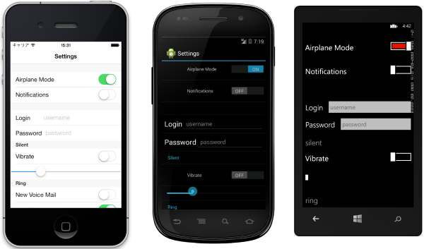
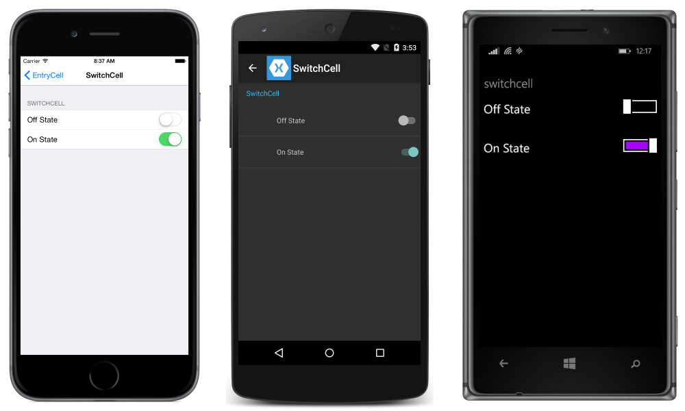
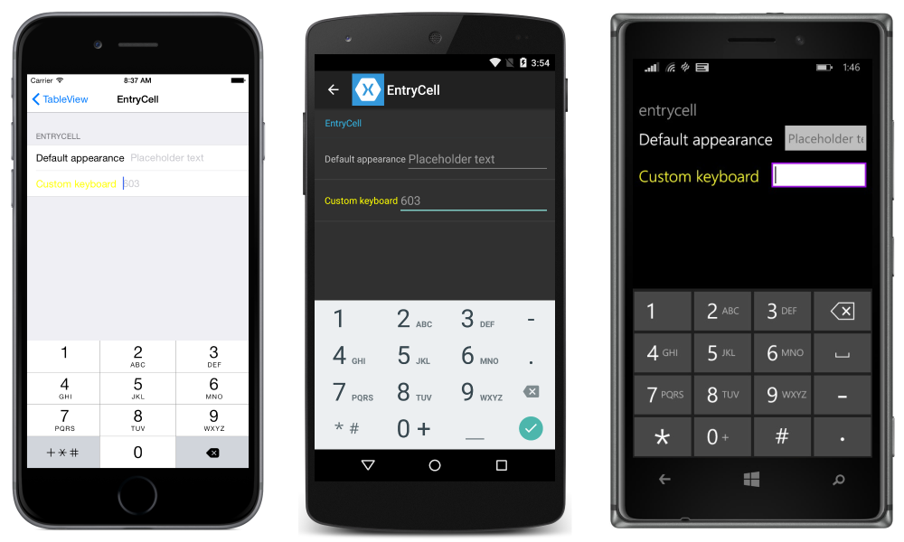
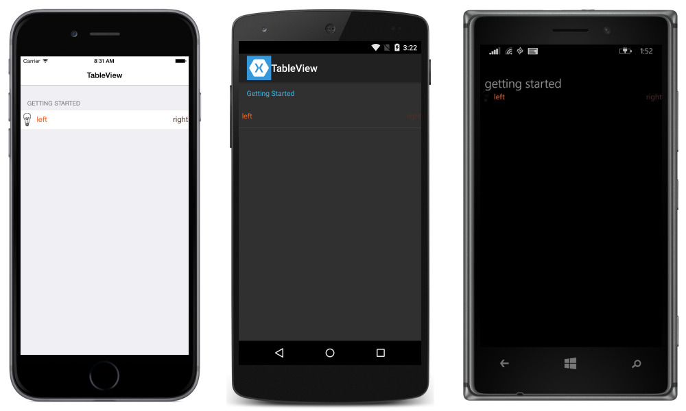

# Xamarin.Forms TableView

[ Download the sample](/samples/xamarin/xamarin-forms-samples/userinterface-tableview)

[`TableView`](xref:Xamarin.Forms.TableView) is a view for displaying scrollable lists of data or choices where there are rows that don't share the same template. Unlike [ListView](~/xamarin-forms/user-interface/listview/index.md), `TableView` does not have the concept of an `ItemsSource`, so items must be manually added as children.



## Use cases

[`TableView`](xref:Xamarin.Forms.TableView) is useful when:

- presenting a list of settings,
- collecting data in a form, or
- showing data that is presented differently from row to row (e.g. numbers, percentages and images).

[`TableView`](xref:Xamarin.Forms.TableView) handles scrolling and laying out rows in attractive sections, a common need for the above scenarios. The `TableView` control uses each platform's underlying equivalent view when available, creating a native look for each platform.

## Structure

Elements in a [`TableView`](xref:Xamarin.Forms.TableView) are organized into sections. At the root of the `TableView` is the [`TableRoot`](xref:Xamarin.Forms.TableRoot), which is parent to one or more [`TableSection`](xref:Xamarin.Forms.TableSection) instances. Each [`TableSection`](xref:Xamarin.Forms.TableSection) consists of a heading and one or more [`ViewCell`](xref:Xamarin.Forms.ViewCell) instances:

```xaml
<TableView Intent="Settings">
    <TableRoot>
        <TableSection Title="Ring">
            <SwitchCell Text="New Voice Mail" />
            <SwitchCell Text="New Mail" On="true" />
        </TableSection>
    </TableRoot>
</TableView>
```

The equivalent C# code is:

```csharp
Content = new TableView
{
    Root = new TableRoot
    {
        new TableSection("Ring")
        {
          // TableSection constructor takes title as an optional parameter
          new SwitchCell { Text = "New Voice Mail" },
          new SwitchCell { Text = "New Mail", On = true }
        }
    },
    Intent = TableIntent.Settings
};
```

## Appearance

[`TableView`](xref:Xamarin.Forms.TableView) exposes the [`Intent`](xref:Xamarin.Forms.TableView.Intent) property, which can be set to any of the [`TableIntent`](xref:Xamarin.Forms.TableIntent) enumeration members:

- `Data` – for use when displaying data entries. Note that [ListView](~/xamarin-forms/user-interface/listview/index.md) may be a better option for scrolling lists of data.
- `Form` – for use when the TableView is acting as a Form.
- `Menu` – for use when presenting a menu of selections.
- `Settings` – for use when displaying a list of configuration settings.

The [`TableIntent`](xref:Xamarin.Forms.TableIntent) value you choose may impact how the [`TableView`](xref:Xamarin.Forms.TableView) appears on each platform. Even if there are not clear differences, it is a best practice to select the `TableIntent` that most closely matches how you intend to use the table.

In addition, the color of the text displayed for each [`TableSection`](xref:Xamarin.Forms.TableSection) can be changed by setting the `TextColor` property to a [`Color`](xref:Xamarin.Forms.Color).

## Built-in cells

Xamarin.Forms comes with built-in cells for collecting and displaying information. Although [`ListView`](xref:Xamarin.Forms.ListView) and [`TableView`](xref:Xamarin.Forms.TableView) can use all of the same cells, [`SwitchCell`](xref:Xamarin.Forms.SwitchCell) and [`EntryCell`](xref:Xamarin.Forms.EntryCell) are the most relevant for a `TableView` scenario.

See [ListView Cell Appearance](~/xamarin-forms/user-interface/listview/customizing-cell-appearance.md) for a detailed description of [TextCell](~/xamarin-forms/user-interface/listview/customizing-cell-appearance.md#textcell) and [ImageCell](~/xamarin-forms/user-interface/listview/customizing-cell-appearance.md#imagecell).

### SwitchCell

[`SwitchCell`](xref:Xamarin.Forms.SwitchCell) is the control to use for presenting and capturing an on/off or `true`/`false` state. It defines the following properties:

- `Text` – text to display beside the switch.
- `On` – whether the switch is displayed as on or off.
- `OnColor` – the [`Color`](xref:Xamarin.Forms.Color) of the switch when it's in the on position.

All of these properties are bindable.

[`SwitchCell`](xref:Xamarin.Forms.SwitchCell) also exposes the `OnChanged` event, allowing you to respond to changes in the cell's state.



### EntryCell

[`EntryCell`](xref:Xamarin.Forms.EntryCell) is useful when you need to display text data that the user can edit. It defines the following properties:

- `Keyboard` – The keyboard to display while editing. There are options for things like numeric values, email, phone numbers, etc. [See the API docs](xref:Xamarin.Forms.Keyboard).
- `Label` – The label text to display to the left of the text entry field.
- `LabelColor` – The color of the label text.
- `Placeholder` – Text to display in the entry field when it is null or empty. This text disappears when text entry begins.
- `Text` – The text in the entry field.
- `HorizontalTextAlignment` – The horizontal alignment of the text. Values are center, left, or right aligned. [See the API docs](xref:Xamarin.Forms.TextAlignment).
- `VerticalTextAlignment` – The vertical alignment of the text. Values are `Start`, `Center`, or `End`.

[`EntryCell`](xref:Xamarin.Forms.EntryCell) also exposes the `Completed` event, which is fired when the user hits the 'done' button on the keyboard while editing text.



## Custom cells

When the built-in cells aren't enough, custom cells can be used to present and capture data in the way that makes sense for your app. For example, you may want to present a slider to allow a user to choose the opacity of an image.

All custom cells must derive from [`ViewCell`](xref:Xamarin.Forms.ViewCell), the same base class that all of the built-in cell types use.

This is an example of a custom cell:



The following example shows the XAML used to create the [`TableView`](xref:Xamarin.Forms.TableView) in the screenshots above:

```xaml
<?xml version="1.0" encoding="UTF-8"?>
<ContentPage xmlns="http://xamarin.com/schemas/2014/forms"
             xmlns:x="http://schemas.microsoft.com/winfx/2009/xaml"
             x:Class="DemoTableView.TablePage"
             Title="TableView">
      <TableView Intent="Settings">
          <TableRoot>
              <TableSection Title="Getting Started">
                  <ViewCell>
                      <StackLayout Orientation="Horizontal">
                          <Image Source="bulb.png" />
                          <Label Text="left"
                                 TextColor="#f35e20" />
                          <Label Text="right"
                                 HorizontalOptions="EndAndExpand"
                                 TextColor="#503026" />
                      </StackLayout>
                  </ViewCell>
              </TableSection>
          </TableRoot>
      </TableView>
</ContentPage>
```

The equivalent C# code is:

```csharp
var table = new TableView();
table.Intent = TableIntent.Settings;
var layout = new StackLayout() { Orientation = StackOrientation.Horizontal };
layout.Children.Add (new Image() { Source = "bulb.png"});
layout.Children.Add (new Label()
{
    Text = "left",
    TextColor = Color.FromHex("#f35e20"),
    VerticalOptions = LayoutOptions.Center
});
layout.Children.Add (new Label ()
{
    Text = "right",
    TextColor = Color.FromHex ("#503026"),
    VerticalOptions = LayoutOptions.Center,
    HorizontalOptions = LayoutOptions.EndAndExpand
});
table.Root = new TableRoot ()
{
    new TableSection("Getting Started")
    {
        new ViewCell() {View = layout}
    }
};
Content = table;
```

The root element under the [`TableView`](xref:Xamarin.Forms.TableView) is the [`TableRoot`](xref:Xamarin.Forms.TableRoot), and there is a [`TableSection`](xref:Xamarin.Forms.TableSection) immediately underneath the `TableRoot`. The [`ViewCell`](xref:Xamarin.Forms.ViewCell) is defined directly under the `TableSection`, and a [`StackLayout`](xref:Xamarin.Forms.StackLayout) is used to manage the layout of the custom cell, although any layout could be used here.

> [!NOTE]
> Unlike [`ListView`](xref:Xamarin.Forms.ListView), [`TableView`](xref:Xamarin.Forms.TableView) does not require that custom (or any) cells are defined in an `ItemTemplate`.

## Row height

The [`TableView`](xref:Xamarin.Forms.TableView) class has two properties that can be used to change the row height of cells:

- [`RowHeight`](xref:Xamarin.Forms.TableView.RowHeight) – sets the height of each row to an `int`.
- [`HasUnevenRows`](xref:Xamarin.Forms.TableView.HasUnevenRows) – rows have varying heights if set to `true`. Note that when setting this property to `true`, row heights will automatically be calculated and applied by Xamarin.Forms.

When the height of content in a cell in a [`TableView`](xref:Xamarin.Forms.TableView) is changed, the row height is implicitly updated on Android and the Universal Windows Platform (UWP). However, on iOS it must be forced to update by setting the [`HasUnevenRows`](xref:Xamarin.Forms.TableView.HasUnevenRows) property to `true` and by calling the [`Cell.ForceUpdateSize`](xref:Xamarin.Forms.Cell.ForceUpdateSize) method.

The following XAML example shows a [`TableView`](xref:Xamarin.Forms.TableView) that contains a [`ViewCell`](xref:Xamarin.Forms.ViewCell):

```xaml
<ContentPage ...>
    <TableView ...
               HasUnevenRows="true">
        <TableRoot>
            ...
            <TableSection ...>
                ...
                <ViewCell x:Name="_viewCell"
                          Tapped="OnViewCellTapped">
                    <Grid Margin="15,0">
                        <Grid.RowDefinitions>
                            <RowDefinition Height="Auto" />
                            <RowDefinition Height="Auto" />
                        </Grid.RowDefinitions>
                        <Label Text="Tap this cell." />
                        <Label x:Name="_target"
                               Grid.Row="1"
                               Text="The cell has changed size."
                               IsVisible="false" />
                    </Grid>
                </ViewCell>
            </TableSection>
        </TableRoot>
    </TableView>
</ContentPage>
```

When the [`ViewCell`](xref:Xamarin.Forms.ViewCell) is tapped, the `OnViewCellTapped` event handler is executed:

```csharp
void OnViewCellTapped(object sender, EventArgs e)
{
    _target.IsVisible = !_target.IsVisible;
    _viewCell.ForceUpdateSize();
}
```

The `OnViewCellTapped` event handler shows or hides the second [`Label`](xref:Xamarin.Forms.Label) in the [`ViewCell`](xref:Xamarin.Forms.ViewCell), and explicitly updates the cell's size by calling the [`Cell.ForceUpdateSize`](xref:Xamarin.Forms.Cell.ForceUpdateSize) method.

The following screenshots show the cell prior to being tapped upon:


The following screenshots show the cell after being tapped upon:


> [!IMPORTANT]
> There is a strong possibility of performance degradation if this feature is overused.

## Related links

- [TableView (sample)](/samples/xamarin/xamarin-forms-samples/userinterface-tableview)