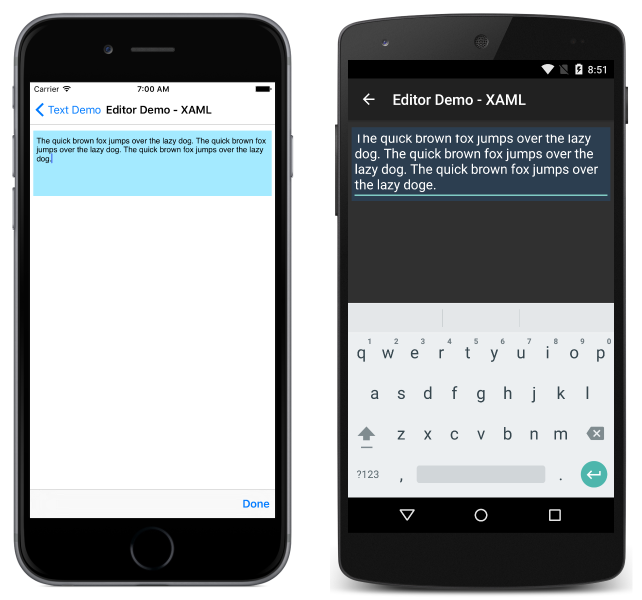

# Xamarin.Forms Editor

[ Download the sample](/samples/xamarin/xamarin-forms-samples/userinterface-text)

The [`Editor`](xref:Xamarin.Forms.Editor) control is used to accept multi-line input.

## Set and read text

The [`Editor`](xref:Xamarin.Forms.Editor), like other text-presenting views, exposes the `Text` property. This property can be used to set and read the text presented by the `Editor`. The following example demonstrates setting the `Text` property in XAML:

```xaml
<Editor x:Name="editor" Text="I am an Editor" />
```

In C#:

```csharp
var editor = new Editor { Text = "I am an Editor" };
```

To read text, access the `Text` property in C#:

```csharp
var text = editor.Text;
```

## Set placeholder text

The [`Editor`](xref:Xamarin.Forms.Editor) can be set to show placeholder text when it is not storing user input. This is accomplished by setting the [`Placeholder`](xref:Xamarin.Forms.InputView.Placeholder) property to a `string`, and is often used to indicate the type of content that is appropriate for the `Editor`. In addition, the placeholder text color can be controlled by setting the [`PlaceholderColor`](xref:Xamarin.Forms.InputView.PlaceholderColor) property to a [`Color`](xref:Xamarin.Forms.Color):

```xaml
<Editor Placeholder="Enter text here" PlaceholderColor="Olive" />
```

```csharp
var editor = new Editor { Placeholder = "Enter text here", PlaceholderColor = Color.Olive };
```

## Prevent text entry

Users can be prevented from modifying the text in an [`Editor`](xref:Xamarin.Forms.Editor) by setting the `IsReadOnly` property, which has a default value of `false`, to `true`:

```xaml
<Editor Text="This is a read-only Editor"
        IsReadOnly="true" />
```

```csharp
var editor = new Editor { Text = "This is a read-only Editor", IsReadOnly = true });
```

> [!NOTE]
> The `IsReadonly` property does not alter the visual appearance of an [`Editor`](xref:Xamarin.Forms.Editor), unlike the `IsEnabled` property that also changes the visual appearance of the `Editor` to gray.

## Transform text

An [`Editor`](xref:Xamarin.Forms.Editor) can transform the casing of its text, stored in the `Text` property, by setting the `TextTransform` property to a value of the `TextTransform` enumeration. This enumeration has four values:

- `None` indicates that the text won't be transformed.
- `Default` indicates that the default behavior for the platform will be used. This is the default value of the `TextTransform` property.
- `Lowercase` indicates that the text will be transformed to lowercase.
- `Uppercase` indicates that the text will be transformed to uppercase.

The following example shows transforming text to uppercase:

```xaml
<Editor Text="This text will be displayed in uppercase."
        TextTransform="Uppercase" />
```

The equivalent C# code is:

```csharp
Editor editor = new Editor
{
    Text = "This text will be displayed in uppercase.",
    TextTransform = TextTransform.Uppercase
};
```

## Limit input length

The [`MaxLength`](xref:Xamarin.Forms.InputView.MaxLength) property can be used to limit the input length that's permitted for the [`Editor`](xref:Xamarin.Forms.Editor). This property should be set to a positive integer:

```xaml
<Editor ... MaxLength="10" />
```

```csharp
var editor = new Editor { ... MaxLength = 10 };
```

A [`MaxLength`](xref:Xamarin.Forms.InputView.MaxLength) property value of 0 indicates that no input will be allowed, and a value of `int.MaxValue`, which is the default value for an [`Editor`](xref:Xamarin.Forms.Editor), indicates that there is no effective limit on the number of characters that may be entered.

## Character spacing

Character spacing can be applied to an [`Editor`](xref:Xamarin.Forms.Editor) by setting the `Editor.CharacterSpacing` property to a `double` value:

```xaml
<Editor ...
        CharacterSpacing="10" />
```

The equivalent C# code is:

```csharp
Editor editor = new editor { CharacterSpacing = 10 };
```

The result is that characters in the text displayed by the [`Editor`](xref:Xamarin.Forms.Editor) are spaced `CharacterSpacing` device-independent units apart.

> [!NOTE]
> The `CharacterSpacing` property value is applied to the text displayed by the `Text` and `Placeholder` properties.

## Auto-size an Editor

An [`Editor`](xref:Xamarin.Forms.Editor) can be made to auto-size to its content by setting the [`Editor.AutoSize`](xref:Xamarin.Forms.Editor.AutoSize) property to [`TextChanges`](xref:Xamarin.Forms.EditorAutoSizeOption.TextChanges), which is a value of the [`EditorAutoSizeOption`](xref:Xamarin.Forms.EditorAutoSizeOption) enumeration. This enumeration has two values:

- [`Disabled`](xref:Xamarin.Forms.EditorAutoSizeOption.Disabled) indicates that automatic resizing is disabled, and is the default value.
- [`TextChanges`](xref:Xamarin.Forms.EditorAutoSizeOption.TextChanges) indicates that automatic resizing is enabled.

This can be accomplished in code as follows:

```xaml
<Editor Text="Enter text here" AutoSize="TextChanges" />
```

```csharp
var editor = new Editor { Text = "Enter text here", AutoSize = EditorAutoSizeOption.TextChanges };
```

When auto-resizing is enabled, the height of the [`Editor`](xref:Xamarin.Forms.Editor) will increase when the user fills it with text, and the height will decrease as the user deletes text.

> [!NOTE]
> An [`Editor`](xref:Xamarin.Forms.Editor) will not auto-size if the [`HeightRequest`](xref:Xamarin.Forms.VisualElement.HeightRequest) property has been set.

## Customize the keyboard

The keyboard that's presented when users interact with an [`Editor`](xref:Xamarin.Forms.Editor) can be set programmatically via the [`Keyboard`](xref:Xamarin.Forms.InputView.Keyboard) property, to one of the following properties from the [`Keyboard`](xref:Xamarin.Forms.Keyboard) class:

- [`Chat`](xref:Xamarin.Forms.Keyboard.Chat) – used for texting and places where emoji are useful.
- [`Default`](xref:Xamarin.Forms.Keyboard.Default) – the default keyboard.
- [`Email`](xref:Xamarin.Forms.Keyboard.Email) – used when entering email addresses.
- [`Numeric`](xref:Xamarin.Forms.Keyboard.Numeric) – used when entering numbers.
- [`Plain`](xref:Xamarin.Forms.Keyboard.Plain) – used when entering text, without any [`KeyboardFlags`](xref:Xamarin.Forms.KeyboardFlags) specified.
- [`Telephone`](xref:Xamarin.Forms.Keyboard.Telephone) – used when entering telephone numbers.
- [`Text`](xref:Xamarin.Forms.Keyboard.Text) – used when entering text.
- [`Url`](xref:Xamarin.Forms.Keyboard.Url) – used for entering file paths & web addresses.

This can be accomplished in XAML as follows:

```xaml
<Editor Keyboard="Chat" />
```

The equivalent C# code is:

```csharp
var editor = new Editor { Keyboard = Keyboard.Chat };
```

Examples of each keyboard can be found in our [Recipes](https://github.com/xamarin/recipes/tree/master/Recipes/xamarin-forms/Controls/choose-keyboard-for-entry) repository.

The [`Keyboard`](xref:Xamarin.Forms.Keyboard) class also has a [`Create`](xref:Xamarin.Forms.Keyboard.Create*) factory method that can be used to customize a keyboard by specifying capitalization, spellcheck, and suggestion behavior. [`KeyboardFlags`](xref:Xamarin.Forms.KeyboardFlags) enumeration values are specified as arguments to the method, with a customized `Keyboard` being returned. The `KeyboardFlags` enumeration contains the following values:

- [`None`](xref:Xamarin.Forms.KeyboardFlags.None) – no features are added to the keyboard.
- [`CapitalizeSentence`](xref:Xamarin.Forms.KeyboardFlags.CapitalizeSentence) – indicates that the first letter of the first word of each entered sentence will be automatically capitalized.
- [`Spellcheck`](xref:Xamarin.Forms.KeyboardFlags.Spellcheck) – indicates that spellcheck will be performed on entered text.
- [`Suggestions`](xref:Xamarin.Forms.KeyboardFlags.Suggestions) – indicates that word completions will be offered on entered text.
- [`CapitalizeWord`](xref:Xamarin.Forms.KeyboardFlags.CapitalizeWord) – indicates that the first letter of each word will be automatically capitalized.
- [`CapitalizeCharacter`](xref:Xamarin.Forms.KeyboardFlags.CapitalizeCharacter) – indicates that every character will be automatically capitalized.
- [`CapitalizeNone`](xref:Xamarin.Forms.KeyboardFlags.CapitalizeNone) – indicates that no automatic capitalization will occur.
- [`All`](xref:Xamarin.Forms.KeyboardFlags.All) – indicates that spellcheck, word completions, and sentence capitalization will occur on entered text.

The following XAML code example shows how to customize the default [`Keyboard`](xref:Xamarin.Forms.Keyboard) to offer word completions and capitalize every entered character:

```xaml
<Editor>
    <Editor.Keyboard>
        <Keyboard x:FactoryMethod="Create">
            <x:Arguments>
                <KeyboardFlags>Suggestions,CapitalizeCharacter</KeyboardFlags>
            </x:Arguments>
        </Keyboard>
    </Editor.Keyboard>
</Editor>
```

The equivalent C# code is:

```csharp
var editor = new Editor();
editor.Keyboard = Keyboard.Create(KeyboardFlags.Suggestions | KeyboardFlags.CapitalizeCharacter);
```

## Enable and disable spell checking

The [`IsSpellCheckEnabled`](xref:Xamarin.Forms.InputView.IsSpellCheckEnabled) property controls whether spell checking is enabled. By default, the property is set to `true`. As the user enters text, misspellings are indicated.

However, for some text entry scenarios, such as entering a username, spell checking provides a negative experience and so should be disabled by setting the [`IsSpellCheckEnabled`](xref:Xamarin.Forms.InputView.IsSpellCheckEnabled) property to `false`:

```xaml
<Editor ... IsSpellCheckEnabled="false" />
```

```csharp
var editor = new Editor { ... IsSpellCheckEnabled = false };
```

> [!NOTE]
> When the [`IsSpellCheckEnabled`](xref:Xamarin.Forms.InputView.IsSpellCheckEnabled) property is set to `false`, and a custom keyboard isn't being used, the native spell checker will be disabled. However, if a [`Keyboard`](xref:Xamarin.Forms.Keyboard) has been set that disables spell checking, such as [`Keyboard.Chat`](xref:Xamarin.Forms.Keyboard.Chat), the `IsSpellCheckEnabled` property is ignored. Therefore, the property cannot be used to enable spell checking for a `Keyboard` that explicitly disables it.

## Enable and disable text prediction

The `IsTextPredictionEnabled` property controls whether text prediction and automatic text correction is enabled. By default, the property is set to `true`. As the user enters text, word predictions are presented.

However, for some text entry scenarios, such as entering a username, text prediction and automatic text correction provides a negative experience and should be disabled by setting the `IsTextPredictionEnabled` property to `false`:

```xaml
<Editor ... IsTextPredictionEnabled="false" />
```

```csharp
var editor = new Editor { ... IsTextPredictionEnabled = false };
```

> [!NOTE]
> When the `IsTextPredictionEnabled` property is set to `false`, and a custom keyboard isn't being used, text prediction and automatic text correction is disabled. However, if a [`Keyboard`](xref:Xamarin.Forms.Keyboard) has been set that disables text prediction, the `IsTextPredictionEnabled` property is ignored. Therefore, the property cannot be used to enable text prediction for a `Keyboard` that explicitly disables it.

## Colors

`Editor` can be set to use a custom background color via the `BackgroundColor` property. Special care is necessary to ensure that colors will be usable on each platform. Because each platform has different defaults for text color, you may need to set a custom background color for each platform. See [Working with Platform Tweaks](~/xamarin-forms/platform/device.md) for more information about optimizing the UI for each platform.

In C#:

```csharp
public partial class EditorPage : ContentPage
{
    public EditorPage ()
    {
        InitializeComponent ();
        var layout = new StackLayout { Padding = new Thickness(5,10) };
        this.Content = layout;
        //dark blue on UWP & Android, light blue on iOS
        var editor = new Editor { BackgroundColor = Device.RuntimePlatform == Device.iOS ? Color.FromHex("#A4EAFF") : Color.FromHex("#2c3e50") };
        layout.Children.Add(editor);
    }
}
```

In XAML:

```xaml
<?xml version="1.0" encoding="UTF-8"?>
<ContentPage xmlns="http://xamarin.com/schemas/2014/forms"
    xmlns:x="http://schemas.microsoft.com/winfx/2009/xaml"
    x:Class="TextSample.EditorPage"
    Title="Editor Demo">
    <ContentPage.Content>
        <StackLayout Padding="5,10">
            <Editor>
                <Editor.BackgroundColor>
                    <OnPlatform x:TypeArguments="x:Color">
                        <On Platform="iOS" Value="#a4eaff" />
                        <On Platform="Android, UWP" Value="#2c3e50" />
                    </OnPlatform>
                </Editor.BackgroundColor>
            </Editor>
        </StackLayout>
    </ContentPage.Content>
</ContentPage>
```



Make sure that the background and text colors you choose are usable on each platform and don't obscure any placeholder text.

## Events and interactivity

`Editor` exposes two events:

- [TextChanged](xref:Xamarin.Forms.InputView.TextChanged) &ndash; raised when the text changes in the editor. Provides the text before and after the change.
- [Completed](xref:Xamarin.Forms.Editor.Completed) &ndash; raised when the user has ended input by pressing the return key on the keyboard.

> [!NOTE]
> The [`VisualElement`](xref:Xamarin.Forms.VisualElement) class, from which [`Entry`](xref:Xamarin.Forms.Entry) inherits, also has [`Focused`](xref:Xamarin.Forms.VisualElement.Focused) and [`Unfocused`](xref:Xamarin.Forms.VisualElement.Unfocused) events.

### Completed

The `Completed` event is used to react to the completion of an interaction with an `Editor`. `Completed` is raised when the user ends input with a field by entering the return key on the keyboard (or by pressing the Tab key on UWP). The handler for the event is a generic event handler, taking the sender and `EventArgs`:

```csharp
void EditorCompleted (object sender, EventArgs e)
{
    var text = ((Editor)sender).Text; // sender is cast to an Editor to enable reading the `Text` property of the view.
}
```

The completed event can be subscribed to in code and XAML:

In C#:

```csharp
public partial class EditorPage : ContentPage
{
    public EditorPage ()
    {
        InitializeComponent ();
        var layout = new StackLayout { Padding = new Thickness(5,10) };
        this.Content = layout;
        var editor = new Editor ();
        editor.Completed += EditorCompleted;
        layout.Children.Add(editor);
    }
}
```

In XAML:

```xaml
<?xml version="1.0" encoding="UTF-8"?>
<ContentPage xmlns="http://xamarin.com/schemas/2014/forms"
xmlns:x="http://schemas.microsoft.com/winfx/2009/xaml"
x:Class="TextSample.EditorPage"
Title="Editor Demo">
    <ContentPage.Content>
        <StackLayout Padding="5,10">
            <Editor Completed="EditorCompleted" />
        </StackLayout>
    </ContentPage.Content>
</Contentpage>
```

### TextChanged

The `TextChanged` event is used to react to a change in the content of a field.

`TextChanged` is raised whenever the `Text` of the `Editor` changes. The handler for the event takes an instance of `TextChangedEventArgs`. `TextChangedEventArgs` provides access to the old and new values of the `Editor` `Text` via the `OldTextValue` and `NewTextValue` properties:

```csharp
void EditorTextChanged (object sender, TextChangedEventArgs e)
{
    var oldText = e.OldTextValue;
    var newText = e.NewTextValue;
}
```

The completed event can be subscribed to in code and XAML:

In code:

```csharp
public partial class EditorPage : ContentPage
{
    public EditorPage ()
    {
        InitializeComponent ();
        var layout = new StackLayout { Padding = new Thickness(5,10) };
        this.Content = layout;
        var editor = new Editor ();
        editor.TextChanged += EditorTextChanged;
        layout.Children.Add(editor);
    }
}
```

In XAML:

```xaml
<?xml version="1.0" encoding="UTF-8"?>
<ContentPage xmlns="http://xamarin.com/schemas/2014/forms"
xmlns:x="http://schemas.microsoft.com/winfx/2009/xaml"
x:Class="TextSample.EditorPage"
Title="Editor Demo">
    <ContentPage.Content>
        <StackLayout Padding="5,10">
            <Editor TextChanged="EditorTextChanged" />
        </StackLayout>
    </ContentPage.Content>
</ContentPage>
```

## Related links

- [Text (sample)](/samples/xamarin/xamarin-forms-samples/userinterface-text)
- [Editor API](xref:Xamarin.Forms.Editor)
