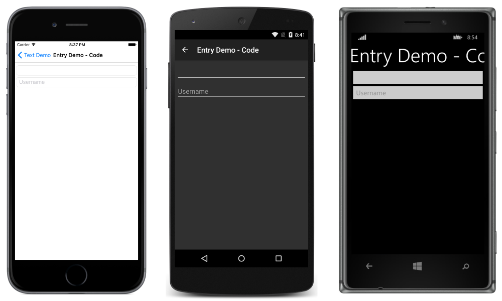

# Entry

_Single-line text or password input_

Xamarin.Forms `Entry` is used for single-line text input. `Entry`, like the Editor view, supports multiple keyboard types. Additionally, `Entry` can be used as a password field.

## Display Customization

### Setting and Reading Text

Entry, like other text-presenting views, exposes the `Text` property. `Text` can be used to set and read the text presented by the `Entry`. The following example demonstrates setting the text in XAML:

```xaml
<Entry Text="I am an Entry" />
```

In C#:

```csharp
var MyEntry = new Entry { Text = "I am an Entry" };
```

To read text, access the `Text` property in C#:

```csharp
var text = MyEntry.Text;
```

> [!NOTE]
> The width of an `Entry` can be defined by setting its `WidthRequest` property. Do not depend on the width of an `Entry` being defined based on the value of its `Text` property.

### Keyboards

The keyboard that is presented when users interact with an `Entry` can be set programmatically via the `Keyboard` property.

The options for the keyboard type are:

- **Default** &ndash; the default keyboard
- **Chat** &ndash; used for texting & places where emoji are useful
- **Email** &ndash; used when entering email addresses
- **Numeric** &ndash; used when entering numbers
- **Telephone** &ndash; used when entering telephone numbers
- **Url** &ndash; used for entering file paths and web addresses

There is an [example of each keyboard](https://developer.xamarin.com/recipes/cross-platform/xamarin-forms/choose-keyboard-for-entry/)
in our Recipes section.

### Placeholders

`Entry` can be set to show placeholder text when it is not storing user input. In practice, this is often seen in forms to clarify the content that is appropriate for a given field. Placeholder text color cannot be customized and will be the same regardless of the `TextColor` setting. If your design calls for a custom placeholder color, you'll need to fall back to a [custom renderer](). The following will create an `Entry` with "Username" as the placeholder in XAML:

```xaml
<Entry Placeholder="Username" />
```

In C#:

```csharp
var MyEntry = new Entry { Placeholder = "Username" };
```



### Password Fields

`Entry` provides the `IsPassword` property. When `IsPassword` is `true`, the contents of the field will be presented as black circles:

In XAML:

```xaml
<Entry IsPassword="true" />
```

In C#:

```csharp
var MyEntry = new Entry { IsPassword = true };
```


Placeholders may be used with instances of `Entry` that are configured as password fields:

In XAML:

```xaml
<Entry IsPassword="true" Placeholder="Password" />
```

In C#:

```csharp
var MyEntry = new Entry { IsPassword = true, Placeholder = "Password" };
```


### Colors

Entry can be set to use a custom background and text colors via the following bindable properties:

- **TextColor** &ndash; sets the color of the text.
- **BackgroundColor** &ndash; sets the color shown behind the text.

Special care is necessary to ensure that colors will be usable on each platform. Because each platform has different defaults for text and background colors, you'll often need to set both if you set one.

Use the following code to set the text color of an entry:

In XAML:

```xaml
<Entry TextColor="Green" />
```

In C#:

```csharp
var entry = new Entry();
entry.TextColor = Color.Green;
```


Note that the placeholder is not affected by the specified `TextColor`.

To set the background color in XAML:

```xaml
<Entry BackgroundColor="#2c3e50" />
```

In C#:

```csharp
var entry = new Entry();
entry.BackgroundColor = Color.FromHex("#2c3e50");
```


Be careful to make sure that the background and text colors you choose are usable on each platform and don't obscure any placeholder text.

## Events and Interactivity

Entry exposes two events:

- [TextChanged](http://developer.xamarin.com/api/event/Xamarin.Forms.Entry.TextChanged/) &ndash; raised when the text changes in the entry. Provides the text before and after the change.
- [Completed](http://developer.xamarin.com/api/event/Xamarin.Forms.Entry.Completed/) &ndash; raised when the user has ended input by pressing the return key on the keyboard.

### Completed

The `Completed` event is used to react to the completion of an interaction with an Entry. `Completed` is raised when the user ends input with a field by entering the return key on the keyboard. The handler for the event is a generic event handler, taking the sender and `EventArgs`:

```csharp
void Entry_Completed (object sender, EventArgs e)
{
    var text = ((Entry)sender).Text; //cast sender to access the properties of the Entry
}
```

The completed event can be subscribed to in XAML:

```xaml
<Entry Completed="Entry_Completed" />
```

and C#:

```csharp
var entry = new Entry ();
entry.Completed += Entry_Completed;
```

### TextChanged

The `TextChanged` event is used to react to a change in the content of a field.

`TextChanged` is raised whenever the `Text` of the `Entry` changes. The handler for the event takes an instance of `TextChangedEventArgs`. `TextChangedEventArgs` provides access to the old and new values of the `Entry` `Text` via the `OldTextValue` and `NewTextValue` properties:

```csharp
void Entry_TextChanged (object sender, TextChangedEventArgs e)
{
    var oldText = e.OldTextValue;
    var newText = e.NewTextValue;
}
```

The `TextChanged` event can be subscribed to in XAML:

```xaml
<Entry TextChanged="Entry_TextChanged" />
```

and C#:

```csharp
var entry = new Entry ();
entry.TextChanged += Entry_TextChanged;
```


## Related Links

- [Text (sample)](https://developer.xamarin.com/samples/xamarin-forms/UserInterface/Text)
- [Entry API](https://developer.xamarin.com/api/type/Xamarin.Forms.Entry/)
