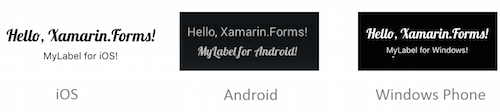

# Fonts in Xamarin.Forms

[ Download the sample](https://developer.xamarin.com/samples/xamarin-forms/WorkingWithFonts/)

This article describes how Xamarin.Forms lets you specify font attributes
(including weight and size) on controls that display text. Font information
can be [specified in code](#Setting_Font_in_Code) or
[specified in XAML](#Setting_Font_in_Xaml).
It is also possible to use a [custom font](#Using_a_Custom_Font).

<a name="Setting_Font_in_Code" />

## Setting Font in Code

Use the three font-related properties of any controls that display text:

- **FontFamily** &ndash; the `string` font name.
- **FontSize** &ndash; the font size as a `double`.
- **FontAttributes** &ndash; a string specifying style information like *Italic* and **Bold** (using the `FontAttributes` enumeration in C#).

This code shows how to create a label and specify the font size and weight to display:

```csharp
var about = new Label {
    FontSize = Device.GetNamedSize (NamedSize.Medium, typeof(Label)),
    FontAttributes = FontAttributes.Bold,
    Text = "Medium Bold Font"
};
```

<a name="FontSize" />

### Font Size

The `FontSize` property can be set to a double value, for instance:

```csharp
label.FontSize = 24;
```

You can also use the `NamedSize` enumeration which has four built-in options; Xamarin.Forms chooses the best size for each platform.

-  **Micro**
-  **Small**
-  **Medium**
-  **Large**

The `NamedSize` enumeration can be used wherever a `FontSize` can be specified using the `Device.GetNamedSize` method to convert the value to a `double`:

```csharp
label.FontSize = Device.GetNamedSize(NamedSize.Small, typeof(Label));
```

<a name="FontAttributes" />

### Font Attributes

Font styles such as **bold** and *italic* can be set on the `FontAttributes` property. The following values are currently supported:

-  **None**
-  **Bold**
-  **Italic**

The `FontAttribute` enumeration can be used as follows (you can specify a single attribute or `OR` them together):

```csharp
label.FontAttributes = FontAttributes.Bold | FontAttributes.Italic;
```

### Setting Font Info Per Platform

Alternatively, the `Device.RuntimePlatform` property can be used to set different
font names on each platform, as demonstrated in this code:

```csharp
label.FontFamily = Device.RuntimePlatform == Device.iOS ? "Lobster-Regular" :
   Device.RuntimePlatform == Device.Android ? "Lobster-Regular.ttf#Lobster-Regular" : "Assets/Fonts/Lobster-Regular.ttf#Lobster",
label.FontSize = Device.RuntimePlatform == Device.iOS ? 24 :
   Device.RuntimePlatform == Device.Android ? Device.GetNamedSize(NamedSize.Medium, label) : Device.GetNamedSize(NamedSize.Large, label);
```

A good source of font information for iOS is [iosfonts.com](http://iosfonts.com).

<a name="Setting_Font_in_Xaml" />

## Setting the Font in XAML

Xamarin.Forms controls that display text all have a `Font` property that can be set in XAML. The simplest way to set the font in XAML is to use the named size enumeration values, as shown in this example:

```xaml
<Label Text="Login" FontSize="Large"/>
<Label Text="Instructions" FontSize="Small"/>
```

There is a built-in converter for the `Font` property that allows all font settings to be expressed as a string value in XAML. The following examples show how you can specify font attributes and sizes in XAML:

```xaml
<Label Text="Italics are supported" FontAttributes="Italic" />
<Label Text="Biggest NamedSize" FontSize="Large" />
<Label Text="Use size 72" FontSize="72" />
```

To specify multiple `Font` settings, combine the required settings into a single `Font` attribute string. The font attribute string should be formatted as `"[font-face],[attributes],[size]"`. The order of the parameters is important, all parameters are optional, and multiple `attributes` can be specified, for example:

```xaml
<Label Text="Small bold text" Font="Bold, Micro" />
<Label Text="Medium custom font" Font="MarkerFelt-Thin, 42" />
<Label Text="Really big bold and italic text" Font="Bold, Italic, 72"  />
```

[`Device.RuntimePlatform`](~/xamarin-forms/platform/device.md#providing-platform-values) can also be used in XAML to render a different font on each platform. The example below uses a custom font face on iOS (<span style="font-family:MarkerFelt-Thin">MarkerFelt-Thin</span>) and specifies only size/attributes on the other platforms:

```xaml
<Label Text="Hello Forms with XAML">
    <Label.FontFamily>
        <OnPlatform x:TypeArguments="x:String">
                <On Platform="iOS" Value="MarkerFelt-Thin" />
                <On Platform="Android" Value="Lobster-Regular.ttf#Lobster-Regular" />
                <On Platform="UWP" Value="Assets/Fonts/Lobster-Regular.ttf#Lobster" />
        </OnPlatform>
    </Label.FontFamily>
</Label>
```

When specifying a custom font face, it is always a good idea to use `OnPlatform`, as it is difficult to find a font that is available on all platforms.

<a name="Using_a_Custom_Font" />

## Using a Custom Font

Using a font other than the built-in typefaces requires some platform-specific coding. This screenshot shows the custom font **Lobster** from [Google's open-source fonts](https://www.google.com/fonts) rendered using Xamarin.Forms.

 [](fonts-images/custom.png#lightbox "Custom Fonts Example")

The steps required for each platform are outlined below. When including custom font files with an application, be sure to verify that the font's license allows for distribution.

### iOS

It is possible to display a custom font by first ensuring that it is loaded,
then referring to it by name using the Xamarin.Forms `Font` methods.
Follow the instructions in [this blog post](http://blog.xamarin.com/custom-fonts-in-ios/):

1. Add the font file with **Build Action: BundleResource**, and
2. Update the **Info.plist** file (**Fonts provided by application**, or `UIAppFonts`, key), then
3. Refer to it by name wherever you define a font in Xamarin.Forms!

```csharp
new Label
{
    Text = "Hello, Forms!",
    FontFamily = Device.RuntimePlatform == Device.iOS ? "Lobster-Regular" : null // set only for iOS
}
```

### Android

Xamarin.Forms for Android can reference a custom font that has been added to the project by following a specific naming standard. First add the font file to the **Assets** folder in the application project and set *Build Action: AndroidAsset*. Then use the full path and *Font Name* separated by a hash (#) as the font name in Xamarin.Forms, as the code snippet below demonstrates:

```csharp
new Label
{
  Text = "Hello, Forms!",
  FontFamily = Device.RuntimePlatform == Device.Android ? "Lobster-Regular.ttf#Lobster-Regular" : null // set only for Android
}
```

### Windows

Xamarin.Forms for Windows platforms can reference a custom font that has been added to the project by following a specific naming standard. First add the font file to the **/Assets/Fonts/** folder in the application project and set the <span class="UIItem">Build Action:Content</span>. Then use the full path and font filename, followed by a hash (#) and the <span class="UIItem">Font Name</span>, as the code snippet below demonstrates:

```csharp
new Label
{
    Text = "Hello, Forms!",
    FontFamily = Device.RuntimePlatform == Device.UWP ? "Assets/Fonts/Lobster-Regular.ttf#Lobster" : null // set only for UWP apps
}
```

> [!NOTE]
> Note that the font file name and font name may be different. To discover the font name on Windows, right-click the .ttf file and select **Preview**. The font name can then be determined from the preview window.

The common code for the application is now complete. Platform-specific phone dialer code will now be implemented as a [DependencyService](~/xamarin-forms/app-fundamentals/dependency-service/index.md).

### XAML

You can also use [`Device.RuntimePlatform`](~/xamarin-forms/platform/device.md#providing-platform-values) in XAML to render a custom font:

```xaml
<Label Text="Hello Forms with XAML">
    <Label.FontFamily>
        <OnPlatform x:TypeArguments="x:String">
                <On Platform="iOS" Value="Lobster-Regular" />
                <On Platform="Android" Value="Lobster-Regular.ttf#Lobster-Regular" />
                <On Platform="UWP" Value="Assets/Fonts/Lobster-Regular.ttf#Lobster" />
        </OnPlatform>
    </Label.FontFamily>
</Label>
```

<a name="Summary" />

## Summary

Xamarin.Forms provides simple default settings to let you size text easily for
all supported platforms. It also lets you specify font face and size &ndash;
even differently for each platform &ndash; when more fine-grained control is
required.

Font information can also be specified in XAML using correctly formatted font
attributes.

## Related Links

- [FontsSample](https://developer.xamarin.com/samples/xamarin-forms/WorkingWithFonts/)
- [Text (sample)](https://developer.xamarin.com/samples/xamarin-forms/UserInterface/Text/)
