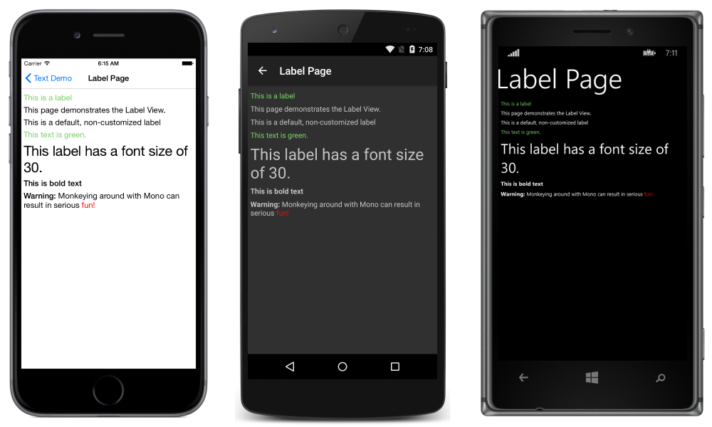
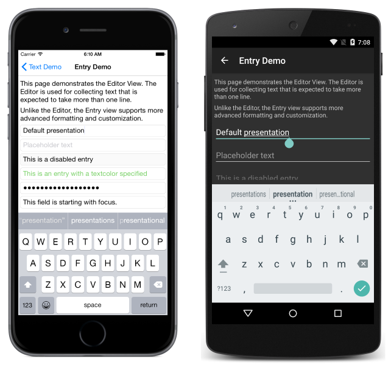
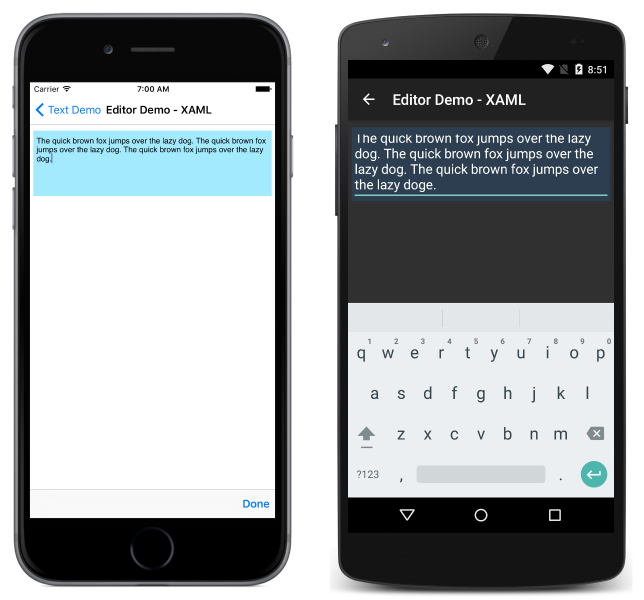

# Text in Xamarin.Forms

[ Download the sample](/samples/xamarin/xamarin-forms-samples/userinterface-text)

_Using Xamarin.Forms to enter or display text._

Xamarin.Forms has three primary views for working with text:

- **[Label](#label)** &mdash; for presenting single or multi-line text. Can show text with multiple formatting options in the same line.
- **[Entry](#entry)** &mdash; for entering text that is only one line. Entry has a password mode.
- **[Editor](#editor)** &mdash; for entering text that could take more than one line.

Text appearance can be changed using built-in or custom [styles](#styles) and some controls support custom [fonts](#fonts).

## [Label](label.md)

The `Label` view is used to display text. It can show multiple lines of text or a single line of text. `Label` can present text with multiple formatting options used in inline. The label view can wrap or truncate text when it can't fit on one line.

See the [Label](label.md) article for more detailed information.

For information on customizing the font used in a label, see [Fonts](fonts.md).

## [Entry](entry.md)

`Entry` is used to accept single-line text input. `Entry` offers control over colors and fonts. `Entry` has a password mode and can show placeholder text until text is entered.

See the [Entry](entry.md) article for more information.

Note that, unlike `Label`, `Entry` cannot have custom font settings.

## [Editor](editor.md)

`Editor` is used to accept multi-line text input. `Editor` offers control over colors and fonts.

See the [Editor](editor.md) article for more information.

## [Fonts](fonts.md)

Many controls support different font settings using the built-in fonts on each platform, or custom fonts included with your app. See the [Fonts](fonts.md) article for more detailed information.

## [Styles](styles.md)

Refer to [working with styles](~/xamarin-forms/user-interface/styles/index.md) to learn how to set up font, [color](~/xamarin-forms/user-interface/colors.md), and other display properties that apply across multiple controls.

## Related Links

- [Text (sample)](/samples/xamarin/xamarin-forms-samples/userinterface-text)