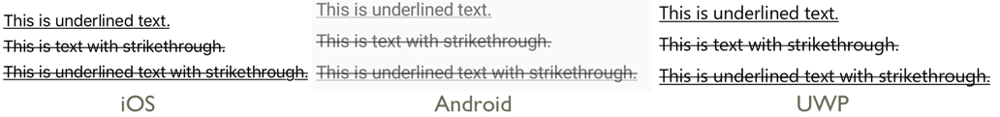
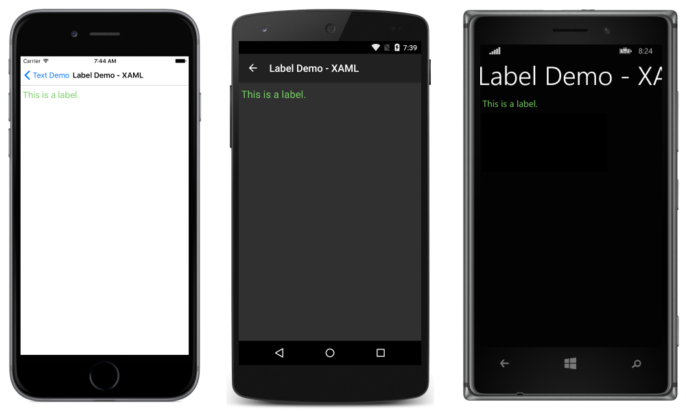
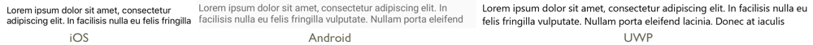
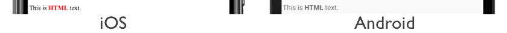
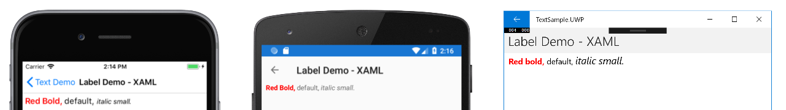
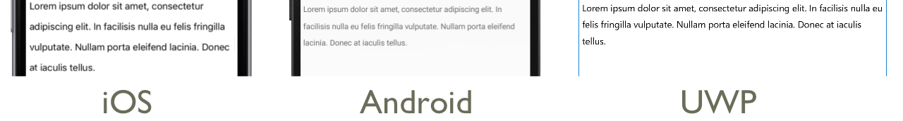
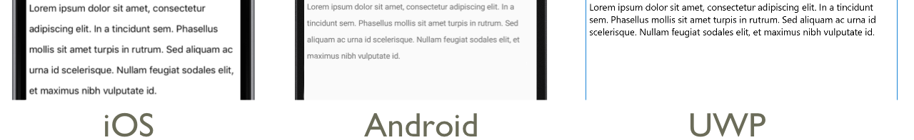
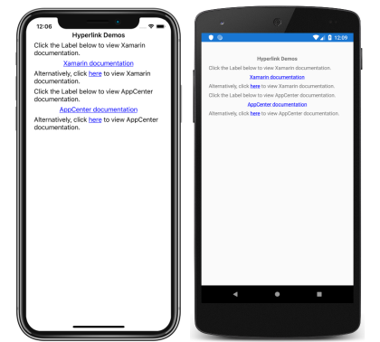

# Xamarin.Forms Label

[ Download the sample](/samples/xamarin/xamarin-forms-samples/userinterface-text)

_Display text in Xamarin.Forms_

The [`Label`](xref:Xamarin.Forms.Label) view is used for displaying text, both single and multi-line. Labels can have text decorations, colored text, and use custom fonts (families, sizes, and options).

## Text decorations

Underline and strikethrough text decorations can be applied to [`Label`](xref:Xamarin.Forms.Label) instances by setting the `Label.TextDecorations` property to one or more `TextDecorations` enumeration members:

- `None`
- `Underline`
- `Strikethrough`

The following XAML example demonstrates setting the `Label.TextDecorations` property:

```xaml
<Label Text="This is underlined text." TextDecorations="Underline"  />
<Label Text="This is text with strikethrough." TextDecorations="Strikethrough" />
<Label Text="This is underlined text with strikethrough." TextDecorations="Underline, Strikethrough" />
```

The equivalent C# code is:

```csharp
var underlineLabel = new Label { Text = "This is underlined text.", TextDecorations = TextDecorations.Underline };
var strikethroughLabel = new Label { Text = "This is text with strikethrough.", TextDecorations = TextDecorations.Strikethrough };
var bothLabel = new Label { Text = "This is underlined text with strikethrough.", TextDecorations = TextDecorations.Underline | TextDecorations.Strikethrough };
```

The following screenshots show the `TextDecorations` enumeration members applied to [`Label`](xref:Xamarin.Forms.Label) instances:



> [!NOTE]
> Text decorations can also be applied to [`Span`](xref:Xamarin.Forms.Span) instances. For more information about the `Span` class, see [Formatted Text](#formatted-text).

## Transform text

A [`Label`](xref:Xamarin.Forms.Entry) can transform the casing of its text, stored in the `Text` property, by setting the `TextTransform` property to a value of the `TextTransform` enumeration. This enumeration has four values:

- `None` indicates that the text won't be transformed.
- `Default` indicates that the default behavior for the platform will be used. This is the default value of the `TextTransform` property.
- `Lowercase` indicates that the text will be transformed to lowercase.
- `Uppercase` indicates that the text will be transformed to uppercase.

The following example shows transforming text to uppercase:

```xaml
<Label Text="This text will be displayed in uppercase."
       TextTransform="Uppercase" />
```

The equivalent C# code is:

```csharp
Label label = new Label
{
    Text = "This text will be displayed in uppercase.",
    TextTransform = TextTransform.Uppercase
};
```

## Character spacing

Character spacing can be applied to [`Label`](xref:Xamarin.Forms.Label) instances by setting the `Label.CharacterSpacing` property to a `double` value:

```xaml
<Label Text="Character spaced text"
       CharacterSpacing="10" />
```

The equivalent C# code is:

```csharp
Label label = new Label { Text = "Character spaced text", CharacterSpacing = 10 };
```

The result is that characters in the text displayed by the [`Label`](xref:Xamarin.Forms.Label) are spaced `CharacterSpacing` device-independent units apart.

## New lines

There are two main techniques for forcing text in a [`Label`](xref:Xamarin.Forms.Label) onto a new line, from XAML:

1. Use the unicode line feed character, which is "&amp;#10;".
1. Specify your text using *property element* syntax.

The following code shows an example of both techniques:

```xaml
<!-- Unicode line feed character -->
<Label Text="First line &#10; Second line" />

<!-- Property element syntax -->
<Label>
    <Label.Text>
        First line
        Second line
    </Label.Text>
</Label>
```

In C#, text can be forced onto a new line with the "\n" character:

```csharp
Label label = new Label { Text = "First line\nSecond line" };
```

## Colors

Labels can be set to use a custom text color via the bindable [`TextColor`](xref:Xamarin.Forms.Label.TextColor) property.

Special care is necessary to ensure that colors will be usable on each platform. Because each platform has different defaults for text and background colors, you'll need to be careful to pick a default that works on each.

The following XAML example sets the text color of a `Label`:

```xaml
<ContentPage xmlns="http://xamarin.com/schemas/2014/forms"
             xmlns:x="http://schemas.microsoft.com/winfx/2009/xaml"
             x:Class="TextSample.LabelPage"
             Title="Label Demo">
    <StackLayout Padding="5,10">
      <Label TextColor="#77d065" FontSize = "20" Text="This is a green label." />
    </StackLayout>
</ContentPage>
```

The equivalent C# code is:

```csharp
public partial class LabelPage : ContentPage
{
    public LabelPage ()
    {
        InitializeComponent ();

        var layout = new StackLayout { Padding = new Thickness(5,10) };
        var label = new Label { Text="This is a green label.", TextColor = Color.FromHex("#77d065"), FontSize = 20 };
        layout.Children.Add(label);
        this.Content = layout;
    }
}
```

The following screenshots show the result of setting the `TextColor` property:



For more information about colors, see [Colors](~/xamarin-forms/user-interface/colors.md).

## Fonts

For more information about specifying fonts on a `Label`, see [Fonts](~/xamarin-forms/user-interface/text/fonts.md).

## Truncation and wrapping

Labels can be set to handle text that can't fit on one line in one of several ways, exposed by the `LineBreakMode` property. [`LineBreakMode`](xref:Xamarin.Forms.LineBreakMode) is an enumeration with the following values:

- **HeadTruncation** &ndash; truncates the head of the text, showing the end.
- **CharacterWrap** &ndash; wraps text onto a new line at a character boundary.
- **MiddleTruncation** &ndash; displays the beginning and end of the text, with the middle replace by an ellipsis.
- **NoWrap** &ndash; does not wrap text, displaying only as much text as can fit on one line.
- **TailTruncation** &ndash; shows the beginning of the text, truncating the end.
- **WordWrap** &ndash; wraps text at the word boundary.

## Display a specific number of lines

The number of lines displayed by a [`Label`](xref:Xamarin.Forms.Label) can be specified by setting the `Label.MaxLines` property to a `int` value:

- When `MaxLines` is -1, which is its default value, the `Label` respects the value of the [`LineBreakMode`](xref:Xamarin.Forms.Label.LineBreakMode) property to either show just one line, possibly truncated, or all lines with all text.
- When `MaxLines` is 0, the `Label` isn't displayed.
- When `MaxLines` is 1, the result is identical to setting the [`LineBreakMode`](xref:Xamarin.Forms.Label.LineBreakMode) property to [`NoWrap`](xref:Xamarin.Forms.LineBreakMode), [`HeadTruncation`](xref:Xamarin.Forms.LineBreakMode), [`MiddleTruncation`](xref:Xamarin.Forms.LineBreakMode), or [`TailTruncation`](xref:Xamarin.Forms.LineBreakMode). However, the `Label` will respect the value of the [`LineBreakMode`](xref:Xamarin.Forms.Label.LineBreakMode) property with regard to placement of an ellipsis, if applicable.
- When `MaxLines` is greater than 1, the `Label` will display up to the specified number of lines, while respecting the value of the [`LineBreakMode`](xref:Xamarin.Forms.Label.LineBreakMode) property with regard to placement of an ellipsis, if applicable. However, setting the `MaxLines` property to a value greater than 1 has no effect if the [`LineBreakMode`](xref:Xamarin.Forms.Label.LineBreakMode) property is set to [`NoWrap`](xref:Xamarin.Forms.LineBreakMode).

The following XAML example demonstrates setting the `MaxLines` property on a [`Label`](xref:Xamarin.Forms.Label):

```xaml
<Label Text="Lorem ipsum dolor sit amet, consectetur adipiscing elit. In facilisis nulla eu felis fringilla vulputate. Nullam porta eleifend lacinia. Donec at iaculis tellus."
       LineBreakMode="WordWrap"
       MaxLines="2" />
```

The equivalent C# code is:

```csharp
var label =
{
  Text = "Lorem ipsum dolor sit amet, consectetur adipiscing elit. In facilisis nulla eu felis fringilla vulputate. Nullam porta eleifend lacinia. Donec at iaculis tellus.", LineBreakMode = LineBreakMode.WordWrap,
  MaxLines = 2
};
```

The following screenshots show the result of setting the `MaxLines` property to 2, when the text is long enough to occupy more than 2 lines:



## Display HTML

The [`Label`](xref:Xamarin.Forms.Label) class has a `TextType` property, which determines whether the `Label` instance should display plain text, or HTML text. This property should be set to one of the members of the `TextType` enumeration:

- `Text` indicates that the `Label` will display plain text, and is the default value of the `Label.TextType` property.
- `Html` indicates that the `Label` will display HTML text.

Therefore, [`Label`](xref:Xamarin.Forms.Label) instances can display HTML by setting the `Label.TextType` property to `Html`, and the `Label.Text` property to a HTML string:

```csharp
Label label = new Label
{
    Text = "This is <strong style=\"color:red\">HTML</strong> text.",
    TextType = TextType.Html
};
```

In the example above, the double quote characters in the HTML have to be escaped using the `\` symbol.

In XAML, HTML strings can become unreadable due to additionally escaping the `<` and `>` symbols:

```xaml
<Label Text="This is &lt;strong style=&quot;color:red&quot;&gt;HTML&lt;/strong&gt; text."
       TextType="Html"  />
```

Alternatively, for greater readability the HTML can be inlined in a `CDATA` section:

```xaml
<Label TextType="Html">
    <![CDATA[
    This is <strong style="color:red">HTML</strong> text.
    ]]>
</Label>
```

In this example, the `Label.Text` property is set to the HTML string that's inlined in the `CDATA` section. This works because the `Text` property is the `ContentProperty` for the `Label` class.

The following screenshots show a [`Label`](xref:Xamarin.Forms.Label) displaying HTML:



> [!IMPORTANT]
> Displaying HTML in a [`Label`](xref:Xamarin.Forms.Label) is limited to the HTML tags that are supported by the underlying platform.

## Formatted text

Labels expose a [`FormattedText`](xref:Xamarin.Forms.Label.FormattedText) property that allows the presentation of text with multiple fonts and colors in the same view.

The `FormattedText` property is of type [`FormattedString`](xref:Xamarin.Forms.FormattedString), which comprises one or more [`Span`](xref:Xamarin.Forms.Span) instances, set via the [`Spans`](xref:Xamarin.Forms.FormattedString.Spans) property. The following `Span` properties can be used to set visual appearance:

- [`BackgroundColor`](xref:Xamarin.Forms.Span.BackgroundColor) – the color of the span background.
- `CharacterSpacing`, of type `double`, is the spacing between characters of the `Span` text.
- [`Font`](xref:Xamarin.Forms.Span.Font) – the font for the text in the span.
- [`FontAttributes`](xref:Xamarin.Forms.Span.FontAttributes) – the font attributes for the text in the span.
- [`FontFamily`](xref:Xamarin.Forms.Span.FontFamily) – the font family to which the font for the text in the span belongs.
- [`FontSize`](xref:Xamarin.Forms.Span.FontSize) – the size of the font for the text in the span.
- [`ForegroundColor`](xref:Xamarin.Forms.Span.ForegroundColor) – the color for the text in the span. This property is obsolete and has been replaced by the `TextColor` property.
- [`LineHeight`](xref:Xamarin.Forms.Span.LineHeight) - the multiplier to apply to the default line height of the span. For more information, see [Line Height](#line-height).
- [`Style`](xref:Xamarin.Forms.Span.Style)  – the style to apply to the span.
- [`Text`](xref:Xamarin.Forms.Span.Text) – the text of the span.
- [`TextColor`](xref:Xamarin.Forms.Span.TextColor) – the color for the text in the span.
- `TextDecorations` - the decorations to apply to the text in the span. For more information, see [Text Decorations](#text-decorations).

The [`BackgroundColor`](xref:Xamarin.Forms.Span.BackgroundColor), [`Text`](xref:Xamarin.Forms.Span.Text), and [`Text`](xref:Xamarin.Forms.Span.Text) bindable properties have a default binding mode of [`OneWay`](xref:Xamarin.Forms.BindingMode). For more information about this binding mode, see [The Default Binding Mode](~/xamarin-forms/app-fundamentals/data-binding/binding-mode.md#the-default-binding-mode) in the [Binding Mode](~/xamarin-forms/app-fundamentals/data-binding/binding-mode.md) guide.

In addition, the [`GestureRecognizers`](xref:Xamarin.Forms.GestureElement.GestureRecognizers) property can be used to define a collection of gesture recognizers that will respond to gestures on the [`Span`](xref:Xamarin.Forms.Span).

> [!NOTE]
> It's not possible to display HTML in a [`Span`](xref:Xamarin.Forms.Span).

The following XAML example demonstrates a `FormattedText` property that consists of three [`Span`](xref:Xamarin.Forms.Span) instances:

```xaml
<ContentPage xmlns="http://xamarin.com/schemas/2014/forms"
             xmlns:x="http://schemas.microsoft.com/winfx/2009/xaml"
             x:Class="TextSample.LabelPage"
             Title="Label Demo - XAML">
    <StackLayout Padding="5,10">
        ...
        <Label LineBreakMode="WordWrap">
            <Label.FormattedText>
                <FormattedString>
                    <Span Text="Red Bold, " TextColor="Red" FontAttributes="Bold" />
                    <Span Text="default, " Style="{DynamicResource BodyStyle}">
                        <Span.GestureRecognizers>
                            <TapGestureRecognizer Command="{Binding TapCommand}" />
                        </Span.GestureRecognizers>
                    </Span>
                    <Span Text="italic small." FontAttributes="Italic" FontSize="Small" />
                </FormattedString>
            </Label.FormattedText>
        </Label>
    </StackLayout>
</ContentPage>
```

The equivalent C# code is:

```csharp
public class LabelPageCode : ContentPage
{
    public LabelPageCode ()
    {
        var layout = new StackLayout{ Padding = new Thickness (5, 10) };
        ...
        var formattedString = new FormattedString ();
        formattedString.Spans.Add (new Span{ Text = "Red bold, ", ForegroundColor = Color.Red, FontAttributes = FontAttributes.Bold });

        var span = new Span { Text = "default, " };
        span.GestureRecognizers.Add(new TapGestureRecognizer { Command = new Command(async () => await DisplayAlert("Tapped", "This is a tapped Span.", "OK")) });
        formattedString.Spans.Add(span);
        formattedString.Spans.Add (new Span { Text = "italic small.", FontAttributes = FontAttributes.Italic, FontSize =  Device.GetNamedSize(NamedSize.Small, typeof(Label)) });

        layout.Children.Add (new Label { FormattedText = formattedString });
        this.Content = layout;
    }
}
```

> [!IMPORTANT]
> The [`Text`](xref:Xamarin.Forms.Span.Text) property of a `Span` can be set through data binding. For more information, see [Data Binding](~/xamarin-forms/app-fundamentals/data-binding/index.md).

Note that a [`Span`](xref:Xamarin.Forms.Span) can also respond to any gestures that are added to the span's [`GestureRecognizers`](xref:Xamarin.Forms.GestureElement.GestureRecognizers) collection. For example, a [`TapGestureRecognizer`](xref:Xamarin.Forms.TapGestureRecognizer) has been added to the second `Span` in the above code examples. Therefore, when this `Span` is tapped the `TapGestureRecognizer` will respond by executing the `ICommand` defined by the [`Command`](xref:Xamarin.Forms.TapGestureRecognizer.Command) property. For more information about gesture recognizers, see [Xamarin.Forms Gestures](~/xamarin-forms/app-fundamentals/gestures/index.md).

The following screenshots show the result of setting the `FormattedString` property to three `Span` instances:



## Line height

The vertical height of a [`Label`](xref:Xamarin.Forms.Label) and a [`Span`](xref:Xamarin.Forms.Span) can be customized by setting the [`Label.LineHeight`](xref:Xamarin.Forms.Label.LineHeight) property or [`Span.LineHeight`](xref:Xamarin.Forms.Span.LineHeight) to a `double` value. On iOS and Android these values are multipliers of the original line height, and on the Universal Windows Platform (UWP) the `Label.LineHeight` property value is a multiplier of the label font size.

> [!NOTE]
>
> - On iOS, the [`Label.LineHeight`](xref:Xamarin.Forms.Label.LineHeight) and [`Span.LineHeight`](xref:Xamarin.Forms.Span.LineHeight) properties change the line height of text that fits on a single line, and text that wraps onto multiple lines.
> - On Android, the [`Label.LineHeight`](xref:Xamarin.Forms.Label.LineHeight) and [`Span.LineHeight`](xref:Xamarin.Forms.Span.LineHeight) properties only change the line height of text that wraps onto multiple lines.
> - On UWP, the [`Label.LineHeight`](xref:Xamarin.Forms.Label.LineHeight) property changes the line height of text that wraps onto multiple lines, and the [`Span.LineHeight`](xref:Xamarin.Forms.Span.LineHeight) property has no effect.

The following XAML example demonstrates setting the [`LineHeight`](xref:Xamarin.Forms.Label.LineHeight) property on a [`Label`](xref:Xamarin.Forms.Label):

```xaml
<Label Text="Lorem ipsum dolor sit amet, consectetur adipiscing elit. In facilisis nulla eu felis fringilla vulputate. Nullam porta eleifend lacinia. Donec at iaculis tellus."
       LineBreakMode="WordWrap"
       LineHeight="1.8" />
```

The equivalent C# code is:

```csharp
var label =
{
  Text = "Lorem ipsum dolor sit amet, consectetur adipiscing elit. In facilisis nulla eu felis fringilla vulputate. Nullam porta eleifend lacinia. Donec at iaculis tellus.", LineBreakMode = LineBreakMode.WordWrap,
  LineHeight = 1.8
};
```

The following screenshots show the result of setting the [`Label.LineHeight`](xref:Xamarin.Forms.Label.LineHeight) property to 1.8:



The following XAML example demonstrates setting the [`LineHeight`](xref:Xamarin.Forms.Span.LineHeight) property on a [`Span`](xref:Xamarin.Forms.Span):

```xaml
<Label LineBreakMode="WordWrap">
    <Label.FormattedText>
        <FormattedString>
            <Span Text="Lorem ipsum dolor sit amet, consectetur adipiscing elit. In a tincidunt sem. Phasellus mollis sit amet turpis in rutrum. Sed aliquam ac urna id scelerisque. "
                  LineHeight="1.8"/>
            <Span Text="Nullam feugiat sodales elit, et maximus nibh vulputate id."
                  LineHeight="1.8" />
        </FormattedString>
    </Label.FormattedText>
</Label>
```

The equivalent C# code is:

```csharp
var formattedString = new FormattedString();
formattedString.Spans.Add(new Span
{
  Text = "Lorem ipsum dolor sit amet, consectetur adipiscing elit. In a tincidunt sem. Phasellus mollis sit amet turpis in rutrum. Sed aliquam ac urna id scelerisque. ",
  LineHeight = 1.8
});
formattedString.Spans.Add(new Span
{
  Text = "Nullam feugiat sodales elit, et maximus nibh vulputate id.",
  LineHeight = 1.8
});
var label = new Label
{
  FormattedText = formattedString,
  LineBreakMode = LineBreakMode.WordWrap
};
```

The following screenshots show the result of setting the [`Span.LineHeight`](xref:Xamarin.Forms.Span.LineHeight) property to 1.8:



## Padding

Padding represents the space between an element and its child elements, and is used to separate the element from its own content. Padding can be applied to [`Label`](xref:Xamarin.Forms.Label) instances by setting the `Label.Padding` property to a [`Thickness`](xref:Xamarin.Forms.Thickness) value:

```xaml
<Label Padding="10">
    <Label.FormattedText>
        <FormattedString>
            <Span Text="Lorem ipsum" />
            <Span Text="dolor sit amet." />
        </FormattedString>
    </Label.FormattedText>
</Label>
```

The equivalent C# code is:

```csharp
FormattedString formattedString = new FormattedString();
formattedString.Spans.Add(new Span
{
  Text = "Lorem ipsum"
});
formattedString.Spans.Add(new Span
{
  Text = "dolor sit amet."
});
Label label = new Label
{
    FormattedText = formattedString,
    Padding = new Thickness(20)
};
```

> [!IMPORTANT]
> On iOS, when a [`Label`](xref:Xamarin.Forms.Label) is created that sets the `Padding` property, padding will be applied and the padding value can be updated later. However, when a `Label` is created that doesn't set the `Padding` property, attempting to set it later will have no effect.
>
> On Android and the Universal Windows Platform, the `Padding` property value can be specified when the `Label` is created, or later.

For more information about padding, see [Margins and Padding](~/xamarin-forms/user-interface/layouts/margin-and-padding.md).

## Hyperlinks

The text displayed by [`Label`](xref:Xamarin.Forms.Label) and [`Span`](xref:Xamarin.Forms.Span) instances can be turned into hyperlinks with the following approach:

1. Set the `TextColor` and `TextDecoration` properties of the [`Label`](xref:Xamarin.Forms.Label) or [`Span`](xref:Xamarin.Forms.Span).
1. Add a [`TapGestureRecognizer`](xref:Xamarin.Forms.TapGestureRecognizer) to the [`GestureRecognizers`](xref:Xamarin.Forms.GestureElement.GestureRecognizers) collection of the [`Label`](xref:Xamarin.Forms.Label) or [`Span`](xref:Xamarin.Forms.Span), whose [`Command`](xref:Xamarin.Forms.TapGestureRecognizer.Command) property binds to a `ICommand`, and whose [`CommandParameter`](xref:Xamarin.Forms.TapGestureRecognizer.CommandParameter) property contains the URL to open.
1. Define the `ICommand` that will be executed by the [`TapGestureRecognizer`](xref:Xamarin.Forms.TapGestureRecognizer).
1. Write the code that will be executed by the `ICommand`.

The following code example, taken from the [Hyperlink Demos](/samples/xamarin/xamarin-forms-samples/userinterface-hyperlinks/) sample, shows a [`Label`](xref:Xamarin.Forms.Label) whose content is set from multiple [`Span`](xref:Xamarin.Forms.Span) instances:

```xaml
<Label>
    <Label.FormattedText>
        <FormattedString>
            <Span Text="Alternatively, click " />
            <Span Text="here"
                  TextColor="Blue"
                  TextDecorations="Underline">
                <Span.GestureRecognizers>
                    <TapGestureRecognizer Command="{Binding TapCommand}"
                                          CommandParameter="https://learn.microsoft.com/xamarin/" />
                </Span.GestureRecognizers>
            </Span>
            <Span Text=" to view Xamarin documentation." />
        </FormattedString>
    </Label.FormattedText>
</Label>
```

In this example, the first and third [`Span`](xref:Xamarin.Forms.Span) instances comprise text, while the second `Span` represents a tappable hyperlink. It has its text color set to blue, and has an underline text decoration. This creates the appearance of a hyperlink, as shown in the following screenshots:

[](label-images/hyperlinks-large.png#lightbox)

When the hyperlink is tapped, the [`TapGestureRecognizer`](xref:Xamarin.Forms.TapGestureRecognizer) will respond by executing the `ICommand` defined by its [`Command`](xref:Xamarin.Forms.TapGestureRecognizer.Command) property. In addition, the URL specified by the [`CommandParameter`](xref:Xamarin.Forms.TapGestureRecognizer.CommandParameter) property will be passed to the `ICommand` as a parameter.

The code-behind for the XAML page contains the `TapCommand` implementation:

```csharp
public partial class MainPage : ContentPage
{
    // Launcher.OpenAsync is provided by Xamarin.Essentials.
    public ICommand TapCommand => new Command<string>(async (url) => await Launcher.OpenAsync(url));

    public MainPage()
    {
        InitializeComponent();
        BindingContext = this;
    }
}
```

The `TapCommand` executes the `Launcher.OpenAsync` method, passing the [`TapGestureRecognizer.CommandParameter`](xref:Xamarin.Forms.TapGestureRecognizer.CommandParameter) property value as a parameter. The `Launcher.OpenAsync` method is provided by Xamarin.Essentials, and opens the URL in a web browser. Therefore, the overall effect is that when the hyperlink is tapped on the page, a web browser appears and the URL associated with the hyperlink is navigated to.

### Creating a reusable hyperlink class

The previous approach to creating a hyperlink requires writing repetitive code every time you require a hyperlink in your application. However, both the [`Label`](xref:Xamarin.Forms.Label) and [`Span`](xref:Xamarin.Forms.Span) classes can be subclassed to create `HyperlinkLabel` and `HyperlinkSpan` classes, with the gesture recognizer and text formatting code added there.

The following code example, taken from the [Hyperlink Demos](/samples/xamarin/xamarin-forms-samples/userinterface-hyperlinks/) sample, shows a `HyperlinkSpan` class:

```csharp
public class HyperlinkSpan : Span
{
    public static readonly BindableProperty UrlProperty =
        BindableProperty.Create(nameof(Url), typeof(string), typeof(HyperlinkSpan), null);

    public string Url
    {
        get { return (string)GetValue(UrlProperty); }
        set { SetValue(UrlProperty, value); }
    }

    public HyperlinkSpan()
    {
        TextDecorations = TextDecorations.Underline;
        TextColor = Color.Blue;
        GestureRecognizers.Add(new TapGestureRecognizer
        {
            // Launcher.OpenAsync is provided by Xamarin.Essentials.
            Command = new Command(async () => await Launcher.OpenAsync(Url))
        });
    }
}
```

The `HyperlinkSpan` class defines a `Url` property, and associated [`BindableProperty`](xref:Xamarin.Forms.BindableProperty), and the constructor sets the hyperlink appearance and the [`TapGestureRecognizer`](xref:Xamarin.Forms.TapGestureRecognizer) that will respond when the hyperlink is tapped. When a `HyperlinkSpan` is tapped, the `TapGestureRecognizer` will respond by executing the `Launcher.OpenAsync` method to open the URL, specified by the `Url` property, in a web browser.

The `HyperlinkSpan` class can be consumed by adding an instance of the class to the XAML:

```xaml
<ContentPage xmlns="http://xamarin.com/schemas/2014/forms"
             xmlns:x="http://schemas.microsoft.com/winfx/2009/xaml"
             xmlns:local="clr-namespace:HyperlinkDemo"
             x:Class="HyperlinkDemo.MainPage">
    <StackLayout>
        ...
        <Label>
            <Label.FormattedText>
                <FormattedString>
                    <Span Text="Alternatively, click " />
                    <local:HyperlinkSpan Text="here"
                                         Url="https://learn.microsoft.com/appcenter/" />
                    <Span Text=" to view AppCenter documentation." />
                </FormattedString>
            </Label.FormattedText>
        </Label>
    </StackLayout>
</ContentPage>
```

## Styling labels

The previous sections covered setting [`Label`](xref:Xamarin.Forms.Label) and [`Span`](xref:Xamarin.Forms.Span) properties on a per-instance basis. However, sets of properties can be grouped into one style that is consistently applied to one or many views. This can increase readability of code and make design changes easier to implement. For more information, see [Styles](~/xamarin-forms/user-interface/text/styles.md).

## Related links

- [Text (sample)](/samples/xamarin/xamarin-forms-samples/userinterface-text)
- [Hyperlinks (sample)](/samples/xamarin/xamarin-forms-samples/userinterface-hyperlinks)
- [Creating Mobile Apps with Xamarin.Forms, Chapter 3 free download](https://aka.ms/xamformsebook)
- [Label API](xref:Xamarin.Forms.Label)
- [Span API](xref:Xamarin.Forms.Span)
