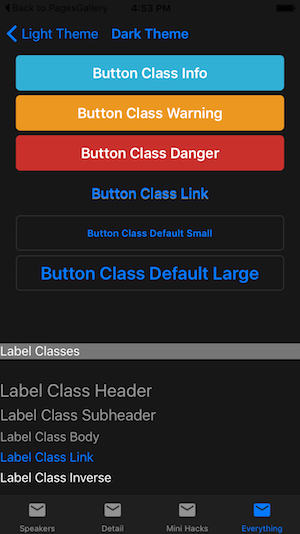

# Xamarin.Forms Dark Theme


> [!NOTE]
> Themes require the Xamarin.Forms 2.3 preview release. Check the
[troubleshooting tips](~/xamarin-forms/user-interface/themes/index.md) if errors occur.

To use the Dark Theme:

## 1. Add Nuget packages

* Xamarin.Forms.Theme.Base
* Xamarin.Forms.Theme.Dark

## 2. Add to the Resource Dictionary

In the **App.xaml** file add a new custom `xmlns` for the theme, and then
ensure the theme's resources are merged with the application's resource dictionary.
An example XAML file is shown below:

```xaml
<?xml version="1.0" encoding="utf-8"?>
<Application xmlns="http://xamarin.com/schemas/2014/forms" xmlns:x="http://schemas.microsoft.com/winfx/2009/xaml" x:Class="EvolveApp.App"
             xmlns:dark="clr-namespace:Xamarin.Forms.Themes;assembly=Xamarin.Forms.Theme.Dark">
    <Application.Resources>
        <ResourceDictionary MergedWith="dark:DarkThemeResources" />
    </Application.Resources>
</Application>
```

## 3. Load theme classes

Follow this [troubleshooting step](~/xamarin-forms/user-interface/themes/index.md)
and add the required code in the iOS and Android application projects.

## 4. Use StyleClass

Here is an example of buttons and labels in the dark theme,
along with the markup that produces them.

[](dark-images/dark-theme.png#lightbox "Buttons and Labels in the Dark Theme")

```xaml
<StackLayout Padding="20">
    <Button Text="Button Default" />
    <Button Text="Button Class Default" StyleClass="Default" />
    <Button Text="Button Class Primary" StyleClass="Primary" />
    <Button Text="Button Class Success" StyleClass="Success" />
    <Button Text="Button Class Info" StyleClass="Info" />
    <Button Text="Button Class Warning" StyleClass="Warning" />
    <Button Text="Button Class Danger" StyleClass="Danger" />
    <Button Text="Button Class Link" StyleClass="Link" />

    <Button Text="Button Class Default Small" StyleClass="Small" />
    <Button Text="Button Class Default Large" StyleClass="Large" />
</StackLayout>
```

The [complete list of built-in classes](~/xamarin-forms/user-interface/themes/index.md)
shows what styles are available for some common controls.
